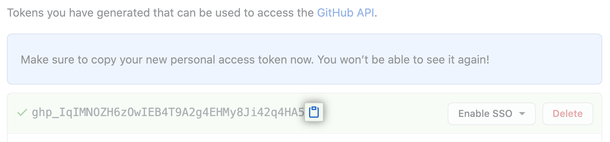

# Project 2147: Git
----


*For this project, we expect you to look at these concepts:*

* [Source code management](/concepts/878)
* [Git and Github cheat sheet - Everything in less than 30 seconds](/concepts/879)
* [The Framework](/concepts/880)
* [Approaching a Project](/concepts/881)
## Resources

**Read or watch:**

* [Resources to learn Git](https://docs.github.com/en/get-started/git-basics/set-up-git)
* [About READMEs](https://docs.github.com/en/repositories/managing-your-repositorys-settings-and-features/customizing-your-repository/about-readmes)
* [How to write a Git commit message](https://cbea.ms/git-commit/)

**Resources for advanced tasks**(Read only after finishing the mandatory tasks):

* [Learning branching](https://learngitbranching.js.org/)
* [Effective pull requests and other good practices for teams using GitHub](https://codeinthehole.com/tips/pull-requests-and-other-good-practices-for-teams-using-github/)
## Learning Objectives

At the end of this project, you are expected to be able to[explain to anyone](https://fs.blog/feynman-learning-technique/),**without the help of Google**:

### General

* What is source code management
* What is Git
* What is GitHub
* What is the difference between Git and GitHub
* How to create a repository
* What is a README
* How to write good READMEs
* How to commit
* How to write helpful commit messages
* How to push code
* How to pull updates
* How to create a branch
* How to merge branches
* How to work as collaborators on a project
* Which files should and which files should not appear in your repo
## Requirements

### General

* A`README.md`file at the root of the repo, containing a description of the repository
* A`README.md`file, at the root of the folder of*this*project (i.e.`git`), describing what this project is about
* **Do not use GitHub’s web UI**, but the command line to perform the exercise (except for operations that can not possibly be done any other way than through the web UI). You won’t be able to perform many of the task requirements on the web UI, and you should start getting used to the command line for simple tasks because many complex tasks can only be done via the command line.
* Your answer files should only contain the command, and nothing else
## More Info

### Install`git`

If`git`is not already installed on your terminal:

``
```
$ sudo apt-get update
$ sudo apt-get upgrade
$ sudo apt-get install git
```

Note: If you’re already the ‘root’ user in the sandbox (e.g. your username starts with ‘root’), you can omit the ‘sudo’ from the commands above as you already have sufficient user permissions.

### Basic usage

At the end of this project you should be able to reproduce and understand these command lines:

``
```
$ git clone <repo>
$ touch test
$ git add test
$ git commit -m "Initial commit"
$ git push origin main
```
**Great!**You've completed the quiz successfully! Keep going!#### Question #0

You have the following files in your project directory:

``
```
julien@ubuntu:/tmp/git_project$ ls
0-test  0-test~ #0-test# file1  file2
```

You’ve edited`0-test`and you want to add it to your GitHub repo. What is the correct command to add**only**`0-test`?

 * `git add .`

 * `git add -N 0-test`

 * `git add 0-test`

#### Tips:

You should learn what each of these commands would actually do if you were to execute them!

#### Question #1

What command can you use to see what changes have been staged, which haven’t, and which files aren’t being tracked by Git?

 * `git init`

 * `git status`

 * `git checkout`


----
## Tasks
---
### 0. Create and setup your Git and GitHub account




You will need a GitHub account for all your projects. You can create an account for free  here

To have access to your repositories and authenticate yourself, you need to create a Personal Access Token on Github.

You can follow this tutorial to create a token.

Once it’s created, you should have a token that looks like this:


Update your Intranet profile by adding your Github username here

If it’s not done the Checker won’t be able to correct your work


Using the graphic interface on the github website, create your first repository.


On the intranet, just under the task, click on the button  and run to start the machine.

Once the container is started, click on  or on  (for the new sandboxes) to open a shell where you can start work from.

On the webterm of the sandbox, do the following:

Replace {YOUR_PERSONAL_TOKEN} with your token from step 1

Replace {YOUR_USERNAME} with your username from step 0 and 1

Replace {YOUR_REPO} with the name of the repository at the bottom of the task

-Create the file README.md with the content My first readme. Tips

Good job!

You pushed your first file in your first repository.

You can now check your repository on GitHub to see if everything is good.

- Name: Look at the bottom of the project to see the name of the repository
- Description: `This is my first repository as a full-stack engineer`
- Public repo
- No `README`, `.gitignore`, or license

- Clone your repository

- Navigate to this new directory. Tips

- Add this new file to git, commit the change with this message “My first commit” and push to the remote server / origin

```
root@896cf839cf9a:/# git clone https://{YOUR_PERSONAL_TOKEN}@github.com/{YOUR_USERNAME}/{YOUR_REPO}.git                  
Cloning into '{YOUR_REPO}'...
warning: You appear to have cloned an empty repository.       

```

```
root@896cf839cf9a:/# cd {YOUR_REPO}/
root@896cf839cf9a:/{YOUR_REPO}#

```

```
root@896cf839cf9a:/{YOUR_REPO}# echo 'My first readme' > README.md                                                                 
root@896cf839cf9a:/{YOUR_REPO}# cat README.md                                                                                      
My first readme                                                                                                                       

```

```
root@896cf839cf9a:/{YOUR_REPO}# git add .
root@896cf839cf9a:/{YOUR_REPO}# git commit -m 'My first commit'
[master (root-commit) 98eef93] My first commit
 1 file changed, 1 insertion(+)
 create mode 100644 README.md
root@896cf839cf9a:/{YOUR_REPO}# git push                                                                                           
Enumerating objects: 3, done.                                                                                                         
Counting objects: 100% (3/3), done.                                                                                                   
Writing objects: 100% (3/3), 212 bytes | 212.00 KiB/s, done.                                                                          
Total 3 (delta 0), reused 0 (delta 0)                                                                                                 
To https://github.com/{YOUR_USERNAME}/{YOUR_REPO}.git                                                                                       
 * [new branch]      master -> master              

```

**Repo:**

- GitHub repository: `atlas-zero_day`
- File: `README.md`


---
### 1. Repo-session

Create a new directory called git in your repo.

Make sure you include a not empty README.md in your directory:

And important part: Make sure your commit and push your code to Github - otherwise the Checker will always fail.

- at the root of your repository
- AND in the directory `git`

**Repo:**

- GitHub repository: `atlas-zero_day`


---
### 2. Coding fury road

For the moment we have an empty project directory containing only a README.md. It’s time to code!

- Create these directories in the `git` folder: `bash`, `c`, `js`
- Create these empty files:


`c/c_is_fun.c`
`js/main.js`
`js/index.js`
- `c/c_is_fun.c`
- `js/main.js`
- `js/index.js`
- Create a file `bash/best` with these two lines inside: `#!/bin/bash` and `echo "Best"`
- Create a file `bash/school` with these two lines inside: `#!/bin/bash` and `echo "School"`
- Add all these new files to git
- Commit your changes (message: “Starting to code today, so cool”) and push to the remote server

- `c/c_is_fun.c`
- `js/main.js`
- `js/index.js`

**Repo:**

- GitHub repository: `atlas-zero_day`
- Directory: `git`
- File: `bash/best, bash/school, c/c_is_fun.c, js/main.js, js/index.js`


---
### 3. Collaboration is the base of a company

A branch is like a copy of your project. It’s used mainly for:

The purpose of a branch is to isolate your work from the main code base of your project and/or from your co-workers’ work.

For this project, create a branch update_script and in this branch:

Perfect! You did an amazing update in your project and it’s isolated correctly from the main branch.

Oh wait, your manager needs a quick fix in your project and it needs to be deployed now:

Ouf, hot fix is done!

- adding a feature in development
- collaborating on the same project with other developers
- not breaking your entire repository
- not upsetting your co-workers

- Create an empty file named `bash/98`
- Update `bash/best` by replacing `echo "Best"` with `echo "Best School"`
- Update `bash/school` by replacing `echo "School"` with `echo "The school is open!"`
- Add and commit these changes (message: “My personal work”)
- Push this new branch Tips

- Change branch to `main`
- Update the file `bash/best` by replacing `echo "Best"` with `echo "This School is so cool!"`
- Delete the directory `js`
- Commit your changes (message: “Hot fix”) and push to the origin

**Repo:**

- GitHub repository: `atlas-zero_day`
- Directory: `git`
- File: `bash/best, bash/school, bash/98`


---
### 4. Collaboration: be up to date

Of course, you can also work on the same branch as your co-workers and it’s best if you keep up to date with their changes.

For this task – and only for this task – please update your file README.md in the main branch from GitHub.com. It’s the only time you are allowed to update and commit from GitHub interface.

After you have done that, in your terminal:

- Get all changes of the main branch locally (i.e. your `README.md` file will be updated)
- Create a new file `up_to_date` in the project directory (`git`) and in it write the git command line used
- Add `up_to_date` to git, commit (message: “How to be up to date in git”), and push to the origin

**Repo:**

- GitHub repository: `atlas-zero_day`
- Directory: `git`
- File: `README.md, up_to_date`


---
### 5. HAAA what did you do???

Collaboration is cool, but not really when you update the same file at the same time…

To illustrate that, please merge the branch update_script to main: “Cool, all my changes will be now part of the main branch, ready to be deployed!”

HHHHHHHAAAAAAAA

As you can see, you have conflicts between two branches on the same file.

Your goal now is to resolve conflicts by using the version of the branch update_script, and push the result to the origin.

At the end, you should have all your work from the branch update_script (new file and two updated files) and all latest main commits (new files, delete folder, etc.), without conflicts.

```
CONFLICT (content): Merge conflict in bash/best

```

**Repo:**

- GitHub repository: `atlas-zero_day`
- Directory: `git`


---
### 6. Never push too much

Create a .gitignore file and define a rule to never push ~ files (generated by Emacs). Tips

**Repo:**

- GitHub repository: `atlas-zero_day`
- Directory: `git`
- File: `.gitignore`