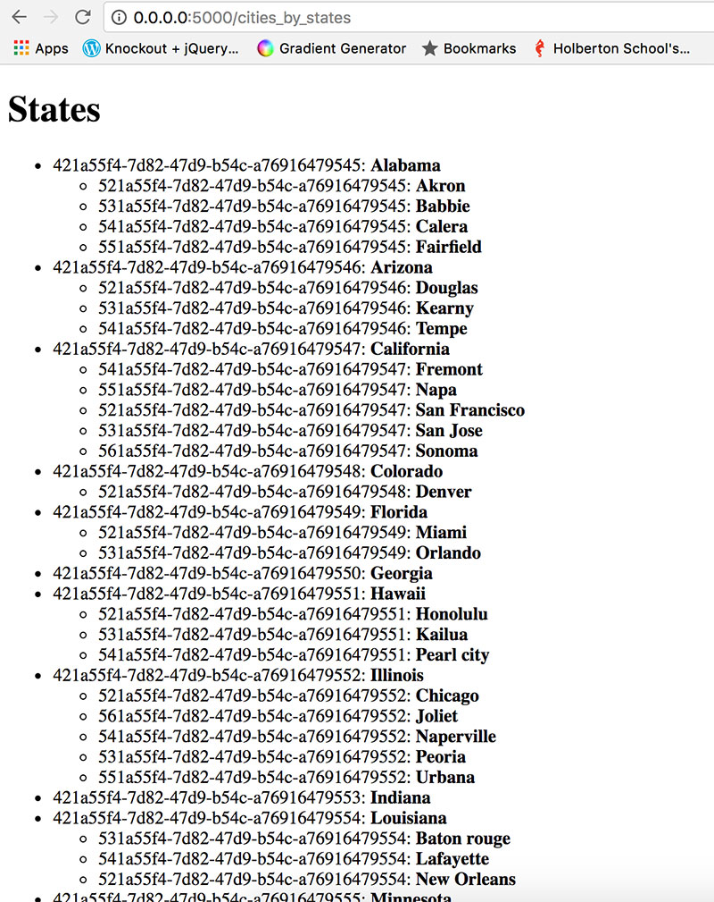
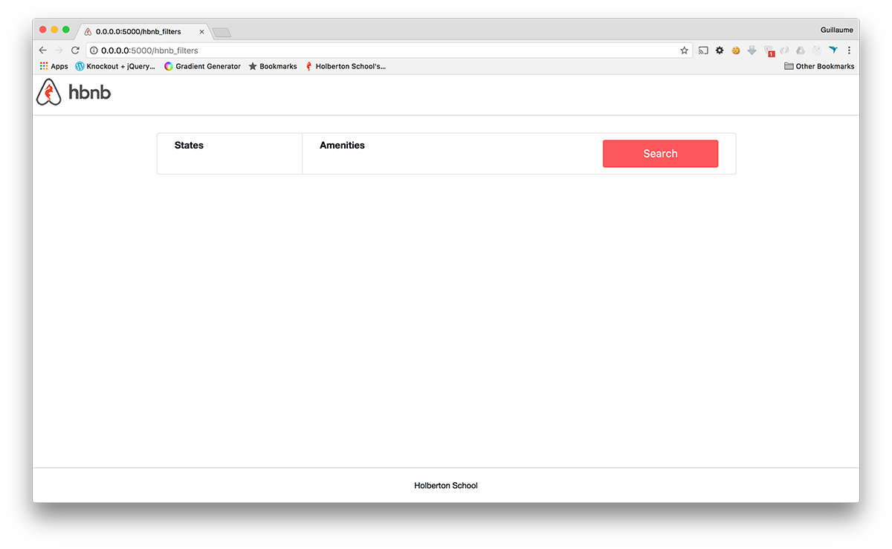
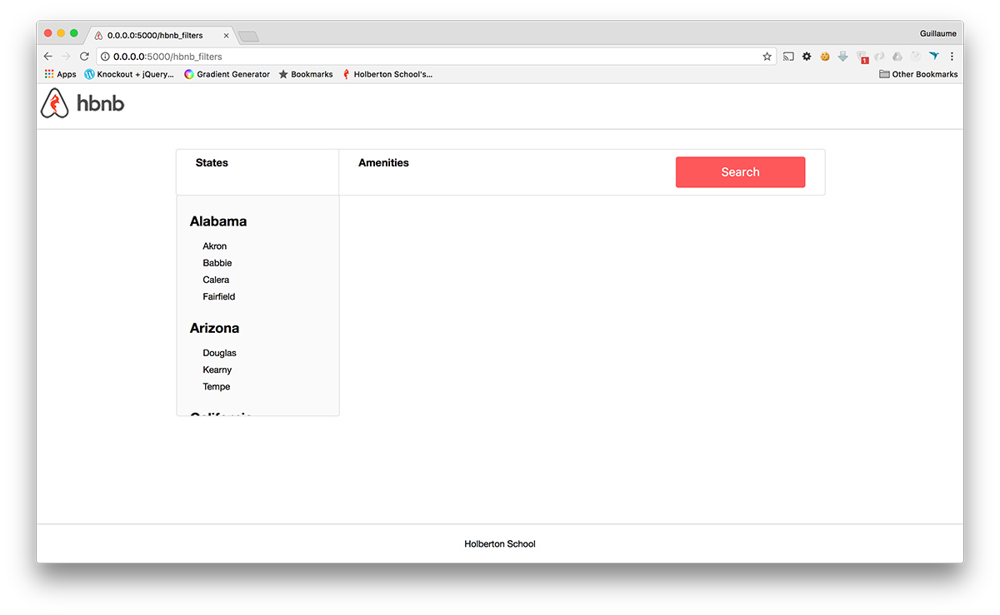
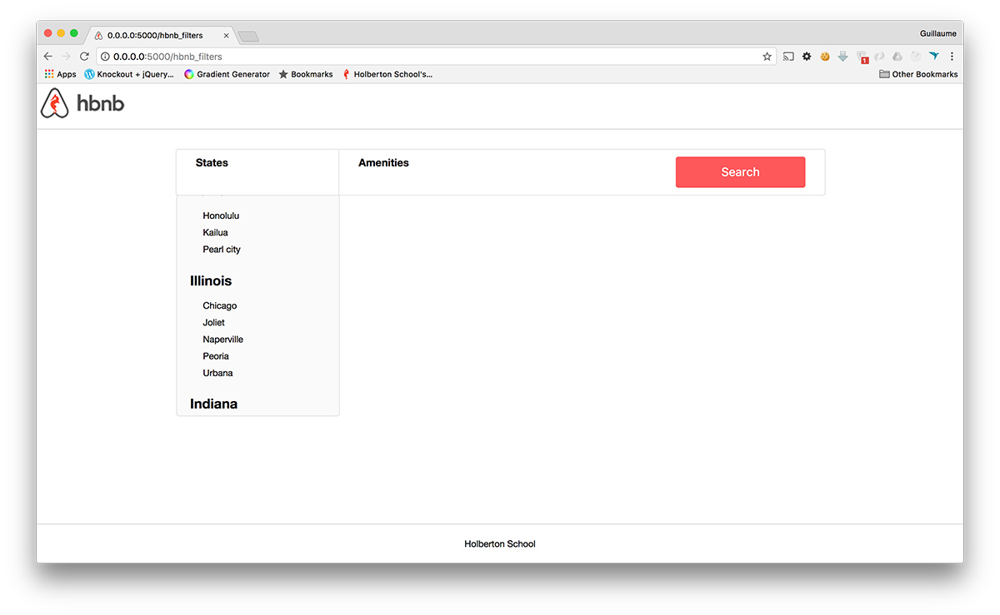
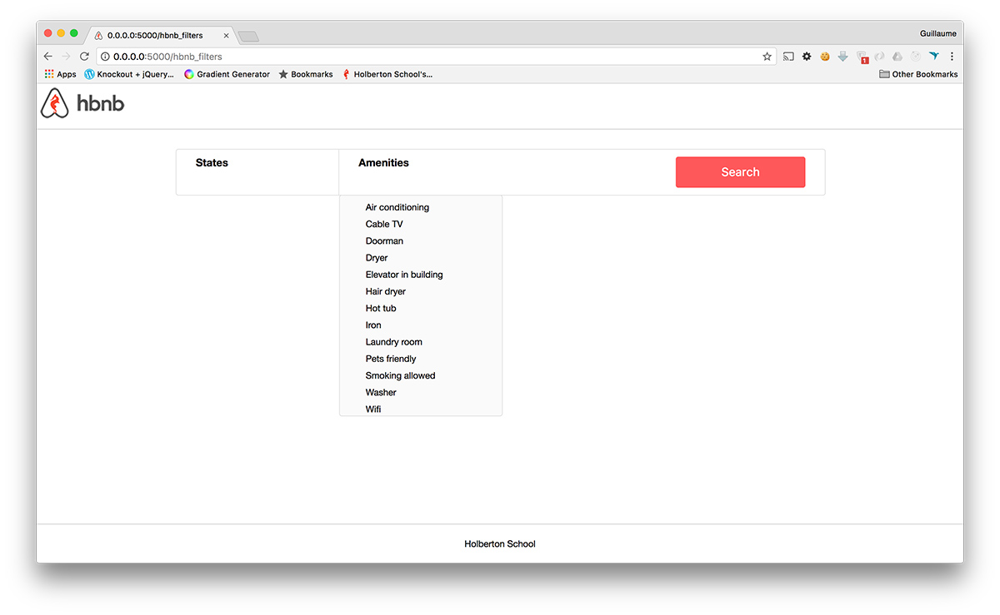

# Project 2130: AirBnB clone - Web framework
----


*For this project, we expect you to look at this concept:*

* [AirBnB clone](/concepts/865)
## Resources

**Read or watch**:

* [What is a Web Framework?](https://intelegain-technologies.medium.com/what-are-web-frameworks-and-why-you-need-them-c4e8806bd0fb)
* [A Minimal Application](https://flask.palletsprojects.com/en/stable/quickstart/)
* [Routing](https://flask.palletsprojects.com/en/stable/quickstart/)(*except “HTTP Methods”*)
* [Rendering Templates](https://flask.palletsprojects.com/en/stable/quickstart/)
* [Synopsis](https://jinja.palletsprojects.com/en/stable/templates/)
* [Variables](https://jinja.palletsprojects.com/en/stable/templates/)
* [Comments](https://jinja.palletsprojects.com/en/stable/templates/)
* [Whitespace Control](https://jinja.palletsprojects.com/en/stable/templates/)
* [List of Control Structures](https://jinja.palletsprojects.com/en/stable/templates/)(*read up to “Call”*)
* [Flask](https://palletsprojects.com/projects/flask/)
* [Jinja](https://jinja.palletsprojects.com/en/stable/templates/)
## Learning Objectives

At the end of this project, you are expected to be able to[explain to anyone](https://fs.blog/feynman-learning-technique/),**without the help of Google**:

### General

* What is a Web Framework
* How to build a web framework with Flask
* How to define routes in Flask
* What is a route
* How to handle variables in a route
* What is a template
* How to create a HTML response in Flask by using a template
* How to create a dynamic template (loops, conditions…)
* How to display in HTML data from a MySQL database
## Requirements

### Python Scripts

* Allowed editors:`vi`,`vim`,`emacs`
* All your files will be interpreted/compiled on Ubuntu 20.04 LTS using python3 (version 3.8.5)
* All your files should end with a new line
* The first line of all your files should be exactly`#!/usr/bin/python3`
* A`README.md`file, at the root of the folder of the project, is mandatory
* Your code should use the pycodestyle (version 2.7.*)
* All your files must be executable
* The length of your files will be tested using`wc`
* All your modules should have documentation (`python3 -c 'print(__import__("my_module").__doc__)'`)
* All your classes should have documentation (`python3 -c 'print(__import__("my_module").MyClass.__doc__)'`)
* All your functions (inside and outside a class) should have documentation (`python3 -c 'print(__import__("my_module").my_function.__doc__)'`and`python3 -c 'print(__import__("my_module").MyClass.my_function.__doc__)'`)
* A documentation is not a simple word, it’s a real sentence explaining what’s the purpose of the module, class or method (the length of it will be verified)
### HTML/CSS Files

* Allowed editors:`vi`,`vim`,`emacs`
* All your files should end with a new line
* A`README.md`file at the root of the folder of the project is mandatory
* Your code should be W3C compliant and validate with[W3C-Validator](https://github.com/hs-hq/W3C-Validator)(except for jinja template)
* All your CSS files should be in the`styles`folder
* All your images should be in the`images`folder
* You are not allowed to use`!important`or`id`(`#...`in the CSS file)
* All tags must be in uppercase
* Current screenshots have been done on`Chrome 56.0.2924.87`.
* No cross browsers
## More Info

### MySQL Default charset issues

* If you get Flask errors after executing the`curl ...`commands, it might be because of the`DEFAULT CHARSET`. If it’s`DEFAULT CHARSET=latam1`, you might want to change it to`DEFAULT CHARSET=utf8mb4`, either on the server’s config file (/etc/mysql/my.cnf commonly) orm on the CREATE DATABASE statement.
### Install Flask

``
```
$ pip3 install Flask
```


### NOTE:

* Try setting FLASK configuration`debug`to`False`iIf you get the following error when running the checker:
``
```
- [Got]
rpc error: code = 2 desc = oci runtime error: exec failed: container_linux.go:290: starting container process caused "process_linux.go:111: decoding init error from pipe caused \"read parent: connection reset by peer\""

(222 chars long)
```
### 

**It is your responsibility to request a review for this project from a peer before the project’s deadline. If no peers have been reviewed, you should request a review from a TA or staff member.**


----
## Tasks
---
### 0. Hello Flask!

Write a script that starts a Flask web application:

In another tab:

- Your web application must be listening on `0.0.0.0`, port `5000`
- Routes:


`/`: display “Hello HBNB!”
- `/`: display “Hello HBNB!”
- You must use the option `strict_slashes=False` in your route definition

- `/`: display “Hello HBNB!”

```
guillaume@ubuntu:~/AirBnB_v2$ python3 -m web_flask.0-hello_route
* Running on http://0.0.0.0:5000/ (Press CTRL+C to quit)
....

```

```
guillaume@ubuntu:~$ curl 0.0.0.0:5000 ; echo "" | cat -e
Hello HBNB!$
guillaume@ubuntu:~$ 

```

**Repo:**

- GitHub repository: `atlas-AirBnB_clone_v2`
- Directory: `web_flask`
- File: `0-hello_route.py, __init__.py`


---
### 1. HBNB

Write a script that starts a Flask web application:

In another tab:

- Your web application must be listening on `0.0.0.0`, port `5000`
- Routes:


`/`: display “Hello HBNB!”
`/hbnb`: display “HBNB”
- `/`: display “Hello HBNB!”
- `/hbnb`: display “HBNB”
- You must use the option `strict_slashes=False` in your route definition

- `/`: display “Hello HBNB!”
- `/hbnb`: display “HBNB”

```
guillaume@ubuntu:~/AirBnB_v2$ python3 -m web_flask.1-hbnb_route
* Running on http://0.0.0.0:5000/ (Press CTRL+C to quit)
....

```

```
guillaume@ubuntu:~$ curl 0.0.0.0:5000/hbnb ; echo "" | cat -e
HBNB$
guillaume@ubuntu:~$ 

```

**Repo:**

- GitHub repository: `atlas-AirBnB_clone_v2`
- Directory: `web_flask`
- File: `1-hbnb_route.py`


---
### 2. C is fun!

Write a script that starts a Flask web application:

In another tab:

- Your web application must be listening on `0.0.0.0`, port `5000`
- Routes:


`/`: display “Hello HBNB!”
`/hbnb`: display “HBNB”
`/c/&lt;text&gt;`: display “C ” followed by the value of the `text` variable (replace underscore `_` symbols with a space ``)
- `/`: display “Hello HBNB!”
- `/hbnb`: display “HBNB”
- `/c/&lt;text&gt;`: display “C ” followed by the value of the `text` variable (replace underscore `_` symbols with a space ``)
- You must use the option `strict_slashes=False` in your route definition

- `/`: display “Hello HBNB!”
- `/hbnb`: display “HBNB”
- `/c/&lt;text&gt;`: display “C ” followed by the value of the `text` variable (replace underscore `_` symbols with a space ``)

```
guillaume@ubuntu:~/AirBnB_v2$ python3 -m web_flask.2-c_route
* Running on http://0.0.0.0:5000/ (Press CTRL+C to quit)
....

```

```
guillaume@ubuntu:~$ curl 0.0.0.0:5000/c/is_fun ; echo "" | cat -e
C is fun$
guillaume@ubuntu:~$ curl 0.0.0.0:5000/c/cool ; echo "" | cat -e
C cool$
guillaume@ubuntu:~$ curl 0.0.0.0:5000/c
<!DOCTYPE HTML PUBLIC "-//W3C//DTD HTML 3.2 Final//EN">
<title>404 Not Found</title>
<h1>Not Found</h1>
<p>The requested URL was not found on the server.  If you entered the URL manually please check your spelling and try again.</p>
guillaume@ubuntu:~$ 

```

**Repo:**

- GitHub repository: `atlas-AirBnB_clone_v2`
- Directory: `web_flask`
- File: `2-c_route.py`


---
### 3. Python is cool!

Write a script that starts a Flask web application:

In another tab:

- Your web application must be listening on `0.0.0.0`, port `5000`
- Routes:


`/`: display “Hello HBNB!”
`/hbnb`: display “HBNB”
`/c/&lt;text&gt;`: display “C ”, followed by the value of the `text` variable (replace underscore `_` symbols with a space ``)
`/python/&lt;text&gt;`: display “Python ”, followed by the value of the `text` variable (replace underscore `_` symbols with a space ``)


The default value of `text` is “is cool”
- `/`: display “Hello HBNB!”
- `/hbnb`: display “HBNB”
- `/c/&lt;text&gt;`: display “C ”, followed by the value of the `text` variable (replace underscore `_` symbols with a space ``)
- `/python/&lt;text&gt;`: display “Python ”, followed by the value of the `text` variable (replace underscore `_` symbols with a space ``)


The default value of `text` is “is cool”
- The default value of `text` is “is cool”
- You must use the option `strict_slashes=False` in your route definition

- `/`: display “Hello HBNB!”
- `/hbnb`: display “HBNB”
- `/c/&lt;text&gt;`: display “C ”, followed by the value of the `text` variable (replace underscore `_` symbols with a space ``)
- `/python/&lt;text&gt;`: display “Python ”, followed by the value of the `text` variable (replace underscore `_` symbols with a space ``)


The default value of `text` is “is cool”
- The default value of `text` is “is cool”

- The default value of `text` is “is cool”

```
guillaume@ubuntu:~/AirBnB_v2$ python3 -m web_flask.3-python_route
* Running on http://0.0.0.0:5000/ (Press CTRL+C to quit)
....

```

```
guillaume@ubuntu:~$ curl -Ls 0.0.0.0:5000/python/is_magic ; echo "" | cat -e
Python is magic$
guillaume@ubuntu:~$ curl -Ls 0.0.0.0:5000/python ; echo "" | cat -e
Python is cool$
guillaume@ubuntu:~$ curl -Ls 0.0.0.0:5000/python/ ; echo "" | cat -e
Python is cool$
guillaume@ubuntu:~$ 

```

**Repo:**

- GitHub repository: `atlas-AirBnB_clone_v2`
- Directory: `web_flask`
- File: `3-python_route.py`


---
### 4. Is it a number?

Write a script that starts a Flask web application:

In another tab:

- Your web application must be listening on `0.0.0.0`, port `5000`
- Routes:


`/`: display “Hello HBNB!”
`/hbnb`: display “HBNB”
`/c/&lt;text&gt;`: display “C ”, followed by the value of the `text` variable (replace underscore `_` symbols with a space ``)
`/python/&lt;text&gt;`: display “Python ”, followed by the value of the `text` variable (replace underscore `_` symbols with a space ``)


The default value of `text` is “is cool”

`/number/&lt;n&gt;`: display “`n` is a number” **only** if `n` is an integer
- `/`: display “Hello HBNB!”
- `/hbnb`: display “HBNB”
- `/c/&lt;text&gt;`: display “C ”, followed by the value of the `text` variable (replace underscore `_` symbols with a space ``)
- `/python/&lt;text&gt;`: display “Python ”, followed by the value of the `text` variable (replace underscore `_` symbols with a space ``)


The default value of `text` is “is cool”
- The default value of `text` is “is cool”
- `/number/&lt;n&gt;`: display “`n` is a number” **only** if `n` is an integer
- You must use the option `strict_slashes=False` in your route definition

- `/`: display “Hello HBNB!”
- `/hbnb`: display “HBNB”
- `/c/&lt;text&gt;`: display “C ”, followed by the value of the `text` variable (replace underscore `_` symbols with a space ``)
- `/python/&lt;text&gt;`: display “Python ”, followed by the value of the `text` variable (replace underscore `_` symbols with a space ``)


The default value of `text` is “is cool”
- The default value of `text` is “is cool”
- `/number/&lt;n&gt;`: display “`n` is a number” **only** if `n` is an integer

- The default value of `text` is “is cool”

```
guillaume@ubuntu:~/AirBnB_v2$ python3 -m web_flask.4-number_route
* Running on http://0.0.0.0:5000/ (Press CTRL+C to quit)
....

```

```
guillaume@ubuntu:~$ curl 0.0.0.0:5000/number/89 ; echo "" | cat -e
89 is a number$
guillaume@ubuntu:~$ curl 0.0.0.0:5000/number/8.9 
<!DOCTYPE HTML PUBLIC "-//W3C//DTD HTML 3.2 Final//EN">
<title>404 Not Found</title>
<h1>Not Found</h1>
<p>The requested URL was not found on the server.  If you entered the URL manually please check your spelling and try again.</p>
guillaume@ubuntu:~$ curl 0.0.0.0:5000/number/python 
<!DOCTYPE HTML PUBLIC "-//W3C//DTD HTML 3.2 Final//EN">
<title>404 Not Found</title>
<h1>Not Found</h1>
<p>The requested URL was not found on the server.  If you entered the URL manually please check your spelling and try again.</p>
guillaume@ubuntu:~$ 

```

**Repo:**

- GitHub repository: `atlas-AirBnB_clone_v2`
- Directory: `web_flask`
- File: `4-number_route.py`


---
### 5. Number template

Write a script that starts a Flask web application:

In another tab:

- Your web application must be listening on `0.0.0.0`, port `5000`
- Routes:


`/`: display “Hello HBNB!”
`/hbnb`: display “HBNB”
`/c/&lt;text&gt;`: display “C ”, followed by the value of the `text` variable (replace underscore `_` symbols with a space ``)
`/python/&lt;text&gt;`: display “Python ”, followed by the value of the `text` variable (replace underscore `_` symbols with a space ``)


The default value of `text` is “is cool”

`/number/&lt;n&gt;`: display “`n` is a number” **only** if `n` is an integer
`/number_template/&lt;n&gt;`: display a HTML page **only** if `n` is an integer: 


`H1` tag: “Number: `n`” inside the tag `BODY`
- `/`: display “Hello HBNB!”
- `/hbnb`: display “HBNB”
- `/c/&lt;text&gt;`: display “C ”, followed by the value of the `text` variable (replace underscore `_` symbols with a space ``)
- `/python/&lt;text&gt;`: display “Python ”, followed by the value of the `text` variable (replace underscore `_` symbols with a space ``)


The default value of `text` is “is cool”
- The default value of `text` is “is cool”
- `/number/&lt;n&gt;`: display “`n` is a number” **only** if `n` is an integer
- `/number_template/&lt;n&gt;`: display a HTML page **only** if `n` is an integer: 


`H1` tag: “Number: `n`” inside the tag `BODY`
- `H1` tag: “Number: `n`” inside the tag `BODY`
- You must use the option `strict_slashes=False` in your route definition

- `/`: display “Hello HBNB!”
- `/hbnb`: display “HBNB”
- `/c/&lt;text&gt;`: display “C ”, followed by the value of the `text` variable (replace underscore `_` symbols with a space ``)
- `/python/&lt;text&gt;`: display “Python ”, followed by the value of the `text` variable (replace underscore `_` symbols with a space ``)


The default value of `text` is “is cool”
- The default value of `text` is “is cool”
- `/number/&lt;n&gt;`: display “`n` is a number” **only** if `n` is an integer
- `/number_template/&lt;n&gt;`: display a HTML page **only** if `n` is an integer: 


`H1` tag: “Number: `n`” inside the tag `BODY`
- `H1` tag: “Number: `n`” inside the tag `BODY`

- The default value of `text` is “is cool”

- `H1` tag: “Number: `n`” inside the tag `BODY`

```
guillaume@ubuntu:~/AirBnB_v2$ python3 -m web_flask.5-number_template
* Running on http://0.0.0.0:5000/ (Press CTRL+C to quit)
....

```

```
guillaume@ubuntu:~$ curl 0.0.0.0:5000/number_template/89 ; echo ""
<!DOCTYPE html>
<HTML lang="en">
    <HEAD>
        <TITLE>HBNB</TITLE>
    </HEAD>
    <BODY>
        <H1>Number: 89</H1>
    </BODY>
</HTML>
guillaume@ubuntu:~$ curl 0.0.0.0:5000/number_template/8.9 
<!DOCTYPE HTML PUBLIC "-//W3C//DTD HTML 3.2 Final//EN">
<title>404 Not Found</title>
<h1>Not Found</h1>
<p>The requested URL was not found on the server.  If you entered the URL manually please check your spelling and try again.</p>
guillaume@ubuntu:~$ curl 0.0.0.0:5000/number_template/python 
<!DOCTYPE HTML PUBLIC "-//W3C//DTD HTML 3.2 Final//EN">
<title>404 Not Found</title>
<h1>Not Found</h1>
<p>The requested URL was not found on the server.  If you entered the URL manually please check your spelling and try again.</p>
guillaume@ubuntu:~$ 

```

**Repo:**

- GitHub repository: `atlas-AirBnB_clone_v2`
- Directory: `web_flask`
- File: `5-number_template.py, templates/5-number.html`


---
### 6. Odd or even?

Write a script that starts a Flask web application:

In another tab:

- Your web application must be listening on `0.0.0.0`, port `5000`
- Routes:


`/`: display “Hello HBNB!”
`/hbnb`: display “HBNB”
`/c/&lt;text&gt;`: display “C ”, followed by the value of the `text` variable (replace underscore `_` symbols with a space ``)
`/python/&lt;text&gt;`: display “Python ”, followed by the value of the `text` variable (replace underscore `_` symbols with a space ``)


The default value of `text` is “is cool”

`/number/&lt;n&gt;`: display “`n` is a number” **only** if `n` is an integer
`/number_template/&lt;n&gt;`: display a HTML page **only** if `n` is an integer: 


`H1` tag: “Number: `n`” inside the tag `BODY`

`/number_odd_or_even/&lt;n&gt;`: display a HTML page **only** if `n` is an integer: 


`H1` tag: “Number: `n` is `even|odd`” inside the tag `BODY`
- `/`: display “Hello HBNB!”
- `/hbnb`: display “HBNB”
- `/c/&lt;text&gt;`: display “C ”, followed by the value of the `text` variable (replace underscore `_` symbols with a space ``)
- `/python/&lt;text&gt;`: display “Python ”, followed by the value of the `text` variable (replace underscore `_` symbols with a space ``)


The default value of `text` is “is cool”
- The default value of `text` is “is cool”
- `/number/&lt;n&gt;`: display “`n` is a number” **only** if `n` is an integer
- `/number_template/&lt;n&gt;`: display a HTML page **only** if `n` is an integer: 


`H1` tag: “Number: `n`” inside the tag `BODY`
- `H1` tag: “Number: `n`” inside the tag `BODY`
- `/number_odd_or_even/&lt;n&gt;`: display a HTML page **only** if `n` is an integer: 


`H1` tag: “Number: `n` is `even|odd`” inside the tag `BODY`
- `H1` tag: “Number: `n` is `even|odd`” inside the tag `BODY`
- You must use the option `strict_slashes=False` in your route definition

- `/`: display “Hello HBNB!”
- `/hbnb`: display “HBNB”
- `/c/&lt;text&gt;`: display “C ”, followed by the value of the `text` variable (replace underscore `_` symbols with a space ``)
- `/python/&lt;text&gt;`: display “Python ”, followed by the value of the `text` variable (replace underscore `_` symbols with a space ``)


The default value of `text` is “is cool”
- The default value of `text` is “is cool”
- `/number/&lt;n&gt;`: display “`n` is a number” **only** if `n` is an integer
- `/number_template/&lt;n&gt;`: display a HTML page **only** if `n` is an integer: 


`H1` tag: “Number: `n`” inside the tag `BODY`
- `H1` tag: “Number: `n`” inside the tag `BODY`
- `/number_odd_or_even/&lt;n&gt;`: display a HTML page **only** if `n` is an integer: 


`H1` tag: “Number: `n` is `even|odd`” inside the tag `BODY`
- `H1` tag: “Number: `n` is `even|odd`” inside the tag `BODY`

- The default value of `text` is “is cool”

- `H1` tag: “Number: `n`” inside the tag `BODY`

- `H1` tag: “Number: `n` is `even|odd`” inside the tag `BODY`

```
guillaume@ubuntu:~/AirBnB_v2$ python3 -m web_flask.6-number_odd_or_even
* Running on http://0.0.0.0:5000/ (Press CTRL+C to quit)
....

```

```
guillaume@ubuntu:~$ curl 0.0.0.0:5000/number_odd_or_even/89 ; echo ""
<!DOCTYPE html>
<HTML lang="en">
    <HEAD>
        <TITLE>HBNB</TITLE>
    </HEAD>
    <BODY>
        <H1>Number: 89 is odd</H1>
    </BODY>
</HTML>
guillaume@ubuntu:~$ curl 0.0.0.0:5000/number_odd_or_even/32 ; echo ""
<!DOCTYPE html>
<HTML lang="en">
    <HEAD>
        <TITLE>HBNB</TITLE>
    </HEAD>
    <BODY>
        <H1>Number: 32 is even</H1>
    </BODY>
</HTML>
guillaume@ubuntu:~$ curl 0.0.0.0:5000/number_odd_or_even/python 
<!DOCTYPE HTML PUBLIC "-//W3C//DTD HTML 3.2 Final//EN">
<title>404 Not Found</title>
<h1>Not Found</h1>
<p>The requested URL was not found on the server.  If you entered the URL manually please check your spelling and try again.</p>
guillaume@ubuntu:~$ 

```

**Repo:**

- GitHub repository: `atlas-AirBnB_clone_v2`
- Directory: `web_flask`
- File: `6-number_odd_or_even.py, templates/6-number_odd_or_even.html`


---
### 7. Improve engines

Before using Flask to display our HBNB data, you will need to update some part of our engine:

Update FileStorage: (models/engine/file_storage.py)

Update DBStorage: (models/engine/db_storage.py)

Update State: (models/state.py) - If it’s not already present

At this moment, in another tab:

And let’s go back the Python console:

And for the getter cities in the State model:

- Add a public method `def close(self):`: call `reload()` method for deserializing the JSON file to objects

- Add a public method `def close(self):`: call `remove()` method on the private session attribute (`self.__session`) tips or `close()` on the class `Session` tips

- If your storage engine is not `DBStorage`, add a public getter method `cities` to return the list of `City` objects from `storage` linked to the current `State`

```
guillaume@ubuntu:~/AirBnB_v2$ HBNB_MYSQL_USER=hbnb_dev HBNB_MYSQL_PWD=hbnb_dev_pwd HBNB_MYSQL_HOST=localhost HBNB_MYSQL_DB=hbnb_dev_db HBNB_TYPE_STORAGE=db python3 
>>> from models import storage
>>> from models.state import State
>>> len(storage.all(State))
5
>>> len(storage.all(State))
5
>>> # Time to insert new data!

```

```
guillaume@ubuntu:~/AirBnB_v2$ echo 'INSERT INTO `states` VALUES ("421a55f1-7d82-45d9-b54c-a76916479545", "Alabama", "2017-03-25 19:42:40","2017-03-25 19:42:40");' | mysql -uroot -p hbnb_dev_db
Enter password: 
guillaume@ubuntu:~/AirBnB_v2$ 

```

```
>>> # Time to insert new data!
>>> len(storage.all(State))
5
>>> # normal: the SQLAlchemy didn't reload his `Session`
>>> # to force it, you must remove the current session to create a new one:
>>> storage.close()
>>> len(storage.all(State))
6
>>> # perfect!

```

```
guillaume@ubuntu:~/AirBnB_v2$ cat main.py
#!/usr/bin/python3
"""
 Test cities access from a state
"""
from models import storage
from models.state import State
from models.city import City

"""
 Objects creations
"""
state_1 = State(name="California")
print("New state: {}".format(state_1))
state_1.save()
state_2 = State(name="Arizona")
print("New state: {}".format(state_2))
state_2.save()

city_1_1 = City(state_id=state_1.id, name="Napa")
print("New city: {} in the state: {}".format(city_1_1, state_1))
city_1_1.save()
city_1_2 = City(state_id=state_1.id, name="Sonoma")
print("New city: {} in the state: {}".format(city_1_2, state_1))
city_1_2.save()
city_2_1 = City(state_id=state_2.id, name="Page")
print("New city: {} in the state: {}".format(city_2_1, state_2))
city_2_1.save()


"""
 Verification
"""
print("")
all_states = storage.all(State)
for state_id, state in all_states.items():
    for city in state.cities:
        print("Find the city {} in the state {}".format(city, state))

guillaume@ubuntu:~/AirBnB_v2$ 
guillaume@ubuntu:~/AirBnB_v2$ rm file.json ; HBNB_TYPE_STORAGE=fs ./main.py 
New state: [State] (5b8f1d55-e49c-44dd-ba6f-a3cf8489ae45) {'name': 'California', 'id': '5b8f1d55-e49c-44dd-ba6f-a3cf8489ae45', 'updated_at': datetime.datetime(2017, 12, 11, 19, 27, 52, 509954), 'created_at': datetime.datetime(2017, 12, 11, 19, 27, 52, 509950)}
New state: [State] (a5e5311a-3c19-4995-9485-32c74411b416) {'name': 'Arizona', 'id': 'a5e5311a-3c19-4995-9485-32c74411b416', 'updated_at': datetime.datetime(2017, 12, 11, 19, 27, 52, 510256), 'created_at': datetime.datetime(2017, 12, 11, 19, 27, 52, 510252)}
New city: [City] (e3e36ded-fe56-44f5-bf08-8a27e2b30672) {'name': 'Napa', 'id': 'e3e36ded-fe56-44f5-bf08-8a27e2b30672', 'state_id': '5b8f1d55-e49c-44dd-ba6f-a3cf8489ae45', 'updated_at': datetime.datetime(2017, 12, 11, 19, 27, 52, 510797), 'created_at': datetime.datetime(2017, 12, 11, 19, 27, 52, 510791)} in the state: [State] (5b8f1d55-e49c-44dd-ba6f-a3cf8489ae45) {'name': 'California', 'id': '5b8f1d55-e49c-44dd-ba6f-a3cf8489ae45', 'updated_at': datetime.datetime(2017, 12, 11, 19, 27, 52, 510038), 'created_at': datetime.datetime(2017, 12, 11, 19, 27, 52, 509950)}
New city: [City] (12a58d70-e255-4c1e-8a68-7d5fb924d2d2) {'name': 'Sonoma', 'id': '12a58d70-e255-4c1e-8a68-7d5fb924d2d2', 'state_id': '5b8f1d55-e49c-44dd-ba6f-a3cf8489ae45', 'updated_at': datetime.datetime(2017, 12, 11, 19, 27, 52, 511437), 'created_at': datetime.datetime(2017, 12, 11, 19, 27, 52, 511432)} in the state: [State] (5b8f1d55-e49c-44dd-ba6f-a3cf8489ae45) {'name': 'California', 'id': '5b8f1d55-e49c-44dd-ba6f-a3cf8489ae45', 'updated_at': datetime.datetime(2017, 12, 11, 19, 27, 52, 510038), 'created_at': datetime.datetime(2017, 12, 11, 19, 27, 52, 509950)}
New city: [City] (a693bdb9-e0ca-4521-adfd-e1a93c093b4b) {'name': 'Page', 'id': 'a693bdb9-e0ca-4521-adfd-e1a93c093b4b', 'state_id': 'a5e5311a-3c19-4995-9485-32c74411b416', 'updated_at': datetime.datetime(2017, 12, 11, 19, 27, 52, 511873), 'created_at': datetime.datetime(2017, 12, 11, 19, 27, 52, 511869)} in the state: [State] (a5e5311a-3c19-4995-9485-32c74411b416) {'name': 'Arizona', 'id': 'a5e5311a-3c19-4995-9485-32c74411b416', 'updated_at': datetime.datetime(2017, 12, 11, 19, 27, 52, 510373), 'created_at': datetime.datetime(2017, 12, 11, 19, 27, 52, 510252)}

Find the city [City] (e3e36ded-fe56-44f5-bf08-8a27e2b30672) {'name': 'Napa', 'id': 'e3e36ded-fe56-44f5-bf08-8a27e2b30672', 'state_id': '5b8f1d55-e49c-44dd-ba6f-a3cf8489ae45', 'updated_at': datetime.datetime(2017, 12, 11, 19, 27, 52, 510953), 'created_at': datetime.datetime(2017, 12, 11, 19, 27, 52, 510791)} in the state [State] (5b8f1d55-e49c-44dd-ba6f-a3cf8489ae45) {'name': 'California', 'id': '5b8f1d55-e49c-44dd-ba6f-a3cf8489ae45', 'updated_at': datetime.datetime(2017, 12, 11, 19, 27, 52, 510038), 'created_at': datetime.datetime(2017, 12, 11, 19, 27, 52, 509950)}
Find the city [City] (12a58d70-e255-4c1e-8a68-7d5fb924d2d2) {'name': 'Sonoma', 'id': '12a58d70-e255-4c1e-8a68-7d5fb924d2d2', 'state_id': '5b8f1d55-e49c-44dd-ba6f-a3cf8489ae45', 'updated_at': datetime.datetime(2017, 12, 11, 19, 27, 52, 511513), 'created_at': datetime.datetime(2017, 12, 11, 19, 27, 52, 511432)} in the state [State] (5b8f1d55-e49c-44dd-ba6f-a3cf8489ae45) {'name': 'California', 'id': '5b8f1d55-e49c-44dd-ba6f-a3cf8489ae45', 'updated_at': datetime.datetime(2017, 12, 11, 19, 27, 52, 510038), 'created_at': datetime.datetime(2017, 12, 11, 19, 27, 52, 509950)}
Find the city [City] (a693bdb9-e0ca-4521-adfd-e1a93c093b4b) {'name': 'Page', 'id': 'a693bdb9-e0ca-4521-adfd-e1a93c093b4b', 'state_id': 'a5e5311a-3c19-4995-9485-32c74411b416', 'updated_at': datetime.datetime(2017, 12, 11, 19, 27, 52, 512073), 'created_at': datetime.datetime(2017, 12, 11, 19, 27, 52, 511869)} in the state [State] (a5e5311a-3c19-4995-9485-32c74411b416) {'name': 'Arizona', 'id': 'a5e5311a-3c19-4995-9485-32c74411b416', 'updated_at': datetime.datetime(2017, 12, 11, 19, 27, 52, 510373), 'created_at': datetime.datetime(2017, 12, 11, 19, 27, 52, 510252)}
guillaume@ubuntu:~/AirBnB_v2$ 

```

**Repo:**

- GitHub repository: `atlas-AirBnB_clone_v2`
- File: `models/engine/file_storage.py, models/engine/db_storage.py, models/state.py`


---
### 8. List of states

Write a script that starts a Flask web application:

IMPORTANT

In another tab:

- Your web application must be listening on `0.0.0.0`, port `5000`
- You must use `storage` for fetching data from the storage engine (`FileStorage` or `DBStorage`) =&gt; `from models import storage` and `storage.all(...)`
- After each request you must remove the current SQLAlchemy Session:


Declare a method to handle `@app.teardown_appcontext`
Call in this method `storage.close()`
- Declare a method to handle `@app.teardown_appcontext`
- Call in this method `storage.close()`
- Routes:


`/states_list`: display a HTML page: (inside the tag `BODY`)


`H1` tag: “States”
`UL` tag: with the list of all `State` objects present in `DBStorage` **sorted by `name`** (A-&gt;Z) tip

`LI` tag: description of one `State`: `&lt;state.id&gt;: &lt;B&gt;&lt;state.name&gt;&lt;/B&gt;`
- `/states_list`: display a HTML page: (inside the tag `BODY`)


`H1` tag: “States”
`UL` tag: with the list of all `State` objects present in `DBStorage` **sorted by `name`** (A-&gt;Z) tip

`LI` tag: description of one `State`: `&lt;state.id&gt;: &lt;B&gt;&lt;state.name&gt;&lt;/B&gt;`
- `H1` tag: “States”
- `UL` tag: with the list of all `State` objects present in `DBStorage` **sorted by `name`** (A-&gt;Z) tip

`LI` tag: description of one `State`: `&lt;state.id&gt;: &lt;B&gt;&lt;state.name&gt;&lt;/B&gt;`
- `LI` tag: description of one `State`: `&lt;state.id&gt;: &lt;B&gt;&lt;state.name&gt;&lt;/B&gt;`
- **NOTE: Students have reported that this one does not work - use the next on instead.** Import this 7-dump to have some data
- Import this 100-dump to have some data
- You must use the option `strict_slashes=False` in your route definition

- Declare a method to handle `@app.teardown_appcontext`
- Call in this method `storage.close()`

- `/states_list`: display a HTML page: (inside the tag `BODY`)


`H1` tag: “States”
`UL` tag: with the list of all `State` objects present in `DBStorage` **sorted by `name`** (A-&gt;Z) tip

`LI` tag: description of one `State`: `&lt;state.id&gt;: &lt;B&gt;&lt;state.name&gt;&lt;/B&gt;`
- `H1` tag: “States”
- `UL` tag: with the list of all `State` objects present in `DBStorage` **sorted by `name`** (A-&gt;Z) tip

`LI` tag: description of one `State`: `&lt;state.id&gt;: &lt;B&gt;&lt;state.name&gt;&lt;/B&gt;`
- `LI` tag: description of one `State`: `&lt;state.id&gt;: &lt;B&gt;&lt;state.name&gt;&lt;/B&gt;`

- `H1` tag: “States”
- `UL` tag: with the list of all `State` objects present in `DBStorage` **sorted by `name`** (A-&gt;Z) tip

`LI` tag: description of one `State`: `&lt;state.id&gt;: &lt;B&gt;&lt;state.name&gt;&lt;/B&gt;`
- `LI` tag: description of one `State`: `&lt;state.id&gt;: &lt;B&gt;&lt;state.name&gt;&lt;/B&gt;`

- `LI` tag: description of one `State`: `&lt;state.id&gt;: &lt;B&gt;&lt;state.name&gt;&lt;/B&gt;`

- Make sure you have a running and valid `setup_mysql_dev.sql` in your `AirBnB_clone_v2` repository (Task)
- Make sure all tables are created when you run `echo "quit" | HBNB_MYSQL_USER=hbnb_dev HBNB_MYSQL_PWD=hbnb_dev_pwd HBNB_MYSQL_HOST=localhost HBNB_MYSQL_DB=hbnb_dev_db HBNB_TYPE_STORAGE=db ./console.py`

```
guillaume@ubuntu:~/AirBnB_v2$ curl -o 7-dump.sql "https://s3.eu-west-3.amazonaws.com/hbtn.intranet.project.files/holbertonschool-higher-level_programming+/290/100-hbnb.sql"
guillaume@ubuntu:~/AirBnB_v2$ cat 7-dump.sql | mysql -uroot -p
Enter password: 
guillaume@ubuntu:~/AirBnB_v2$ HBNB_MYSQL_USER=hbnb_dev HBNB_MYSQL_PWD=hbnb_dev_pwd HBNB_MYSQL_HOST=localhost HBNB_MYSQL_DB=hbnb_dev_db HBNB_TYPE_STORAGE=db python3 -m web_flask.7-states_list
* Running on http://0.0.0.0:5000/ (Press CTRL+C to quit)
....

```

```
guillaume@ubuntu:~$ curl 0.0.0.0:5000/states_list ; echo ""
<!DOCTYPE html>
<HTML lang="en">
    <HEAD>
        <TITLE>HBNB</TITLE>
    </HEAD>
    <BODY>
        <H1>States</H1>
        <UL>

            <LI>421a55f4-7d82-47d9-b54c-a76916479545: <B>Alabama</B></LI>

            <LI>421a55f4-7d82-47d9-b54c-a76916479546: <B>Arizona</B></LI>

            <LI>421a55f4-7d82-47d9-b54c-a76916479547: <B>California</B></LI>

            <LI>421a55f4-7d82-47d9-b54c-a76916479548: <B>Colorado</B></LI>

            <LI>421a55f4-7d82-47d9-b54c-a76916479549: <B>Florida</B></LI>

            <LI>421a55f4-7d82-47d9-b54c-a76916479550: <B>Georgia</B></LI>

            <LI>421a55f4-7d82-47d9-b54c-a76916479551: <B>Hawaii</B></LI>

            <LI>421a55f4-7d82-47d9-b54c-a76916479552: <B>Illinois</B></LI>

            <LI>421a55f4-7d82-47d9-b54c-a76916479553: <B>Indiana</B></LI>

            <LI>421a55f4-7d82-47d9-b54c-a76916479554: <B>Louisiana</B></LI>

            <LI>421a55f4-7d82-47d9-b54c-a76916479555: <B>Minnesota</B></LI>

            <LI>421a55f4-7d82-47d9-b54c-a76916479556: <B>Mississippi</B></LI>

            <LI>421a55f4-7d82-47d9-b54c-a76916479557: <B>Oregon</B></LI>

        </UL>
    </BODY>
</HTML>
guillaume@ubuntu:~$ 

```

**Repo:**

- GitHub repository: `atlas-AirBnB_clone_v2`
- File: `web_flask/7-states_list.py, web_flask/templates/7-states_list.html`


---
### 9. Cities by states



Write a script that starts a Flask web application:

IMPORTANT

In another tab:


- Your web application must be listening on `0.0.0.0`, port `5000`
- You must use `storage` for fetching data from the storage engine (`FileStorage` or `DBStorage`) =&gt; `from models import storage` and `storage.all(...)`
- To load all cities of a `State`:


If your storage engine is `DBStorage`, you must use `cities` relationship
Otherwise, use the public getter method `cities`
- If your storage engine is `DBStorage`, you must use `cities` relationship
- Otherwise, use the public getter method `cities`
- After each request you must remove the current SQLAlchemy Session:


Declare a method to handle `@app.teardown_appcontext`
Call in this method `storage.close()`
- Declare a method to handle `@app.teardown_appcontext`
- Call in this method `storage.close()`
- Routes:


`/cities_by_states`: display a HTML page: (inside the tag `BODY`)


`H1` tag: “States”
`UL` tag: with the list of all `State` objects present in `DBStorage` **sorted by `name`** (A-&gt;Z) tip

`LI` tag: description of one `State`: `&lt;state.id&gt;: &lt;B&gt;&lt;state.name&gt;&lt;/B&gt;` + `UL` tag: with the list of `City` objects linked to the `State` **sorted by `name`** (A-&gt;Z)


`LI` tag: description of one `City`: `&lt;city.id&gt;: &lt;B&gt;&lt;city.name&gt;&lt;/B&gt;`
- `/cities_by_states`: display a HTML page: (inside the tag `BODY`)


`H1` tag: “States”
`UL` tag: with the list of all `State` objects present in `DBStorage` **sorted by `name`** (A-&gt;Z) tip

`LI` tag: description of one `State`: `&lt;state.id&gt;: &lt;B&gt;&lt;state.name&gt;&lt;/B&gt;` + `UL` tag: with the list of `City` objects linked to the `State` **sorted by `name`** (A-&gt;Z)


`LI` tag: description of one `City`: `&lt;city.id&gt;: &lt;B&gt;&lt;city.name&gt;&lt;/B&gt;`
- `H1` tag: “States”
- `UL` tag: with the list of all `State` objects present in `DBStorage` **sorted by `name`** (A-&gt;Z) tip

`LI` tag: description of one `State`: `&lt;state.id&gt;: &lt;B&gt;&lt;state.name&gt;&lt;/B&gt;` + `UL` tag: with the list of `City` objects linked to the `State` **sorted by `name`** (A-&gt;Z)


`LI` tag: description of one `City`: `&lt;city.id&gt;: &lt;B&gt;&lt;city.name&gt;&lt;/B&gt;`
- `LI` tag: description of one `State`: `&lt;state.id&gt;: &lt;B&gt;&lt;state.name&gt;&lt;/B&gt;` + `UL` tag: with the list of `City` objects linked to the `State` **sorted by `name`** (A-&gt;Z)


`LI` tag: description of one `City`: `&lt;city.id&gt;: &lt;B&gt;&lt;city.name&gt;&lt;/B&gt;`
- `LI` tag: description of one `City`: `&lt;city.id&gt;: &lt;B&gt;&lt;city.name&gt;&lt;/B&gt;`
- **NOTE: Students have reported that this one does not work - use the next on instead.** Import this 7-dump to have some data
- Import this 100-dump to have some data
- You must use the option `strict_slashes=False` in your route definition

- If your storage engine is `DBStorage`, you must use `cities` relationship
- Otherwise, use the public getter method `cities`

- Declare a method to handle `@app.teardown_appcontext`
- Call in this method `storage.close()`

- `/cities_by_states`: display a HTML page: (inside the tag `BODY`)


`H1` tag: “States”
`UL` tag: with the list of all `State` objects present in `DBStorage` **sorted by `name`** (A-&gt;Z) tip

`LI` tag: description of one `State`: `&lt;state.id&gt;: &lt;B&gt;&lt;state.name&gt;&lt;/B&gt;` + `UL` tag: with the list of `City` objects linked to the `State` **sorted by `name`** (A-&gt;Z)


`LI` tag: description of one `City`: `&lt;city.id&gt;: &lt;B&gt;&lt;city.name&gt;&lt;/B&gt;`
- `H1` tag: “States”
- `UL` tag: with the list of all `State` objects present in `DBStorage` **sorted by `name`** (A-&gt;Z) tip

`LI` tag: description of one `State`: `&lt;state.id&gt;: &lt;B&gt;&lt;state.name&gt;&lt;/B&gt;` + `UL` tag: with the list of `City` objects linked to the `State` **sorted by `name`** (A-&gt;Z)


`LI` tag: description of one `City`: `&lt;city.id&gt;: &lt;B&gt;&lt;city.name&gt;&lt;/B&gt;`
- `LI` tag: description of one `State`: `&lt;state.id&gt;: &lt;B&gt;&lt;state.name&gt;&lt;/B&gt;` + `UL` tag: with the list of `City` objects linked to the `State` **sorted by `name`** (A-&gt;Z)


`LI` tag: description of one `City`: `&lt;city.id&gt;: &lt;B&gt;&lt;city.name&gt;&lt;/B&gt;`
- `LI` tag: description of one `City`: `&lt;city.id&gt;: &lt;B&gt;&lt;city.name&gt;&lt;/B&gt;`

- `H1` tag: “States”
- `UL` tag: with the list of all `State` objects present in `DBStorage` **sorted by `name`** (A-&gt;Z) tip

`LI` tag: description of one `State`: `&lt;state.id&gt;: &lt;B&gt;&lt;state.name&gt;&lt;/B&gt;` + `UL` tag: with the list of `City` objects linked to the `State` **sorted by `name`** (A-&gt;Z)


`LI` tag: description of one `City`: `&lt;city.id&gt;: &lt;B&gt;&lt;city.name&gt;&lt;/B&gt;`
- `LI` tag: description of one `State`: `&lt;state.id&gt;: &lt;B&gt;&lt;state.name&gt;&lt;/B&gt;` + `UL` tag: with the list of `City` objects linked to the `State` **sorted by `name`** (A-&gt;Z)


`LI` tag: description of one `City`: `&lt;city.id&gt;: &lt;B&gt;&lt;city.name&gt;&lt;/B&gt;`
- `LI` tag: description of one `City`: `&lt;city.id&gt;: &lt;B&gt;&lt;city.name&gt;&lt;/B&gt;`

- `LI` tag: description of one `State`: `&lt;state.id&gt;: &lt;B&gt;&lt;state.name&gt;&lt;/B&gt;` + `UL` tag: with the list of `City` objects linked to the `State` **sorted by `name`** (A-&gt;Z)


`LI` tag: description of one `City`: `&lt;city.id&gt;: &lt;B&gt;&lt;city.name&gt;&lt;/B&gt;`
- `LI` tag: description of one `City`: `&lt;city.id&gt;: &lt;B&gt;&lt;city.name&gt;&lt;/B&gt;`

- `LI` tag: description of one `City`: `&lt;city.id&gt;: &lt;B&gt;&lt;city.name&gt;&lt;/B&gt;`

- Make sure you have a running and valid `setup_mysql_dev.sql` in your `AirBnB_clone_v2` repository (Task)
- Make sure all tables are created when you run `echo "quit" | HBNB_MYSQL_USER=hbnb_dev HBNB_MYSQL_PWD=hbnb_dev_pwd HBNB_MYSQL_HOST=localhost HBNB_MYSQL_DB=hbnb_dev_db HBNB_TYPE_STORAGE=db ./console.py`

```
guillaume@ubuntu:~/AirBnB_v2$ curl -o 7-dump.sql "https://s3.eu-west-3.amazonaws.com/hbtn.intranet.project.files/holbertonschool-higher-level_programming+/290/100-hbnb.sql"
guillaume@ubuntu:~/AirBnB_v2$ cat 7-dump.sql | mysql -uroot -p
Enter password: 
guillaume@ubuntu:~/AirBnB_v2$ HBNB_MYSQL_USER=hbnb_dev HBNB_MYSQL_PWD=hbnb_dev_pwd HBNB_MYSQL_HOST=localhost HBNB_MYSQL_DB=hbnb_dev_db HBNB_TYPE_STORAGE=db python3 -m web_flask.8-cities_by_states
* Running on http://0.0.0.0:5000/ (Press CTRL+C to quit)
....

```

```
guillaume@ubuntu:~$ curl 0.0.0.0:5000/cities_by_states ; echo ""
<!DOCTYPE html>
<HTML lang="en">
    <HEAD>
        <TITLE>HBNB</TITLE>
    </HEAD>
    <BODY>
        <H1>States</H1>
        <UL>

            <LI>421a55f4-7d82-47d9-b54c-a76916479545: <B>Alabama</B>
                <UL>

                        <LI>521a55f4-7d82-47d9-b54c-a76916479545: <B>Akron</B></LI>

                        <LI>531a55f4-7d82-47d9-b54c-a76916479545: <B>Babbie</B></LI>

                        <LI>541a55f4-7d82-47d9-b54c-a76916479545: <B>Calera</B></LI>

                        <LI>551a55f4-7d82-47d9-b54c-a76916479545: <B>Fairfield</B></LI>

                </UL>
            </LI>

            <LI>421a55f4-7d82-47d9-b54c-a76916479546: <B>Arizona</B>
                <UL>

                        <LI>521a55f4-7d82-47d9-b54c-a76916479546: <B>Douglas</B></LI>

                        <LI>531a55f4-7d82-47d9-b54c-a76916479546: <B>Kearny</B></LI>

                        <LI>541a55f4-7d82-47d9-b54c-a76916479546: <B>Tempe</B></LI>

                </UL>
            </LI>

            <LI>421a55f4-7d82-47d9-b54c-a76916479547: <B>California</B>
                <UL>

                        <LI>541a55f4-7d82-47d9-b54c-a76916479547: <B>Fremont</B></LI>

                        <LI>551a55f4-7d82-47d9-b54c-a76916479547: <B>Napa</B></LI>

                        <LI>521a55f4-7d82-47d9-b54c-a76916479547: <B>San Francisco</B></LI>

                        <LI>531a55f4-7d82-47d9-b54c-a76916479547: <B>San Jose</B></LI>

                        <LI>561a55f4-7d82-47d9-b54c-a76916479547: <B>Sonoma</B></LI>

                </UL>
            </LI>

            <LI>421a55f4-7d82-47d9-b54c-a76916479548: <B>Colorado</B>
                <UL>

                        <LI>521a55f4-7d82-47d9-b54c-a76916479548: <B>Denver</B></LI>

                </UL>
            </LI>

            <LI>421a55f4-7d82-47d9-b54c-a76916479549: <B>Florida</B>
                <UL>

                        <LI>521a55f4-7d82-47d9-b54c-a76916479549: <B>Miami</B></LI>

                        <LI>531a55f4-7d82-47d9-b54c-a76916479549: <B>Orlando</B></LI>

                </UL>
            </LI>

            <LI>421a55f4-7d82-47d9-b54c-a76916479550: <B>Georgia</B>
                <UL>

                </UL>
            </LI>

            <LI>421a55f4-7d82-47d9-b54c-a76916479551: <B>Hawaii</B>
                <UL>

                        <LI>521a55f4-7d82-47d9-b54c-a76916479551: <B>Honolulu</B></LI>

                        <LI>531a55f4-7d82-47d9-b54c-a76916479551: <B>Kailua</B></LI>

                        <LI>541a55f4-7d82-47d9-b54c-a76916479551: <B>Pearl city</B></LI>

                </UL>
            </LI>

            <LI>421a55f4-7d82-47d9-b54c-a76916479552: <B>Illinois</B>
                <UL>

                        <LI>521a55f4-7d82-47d9-b54c-a76916479552: <B>Chicago</B></LI>

                        <LI>561a55f4-7d82-47d9-b54c-a76916479552: <B>Joliet</B></LI>

                        <LI>541a55f4-7d82-47d9-b54c-a76916479552: <B>Naperville</B></LI>

                        <LI>531a55f4-7d82-47d9-b54c-a76916479552: <B>Peoria</B></LI>

                        <LI>551a55f4-7d82-47d9-b54c-a76916479552: <B>Urbana</B></LI>

                </UL>
            </LI>

            <LI>421a55f4-7d82-47d9-b54c-a76916479553: <B>Indiana</B>
                <UL>

                </UL>
            </LI>

            <LI>421a55f4-7d82-47d9-b54c-a76916479554: <B>Louisiana</B>
                <UL>

                        <LI>531a55f4-7d82-47d9-b54c-a76916479554: <B>Baton rouge</B></LI>

                        <LI>541a55f4-7d82-47d9-b54c-a76916479554: <B>Lafayette</B></LI>

                        <LI>521a55f4-7d82-47d9-b54c-a76916479554: <B>New Orleans</B></LI>

                </UL>
            </LI>

            <LI>421a55f4-7d82-47d9-b54c-a76916479555: <B>Minnesota</B>
                <UL>

                        <LI>521a55f4-7d82-47d9-b54c-a76916479555: <B>Saint Paul</B></LI>

                </UL>
            </LI>

            <LI>421a55f4-7d82-47d9-b54c-a76916479556: <B>Mississippi</B>
                <UL>

                        <LI>521a55f4-7d82-47d9-b54c-a76916479556: <B>Jackson</B></LI>

                        <LI>541a55f4-7d82-47d9-b54c-a76916479556: <B>Meridian</B></LI>

                        <LI>531a55f4-7d82-47d9-b54c-a76916479556: <B>Tupelo</B></LI>

                </UL>
            </LI>

            <LI>421a55f4-7d82-47d9-b54c-a76916479557: <B>Oregon</B>
                <UL>

                        <LI>531a55f4-7d82-47d9-b54c-a76916479557: <B>Eugene</B></LI>

                        <LI>521a55f4-7d82-47d9-b54c-a76916479557: <B>Portland</B></LI>

                </UL>
            </LI>

        </UL>
    </BODY>
</HTML>
guillaume@ubuntu:~$ 

```

**Repo:**

- GitHub repository: `atlas-AirBnB_clone_v2`
- File: `web_flask/8-cities_by_states.py, web_flask/templates/8-cities_by_states.html`


---
### 10. States and State

Write a script that starts a Flask web application:

IMPORTANT

In another tab:

- Your web application must be listening on `0.0.0.0`, port `5000`
- You must use `storage` for fetching data from the storage engine (`FileStorage` or `DBStorage`) =&gt; `from models import storage` and `storage.all(...)`
- To load all cities of a `State`:


If your storage engine is `DBStorage`, you must use `cities` relationship
Otherwise, use the public getter method `cities`
- If your storage engine is `DBStorage`, you must use `cities` relationship
- Otherwise, use the public getter method `cities`
- After each request you must remove the current SQLAlchemy Session:


Declare a method to handle `@app.teardown_appcontext`
Call in this method `storage.close()`
- Declare a method to handle `@app.teardown_appcontext`
- Call in this method `storage.close()`
- Routes:


`/states`: display a HTML page: (inside the tag `BODY`)


`H1` tag: “States”
`UL` tag: with the list of all `State` objects present in `DBStorage` **sorted by `name`** (A-&gt;Z) tip

`LI` tag: description of one `State`: `&lt;state.id&gt;: &lt;B&gt;&lt;state.name&gt;&lt;/B&gt;`


`/states/&lt;id&gt;`: display a HTML page: (inside the tag `BODY`)


If a `State` object is found with this `id`:


`H1` tag: “State: ”
`H3` tag: “Cities:”
`UL` tag: with the list of `City` objects linked to the `State` **sorted by `name`** (A-&gt;Z)


`LI` tag: description of one `City`: `&lt;city.id&gt;: &lt;B&gt;&lt;city.name&gt;&lt;/B&gt;`


Otherwise: 


`H1` tag: “Not found!”
- `/states`: display a HTML page: (inside the tag `BODY`)


`H1` tag: “States”
`UL` tag: with the list of all `State` objects present in `DBStorage` **sorted by `name`** (A-&gt;Z) tip

`LI` tag: description of one `State`: `&lt;state.id&gt;: &lt;B&gt;&lt;state.name&gt;&lt;/B&gt;`
- `H1` tag: “States”
- `UL` tag: with the list of all `State` objects present in `DBStorage` **sorted by `name`** (A-&gt;Z) tip

`LI` tag: description of one `State`: `&lt;state.id&gt;: &lt;B&gt;&lt;state.name&gt;&lt;/B&gt;`
- `LI` tag: description of one `State`: `&lt;state.id&gt;: &lt;B&gt;&lt;state.name&gt;&lt;/B&gt;`
- `/states/&lt;id&gt;`: display a HTML page: (inside the tag `BODY`)


If a `State` object is found with this `id`:


`H1` tag: “State: ”
`H3` tag: “Cities:”
`UL` tag: with the list of `City` objects linked to the `State` **sorted by `name`** (A-&gt;Z)


`LI` tag: description of one `City`: `&lt;city.id&gt;: &lt;B&gt;&lt;city.name&gt;&lt;/B&gt;`


Otherwise: 


`H1` tag: “Not found!”
- If a `State` object is found with this `id`:


`H1` tag: “State: ”
`H3` tag: “Cities:”
`UL` tag: with the list of `City` objects linked to the `State` **sorted by `name`** (A-&gt;Z)


`LI` tag: description of one `City`: `&lt;city.id&gt;: &lt;B&gt;&lt;city.name&gt;&lt;/B&gt;`
- `H1` tag: “State: ”
- `H3` tag: “Cities:”
- `UL` tag: with the list of `City` objects linked to the `State` **sorted by `name`** (A-&gt;Z)


`LI` tag: description of one `City`: `&lt;city.id&gt;: &lt;B&gt;&lt;city.name&gt;&lt;/B&gt;`
- `LI` tag: description of one `City`: `&lt;city.id&gt;: &lt;B&gt;&lt;city.name&gt;&lt;/B&gt;`
- Otherwise: 


`H1` tag: “Not found!”
- `H1` tag: “Not found!”
- You must use the option `strict_slashes=False` in your route definition
- **NOTE: Students have reported that this one does not work - use the next on instead.** Import this 7-dump to have some data
- Import this 100-dump to have some data

- If your storage engine is `DBStorage`, you must use `cities` relationship
- Otherwise, use the public getter method `cities`

- Declare a method to handle `@app.teardown_appcontext`
- Call in this method `storage.close()`

- `/states`: display a HTML page: (inside the tag `BODY`)


`H1` tag: “States”
`UL` tag: with the list of all `State` objects present in `DBStorage` **sorted by `name`** (A-&gt;Z) tip

`LI` tag: description of one `State`: `&lt;state.id&gt;: &lt;B&gt;&lt;state.name&gt;&lt;/B&gt;`
- `H1` tag: “States”
- `UL` tag: with the list of all `State` objects present in `DBStorage` **sorted by `name`** (A-&gt;Z) tip

`LI` tag: description of one `State`: `&lt;state.id&gt;: &lt;B&gt;&lt;state.name&gt;&lt;/B&gt;`
- `LI` tag: description of one `State`: `&lt;state.id&gt;: &lt;B&gt;&lt;state.name&gt;&lt;/B&gt;`
- `/states/&lt;id&gt;`: display a HTML page: (inside the tag `BODY`)


If a `State` object is found with this `id`:


`H1` tag: “State: ”
`H3` tag: “Cities:”
`UL` tag: with the list of `City` objects linked to the `State` **sorted by `name`** (A-&gt;Z)


`LI` tag: description of one `City`: `&lt;city.id&gt;: &lt;B&gt;&lt;city.name&gt;&lt;/B&gt;`


Otherwise: 


`H1` tag: “Not found!”
- If a `State` object is found with this `id`:


`H1` tag: “State: ”
`H3` tag: “Cities:”
`UL` tag: with the list of `City` objects linked to the `State` **sorted by `name`** (A-&gt;Z)


`LI` tag: description of one `City`: `&lt;city.id&gt;: &lt;B&gt;&lt;city.name&gt;&lt;/B&gt;`
- `H1` tag: “State: ”
- `H3` tag: “Cities:”
- `UL` tag: with the list of `City` objects linked to the `State` **sorted by `name`** (A-&gt;Z)


`LI` tag: description of one `City`: `&lt;city.id&gt;: &lt;B&gt;&lt;city.name&gt;&lt;/B&gt;`
- `LI` tag: description of one `City`: `&lt;city.id&gt;: &lt;B&gt;&lt;city.name&gt;&lt;/B&gt;`
- Otherwise: 


`H1` tag: “Not found!”
- `H1` tag: “Not found!”

- `H1` tag: “States”
- `UL` tag: with the list of all `State` objects present in `DBStorage` **sorted by `name`** (A-&gt;Z) tip

`LI` tag: description of one `State`: `&lt;state.id&gt;: &lt;B&gt;&lt;state.name&gt;&lt;/B&gt;`
- `LI` tag: description of one `State`: `&lt;state.id&gt;: &lt;B&gt;&lt;state.name&gt;&lt;/B&gt;`

- `LI` tag: description of one `State`: `&lt;state.id&gt;: &lt;B&gt;&lt;state.name&gt;&lt;/B&gt;`

- If a `State` object is found with this `id`:


`H1` tag: “State: ”
`H3` tag: “Cities:”
`UL` tag: with the list of `City` objects linked to the `State` **sorted by `name`** (A-&gt;Z)


`LI` tag: description of one `City`: `&lt;city.id&gt;: &lt;B&gt;&lt;city.name&gt;&lt;/B&gt;`
- `H1` tag: “State: ”
- `H3` tag: “Cities:”
- `UL` tag: with the list of `City` objects linked to the `State` **sorted by `name`** (A-&gt;Z)


`LI` tag: description of one `City`: `&lt;city.id&gt;: &lt;B&gt;&lt;city.name&gt;&lt;/B&gt;`
- `LI` tag: description of one `City`: `&lt;city.id&gt;: &lt;B&gt;&lt;city.name&gt;&lt;/B&gt;`
- Otherwise: 


`H1` tag: “Not found!”
- `H1` tag: “Not found!”

- `H1` tag: “State: ”
- `H3` tag: “Cities:”
- `UL` tag: with the list of `City` objects linked to the `State` **sorted by `name`** (A-&gt;Z)


`LI` tag: description of one `City`: `&lt;city.id&gt;: &lt;B&gt;&lt;city.name&gt;&lt;/B&gt;`
- `LI` tag: description of one `City`: `&lt;city.id&gt;: &lt;B&gt;&lt;city.name&gt;&lt;/B&gt;`

- `LI` tag: description of one `City`: `&lt;city.id&gt;: &lt;B&gt;&lt;city.name&gt;&lt;/B&gt;`

- `H1` tag: “Not found!”

- Make sure you have a running and valid `setup_mysql_dev.sql` in your `AirBnB_clone_v2` repository (Task)
- Make sure all tables are created when you run `echo "quit" | HBNB_MYSQL_USER=hbnb_dev HBNB_MYSQL_PWD=hbnb_dev_pwd HBNB_MYSQL_HOST=localhost HBNB_MYSQL_DB=hbnb_dev_db HBNB_TYPE_STORAGE=db ./console.py`

```
guillaume@ubuntu:~/AirBnB_v2$ curl -o 7-dump.sql "https://s3.eu-west-3.amazonaws.com/hbtn.intranet.project.files/holbertonschool-higher-level_programming+/290/100-hbnb.sql"
guillaume@ubuntu:~/AirBnB_v2$ cat 7-dump.sql | mysql -uroot -p
Enter password: 
guillaume@ubuntu:~/AirBnB_v2$ HBNB_MYSQL_USER=hbnb_dev HBNB_MYSQL_PWD=hbnb_dev_pwd HBNB_MYSQL_HOST=localhost HBNB_MYSQL_DB=hbnb_dev_db HBNB_TYPE_STORAGE=db python3 -m web_flask.9-states
* Running on http://0.0.0.0:5000/ (Press CTRL+C to quit)
....

```

```
guillaume@ubuntu:~$ curl 0.0.0.0:5000/states ; echo ""
<!DOCTYPE html>
<HTML lang="en">
    <HEAD>
        <TITLE>HBNB</TITLE>
    </HEAD>
    <BODY>

        <H1>States</H1>
        <UL>

            <LI>421a55f4-7d82-47d9-b54c-a76916479545: <B>Alabama</B></LI>

            <LI>421a55f4-7d82-47d9-b54c-a76916479546: <B>Arizona</B></LI>

            <LI>421a55f4-7d82-47d9-b54c-a76916479547: <B>California</B></LI>

            <LI>421a55f4-7d82-47d9-b54c-a76916479548: <B>Colorado</B></LI>

            <LI>421a55f4-7d82-47d9-b54c-a76916479549: <B>Florida</B></LI>

            <LI>421a55f4-7d82-47d9-b54c-a76916479550: <B>Georgia</B></LI>

            <LI>421a55f4-7d82-47d9-b54c-a76916479551: <B>Hawaii</B></LI>

            <LI>421a55f4-7d82-47d9-b54c-a76916479552: <B>Illinois</B></LI>

            <LI>421a55f4-7d82-47d9-b54c-a76916479553: <B>Indiana</B></LI>

            <LI>421a55f4-7d82-47d9-b54c-a76916479554: <B>Louisiana</B></LI>

            <LI>421a55f4-7d82-47d9-b54c-a76916479555: <B>Minnesota</B></LI>

            <LI>421a55f4-7d82-47d9-b54c-a76916479556: <B>Mississippi</B></LI>

            <LI>421a55f4-7d82-47d9-b54c-a76916479557: <B>Oregon</B></LI>

        </UL>

    </BODY>
</HTML>
guillaume@ubuntu:~$ curl 0.0.0.0:5000/states/421a55f4-7d82-47d9-b54c-a76916479552 ; echo ""
<!DOCTYPE html>
<HTML lang="en">
    <HEAD>
        <TITLE>HBNB</TITLE>
    </HEAD>
    <BODY>

        <H1>State: Illinois</H1>
        <H3>Cities:</H3>
        <UL>
                <LI>521a55f4-7d82-47d9-b54c-a76916479552: <B>Chicago</B></LI>

                <LI>561a55f4-7d82-47d9-b54c-a76916479552: <B>Joliet</B></LI>

                <LI>541a55f4-7d82-47d9-b54c-a76916479552: <B>Naperville</B></LI>

                <LI>531a55f4-7d82-47d9-b54c-a76916479552: <B>Peoria</B></LI>

                <LI>551a55f4-7d82-47d9-b54c-a76916479552: <B>Urbana</B></LI>
        </UL>

    </BODY>
</HTML>
guillaume@ubuntu:~$ curl 0.0.0.0:5000/states/holberton ; echo ""
<!DOCTYPE html>
<HTML lang="en">
    <HEAD>
        <TITLE>HBNB</TITLE>
    </HEAD>
    <BODY>

        <H1>Not found!</H1>

    </BODY>
</HTML>
guillaume@ubuntu:~$ 

```

**Repo:**

- GitHub repository: `atlas-AirBnB_clone_v2`
- File: `web_flask/9-states.py, web_flask/templates/9-states.html`


---
### 11. HBNB filters









Write a script that starts a Flask web application:

IMPORTANT

In the browser:


- Your web application must be listening on `0.0.0.0`, port `5000`
- You must use `storage` for fetching data from the storage engine (`FileStorage` or `DBStorage`) =&gt; `from models import storage` and `storage.all(...)`
- To load all cities of a `State`:


If your storage engine is `DBStorage`, you must use `cities` relationship
Otherwise, use the public getter method `cities`
- If your storage engine is `DBStorage`, you must use `cities` relationship
- Otherwise, use the public getter method `cities`
- After each request you must remove the current SQLAlchemy Session:


Declare a method to handle `@app.teardown_appcontext`
Call in this method `storage.close()`
- Declare a method to handle `@app.teardown_appcontext`
- Call in this method `storage.close()`
- Routes:


`/hbnb_filters`: display a HTML page like `6-index.html`, which was done during the project 0x01. AirBnB clone - Web static

Copy files `3-footer.css`, `3-header.css`, `4-common.css` and `6-filters.css` from `web_static/styles/` to the folder `web_flask/static/styles`
Copy files `icon.png` and `logo.png` from `web_static/images/` to the folder `web_flask/static/images`
Update `.popover` class in `6-filters.css` to allow scrolling in the popover and a max height of 300 pixels.
Use `6-index.html` content as source code for the template `10-hbnb_filters.html`:


Replace the content of the `H4` tag under each filter title (`H3` States and `H3` Amenities) by `&amp;nbsp;`

`State`, `City` and `Amenity` objects must be loaded from `DBStorage` and **sorted by name** (A-&gt;Z)
- `/hbnb_filters`: display a HTML page like `6-index.html`, which was done during the project 0x01. AirBnB clone - Web static

Copy files `3-footer.css`, `3-header.css`, `4-common.css` and `6-filters.css` from `web_static/styles/` to the folder `web_flask/static/styles`
Copy files `icon.png` and `logo.png` from `web_static/images/` to the folder `web_flask/static/images`
Update `.popover` class in `6-filters.css` to allow scrolling in the popover and a max height of 300 pixels.
Use `6-index.html` content as source code for the template `10-hbnb_filters.html`:


Replace the content of the `H4` tag under each filter title (`H3` States and `H3` Amenities) by `&amp;nbsp;`

`State`, `City` and `Amenity` objects must be loaded from `DBStorage` and **sorted by name** (A-&gt;Z)
- Copy files `3-footer.css`, `3-header.css`, `4-common.css` and `6-filters.css` from `web_static/styles/` to the folder `web_flask/static/styles`
- Copy files `icon.png` and `logo.png` from `web_static/images/` to the folder `web_flask/static/images`
- Update `.popover` class in `6-filters.css` to allow scrolling in the popover and a max height of 300 pixels.
- Use `6-index.html` content as source code for the template `10-hbnb_filters.html`:


Replace the content of the `H4` tag under each filter title (`H3` States and `H3` Amenities) by `&amp;nbsp;`
- Replace the content of the `H4` tag under each filter title (`H3` States and `H3` Amenities) by `&amp;nbsp;`
- `State`, `City` and `Amenity` objects must be loaded from `DBStorage` and **sorted by name** (A-&gt;Z)
- You must use the option `strict_slashes=False` in your route definition
- Import this 10-dump to have some data

- If your storage engine is `DBStorage`, you must use `cities` relationship
- Otherwise, use the public getter method `cities`

- Declare a method to handle `@app.teardown_appcontext`
- Call in this method `storage.close()`

- `/hbnb_filters`: display a HTML page like `6-index.html`, which was done during the project 0x01. AirBnB clone - Web static

Copy files `3-footer.css`, `3-header.css`, `4-common.css` and `6-filters.css` from `web_static/styles/` to the folder `web_flask/static/styles`
Copy files `icon.png` and `logo.png` from `web_static/images/` to the folder `web_flask/static/images`
Update `.popover` class in `6-filters.css` to allow scrolling in the popover and a max height of 300 pixels.
Use `6-index.html` content as source code for the template `10-hbnb_filters.html`:


Replace the content of the `H4` tag under each filter title (`H3` States and `H3` Amenities) by `&amp;nbsp;`

`State`, `City` and `Amenity` objects must be loaded from `DBStorage` and **sorted by name** (A-&gt;Z)
- Copy files `3-footer.css`, `3-header.css`, `4-common.css` and `6-filters.css` from `web_static/styles/` to the folder `web_flask/static/styles`
- Copy files `icon.png` and `logo.png` from `web_static/images/` to the folder `web_flask/static/images`
- Update `.popover` class in `6-filters.css` to allow scrolling in the popover and a max height of 300 pixels.
- Use `6-index.html` content as source code for the template `10-hbnb_filters.html`:


Replace the content of the `H4` tag under each filter title (`H3` States and `H3` Amenities) by `&amp;nbsp;`
- Replace the content of the `H4` tag under each filter title (`H3` States and `H3` Amenities) by `&amp;nbsp;`
- `State`, `City` and `Amenity` objects must be loaded from `DBStorage` and **sorted by name** (A-&gt;Z)

- Copy files `3-footer.css`, `3-header.css`, `4-common.css` and `6-filters.css` from `web_static/styles/` to the folder `web_flask/static/styles`
- Copy files `icon.png` and `logo.png` from `web_static/images/` to the folder `web_flask/static/images`
- Update `.popover` class in `6-filters.css` to allow scrolling in the popover and a max height of 300 pixels.
- Use `6-index.html` content as source code for the template `10-hbnb_filters.html`:


Replace the content of the `H4` tag under each filter title (`H3` States and `H3` Amenities) by `&amp;nbsp;`
- Replace the content of the `H4` tag under each filter title (`H3` States and `H3` Amenities) by `&amp;nbsp;`
- `State`, `City` and `Amenity` objects must be loaded from `DBStorage` and **sorted by name** (A-&gt;Z)

- Replace the content of the `H4` tag under each filter title (`H3` States and `H3` Amenities) by `&amp;nbsp;`

- Make sure you have a running and valid `setup_mysql_dev.sql` in your `AirBnB_clone_v2` repository (Task)
- Make sure all tables are created when you run `echo "quit" | HBNB_MYSQL_USER=hbnb_dev HBNB_MYSQL_PWD=hbnb_dev_pwd HBNB_MYSQL_HOST=localhost HBNB_MYSQL_DB=hbnb_dev_db HBNB_TYPE_STORAGE=db ./console.py`

```
guillaume@ubuntu:~/AirBnB_v2$ curl -o 10-dump.sql "https://s3.eu-west-3.amazonaws.com/hbtn.intranet.project.files/holbertonschool-higher-level_programming+/290/10-hbnb_filters.sql"
guillaume@ubuntu:~/AirBnB_v2$ cat 10-dump.sql | mysql -uroot -p
Enter password: 
guillaume@ubuntu:~/AirBnB_v2$ HBNB_MYSQL_USER=hbnb_dev HBNB_MYSQL_PWD=hbnb_dev_pwd HBNB_MYSQL_HOST=localhost HBNB_MYSQL_DB=hbnb_dev_db HBNB_TYPE_STORAGE=db python3 -m web_flask.10-hbnb_filters
* Running on http://0.0.0.0:5000/ (Press CTRL+C to quit)
....

```

**Repo:**

- GitHub repository: `atlas-AirBnB_clone_v2`
- File: `web_flask/10-hbnb_filters.py, web_flask/templates/10-hbnb_filters.html, web_flask/static/`