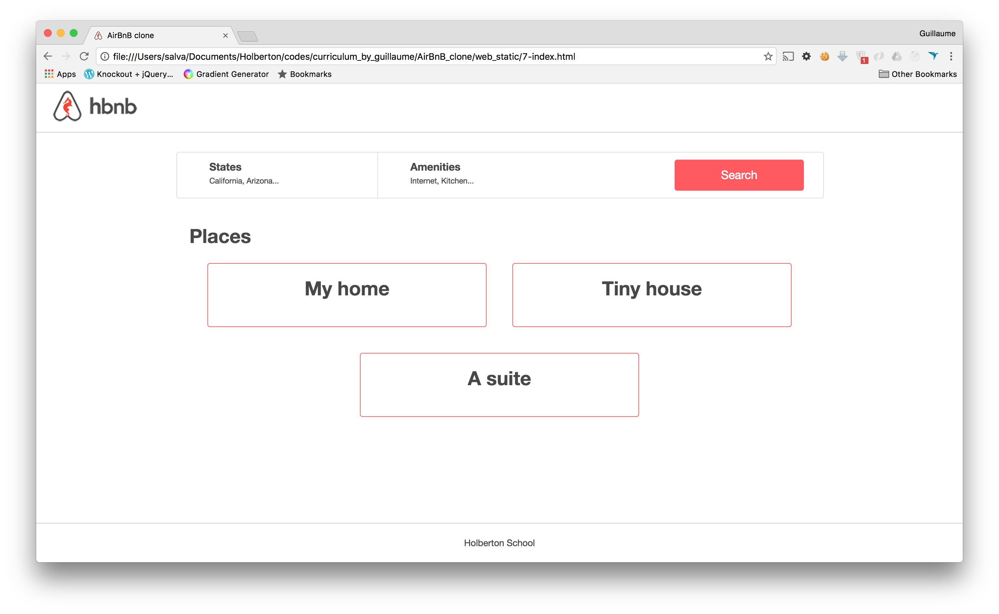

# Project 2188: AirBnB clone - Web static
----


(the original page had an image here that was not available)

## Background Context

### Web static, what?

Now that you have a command interpreter for managing your AirBnB objects, it’s time to make them alive!

Before developing a big and complex web application, we will build the front end step-by-step.

The first step is to “design” / “sketch” / “prototype” each element:

* Create simple HTML static pages
* Style guide
* Fake contents
* No Javascript
* No data loaded from anything

During this project, you will learn how to manipulate HTML and CSS languages. HTML is the structure of your page, it should be the first thing to write. CSS is the styling of your page, the design. I really encourage you to fix your HTML part before starting the styling. Indeed, without any structure, you can’t apply any design.

Before starting, please fork or clone the repository`AirBnB_clone`from your partner if you were not the owner of the previous project.

## Resources

**Read or watch**:

* [Learn to Code HTML & CSS](https://learn.shayhowe.com/html-css/)(*until “Creating Lists” included*)
* [Inline Styles in HTML](https://www.codecademy.com/article/html-inline-styles)
* [Specifics on CSS Specificity](https://css-tricks.com/specifics-on-css-specificity/)
* [CSS SpeciFishity](http://www.standardista.com/cgi-sys/suspendedpage.cgi)
* [Introduction to HTML](https://developer.mozilla.org/en-US/docs/Learn_web_development/Core/Structuring_content)
* [CSS](https://developer.mozilla.org/en-US/docs/Learn_web_development/Core/Styling_basics)
* [MDN](https://developer.mozilla.org/en-US/)
* [center boxes](https://css-tricks.com/centering-css-complete-guide/)
## Learning Objectives

At the end of this project, you are expected to be able to[explain to anyone](https://fs.blog/feynman-learning-technique/),**without the help of Google**:

### General

* What is HTML
* How to create an HTML page
* What is a markup language
* What is the DOM
* What is an element / tag
* What is an attribute
* How does the browser load a webpage
* What is CSS
* How to add style to an element
* What is a class
* What is a selector
* How to compute CSS Specificity Value
* What are Box properties in CSS
## Requirements

### General

* Allowed editors:`vi`,`vim`,`emacs`
* All your files should end with a new line
* A`README.md`file, at the root of the folder of the project, is mandatory
* Your code should be W3C compliant and validate with[W3C-Validator](https://github.com/hs-hq/W3C-Validator)
* All your CSS files should be in`styles`folder
* All your images should be in`images`folder
* You are not allowed to use`!important`and`id`(`#...`in the CSS file)
* You are not allowed to use tags`img`,`embed`and`iframe`
* You are not allowed to use Javascript
* Current screenshots have been done on`Chrome 56`or more.
* No cross browsers
* You have to follow all requirements but some`margin`/`padding`are missing - you should try to fit as much as you can to screenshots
## More Info


**Great!**You've completed the quiz successfully! Keep going!#### Question #0

Is the following HTML markup valid?

``
```
<html></html>
```

(elements are correctly tagged, we don’t care about`!Doctype`here)

 * Yes

 * No

#### Question #1

Is the following HTML markup valid?

``
```
<html>
    <head>
    </head>
    <body>
    </body>
</html>
```

(elements are correctly tagged, we don’t care about`!Doctype`here)

 * Yes

 * No

#### Question #2

Is the following HTML markup valid?

``
```
<html>
    <head>
    </head>
    <body>
    <body>
</html>
```

(elements are correctly tagged, we don’t care about`!Doctype`here)

 * Yes

 * No

#### Tips:

Each HTML tag must be closed

#### Question #3

Is the following HTML markup valid?

``
```
<html>
    <head>
    </head>
    <body>
        
    </body>
</html>
```

(elements are correctly tagged, we don’t care about`!Doctype`here)

 * Yes

 * No

#### Tips:

``is an empty element

#### Question #4

Is the following HTML markup valid?

``
```
<html>
    <head>
    </head>
    <body>
        <h1>Best <b>School</h1></b>
    </body>
</html>
```

(elements are correctly tagged, we don’t care about`!Doctype`here)

 * Yes

 * No

#### Tips:

“Always close something before opening a new thing”

#### Question #5

Is the following HTML markup valid?

``
```
<html>
    <head>
    </head>
    <body>
        <h1>
            <a href="www.google.com'>Google</a>
        </h1>
    </body>
</html>
```

(elements are correctly tagged, we don’t care about`!Doctype`here)

 * Yes

 * No

#### Tips:

Number of quotes is important!

#### Question #6

Is the following HTML markup valid?

``
```
<html>
    <head>
    </head>
    <body>
        <h1>
            <a href="www.google.com">Go to <b>Google</b>
        </h1>
    </body>
</html>
```

(elements are correctly tagged, we don’t care about`!Doctype`here)

 * Yes

 * No

#### Question #7

Is following CSS syntax valid?

``
```
body {
    color: #FF0000;
}
```

 * Yes

 * No

#### Question #8

Is following CSS syntax valid?

``
```
body {
    color: #FF0000;
}

* {
    font-size: 14px;
}
```

 * Yes

 * No

#### Tips:

[Universal selectors](https://developer.mozilla.org/en-US/docs/Web/CSS/Universal_selectors)

#### Question #9

Is following CSS syntax valid?

``
```
body {
    color: #FF0000;
}

* {
    font-size: 14px;
    font-weight: 400
    text-align: center;
}
```

 * Yes

 * No

#### Tips:

Betty for CSS!

#### Question #10

Is following CSS syntax valid?

``
```
body {
    color: #FF0000;
}

* {
    font-size: 14px;
    text-align: center;

    h1 {
        margin: 30px;
    }
}
```

 * Yes

 * No

#### Tips:

CSS vs SCSS

#### Question #11

Is following CSS syntax valid?

``
```
body {
    color: #FF0000;
}

* {
    font-size: 14px;
    text-align: center;
    margin: 30px 12px 4px;
}
```

 * Yes

 * No

#### Tips:

`margin`and`padding`support 4 different syntaxes:[margin](https://developer.mozilla.org/en-US/docs/Web/CSS/margin)

#### Question #12

Is following CSS syntax valid?

``
```
body {
    color: #FF0000;
}

h1.title {
    font-size: 16px;
}
```

 * Yes

 * No

#### Question #13

Is following CSS syntax valid?

``
```
body {
    color: #FF0000;
}

div.filters h2 {
    font-size: 16px;
}
```

 * Yes

 * No

#### Question #14

Is following CSS syntax valid?

``
```
body {
    color: #FF0000;
}

div.filters p.title h2 span.text.big {
    font-size: 20px;
}
```

 * Yes

 * No

#### Question #15

Is following CSS syntax valid?

``
```
body {
    color: #FF0000;
}

h3,
div.full_text,
div.small_text h4,
div.filters p.title {
    font-size: 20px;
}
```

 * Yes

 * No

#### Question #16

Is following CSS syntax valid?

``
```
body {
    color: #FF0000;
}

h3,
div.full_text
div.small_text h4
div.filters p.title {
    font-size: 20px;
}
```

 * Yes

 * No

#### Tips:

`,`separates multiple selector, without it’s specific selector

#### Question #17

In the following code, is the text`Best School`red?

*css:*

``
```
h1 {
    color: red;
}
```

*html:*

``
```
<h1>Best School</h1>
```

 * Yes

 * No

#### Question #18

In the following code, is the text`Best School`red?

*css:*

``
```
h2 {
    color: red;
}
```

*html:*

``
```
<h1>Best School</h1>
```

 * Yes

 * No

#### Question #19

In the following code, is the text`Best School`red?

*css:*

``
```
h1.title {
    color: red;
}
```

*html:*

``
```
<h1>Best School</h1>
```

 * Yes

 * No

#### Question #20

In the following code, is the text`Best School`red?

*css:*

``
```
h1 div.title {
    color: red;
}
```

*html:*

``
```
<h1>Best School</h1>
```

 * Yes

 * No

#### Question #21

In the following code, is the text`Best School`red?

*css:*

``
```
h3 span.text,
h1,
div.title {
    color: red;
}
```

*html:*

``
```
<h1>Best School</h1>
```

 * Yes

 * No

#### Question #22

In the following code, is the text`Best School`red?

*css:*

``
```
h1 {
    color: green;
}

span.my_title {
    color: red;
}
```

*html:*

``
```
<h1>
    <span class="my_title">Best School</span>
</h1>
```

 * Yes

 * No

#### Tips:

[CSS selector math](http://www.standardista.com/wp-content/uploads/2012/01/specificity3.pdf)

#### Question #23

In the following code, is the text`Best School`red?

*css:*

``
```
h1 .my_title {
    color: green;
}

.my_title {
    color: red;
}
```

*html:*

``
```
<h1>
    <span class="my_title">Best School</span>
</h1>
```

 * Yes

 * No

#### Tips:

[CSS selector math](http://www.standardista.com/wp-content/uploads/2012/01/specificity3.pdf)


----
## Tasks
---
### 0. Inline styling


Write an HTML page that displays a header and a footer.

Layout:

Requirements:


- Body:


no margin
no padding
- no margin
- no padding
- Header:


background color #FF0000 (red)
height: 70px
width: 100%
- background color #FF0000 (red)
- height: 70px
- width: 100%
- Footer:


background color #00FF00 (green)
height: 60px
width: 100%
text `Holberton School` center vertically and horizontally
always at the bottom at the page
- background color #00FF00 (green)
- height: 60px
- width: 100%
- text `Holberton School` center vertically and horizontally
- always at the bottom at the page

- no margin
- no padding

- background color #FF0000 (red)
- height: 70px
- width: 100%

- background color #00FF00 (green)
- height: 60px
- width: 100%
- text `Holberton School` center vertically and horizontally
- always at the bottom at the page

- You must use the `header` and `footer` tags
- You are not allowed to import any files
- You are not allowed to use the `style` tag in the `head` tag
- Use inline styling for all your tags

**Repo:**

- GitHub repository: `atlas-AirBnB_clone`
- Directory: `web_static`
- File: `0-index.html`


---
### 1. Head styling

Write an HTML page that displays a header and a footer by using the style tag in the head tag (same as 0-index.html)

Requirements:

The layout must be exactly the same as 0-index.html

- You must use the `header` and `footer` tags
- You are not allowed to import any files
- No inline styling
- You must use the `style` tag in the `head` tag

**Repo:**

- GitHub repository: `atlas-AirBnB_clone`
- Directory: `web_static`
- File: `1-index.html`


---
### 2. CSS files

Write an HTML page that displays a header and a footer by using CSS files (same as 1-index.html)

Requirements:

The layout must be exactly the same as 1-index.html

- You must use the `header` and `footer` tags
- No inline styling
- You must have 3 CSS files:


`styles/2-common.css`: for global style (i.e. the `body` style)
`styles/2-header.css`: for header style
`styles/2-footer.css`: for footer style
- `styles/2-common.css`: for global style (i.e. the `body` style)
- `styles/2-header.css`: for header style
- `styles/2-footer.css`: for footer style

- `styles/2-common.css`: for global style (i.e. the `body` style)
- `styles/2-header.css`: for header style
- `styles/2-footer.css`: for footer style

**Repo:**

- GitHub repository: `atlas-AirBnB_clone`
- Directory: `web_static`
- File: `2-index.html, styles/2-common.css, styles/2-header.css, styles/2-footer.css`


---
### 3. Zoning done!


Write an HTML page that displays a header and footer by using CSS files (same as 2-index.html)

Layout:

Requirements:


- Common:


no margin
no padding
font color: #484848
font size: 14px
font family: `Circular,"Helvetica Neue",Helvetica,Arial,sans-serif;`
icon in the browser tab
- no margin
- no padding
- font color: #484848
- font size: 14px
- font family: `Circular,"Helvetica Neue",Helvetica,Arial,sans-serif;`
- icon in the browser tab
- Header:


background color: white
height: 70px
width: 100%
border bottom 1px #CCCCCC
logo align on left and center vertically (20px space at the left)
- background color: white
- height: 70px
- width: 100%
- border bottom 1px #CCCCCC
- logo align on left and center vertically (20px space at the left)
- Footer:


background color: white
height: 60px
width: 100%
border top 1px #CCCCCC
text `Holberton School` center vertically and horizontally
always at the bottom at the page
- background color: white
- height: 60px
- width: 100%
- border top 1px #CCCCCC
- text `Holberton School` center vertically and horizontally
- always at the bottom at the page

- no margin
- no padding
- font color: #484848
- font size: 14px
- font family: `Circular,"Helvetica Neue",Helvetica,Arial,sans-serif;`
- icon in the browser tab

- background color: white
- height: 70px
- width: 100%
- border bottom 1px #CCCCCC
- logo align on left and center vertically (20px space at the left)

- background color: white
- height: 60px
- width: 100%
- border top 1px #CCCCCC
- text `Holberton School` center vertically and horizontally
- always at the bottom at the page

- No inline style
- You are not allowed to use the `img` tag
- You are not allowed to use the `style` tag in the `head` tag
- All images must be stored in the `images` folder
- You must have 3 CSS files:


`styles/3-common.css`: for the global style (i.e `body` style)
`styles/3-header.css`: for the header style
`styles/3-footer.css`: for the footer style
- `styles/3-common.css`: for the global style (i.e `body` style)
- `styles/3-header.css`: for the header style
- `styles/3-footer.css`: for the footer style

- `styles/3-common.css`: for the global style (i.e `body` style)
- `styles/3-header.css`: for the header style
- `styles/3-footer.css`: for the footer style

**Repo:**

- GitHub repository: `atlas-AirBnB_clone`
- Directory: `web_static`
- File: `3-index.html, styles/3-common.css, styles/3-header.css, styles/3-footer.css, images/`


---
### 4. Search!


Write an HTML page that displays a header, footer and a filters box with a search button.

Layout: (based on 3-index.html)

Requirements:


- Container:


between `header` and `footer` tags, add a `div`:


class name: `container`
max width 1000px
margin top and bottom 30px - it should be 30px under the bottom of the `header` (screenshot)
center horizontally
- between `header` and `footer` tags, add a `div`:


class name: `container`
max width 1000px
margin top and bottom 30px - it should be 30px under the bottom of the `header` (screenshot)
center horizontally
- class name: `container`
- max width 1000px
- margin top and bottom 30px - it should be 30px under the bottom of the `header` (screenshot)
- center horizontally
- Filter section: 


tag `section`
class name `filters`
inside the `.container`
background color white
height: 70px
width: 100% of the container
border 1px #DDDDDD with radius 4px
- tag `section`
- class name `filters`
- inside the `.container`
- background color white
- height: 70px
- width: 100% of the container
- border 1px #DDDDDD with radius 4px
- Button search:


tag `button`
text `Search`
inside the section filters
font size: 18px
background color #FF5A5F
text color #FFFFFF
height: 48px
width: 20% of the section filters
no borders
border radius: 4px
center vertically and at 30px of the right border
change opacity to 90% when the mouse is on the button
- tag `button`
- text `Search`
- inside the section filters
- font size: 18px
- background color #FF5A5F
- text color #FFFFFF
- height: 48px
- width: 20% of the section filters
- no borders
- border radius: 4px
- center vertically and at 30px of the right border
- change opacity to 90% when the mouse is on the button

- between `header` and `footer` tags, add a `div`:


class name: `container`
max width 1000px
margin top and bottom 30px - it should be 30px under the bottom of the `header` (screenshot)
center horizontally
- class name: `container`
- max width 1000px
- margin top and bottom 30px - it should be 30px under the bottom of the `header` (screenshot)
- center horizontally

- class name: `container`
- max width 1000px
- margin top and bottom 30px - it should be 30px under the bottom of the `header` (screenshot)
- center horizontally

- tag `section`
- class name `filters`
- inside the `.container`
- background color white
- height: 70px
- width: 100% of the container
- border 1px #DDDDDD with radius 4px

- tag `button`
- text `Search`
- inside the section filters
- font size: 18px
- background color #FF5A5F
- text color #FFFFFF
- height: 48px
- width: 20% of the section filters
- no borders
- border radius: 4px
- center vertically and at 30px of the right border
- change opacity to 90% when the mouse is on the button

- You must use: `header`, `footer`, `section`, `button` tags
- No inline style
- You are not allowed to use the `img` tag
- You are not allowed to use the `style` tag in the `head` tag
- All images must be stored in the `images` folder
- You must have 4 CSS files:


`styles/4-common.css`: for the global style (`body` and `.container` styles)
`styles/3-header.css`: for the header style
`styles/3-footer.css`: for the footer style
`styles/4-filters.css`: for the filters style
- `styles/4-common.css`: for the global style (`body` and `.container` styles)
- `styles/3-header.css`: for the header style
- `styles/3-footer.css`: for the footer style
- `styles/4-filters.css`: for the filters style
- `4-index.html` **won’t be W3C valid**, don’t worry, it’s temporary

- `styles/4-common.css`: for the global style (`body` and `.container` styles)
- `styles/3-header.css`: for the header style
- `styles/3-footer.css`: for the footer style
- `styles/4-filters.css`: for the filters style

**Repo:**

- GitHub repository: `atlas-AirBnB_clone`
- Directory: `web_static`
- File: `4-index.html, styles/4-common.css, styles/3-header.css, styles/3-footer.css, styles/4-filters.css, images/`


---
### 5. More filters


Write an HTML page that displays a header, footer and a filters box.

Layout: (based on 4-index.html)

Requirements:


- Locations and Amenities filters:


tag: `div`
classname: `locations` for location tag and `amenities` for the other
inside the section filters (same level as the `button` Search)
height: 100% of the section filters
width: 25% of the section filters
border right #DDDDDD 1px only for the first left filter
contains a title:


tag: `h3`
font weight: 600
text `States` or `Amenities`

contains a subtitle:


tag: `h4`
font weight: 400
font size: 14px
text with fake contents
- tag: `div`
- classname: `locations` for location tag and `amenities` for the other
- inside the section filters (same level as the `button` Search)
- height: 100% of the section filters
- width: 25% of the section filters
- border right #DDDDDD 1px only for the first left filter
- contains a title:


tag: `h3`
font weight: 600
text `States` or `Amenities`
- tag: `h3`
- font weight: 600
- text `States` or `Amenities`
- contains a subtitle:


tag: `h4`
font weight: 400
font size: 14px
text with fake contents
- tag: `h4`
- font weight: 400
- font size: 14px
- text with fake contents

- tag: `div`
- classname: `locations` for location tag and `amenities` for the other
- inside the section filters (same level as the `button` Search)
- height: 100% of the section filters
- width: 25% of the section filters
- border right #DDDDDD 1px only for the first left filter
- contains a title:


tag: `h3`
font weight: 600
text `States` or `Amenities`
- tag: `h3`
- font weight: 600
- text `States` or `Amenities`
- contains a subtitle:


tag: `h4`
font weight: 400
font size: 14px
text with fake contents
- tag: `h4`
- font weight: 400
- font size: 14px
- text with fake contents

- tag: `h3`
- font weight: 600
- text `States` or `Amenities`

- tag: `h4`
- font weight: 400
- font size: 14px
- text with fake contents

- You must use: `header`, `footer`, `section`, `button`, `h3`, `h4` tags
- No inline style
- You are not allowed to use the `img` tag
- You are not allowed to use the `style` tag in the `head` tag
- All images must be stored in the `images` folder
- You must have 4 CSS files:


`styles/4-common.css`: for the global style (`body` and `.container` styles)
`styles/3-header.css`: for the header style
`styles/3-footer.css`: for the footer style
`styles/5-filters.css`: for the filters style
- `styles/4-common.css`: for the global style (`body` and `.container` styles)
- `styles/3-header.css`: for the header style
- `styles/3-footer.css`: for the footer style
- `styles/5-filters.css`: for the filters style

- `styles/4-common.css`: for the global style (`body` and `.container` styles)
- `styles/3-header.css`: for the header style
- `styles/3-footer.css`: for the footer style
- `styles/5-filters.css`: for the filters style

**Repo:**

- GitHub repository: `atlas-AirBnB_clone`
- Directory: `web_static`
- File: `5-index.html, styles/4-common.css, styles/3-header.css, styles/3-footer.css, styles/5-filters.css, images/`


---
### 6. It's (h)over


Write an HTML page that displays a header, footer and a filters box with dropdown.

Layout: (based on 5-index.html)

Requirements:


- Update Locations and Amenities filters to display a contextual dropdown when the mouse is on the filter `div`: 


tag `ul`
classname `popover`
text should be fake now
inside each `div`
not displayed by default
color #FAFAFA
width same as the `div` filter
border #DDDDDD 1px with border radius 4px
no list display
Location filter has 2 levels of `ul`/`li`:


state -&gt; cities
state name must be display in a `h2` tag (font size 16px)
- tag `ul`
- classname `popover`
- text should be fake now
- inside each `div`
- not displayed by default
- color #FAFAFA
- width same as the `div` filter
- border #DDDDDD 1px with border radius 4px
- no list display
- Location filter has 2 levels of `ul`/`li`:


state -&gt; cities
state name must be display in a `h2` tag (font size 16px)
- state -&gt; cities
- state name must be display in a `h2` tag (font size 16px)

- tag `ul`
- classname `popover`
- text should be fake now
- inside each `div`
- not displayed by default
- color #FAFAFA
- width same as the `div` filter
- border #DDDDDD 1px with border radius 4px
- no list display
- Location filter has 2 levels of `ul`/`li`:


state -&gt; cities
state name must be display in a `h2` tag (font size 16px)
- state -&gt; cities
- state name must be display in a `h2` tag (font size 16px)

- state -&gt; cities
- state name must be display in a `h2` tag (font size 16px)

- You must use: `header`, `footer`, `section`, `button`, `h3`, `h4`, `ul`, `li` tags
- No inline style
- You are not allowed to use the `img` tag
- You are not allowed to use the `style` tag in the `head` tag
- All images must be stored in the `images` folder
- You must have 4 CSS files:


`styles/4-common.css`: for the global style (`body` and `.container` styles)
`styles/3-header.css`: for the header style
`styles/3-footer.css`: for the footer style
`styles/6-filters.css`: for the filters style
- `styles/4-common.css`: for the global style (`body` and `.container` styles)
- `styles/3-header.css`: for the header style
- `styles/3-footer.css`: for the footer style
- `styles/6-filters.css`: for the filters style

- `styles/4-common.css`: for the global style (`body` and `.container` styles)
- `styles/3-header.css`: for the header style
- `styles/3-footer.css`: for the footer style
- `styles/6-filters.css`: for the filters style

**Repo:**

- GitHub repository: `atlas-AirBnB_clone`
- Directory: `web_static`
- File: `6-index.html, styles/4-common.css, styles/3-header.css, styles/3-footer.css, styles/6-filters.css, images/`


---
### 7. Display results



Write an HTML page that displays a header, footer, a filters box with dropdown and results.

Layout: (based on 6-index.html)

Requirements:


- Add Places section:


tag: `section`
classname: `places`
same level as the filters section, inside `.container`
contains a title:


tag: `h1`
text: `Places`
align in the top left
font size: 30px

contains multiple “Places” as listing (horizontal or vertical) describe by:


tag: `article`
width: 390px
padding and margin 20px
border #FF5A5F 1px with radius 4px
contains the place name:


tag: `h2`
font size: 30px
center horizontally
- tag: `section`
- classname: `places`
- same level as the filters section, inside `.container`
- contains a title:


tag: `h1`
text: `Places`
align in the top left
font size: 30px
- tag: `h1`
- text: `Places`
- align in the top left
- font size: 30px
- contains multiple “Places” as listing (horizontal or vertical) describe by:


tag: `article`
width: 390px
padding and margin 20px
border #FF5A5F 1px with radius 4px
contains the place name:


tag: `h2`
font size: 30px
center horizontally
- tag: `article`
- width: 390px
- padding and margin 20px
- border #FF5A5F 1px with radius 4px
- contains the place name:


tag: `h2`
font size: 30px
center horizontally
- tag: `h2`
- font size: 30px
- center horizontally

- tag: `section`
- classname: `places`
- same level as the filters section, inside `.container`
- contains a title:


tag: `h1`
text: `Places`
align in the top left
font size: 30px
- tag: `h1`
- text: `Places`
- align in the top left
- font size: 30px
- contains multiple “Places” as listing (horizontal or vertical) describe by:


tag: `article`
width: 390px
padding and margin 20px
border #FF5A5F 1px with radius 4px
contains the place name:


tag: `h2`
font size: 30px
center horizontally
- tag: `article`
- width: 390px
- padding and margin 20px
- border #FF5A5F 1px with radius 4px
- contains the place name:


tag: `h2`
font size: 30px
center horizontally
- tag: `h2`
- font size: 30px
- center horizontally

- tag: `h1`
- text: `Places`
- align in the top left
- font size: 30px

- tag: `article`
- width: 390px
- padding and margin 20px
- border #FF5A5F 1px with radius 4px
- contains the place name:


tag: `h2`
font size: 30px
center horizontally
- tag: `h2`
- font size: 30px
- center horizontally

- tag: `h2`
- font size: 30px
- center horizontally

- You must use: `header`, `footer`, `section`, `article`, `button`, `h1`, `h2`, `h3`, `h4`, `ul`, `li` tags
- No inline style
- You are not allowed to use the `img` tag
- You are not allowed to use the `style` tag in the `head` tag
- All images must be stored in the `images` folder
- You must have 5 CSS files:


`styles/4-common.css`: for the global style (i.e. `body` and `.container` styles)
`styles/3-header.css`: for the header style
`styles/3-footer.css`: for footer style
`styles/6-filters.css`: for the filters style
`styles/7-places.css`: for the places style
- `styles/4-common.css`: for the global style (i.e. `body` and `.container` styles)
- `styles/3-header.css`: for the header style
- `styles/3-footer.css`: for footer style
- `styles/6-filters.css`: for the filters style
- `styles/7-places.css`: for the places style

- `styles/4-common.css`: for the global style (i.e. `body` and `.container` styles)
- `styles/3-header.css`: for the header style
- `styles/3-footer.css`: for footer style
- `styles/6-filters.css`: for the filters style
- `styles/7-places.css`: for the places style

**Repo:**

- GitHub repository: `atlas-AirBnB_clone`
- Directory: `web_static`
- File: `7-index.html, styles/4-common.css, styles/3-header.css, styles/3-footer.css, styles/6-filters.css, styles/7-places.css, images/`


---
### 8. More details


Write an HTML page that displays a header, a footer, a filter box (dropdown list) and the result of the search.

Layout: (based on 7-index.html)

Add more information to a Place article:

Requirements:


- Price by night:


tag: `div`
classname: `price_by_night`
same level as the place name
font color: #FF5A5F
border: #FF5A5F 4px rounded
min width: 60px
height: 60px
font size: 30px
align: the top right (with space)
- tag: `div`
- classname: `price_by_night`
- same level as the place name
- font color: #FF5A5F
- border: #FF5A5F 4px rounded
- min width: 60px
- height: 60px
- font size: 30px
- align: the top right (with space)
- Information section:


tag: `div`
classname: `information`
height: 80px
border: top and bottom #DDDDDD 1px
contains (align vertically):


Number of guests:


tag: `div`
classname: `max_guest`
width: 100px
fake text
icon

Number of bedrooms:


tag: `div`
classname: `number_rooms`
width: 100px
fake text
icon

Number of bathrooms:


tag: `div`
classname: `number_bathrooms`
width: 100px
fake text
icon
- tag: `div`
- classname: `information`
- height: 80px
- border: top and bottom #DDDDDD 1px
- contains (align vertically):


Number of guests:


tag: `div`
classname: `max_guest`
width: 100px
fake text
icon

Number of bedrooms:


tag: `div`
classname: `number_rooms`
width: 100px
fake text
icon

Number of bathrooms:


tag: `div`
classname: `number_bathrooms`
width: 100px
fake text
icon
- Number of guests:


tag: `div`
classname: `max_guest`
width: 100px
fake text
icon
- tag: `div`
- classname: `max_guest`
- width: 100px
- fake text
- icon
- Number of bedrooms:


tag: `div`
classname: `number_rooms`
width: 100px
fake text
icon
- tag: `div`
- classname: `number_rooms`
- width: 100px
- fake text
- icon
- Number of bathrooms:


tag: `div`
classname: `number_bathrooms`
width: 100px
fake text
icon
- tag: `div`
- classname: `number_bathrooms`
- width: 100px
- fake text
- icon
- User section:


tag: `div`
classname: `user`
text `Owner: &lt;fake text&gt;`
`Owner` text should be in bold
- tag: `div`
- classname: `user`
- text `Owner: &lt;fake text&gt;`
- `Owner` text should be in bold
- Description section:


tag: `div`
classname: `description`
- tag: `div`
- classname: `description`

- tag: `div`
- classname: `price_by_night`
- same level as the place name
- font color: #FF5A5F
- border: #FF5A5F 4px rounded
- min width: 60px
- height: 60px
- font size: 30px
- align: the top right (with space)

- tag: `div`
- classname: `information`
- height: 80px
- border: top and bottom #DDDDDD 1px
- contains (align vertically):


Number of guests:


tag: `div`
classname: `max_guest`
width: 100px
fake text
icon

Number of bedrooms:


tag: `div`
classname: `number_rooms`
width: 100px
fake text
icon

Number of bathrooms:


tag: `div`
classname: `number_bathrooms`
width: 100px
fake text
icon
- Number of guests:


tag: `div`
classname: `max_guest`
width: 100px
fake text
icon
- tag: `div`
- classname: `max_guest`
- width: 100px
- fake text
- icon
- Number of bedrooms:


tag: `div`
classname: `number_rooms`
width: 100px
fake text
icon
- tag: `div`
- classname: `number_rooms`
- width: 100px
- fake text
- icon
- Number of bathrooms:


tag: `div`
classname: `number_bathrooms`
width: 100px
fake text
icon
- tag: `div`
- classname: `number_bathrooms`
- width: 100px
- fake text
- icon

- Number of guests:


tag: `div`
classname: `max_guest`
width: 100px
fake text
icon
- tag: `div`
- classname: `max_guest`
- width: 100px
- fake text
- icon
- Number of bedrooms:


tag: `div`
classname: `number_rooms`
width: 100px
fake text
icon
- tag: `div`
- classname: `number_rooms`
- width: 100px
- fake text
- icon
- Number of bathrooms:


tag: `div`
classname: `number_bathrooms`
width: 100px
fake text
icon
- tag: `div`
- classname: `number_bathrooms`
- width: 100px
- fake text
- icon

- tag: `div`
- classname: `max_guest`
- width: 100px
- fake text
- icon

- tag: `div`
- classname: `number_rooms`
- width: 100px
- fake text
- icon

- tag: `div`
- classname: `number_bathrooms`
- width: 100px
- fake text
- icon

- tag: `div`
- classname: `user`
- text `Owner: &lt;fake text&gt;`
- `Owner` text should be in bold

- tag: `div`
- classname: `description`

- You must use: `header`, `footer`, `section`, `article`, `button`, `h1`, `h2`, `h3`, `h4`, `ul`, `li` tags
- No inline style
- You are not allowed to use the `img` tag
- You are not allowed to use the `style` tag in the `head` tag
- All images must be stored in the `images` folder
- You must have 5 CSS files:


`styles/4-common.css`: for the global style (i.e. `body` and `.container` styles)
`styles/3-header.css`: for the header style
`styles/3-footer.css`: for the footer style
`styles/6-filters.css`: for the filters style
`styles/8-places.css`: for the places style
- `styles/4-common.css`: for the global style (i.e. `body` and `.container` styles)
- `styles/3-header.css`: for the header style
- `styles/3-footer.css`: for the footer style
- `styles/6-filters.css`: for the filters style
- `styles/8-places.css`: for the places style

- `styles/4-common.css`: for the global style (i.e. `body` and `.container` styles)
- `styles/3-header.css`: for the header style
- `styles/3-footer.css`: for the footer style
- `styles/6-filters.css`: for the filters style
- `styles/8-places.css`: for the places style

**Repo:**

- GitHub repository: `atlas-AirBnB_clone`
- Directory: `web_static`
- File: `8-index.html, styles/4-common.css, styles/3-header.css, styles/3-footer.css, styles/6-filters.css, styles/8-places.css, images/`