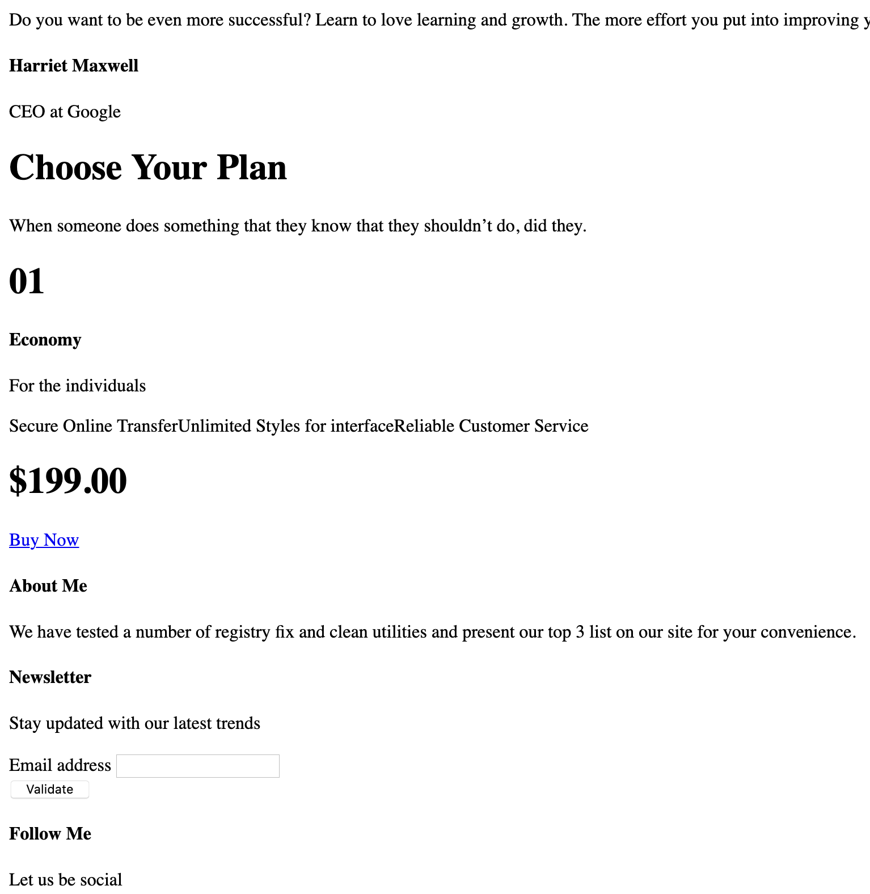

# Project 2357: Accessibility
----


*For this project, we expect you to look at this concept:*

* [A Crash Course on Accessibility](/concepts/956)


## Resources

**Read or watch**:

* [Accessibility is not a feature. — Ethan Marcotte](https://ethanmarcotte.com/wrote/accessibility-is-not-a-feature/)
* [How to Meet WCAG (Quickref Reference](https://www.w3.org/WAI/WCAG22/quickref/?versions=2.1)
* [Web Accessibility Guidebook for Developers](https://www.telerik.com/blogs/web-accessibility-guidebook-for-developers?fbclid=IwAR3v8sqaMyuAYfa14dZJpDKqJd-v8qKfaKeEvZJRKTcRIOabNnYGPo4rA7U)
* [Testing with assistive technologies - Service Manual - GOV.UK](https://www.gov.uk/service-manual/technology/testing-with-assistive-technologies)
* [A11Y Style Guide](https://a11y-style-guide.com/style-guide/)
* [Building Pylon-Free Web Pages: An Intro to Web Accessibility](https://engineering.vena.io/building-pylon-free-web-pages-an-intro-to-web-accessibility/)
* [I Threw Away my Mouse - 24 Accessibility](https://www.24a11y.com/2018/i-threw-away-my-mouse/)
* [I Used a Switch Control for a Day - 24 Accessibility](https://www.24a11y.com/2018/i-used-a-switch-control-for-a-day/)
* [The Myths of Color Contrast Accessibility](https://uxmovement.com/buttons/the-myths-of-color-contrast-accessibility/)
* [IAAP Certification](https://www.accessibilityassociation.org/s/certification)
* [Accessibility Blog | Deque Systems](https://www.deque.com/blog/)
* [Tink - Léonie Watson – On technology, food & life in the digital age](https://tink.uk/)
* [Accessibility Weekly](https://a11yweekly.com/)
* [Section508.gov | GSA Government-wide IT Accessibility Program](https://www.section508.gov/)
## Learning Objectives

At the end of this project, you are expected to be able to[explain to anyone](https://fs.blog/feynman-learning-technique/),**without the help of Google**:

* ARIA’s main purpose
* WCAG conformance levels (A, AA and AAA)
* The importance of Web Accessibility
* Tools to use for Web Accessibility
## Requirements

* Allowed editors:`vi`,`vim`,`emacs`
* A`README.md`at the root of the project directory is mandatory
* HTML and CSS have been rendered on Chrome 78 or more.
**Great!**You've completed the quiz successfully! Keep going!#### Question #0

Accessibility level: live video has captions

 * level A

 * level AA

 * level AAA

#### Question #1

Accessibility level: provide descriptive link text

 * level A

 * level AA

 * level AAA

#### Question #2

Accessibility level: provide ability to skip content

 * level A

 * level AA

 * level AAA

#### Question #3

Accessibility level: explain any unusual word

 * level A

 * level AA

 * level AAA

#### Question #4

Accessibility level: no major code error

 * level A

 * level AA

 * level AAA

#### Question #5

If a person types “paleo recipes” in a site search, which of the following is the best page title?

 * Search

 * Search results for “paleo recipes”

 * Paleo recipes

#### Question #6

Identifying the language of an HTML page is important for users of:

 * Voice recognition software

 * Screen readers

 * Screen magnifiers

 * All of the above

#### Question #7

What is the correct language code for Portuguese?

(select all valid answers)

 * lang=“portuguese”

 * lang=“portugues”

 * lang=“port”

 * lang=“pt”

 * lang=“pt-br”

#### Question #8

Where should be the lang attribute

 * In the`<!doctype>`element

 * In the`<body>`element

 * In the`html`element

#### Question #9

All of the following are true about skip links except

 * Must be placed just before the main navigation menu

 * Must become visible upon receiving focus, if hidden

 * Must be accessible to keyboard-only users

 * Must be accessible to screen reader users


----
## Tasks
---
### 0. make the "works" card focus visible

Start with this <!--plain-NL-->`00-styles.css`<!--inline-NL--> file:<!--plain-NL-->

```

/* SUMMARY
1. GLOBAL
2. LAYOUT
3. SECTION
4. CARD
*/


/*** 1. GLOBAL ***/

/* Reset / Normalize
  ============================= */

/*! normalize.css v8.0.1 | MIT License | github.com/necolas/normalize.css */html{line-height:1.15;-webkit-text-size-adjust:100%}body{margin:0}main{display:block}h1{font-size:2em;margin:.67em 0}hr{box-sizing:content-box;height:0;overflow:visible}pre{font-family:monospace,monospace;font-size:1em}a{background-color:transparent}abbr[title]{border-bottom:none;text-decoration:underline;text-decoration:underline dotted}b,strong{font-weight:bolder}code,kbd,samp{font-family:monospace,monospace;font-size:1em}small{font-size:80%}sub,sup{font-size:75%;line-height:0;position:relative;vertical-align:baseline}sub{bottom:-.25em}sup{top:-.5em}img{border-style:none}button,input,optgroup,select,textarea{font-family:inherit;font-size:100%;line-height:1.15;margin:0}button,input{overflow:visible}button,select{text-transform:none}[type=button],[type=reset],[type=submit],button{-webkit-appearance:button}[type=button]::-moz-focus-inner,[type=reset]::-moz-focus-inner,[type=submit]::-moz-focus-inner,button::-moz-focus-inner{border-style:none;padding:0}[type=button]:-moz-focusring,[type=reset]:-moz-focusring,[type=submit]:-moz-focusring,button:-moz-focusring{outline:1px dotted ButtonText}fieldset{padding:.35em .75em .625em}legend{box-sizing:border-box;color:inherit;display:table;max-width:100%;padding:0;white-space:normal}progress{vertical-align:baseline}textarea{overflow:auto}[type=checkbox],[type=radio]{box-sizing:border-box;padding:0}[type=number]::-webkit-inner-spin-button,[type=number]::-webkit-outer-spin-button{height:auto}[type=search]{-webkit-appearance:textfield;outline-offset:-2px}[type=search]::-webkit-search-decoration{-webkit-appearance:none}::-webkit-file-upload-button{-webkit-appearance:button;font:inherit}details{display:block}summary{display:list-item}template{display:none}[hidden]{display:none}

/* Variables
  ============================= */

:root {
  --color-primary: #D73953;
  --color-black:  #090909;
  --color-white: #ffffff;
  --color-grey: #a0a0a0;
  --color-light-grey: #f3f3f3;
  --color-dark-grey: #353535;
  --color-red: #cd3e65;
  --color-green: #08805b;

  --text-color: var(--color-black);
  --valid-color: var(--color-green);
  --error-color: var(--color-red);

  --font-family-base: 'Open Sans', 'Helvetica Neue', Helvetica, Arial, sans-serif;
  --font-family-title: 'Raleway', 'Helvetica Neue', Helvetica, Arial, sans-serif;

  --font-size-small: 1.2rem;
  --font-size-medium: 1.6rem;
  --font-size-large: 1.8rem;
  --font-size-x-large: 2.3rem;
  --font-size-xx-large: 4.8rem;

  --font-weight-regular: 400;
  --font-weight-bold: 700;

  --line-height-small: 1.2;
  --line-height-base: 1.5;
  --line-height-big: 1.8;

  /** SECTION **/
  --section-padding: 5rem 0;
  --section-header-padding: 0 0 3rem;
  --section-header-align: center;
  --section-title-font-size: var(--font-size-xx-large);
  --section-title-font-weight: var(--font-weight-bold);
  --section-title-line-height: var(--line-height-small);
  --section-title-margin: 0;
  --section-title-color: var(--color-black);
  --section-tagline-transform: uppercase;
  --section-tagline-color: var(--color-primary);
  --section-tagline-font-family: var(--font-family-headings);
  --section-tagline-font-weight: var(--font-weight-bold);
  --section-tagline-margin: 0;
  --section-body-padding: 2rem 0 4rem;
  --section-footer-padding: 3rem 0 0;
  --section-footer-align: center;

  /** HEADER **/
  --header-padding: 4rem 0 0;

  /** FOOTER **/
  --footer-padding: 5rem 0 1rem;

  /** NAVBAR **/
  --nav-item-font-family: var(--font-family-headings);
  --nav-item-font-weight: var(--font-weight-bold);
  --nav-item-font-size: var(--font-size-medium);
  --nav-item-letter-spacing: .04rem;
  --nav-item-display: inline-block;
  --nav-item-margin: 0 0 0 2rem;
  --nav-item-link-hover: var(--color-white);

  /** BUTTON **/
  --button-display: inline-block;
  --button-padding: 1.5rem 3rem;
  --button-border: var(--color-primary) solid 0.2rem;
  --button-color: var(--color-black);
  --button-text-decoration: none;
  --button-font-size: var(--font-size-large);
  --button-hover-color: var(--color-white);
  --button-hover-text-decoration: none;
  --button-hover-background: var(--color-primary);

  /** MOTION **/
  --transition-duration: .3s;
  --transition-cubic-bezier: cubic-bezier(0.17, 0.67, 0, 1.01);
}

/* Base
    ============================= */

*, *:before, *:after {
  box-sizing: border-box;
}

html {
  scroll-behavior: smooth;
  font-size: 62.5%;
}

body {
  color: var(--text-color);
  font-family: var(--font-family-base);
  font-size: var(--font-size-medium);
  font-weight: var(--font-weight-regular);
  line-height: var(--line-height-base);
}

h1, h2, h3, h4, h5, h6 {
  font-family: var(--font-family-title);
  font-weight: var(--font-weight-bold);
}

a {
  color: var(--text-color);
  text-decoration: none;
}

a:visited {
  font-style: italic;
}

a:hover {
  text-decoration: underline;
}

a:active {
  background-color: var(--color-light-grey);
}

.button {
  display: var(--button-display);
  padding: var(--button-padding);
  border: var(--button-border);
  font-size: var(--button-font-size);
  color: var(--button-color);
  text-decoration: var(--button-text-decoration);
  cursor: pointer;
}

.button:hover {
  color: var(--button-hover-color);
  text-decoration: var(--button-hover-text-decoration);
  background: var(--button-hover-background);
  transition-duration: var(--transition-duration);
  transition-property: color, background-color;
}

.button-primary {
  color: var(--color-white);
  background: var(--color-primary);
}

.button-primary:hover {
  color: var(--color-primary);
  background: var(--color-white);
}

@media only screen and (max-width: 480px) {
  html{
    font-size: 57%;
  }
}

@media only screen and (min-width: 481px) and (max-width: 767px) {
  html{
    font-size: 60%;
  }
}

/* Helpers
    ============================= */

.visually-hidden:not(:focus):not(:active) {
  position: absolute !important;
  height: 1px;
  width: 1px;
  overflow: hidden;
  clip: rect(1px, 1px, 1px, 1px);
  white-space: nowrap;
}

/*** 2. LAYOUT ***/

/* Layout
    ============================= */

.container {
  max-width: 960px;
  margin-left: auto;
  margin-right: auto;
}

main img {
  width: 100%;
  height: auto;
}

/* Grid
    ============================= */

ul.row {
  margin: -1rem;
  padding: 0;
  list-style: none;
}

.row {
  display: flex;
}

[class*='col-'] {
  margin: 1rem;
}

.col-1-3 {
  width: calc((100% / 3) - 2rem);
}

.col-1-2 {
  width: calc((100% / 2) - 2rem);
}

@media only screen and (max-width: 767px) {
  :root {
    --section-padding: 2rem 1.5rem;
    --section-body-padding: 2rem 0 0;
  }

  ul.row,
  .row {
    flex-direction: column;
    margin: 0;
  }

  [class*='col-'] {
    margin: 0 0 3rem 0;
  }

  .col-1-3,
  .col-1-2 {
    width: 100%;
  }
}

/* Navbar
    ============================= */

.nav {
  margin: 0;
  padding: 0;
  list-style: none;
  text-align: center;
  display: flex;
}

.nav .nav-item {
  font-family: var(--nav-item-font-family);
  font-weight: var(--nav-item-font-weight);
  font-size: var(--nav-item-font-size);
  letter-spacing: var(--nav-item-letter-spacing);
}

.nav .nav-item + .nav-item {
  margin: var(--nav-item-margin);
}

.nav .nav-link {
  display: block;
  padding: 0.5rem 0;
  position: relative;
}

.nav .nav-link:hover {
  color: var(--nav-item-link-hover);
  text-decoration: none;
}

.nav .nav-link::before {
  content: '';
  position: absolute;
  bottom: 0;
  left: 0;
  background-color: var(--color-white);
  width: 0;
  height: 0.2rem;
  transition: var(--transition-duration) var(--transition-cubic-bezier);
}

.nav .nav-item:hover .nav-link::before {
  background-color: var(--color-primary);
  width: 100%;
}

@media only screen and (max-width: 767px) {
  :root {
    --nav-item-margin: 0;
  }

  .navbar-menu {
    flex: 1;
    display: none;
  }

  .header .nav {
    flex-direction: column;
    overflow: hidden;
    max-height: 0;
    transition: max-height .2s ease-out;
  }
}

/* Header
  ============================= */

.header {
  padding: var(--header-padding);
  position: relative;
  z-index: 3;
  background: transparent;
}

.header-container {
  display: flex;
  justify-content: space-between;
  align-items: center;
}

/* Header menu mobile
  ============================= */

.header .menu-icon {
  cursor: pointer;
  padding: 2.5rem;
  position: relative;
  user-select: none;
  display: none;
}

.header .menu-icon .navicon {
  background: var(--color-white);
  display: block;
  width: 2rem;
  height: .2rem;
  position: relative;
  transition: background .2s ease-out;
}

.header .menu-icon .navicon:before,
.header .menu-icon .navicon:after {
  content: '';
  display: block;
  width: 100%;
  height: 100%;
  position: absolute;
  background: var(--color-white);
  transition: all .2s ease-out;
}

.header .menu-icon .navicon:before {
  top: .7rem;
}

.header .menu-icon .navicon:after {
  top: -.7rem;
}

/* menu btn */

.header .menu-btn {
  display: none;
}

.menu-btn:checked ~ .navbar-menu {
  display: block;
}

.menu-btn:checked ~ .navbar-menu .nav {
  max-height: 100%;
  overflow: inherit;
}

.header .menu-btn:checked ~ .menu-icon .navicon {
  background: transparent;
}

.header .menu-btn:checked ~ .menu-icon .navicon:before {
  transform: rotate(-45deg);
}

.header .menu-btn:checked ~ .menu-icon .navicon:after {
  transform: rotate(45deg);
}

.header .menu-btn:checked ~ .menu-icon .navicon:before,
.header .menu-btn:checked ~ .menu-icon .navicon:after {
  top: 0;
}

@media only screen and (max-width: 767px) {
  :root {
    --header-padding: 2rem 0 0;
    --nav-item-font-size: var(--font-size-large);
  }

  .header {
    background: var(--color-black);
  }

  .header-container {
    flex-wrap: wrap;
    padding: 0 1.5rem;
  }

  .header .menu-icon {
    display: block;
  }
}

@media only screen and (max-width: 480px) {
  .header-logo {
    flex-basis: 70%;
  }
}

@media only screen and (min-width: 481px) and (max-width: 767px) {
  .header-logo {
    flex-basis: 79%;
  }
}

/* Footer
    ============================= */

.footer {
  --nav-item-font-weight: normal;
  --nav-item-font-size: var(--font-size-small);
  padding: var(--footer-padding);
}

.footer-copyright {
  margin: 0;
  font-size: var(--font-size-small);
  color: var(--text-color);
}

.footer ul {
  text-align: right;
}

.footer-address {
  color: var(--text-color);
}

.social-link {
  display: block;
}

.social-link > svg {
  fill: var(--text-color);
}

@media only screen and (max-width: 767px) {
  :root {
    --footer-padding: 5rem 2rem 1rem;
  }

  .footer .social.nav,
  .footer .footer-nav {
    text-align: center;
  }

  .social.nav li + li,
  .footer-nav li + li {
    padding-left: 2rem;
  }
}

/*** 3. SECTION ***/

/* Section (all styles)
    ============================= */

.section {
  padding: var(--section-padding);
}

.section-header {
  text-align: var(--section-header-align);
  padding: var(--section-header-padding);
}

.section-title {
  font-size: var(--section-title-font-size);
  font-weight: var(--section-title-font-weight);
  line-height: var(--section-title-line-height);
  margin: var(--section-title-margin);
  color: var(--section-title-color);
}

.section-tagline {
  color: var(--section-tagline-color);
  font-family: var(--section-tagline-font-family);
  text-transform: var(--section-tagline-transform);
  font-weight: var(--section-tagline-font-weight);
  margin: var(--section-tagline-margin);
}

.section-body {
  padding: var(--section-body-padding);
}

.section-footer {
  padding: var(--section-footer-padding);
  text-align: var(--section-footer-align);
}

/* Section theming
    ============================= */

[data-section-theme="dark"] {
  --button-color: var(--color-white);
  --text-color: var(--color-white);
  --section-title-color: var(--color-white);
  background: var(--color-black);
}

/* Section HERO
    ============================= */

.section-hero {
  position: relative;
  margin-top: -8.5rem;
}

.hero-homepage {
  background-image: url(../images/banner-home.jpg);
  background-position: 65% 8rem;
  background-repeat: no-repeat;
  background-size: 90rem auto;
}

.section-hero .section-body {
  padding: 10rem 4rem;
}

.section-hero .section-category {
  color: var(--color-white);
  text-transform: uppercase;
}

.section-hero .section-title {
  margin-bottom: 5rem;
}

.section-hero .section-inner {
  display: flex;
  flex-direction: column;
  align-items: flex-start;
  justify-content: center;
  min-height: 35vh;
}

.article-page .section-hero {
  margin-top: -8.5rem;
  padding-top: 5rem;
}

@media only screen and (max-width: 767px) {
  .section-hero {
    margin: -0.1rem 0;
    background-position: 85% 0;
  }

  .section-hero .section-body {
    padding: 2rem;
  }
}

/* Section Latest news
    ============================= */

.section-latest-news .row {
  flex-direction: row-reverse;
}

@media only screen and (max-width: 767px) {
  .section-latest-news .row {
    flex-direction: column;
  }
}

/* Section SERVICES
    ============================= */

.section-services .row {
  flex-wrap: wrap;
}

/* Section ABOUT US
    ============================= */

.section-about-us [class*='col-'] {
  align-self: center;
}

/*** 4. CARD ***/

/* Card (all styles)
    ============================= */

.card-category {
  color: var(--color-primary);
}

/* Card WORK
    ============================= */

.card-work .card-outer {
  position: relative;
  overflow: hidden;
}

.card-work:hover .card-outer {
  transform: scale(0.95);
}

.card-work .card-image img {
  height: 30rem;
  width: 100%;
  object-fit: cover;
  vertical-align: bottom;
}

.card-work:hover .card-image {
  transform: scale(1.2);
  transition: var(--transition-duration) var(--transition-cubic-bezier);
}

.card-work .card-inner {
  position: absolute;
  top: -0.1rem;
  left: -0.1rem;
  right: -0.1rem;
  bottom: -0.1rem;
  z-index: 1;
  transition: var(--transition-duration) var(--transition-cubic-bezier);
}

.card-work:hover .card-inner {
  background-color: rgba(0, 0, 0, 0.7);
}

.card-work .card-title {
  text-align: center;
  margin: 0;
  opacity: 0;
  height: 100%;
  position: relative;
}

.card-work .card-title a {
  display: block;
  text-decoration: none;
  padding-top: 45%;
}

.card-work .card-title a::after {
  position: absolute;
  top: 0;
  left: 0;
  right: 0;
  bottom: 0;
  content: '';
}

.card-work:hover .card-title {
  opacity: 1;
}

@media only screen and (max-width: 767px) {

  .card-work .card-inner {
    --text-color: var(--color-white);
    position: relative;
  }

  .card-work .card-title {
    opacity: 1;
  }

  .card-work .card-title a {
    display: block;
    padding: 2rem 1rem 0 1rem;
  }

  .card-work:hover .card-inner {
    background-color: transparent;
  }

  .card-work:hover .card-image {
    transform: none;
  }
}

/* Card SERVICES
    ============================= */

.card-services .card-title {
  margin: 0;
}

.card-services a {
  display: block;
  padding: 2rem;
  background-color: var(--color-light-grey);
}

.card-services a:hover {
  color: var(--color-white);
  background: var(--color-primary);
  text-decoration: none;
  transition-duration: 0.3s;
  transition-property: color, background-color;
}

/* Card TESTIMONIAL
    ============================= */

.card-testimonial {
  text-align: center;
}

.card-testimonial .card-avatar {
  border-radius: 50%;
  width: 10rem;
  height: 10rem;
}

.card-testimonial .card-quote cite {
  display: block;
  padding-top: 1rem;
  color: var(--color-primary);
}

.card-testimonial .card-quote {
  position: relative;
}

.card-testimonial .card-quote::before {
  content: '\201C';
  position: absolute;
  top: -4.5rem;
  left: -1rem;
  color: #efeded;
  font-size: 10rem;
  z-index: -1;
}

/*** ARTICLE PAGE ***/

/* Section HERO (article)
    ============================= */

.hero-article {
  background-size: 150rem 100rem;
  background-position: 50% 0;
}

.hero-article::before {
  content: '';
  background: rgba(0, 0, 0, 0.8);
  position: absolute;
  top: 0;
  right: 0;
  left: 0;
  bottom: 0;
  z-index: 0;
}

.hero-article .section-inner {
  text-align: center;
  align-items: center;
  min-height: 40vh;
}

.hero-article .section-body {
  position: relative;
  padding: 7rem 0 0;
  z-index: 2;
}

.main-article {
  padding: 5rem 0;
}

/* Post
    ============================= */

.post {
  display: flex;
  align-items: baseline;
}

.post-content {
  width: 100%;
  padding-left: 7rem;
}

.post-aside {
  order: -1;
  min-width: 20%;
}

.post img {
  width: 100%;
  height: auto;
}

.post-content p:first-child {
  font-size: var(--font-size-x-large);
}

.post-content .img-caption {
  margin: 1rem 0;
  padding: 0 0.5rem;
  font-size: var(--font-size-small);
  color: var(--color-grey);
  text-align: center;
}

@media only screen and (max-width: 767px) {
  .post {
    flex-direction: column;
    margin: 2rem;
  }

  .post-content {
    padding-left: 0;
  }
}

/* Post Meta
    ============================= */

.post-meta-list {
  flex-direction: column;
}

.post-meta-list strong {
  color: var(--color-primary);
  font-size: 1.3rem;
  font-weight: var(--font-weight-bold);
  text-transform: uppercase;
  letter-spacing: normal;
  display: block;
}

.post-meta-list [class*='post-meta'] {
  margin-bottom: 1rem;
  padding-bottom: 1rem;
  border-bottom: 0.2rem solid var(--color-light-grey);
}

.post-meta-list [class*='post-meta']:last-child {
  border: none;
  margin-bottom: 3rem;
}

/* Tag list
    ============================= */

.tag-list {
  padding: 0;
  list-style: none;
}

.tag-list li {
  display: inline;
}

.tag-list li::after {
  content: ", ";
}

.tag-list li:last-child::after {
  content: "";
}

/*** FORM ***/

/* Comment section
    ============================= */

.post-comments {
  width: 80%;
  margin: 10rem 0 0 auto;
  padding-left: 7rem;
}

.post-comments .section-title {
  font-variant: small-caps;
}

@media only screen and (max-width: 767px) {
  .post-comments {
    width: calc(100% - 4rem);
    margin: 2rem;
    padding: 0;
  }
}

/* Basic form
    ============================= */

form {
  display: flex;
  flex-direction: column;
  padding: 1rem 0;
  margin: 0;
}

fieldset {
  border: 0;
  display: flex;
  flex-direction: column;
  justify-content: flex-start;
  padding: 0 0 2rem;
}

label {
  cursor: pointer;
  display: block;
  white-space: nowrap;
  font-size: 1.4rem;
  padding: 0 0 .5rem;
}

input[type=text],
input[type=email],
textarea {
  position: relative;
  width: 100%;
  padding: 1.2rem;
  line-height: 1;
  border: .1rem solid var(--color-black);
  background-color: var(--color-white);
  box-shadow: none;
  outline: 0;
}

input[type=text],
input[type=email] {
  padding-right: 3rem;
}

input[type=text]:focus,
input[type=email]:focus,
textarea:focus {
  border: .1rem solid var(--color-grey);
}

::placeholder {
  font-style: italic;
  font-size: var(--font-size-small);
}

/* Form group
    ============================= */

.form-group {
  padding: 1rem;
  margin: 0;
  background-color: var(--color-white);
}

.form-group:focus-within {
  background-color: var(--color-light-grey);
  transition: .3s;
}

/* Form field
    ============================= */

.form-field-container {
  position: relative;
}

.form-field-icon {
  font-style: normal;
}

/* Form help
    ============================= */

.form-group .form-help {
  margin: 0;
  line-height: 1.3;
  letter-spacing: .019rem;
  color: var(--color-dark-grey);
  font-size: var(--font-size-small);
  max-height: 0;
  transition: .3s;
  overflow: hidden;
}

.form-group:focus-within .form-help {
  max-height: 20rem;
  margin: .4rem 0 0;
}

/* Form error handling
    ============================= */

input:not(:placeholder-shown) ~ .form-field-icon::after {
  height: 100%;
  right: 0;
  pointer-events: none;
  position: absolute;
  top: 0;
  width: 1.3em;
}

input:required:invalid:not(:focus):not(:placeholder-shown) ~ .form-field-icon::after {
  content: '✘';
  color: var(--error-color);
}

input:required:valid ~ .form-field-icon::after {
  content: '✔';
  color: var(--valid-color);
}

input:required:valid ~ .form-help {
  max-height: 0;
}

input:required:invalid:not(:focus):not(:placeholder-shown),
textarea:invalid:not(:focus):not(:placeholder-shown) {
  border: 0.1rem solid var(--error-color);
}

input:required:valid:not(:placeholder-shown),
textarea:valid:not(:placeholder-shown) {
  border: 0.1rem solid var(--valid-color);
}

/*** SEARCH FORM ***/

.form-search {
  display: block;
  padding: .5rem 0;
  position: relative;
}

.form-search .search-button {
  display: inline-block;
  background: transparent;
  border: 0;
  margin: 0;
  padding: 0;
}

.search-button .search-icon {
  fill: var(--color-white);
  width: 1.5rem;
  height: 1.5rem;
}

.form-search input[type="search"] {
  display: inline-block;
  color: var(--color-white);
  padding-right: 2rem;
  height: 3rem;
  border: 0;
  outline: none;
  position: absolute;
  width: 0;
  right: 0;
  background: none;
  cursor: pointer;
  z-index: 3;
  transition: width .4s cubic-bezier(0, 0.795, 0, 1);
}

.form-search input[type="search"]:focus {
  position: relative;
  width: 15rem;
  z-index: 1;
  border-bottom: .1rem solid var(--color-grey);
  padding: 0;
  cursor: text;
  margin: 0 1rem;
}

```

You can use it with this <!--plain-NL-->`00-index.html`<!--inline-NL--> file:<!--plain-NL-->

[Images archive](images.zip) <!--link-->

Let’s start by the “Work” section:<!--plain-NL-->

We have an issue with the focus (moving from one link to another with the <!--plain-NL-->`TAB`<!--inline-NL--> key) in the Desktop version. With the DevTools, you can active the focus on the <!--plain-NL-->`<a>`<!--inline-NL--> inside <!--plain-NL-->`.card-title`<!--inline-NL--> and nothing happen.<!--plain-NL-->

To solve it, we need to update the way we are managing the hover state of <!--plain-NL-->`.card-title`<!--inline-NL-->:<!--plain-NL-->

- In your `keyboard/01-styles.css` file, in the `/* Card WORK` section

                                        
Remove `opacity: 0` inside `.card-work .card-title`
Remove `.card-work:hover .card-inner`
Remove `.card-work:hover .card-title`
Target the selector `.card-work .card-title a` and add an opacity to 0.

                                                For `.card-work .card-title a` with the `a` in state focus and `.card-work:hover .card-title a`:

                                                
Property: `opacity`, Value: `1`
Property: `height`, Value: `100%`
Property: `background-color`, Value: `rgba(0, 0, 0, 0.7)`
- Remove `opacity: 0` inside `.card-work .card-title`
- Remove `.card-work:hover .card-inner`
- Remove `.card-work:hover .card-title`
- Target the selector `.card-work .card-title a` and add an opacity to 0.
- For `.card-work .card-title a` with the `a` in state focus and `.card-work:hover .card-title a`:

                                                
Property: `opacity`, Value: `1`
Property: `height`, Value: `100%`
Property: `background-color`, Value: `rgba(0, 0, 0, 0.7)`
- Property: `opacity`, Value: `1`
- Property: `height`, Value: `100%`
- Property: `background-color`, Value: `rgba(0, 0, 0, 0.7)`

- Remove `opacity: 0` inside `.card-work .card-title`
- Remove `.card-work:hover .card-inner`
- Remove `.card-work:hover .card-title`
- Target the selector `.card-work .card-title a` and add an opacity to 0.
- For `.card-work .card-title a` with the `a` in state focus and `.card-work:hover .card-title a`:

                                                
Property: `opacity`, Value: `1`
Property: `height`, Value: `100%`
Property: `background-color`, Value: `rgba(0, 0, 0, 0.7)`
- Property: `opacity`, Value: `1`
- Property: `height`, Value: `100%`
- Property: `background-color`, Value: `rgba(0, 0, 0, 0.7)`

- Property: `opacity`, Value: `1`
- Property: `height`, Value: `100%`
- Property: `background-color`, Value: `rgba(0, 0, 0, 0.7)`

Now you use the keyboard to navigate, you should see the card with the title and the dark background like when you hover the card with your mouse.<!--plain-NL-->

All the other elements have a blue outline around.<!--plain-NL-->

**Repo:**

- GitHub repository: `atlas-web_front_end`
- Directory: `accessibility`
- File: `keyboard/01-styles.css, keyboard/01-index.html`


---
### 1. add the skip-links

Using the <!--plain-NL-->`00-index.html`<!--inline-NL--> provided in the previous task, in your <!--plain-NL-->`skip-links/01-index.html`<!--inline-NL--> file, just after the <!--plain-NL-->`<body>`<!--inline-NL--> HTML open tag<!--plain-NL-->

- Add the `<!-- Skip links -->` comment
- Create a new `<nav>` tag with the `aria-label` attribute. Put the value `Skip links` inside it.
    - Create a non ordered list of class `off-screen`
        - Create a first `li` with a link inside
            - Href: `#a11y-primary-nav`
            - Class: `skip-link`
            - Text: `Skip to primary navigation`
        - Create a second `li` with a link inside
            - Href: `#a11y-main-content`
            - Class: `skip-link`
            - Text: `Skip to main content`
- On the `&lt;nav class="navbar-menu"&gt;`, add an id with the text: `a11y-primary-nav` and a `tabindex="-1"`
- On the `&lt;main&gt;` tag, add an id with the text: `a11y-main-content`, and `tabindex="-1"`


`00-article.html`<!--inline-NL--> is provided to you below to repeat the same changes in your <!--plain-NL-->`skip-links/01-article.html`<!--inline-NL--> file<!--plain-NL-->

```
<!DOCTYPE html>
<html lang="en" dir="ltr">
  <head>
    <meta charset="utf-8">
    <meta name="viewport" content="width=device-width, initial-scale=1, viewport-fit=cover">
    <title>Article - Techium</title>
    <meta name="description" content="Description of the page less than 150 characters">
    <link rel="icon" type="image/x-icon" href="/favicon.ico">
    <link rel="icon" type="image/png" href="/favicon.png">
    <link href="https://fonts.googleapis.com/css?family=Open+Sans:400,700|Raleway:700&display=swap" rel="stylesheet">
    <link rel="stylesheet" href="00-styles.css">
  </head>
  <body class="article-page">

    <!-- Header -->
    <header class="header" data-section-theme="dark">
      <div class="container">
        <div class="header-container">
          <div class="header-logo">
            <a href="/">
              
            </a>
          </div>
          <input class="menu-btn" type="checkbox" id="menu-btn" />
          <label class="menu-icon" for="menu-btn">
            <span class="navicon"></span>
          </label>
          <nav class="navbar-menu">
            <ul class="nav">
              <li class="nav-item">
                <a href="/" class="nav-link">Home</a>
              </li>
              <li class="nav-item">
                <a href="#services" class="nav-link">Services</a>
              </li>
              <li class="nav-item">
                <a href="#works" class="nav-link">Works</a>
              </li>
              <li class="nav-item">
                <a href="#about" class="nav-link">About</a>
              </li>
              <li class="nav-item">
                <a href="#latest_news" class="nav-link">Latest news</a>
              </li>
              <li class="nav-item">
                <a href="#testimonials" class="nav-link">Testimonials</a>
              </li>
              <li class="nav-item">
                <a href="#contact" class="nav-link">Contact</a>
              </li>
              <li class="nav-item">
                <form action="#" method="post" class="form-search">
                  <input type="search" name="q" id="search-input" placeholder="Search..." aria-label="Search through site content">
                  <button class="search-button">
                    <svg viewbox="0 0 512 512" xmlns="http://www.w3.org/2000/svg" width="20" height="20" class="search-icon">
                      <title>
                        Search icon
                      </title>
                      <path d="M508.5 468.9L387.1 347.5c-2.3-2.3-5.3-3.5-8.5-3.5h-13.2c31.5-36.5 50.6-84 50.6-136C416 93.1 322.9 0 208 0S0 93.1 0 208s93.1 208 208 208c52 0 99.5-19.1 136-50.6v13.2c0 3.2 1.3 6.2 3.5 8.5l121.4 121.4c4.7 4.7 12.3 4.7 17 0l22.6-22.6c4.7-4.7 4.7-12.3 0-17zM208 368c-88.4 0-160-71.6-160-160S119.6 48 208 48s160 71.6 160 160-71.6 160-160 160z"/>
                    </svg>
                  </button>
                </form>
              </li>
            </ul>
          </nav>
        </div>
      </div>
    </header>

    <!-- Main -->
    <main>

      <!-- Hero section -->
      <header class="section-hero hero-article" data-section-theme="dark" style="background-image: url('../images/pic-article-02.jpg')">
        <div class="container">
          <div class="section-body">
            <section class="section-inner">
              <span class="section-category">Digital Life</span>
              <h1 class="section-title">Ut alios omittam, hunc appello, quem ille unum secutus est.</h1>
            </section>
          </div>
        </div>
      </header>

      <div class="main-article">
        <div class="container">
          <div class="post">
            <article class="post-content">
              <p>Lorem ipsum dolor sit amet, consectetur adipiscing elit. Tum mihi Piso: Quid ergo? Tum ille: Ain tandem? Non autem hoc: igitur ne illud quidem. Sed quod proximum fuit non vidit. Nos commodius agimus. An nisi populari fama?</p>

              <p>Lorem ipsum dolor sit amet, consectetur adipiscing elit. Sed haec omittamus; <b>Hoc Hieronymus summum bonum esse dixit.</b> Duo Reges: constructio interrete.</p>

              <h2>Prioris generis est docilitas, memoria</h2>

              <ol>
                <li>Nec enim, dum metuit, iustus est, et certe, si metuere destiterit, non erit;</li>
                <li>Quid enim de amicitia statueris utilitatis causa expetenda vides.</li>
              </ol>

              <p>Morbi pharetra congue ante ac tincidunt. Donec euismod eu mauris nec laoreet. Praesent id sodales ipsum. Aliquam erat volutpat. Ut porta sem eget libero faucibus, eget convallis nisi finibus. Interdum et malesuada fames ac ante ipsum primis in faucibus. Vestibulum accumsan euismod nunc quis viverra.</p>

              <figure>
                
                <figcaption class="img-caption">Pugnant Stoici cum Peripateticis. Prioris generis est docilitas</figcaption>
              </figure>

              <p>Quare conare, quaeso. Dici enim nihil potest verius. Primum divisit ineleganter; Suam denique cuique naturam esse ad vivendum ducem.</p>

              <blockquote cite="https://www.holbertonschool.com/">
                <p>Ego autem tibi, Piso, assentior usu hoc venire, ut acrius aliquanto et attentius de claris viris locorum admonitu cogitemus.</p>
              </blockquote>

              <p>Omnia contraria, quos etiam insanos esse vultis. Tibi hoc incredibile, quod beatissimum.</p>

              <h2>Piso igitur hoc modo, vir optimus tuique, ut scis, amantissimus.</h2>

              <p><a href="http://loripsum.net/" target="_blank" rel="noopener">Apparet statim, quae sint officia, quae actiones.</a> Quae in controversiam veniunt, de iis, si placet, disseramus.</p>

              <ul>
                <li>Tubulum fuisse, qua illum, cuius is condemnatus est rogatione, P.</li>
                <li>Quis est autem dignus nomine hominis, qui unum diem totum velit esse in genere isto voluptatis?</li>
                <li>Sed in rebus apertissimis nimium longi sumus.</li>
              </ul>

              <p>Hoc etsi multimodis reprehendi potest, tamen accipio, quod dant. Atqui, inquam, Cato, si istud optinueris, traducas me ad te totum licebit. Nemo nostrum istius generis asotos iucunde putat vivere. Res enim se praeclare habebat, et quidem in utraque parte. Qui autem esse poteris, nisi te amor ipse ceperit? Ita fit cum gravior, tum etiam splendidior oratio. De vacuitate doloris eadem sententia erit. Sin tantum modo ad indicia veteris memoriae cognoscenda, curiosorum.</p>
            </article>

            <!-- Aside section -->
            <aside class="post-aside">
              <div class="post-meta">
                <ul class="post-meta-list row">
                  <li class="post-meta-author">
                    <strong>Written by:</strong>
                    <a href="#" rel="author">William Attaway</a>
                  </li>
                  <li class="post-meta-date">
                    <strong>Posted on:</strong>
                    <time datetime="2019-10">October 2019</time>
                  </li>
                  <li class="post-meta-tag">
                    <strong>Tags:</strong>
                    <ul class="tag-list">
                      <li>
                        <a href="#" rel="tag">Web Design</a>
                      </li>
                      <li>
                        <a href="#" rel="tag">UX</a>
                      </li>
                    </ul>
                  </li>
                </ul>
              </div>
              <div class="post-share">
                <ul class="social nav">
                  <li class="social-item nav-item">
                    <a href="#" class="social-link">
                      <svg viewbox="0 0 24 24" xmlns="http://www.w3.org/2000/svg" width="25" height="25">
                        <title>
                          Facebook icon
                        </title>
                        <path d="M23.998 12c0-6.628-5.372-12-11.999-12C5.372 0 0 5.372 0 12c0 5.988 4.388 10.952 10.124 11.852v-8.384H7.078v-3.469h3.046V9.356c0-3.008 1.792-4.669 4.532-4.669 1.313 0 2.686.234 2.686.234v2.953H15.83c-1.49 0-1.955.925-1.955 1.874V12h3.328l-.532 3.469h-2.796v8.384c5.736-.9 10.124-5.864 10.124-11.853z"/>
                      </svg>
                    </a>
                  </li>
                  <li class="social-item nav-item">
                    <a href="#" class="social-link">
                      <svg viewbox="0 0 24 24" xmlns="http://www.w3.org/2000/svg" width="25" height="25">
                        <title>
                          Twitter icon
                        </title>
                        <path d="M23.954 4.569a10 10 0 0 1-2.825.775 4.958 4.958 0 0 0 2.163-2.723c-.951.555-2.005.959-3.127 1.184a4.92 4.92 0 0 0-8.384 4.482C7.691 8.094 4.066 6.13 1.64 3.161a4.822 4.822 0 0 0-.666 2.475c0 1.71.87 3.213 2.188 4.096a4.904 4.904 0 0 1-2.228-.616v.061a4.923 4.923 0 0 0 3.946 4.827 4.996 4.996 0 0 1-2.212.085 4.937 4.937 0 0 0 4.604 3.417 9.868 9.868 0 0 1-6.102 2.105c-.39 0-.779-.023-1.17-.067a13.995 13.995 0 0 0 7.557 2.209c9.054 0 13.999-7.496 13.999-13.986 0-.209 0-.42-.015-.63a9.936 9.936 0 0 0 2.46-2.548l-.047-.02z"/>
                      </svg>
                    </a>
                  </li>
                </ul>
              </div>
            </aside>
          </div>

          <!-- Comment section -->
          <section class="post-comments">
            <header>
              <h2 class="section-title">Leave a comment</h2>
              <p>All fields are required.</p>
            </header>
            <form action="#" method="post">
              <fieldset>
                <legend class="visually-hidden">Your personal information</legend>
                <div class="form-group col-1-2">
                  <label for="your-first-name">First Name</label>
                  <div class="form-field">
                    <span class="form-field-container">
                      <input type="text" name="your-first-name" id="your-first-name" placeholder="e.g. Mike" pattern="[A-Za-zÀ-ž\s]{3,}"  maxlength="35" autocomplete accesskey="f" required>
                      <i class="form-field-icon"></i>
                      <p class="form-help">First name should be at least 3 characters and only contains letters</p>
                    </span>
                  </div>
                </div>
                <div class="form-group col-1-2">
                  <label for="your-last-name">Last Name</label>
                  <div class="form-field">
                    <span class="form-field-container">
                      <input type="text" name="your-last-name" id="your-last-name" placeholder="e.g. Smith" pattern="[A-Za-zÀ-ž\s]{3,}" maxlength="40" autocomplete accesskey="l" required>
                      <i class="form-field-icon"></i>
                    </span>
                    <p class="form-help">Last name should be at least 3 characters and only contains letters</p>
                  </div>
                </div>
                <div class="form-group col-2-3">
                  <label for="your-email">Email</label>
                  <div class="form-field">
                    <span class="form-field-container">
                      <input type="email" name="your-email" id="your-email" placeholder="e.g. youremail@gmail.com" pattern="[a-z0-9._%+-]+@[a-z0-9.-]+\.[a-z]{2,}$" maxlength="55" autocomplete accesskey="e" required>
                      <i class="form-field-icon"></i>
                    </span>
                  </div>
                </div>
              </fieldset>
              <fieldset>
                <legend class="visually-hidden">Your comment</legend>
                <div class="form-group col-2-3">
                  <label for="your-title">Title</label>
                  <div class="form-field">
                    <span class="form-field-container">
                      <input type="text" name="your-title" id="your-title" placeholder="e.g. I loved that article" pattern="[A-Za-zÀ-ž\s]{4,}" maxlength="75" accesskey="t" required>
                      <i class="form-field-icon"></i>
                      <p class="form-help">Title should be at least 4 characters and only contains letters</p>
                    </span>
                  </div>
                </div>
                <div class="form-group col-2-3">
                  <label for="your-comment">Comment</label>
                  <div class="form-field">
                    <span class="form-field-container">
                      <textarea accesskey="c" placeholder="Write your comment here" name="your-comment" id="your-comment" minlength="10" cols="30" rows="6" required></textarea>
                    </span>
                    <p class="form-help">Comment should be at least 10 characters</p>
                  </div>
                </div>
                <div class="form-group">
                  <button class="button button-primary">Post my comment</button>
                </div>
              </fieldset>
            </form>
          </section>
        </div>
      </div>

    </main>

    <!-- Footer -->
    <footer class="footer" data-section-theme="dark">
      <div  class="container">
        <div class="row">
          <div class="col-1-2">
            
            <address class="footer-address">
              234 Washington Street<br>
              Urbana, Illinois
            </address>
          </div>
          <div class="col-1-2">
            <ul class="social nav">
              <li class="social-item nav-item">
                <a href="https://www.facebook.com/HolbertonSchool/" class="social-link">
                  <svg viewbox="0 0 24 24" xmlns="http://www.w3.org/2000/svg" width="25" height="25">
                    <title>
                      Facebook icon
                    </title>
                    <path d="M23.998 12c0-6.628-5.372-12-11.999-12C5.372 0 0 5.372 0 12c0 5.988 4.388 10.952 10.124 11.852v-8.384H7.078v-3.469h3.046V9.356c0-3.008 1.792-4.669 4.532-4.669 1.313 0 2.686.234 2.686.234v2.953H15.83c-1.49 0-1.955.925-1.955 1.874V12h3.328l-.532 3.469h-2.796v8.384c5.736-.9 10.124-5.864 10.124-11.853z"/>
                  </svg>
                </a>
              </li>
              <li class="social-item nav-item">
                <a href="https://twitter.com/holbertonschool" class="social-link">
                  <svg viewbox="0 0 24 24" xmlns="http://www.w3.org/2000/svg" width="25" height="25">
                    <title>
                      Twitter icon
                    </title>
                    <path d="M23.954 4.569a10 10 0 0 1-2.825.775 4.958 4.958 0 0 0 2.163-2.723c-.951.555-2.005.959-3.127 1.184a4.92 4.92 0 0 0-8.384 4.482C7.691 8.094 4.066 6.13 1.64 3.161a4.822 4.822 0 0 0-.666 2.475c0 1.71.87 3.213 2.188 4.096a4.904 4.904 0 0 1-2.228-.616v.061a4.923 4.923 0 0 0 3.946 4.827 4.996 4.996 0 0 1-2.212.085 4.937 4.937 0 0 0 4.604 3.417 9.868 9.868 0 0 1-6.102 2.105c-.39 0-.779-.023-1.17-.067a13.995 13.995 0 0 0 7.557 2.209c9.054 0 13.999-7.496 13.999-13.986 0-.209 0-.42-.015-.63a9.936 9.936 0 0 0 2.46-2.548l-.047-.02z"/>
                  </svg>
                </a>
              </li>
              <li class="social-item nav-item">
                <a href="https://www.instagram.com/holbertonschool/" class="social-link">
                  <svg viewbox="0 0 24 24" xmlns="http://www.w3.org/2000/svg" width="25" height="25">
                    <title>
                      Instagram icon
                    </title>
                    <path d="M12 0C8.74 0 8.333.015 7.053.072 5.775.132 4.905.333 4.14.63c-.789.306-1.459.717-2.126 1.384S.935 3.35.63 4.14C.333 4.905.131 5.775.072 7.053.012 8.333 0 8.74 0 12s.015 3.667.072 4.947c.06 1.277.261 2.148.558 2.913a5.885 5.885 0 0 0 1.384 2.126A5.868 5.868 0 0 0 4.14 23.37c.766.296 1.636.499 2.913.558C8.333 23.988 8.74 24 12 24s3.667-.015 4.947-.072c1.277-.06 2.148-.262 2.913-.558a5.898 5.898 0 0 0 2.126-1.384 5.86 5.86 0 0 0 1.384-2.126c.296-.765.499-1.636.558-2.913.06-1.28.072-1.687.072-4.947s-.015-3.667-.072-4.947c-.06-1.277-.262-2.149-.558-2.913a5.89 5.89 0 0 0-1.384-2.126A5.847 5.847 0 0 0 19.86.63c-.765-.297-1.636-.499-2.913-.558C15.667.012 15.26 0 12 0zm0 2.16c3.203 0 3.585.016 4.85.071 1.17.055 1.805.249 2.227.415.562.217.96.477 1.382.896.419.42.679.819.896 1.381.164.422.36 1.057.413 2.227.057 1.266.07 1.646.07 4.85s-.015 3.585-.074 4.85c-.061 1.17-.256 1.805-.421 2.227a3.81 3.81 0 0 1-.899 1.382 3.744 3.744 0 0 1-1.38.896c-.42.164-1.065.36-2.235.413-1.274.057-1.649.07-4.859.07-3.211 0-3.586-.015-4.859-.074-1.171-.061-1.816-.256-2.236-.421a3.716 3.716 0 0 1-1.379-.899 3.644 3.644 0 0 1-.9-1.38c-.165-.42-.359-1.065-.42-2.235-.045-1.26-.061-1.649-.061-4.844 0-3.196.016-3.586.061-4.861.061-1.17.255-1.814.42-2.234.21-.57.479-.96.9-1.381.419-.419.81-.689 1.379-.898.42-.166 1.051-.361 2.221-.421 1.275-.045 1.65-.06 4.859-.06l.045.03zm0 3.678a6.162 6.162 0 1 0 0 12.324 6.162 6.162 0 1 0 0-12.324zM12 16c-2.21 0-4-1.79-4-4s1.79-4 4-4 4 1.79 4 4-1.79 4-4 4zm7.846-10.405a1.441 1.441 0 0 1-2.88 0 1.44 1.44 0 0 1 2.88 0z"/>
                  </svg>
                </a>
              </li>
            </ul>
          </div>
        </div>

        <hr>

        <div class="row">
          <div class="col-1-2">
            <p class="footer-copyright">© 2020 Techium, made with ♥ by students at Holberton School.</p>
          </div>
          <div class="col-1-2">
            <ul class="footer-nav nav">
              <li class="footer-nav-item nav-item">
                <a href="#" class="footer-nav-link">Terms of use</a>
              </li>
              <li class="footer-nav-item nav-item">
                <a href="#" class="footer-nav-link">Privacy Policy</a>
              </li>
              <li class="footer-nav-item nav-item">
                <a href="#" class="footer-nav-link">Cookie Policy</a>
              </li>
            </ul>
          </div>
        </div>
      </div>
    </footer>
  </body>
</html>

```

The name of the ID can be anything but prefixing with a11y can help us to remember why we are using an ID. (I recommend reading <!--plain-->[this article](https://csswizardry.com/2015/03/more-transparent-ui-code-with-namespaces/) <!--link--> about CSS namespacing by Harry Roberts)<!--plain-->

Using the stylesheet from the previous task, in your <!--plain-NL-->`skip-links/01-styles.css`<!--inline-NL--> file, in the <!--plain-NL-->`/* Helpers`<!--inline-NL--> section, after the <!--plain-NL-->`visually-hidden`<!--inline-NL--> selector<!--plain-NL-->

- Target the `off-screen` class
    - Property: `left`, Value: `-100vw`
    - Property: `position`, Value: `absolute`
- Target the `skip-link` class
  - Property: `background`, Value: link to the `color-black` variable
  - Property: `color`, Value: link to the `color-white` variable
  - Property: `left`, Value: `0`
  - Property: `padding`, Value: `.7rem`
  - Property: `position`, Value: `fixed`
  - Property: `opacity`, Value: `0`
  - Property: `top`, Value: `0`
  - Property: `z-index`, Value: `10`
  - Property: `transform`, Value: `translateY(-1rem)`
  - Property: `transition`, Value: `transform .2s ease-in-out, opacity .2s ease-in-out`
- Target the `focus` state of `skip-link` class
  - Property: `opacity`, Value: `1`
  - Property: `transform`, Value: `translateY(0)`

**Repo:**

- GitHub repository: `atlas-web_front_end`
- Directory: `accessibility`
- File: `skip-links/01-index.html, skip-links/01-article.html, skip-links/01-styles.css`


---
### 2. Elements must have sufficient color contrast

You are given this <!--plain-NL-->`fix-a11y/00-index.html`<!--inline-NL--> starter file:<!--plain-NL-->
```
<!DOCTYPE html>
<html>
  <head>
    <meta name="viewport" content="width=device-width, initial-scale=1, user-scalable=no">
    <meta charset="UTF-8">
    <title></title>
    <style>
      body {
        color: #a6a5a5;
        background-color: #5f7a8a;
      }
    </style>
  </head>
  <body>
    <div class="header">
      <div>
        <div>
          <div><a href="#"></a></div>
          <div class="nav">
            <div>
              <p><a href="#">Home</a></p>
              <p><a href="#">About</a></p>
              <p><a href="#">Services</a></p>
              <p><a href="#">Portfolio</a></p>
              <p><a href="#">Pricing</a></p>
              <p><a href="#">Pages</a></p>
              <p><a href="#">Contact</a></p>
            </div>
          </div>
        </div>
      </div>
    </div>
    <div class="section">
      <div class="container">
        <div class="row">
          <div class="col-6">
            <h6>This is me</h6>
            <h1>Philip Gilbert</h1>
            <div>You will begin to realise why this exercise is called the Dickens Pattern with reference to the ghost showing Scrooge some different futures.</div><a class="primary-btn" href="#">discover now</a>
          </div>
          <div class="col-6"></div>
        </div>
      </div>
    </div>
    <div class="section">
      <div class="container">
        <div class="row">
          <div class="col-6"></div>
          <div class="col-5">
            <h6>About Me</h6>
            <h1>Personal Details</h1>
            <p>Here, I focus on a range of items and features that we use in life without giving them a second thought. such as Coca Cola. Dolor sit amet, consectetur adipisicing elit, sed do eiusmod tempor incididunt ut labore et dolore magna aliqua. Ut enim ad minim veniam, quis nostrud exercitation ullamco.</p><a class="primary-btn" href="#">View Full Details</a>
          </div>
        </div>
      </div>
    </div>
    <div class="section">
      <div class="container">
        <div class="row">
          <div class="col-7">
            <div class="title">
              <h1>My Offered Services</h1>
              <p>At about this time of year, some months after New Year’s resolutions have been made and kept, or made and neglected.</p>
            </div>
          </div>
        </div>
        <div class="row">
          <div class="col-4">
            <div class="single-services"><a href="#">
                <h4>Web Design</h4></a>
              <p>It is not because things are difficult that we do not dare; it is because we do not dare that they are difficult.”</p>
            </div>
          </div>
          <div class="col-4">
            <div class="single-services"><a href="#">
                <h4>Web Development</h4></a>
              <p>If you are an entrepreneur, you know that your success cannot depend on the opinions of others. Like the wind, opinions.</p>
            </div>
          </div>
        </div>
      </div>
    </div>
    <div class="section">
      <div class="container">
        <div class="row">
          <div class="col-lg-3">
            <h1 class="counter">2536</h1>
            <p>Projects Completed</p>
          </div>
          <div class="col-lg-3">
            <h1 class="counter">6784</h1>
            <p>Happy Clients</p>
          </div>
        </div>
      </div>
    </div>
    <div class="section">
      <div class="container">
        <div class="row">
          <div class="menu-content">
            <div class="title">
              <h1>Client’s Feedback About Me</h1>
              <p>It is very easy to start smoking but it is an uphill task to quit it. Ask any chain smoker or even a person.</p>
            </div>
          </div>
        </div>
        <div class="row">
          <div class="active-testimonial">
            <div class="single-testimonial item d-flex flex-row">
              <div class="thumb"></div>
              <div class="desc">
                <p>Do you want to be even more successful? Learn to love learning and growth. The more effort you put into improving your skills, the bigger the payoff you.</p>
                <h4>Harriet Maxwell</h4>
                <p>CEO at Google</p>
              </div>
            </div>
          </div>
        </div>
      </div>
    </div>
    <div class="section">
      <div class="container">
        <div class="row">
          <div class="col-8">
            <div class="title text-center">
              <h1>Choose Your Plan</h1>
              <p>When someone does something that they know that they shouldn’t do, did they.</p>
            </div>
          </div>
        </div>
        <div class="row">
          <div class="col-3">
            <div>
              <h1>01</h1>
              <h4>Economy</h4>
              <p>For the individuals</p>
            </div>
            <div class="package-list">
              <div><span>Secure Online Transfer</span><span>Unlimited Styles for interface</span><span>Reliable Customer Service</span></div>
            </div>
            <div class="bottom-part">
              <h1>$199.00</h1><a href="#">Buy Now</a>
            </div>
          </div>
        </div>
      </div>
    </div>
    <div class="footer">
      <div class="container">
        <div class="row">
          <div class="col-5">
            <div>
              <h4>About Me</h4><span>We have tested a number of registry fix and clean utilities and present our top 3 list on our site for your convenience.</span>
            </div>
          </div>
          <div class="col-5">
            <div class="footer-widget">
              <h4>Newsletter</h4>
              <p>Stay updated with our latest trends</p>
              <form action="#" method="post">
                <div class="input-group">
                  <input class="form-control" type="text" name="email" placeholder="Enter Email Address">
                  <div class="input-group-btn"><a class="btn" type="submit">Validate</a></div>
                </div>
              </form>
            </div>
          </div>
          <div class="col-2">
            <div class="footer-widget">
              <h4>Follow Me</h4>
              <p>Let us be social</p>
              <div><a href="#"><i class="facebook-icon"></i></a><a href="#"><i class="twitter-icon"></i></a></div>
            </div>
          </div>
        </div>
      </div>
    </div>
  </body>
</html>
```
As you can see, the contrast is not good.
The easy fix is simply to remove the <!--plain-->`body`<!--inline--> styles in the embed <!--plain-->`<style>`<!--inline-->.  Do this in your <!--plain-->`fix-a11y/01-index.html`<!--inline--> file. In a real case, you could use the <!--plain-->[Contrast Ratio](https://developers.google.com/web/tools/chrome-devtools/accessibility/reference) <!--link--> section of the Color Picker.<!--plain-->

Check with <!--plain-->[Axe](https://chromewebstore.google.com/detail/axe-devtools-web-accessib/lhdoppojpmngadmnindnejefpokejbdd) <!--link--> to ensure the issue is fixed.<!--plain-->

**Rendering the page should display something like this**<!--code-NL-->




**Repo:**

- GitHub repository: `atlas-web_front_end`
- Directory: `accessibility`
- File: `fix-a11y/01-index.html`


---
### 3. Documents must have <title> element to aid in navigation

Taking your code from the previous task, in your <!--plain-NL-->`fix-a11y/02-index.html`<!--inline-NL--> file<!--plain-NL-->

Add a title: <!--plain-NL-->`Homepage - A fake website`<!--inline-NL-->

Check with Axe to ensure the issue is fixed<!--plain-NL-->


**Repo:**

- GitHub repository: `atlas-web_front_end`
- Directory: `accessibility`
- File: `fix-a11y/02-index.html`


---
### 4. <html> element must have a lang attribute

Taking your code from the previous task, in your <!--plain-NL-->`fix-a11y/03-index.html`<!--inline-NL--> file<!--plain-NL-->

On the <!--plain-NL-->`html`<!--inline-NL--> tag, add the attribute <!--plain-NL-->`lang`<!--inline-NL--> with the <!--plain-NL-->`en`<!--inline-NL--> value.<!--plain-NL-->

Check with Axe to ensure the issue is fixed.<!--plain-NL-->

**Repo:**

- GitHub repository: `atlas-web_front_end`
- Directory: `accessibility`
- File: `fix-a11y/03-index.html`


---
### 5. Images must have alternate text

Taking your code from the previous task, in your <!--plain-NL-->`fix-a11y/04-index.html`<!--inline-NL--> file<!--plain-NL-->

- Locate the `img` that points to the `logo.png`
  - Add an `alt` attribute with the text `Name of the logo`
- Locate the `img` that points to the `hero-img.png`
  - Add an empty `alt` (decorative image)

**Repo:**

- GitHub repository: `atlas-web_front_end`
- Directory: `accessibility`
- File: `fix-a11y/04-index.html`


---
### 6. Form elements must have labels

Taking your code from the previous task, in your <!--plain-NL-->`fix-a11y/05-index.html`<!--inline-NL--> file, locate the <!--plain-NL-->`form`<!--inline-NL-->

- Add a `label` just before the `input`
  - Class: `visually-hidden`
  - For: `email`
- On the `input`
  - Add an `id`: `email`

Axe tells use that the issue is solved. But actually, some elements should be fixed for better accessibility and usability.<!--plain-NL-->

- We can change the `type` from `text` to `email`
- Add the attribute `autocomplete` with the value `email`
- Add the `required` attribute and the `aria-required="true"`
- Change the `a` to be a `button`
- We can remove the `placeholder` as it doesn’t add any value

We don’t have any error handling in our example, that should exist on the front-end / back-end side.<!--plain-NL-->

**Repo:**

- GitHub repository: `atlas-web_front_end`
- Directory: `accessibility`
- File: `fix-a11y/05-index.html`


---
### 7. Links must have discernible text

In your <!--plain-NL-->`fix-a11y/06-index.html`<!--inline-NL--> file<!--plain-NL-->

- Locate the`facebook-icon` and add an `aria-label` on the `a` with the text `Facebook`
- Locate the `twitter-icon` and add an `aria-label` on the `a` with the text `Twitter`

Links should never be empty, in our case, we are using a font (like <!--plain-->[Font Awesome](https://fontawesome.com/) <!--link-->) to generate icons.<!--plain-->

**Repo:**

- GitHub repository: `atlas-web_front_end`
- Directory: `accessibility`
- File: `fix-a11y/06-index.html`


---
### 8. Zooming and scaling must not be disabled

In your <!--plain-NL-->`fix-a11y/07-index.html`<!--inline-NL--> file<!--plain-NL-->

Locate the <!--plain-NL-->`meta`<!--inline-NL--> viewport and remove <!--plain-NL-->`user-scalable=no`<!--inline-NL-->

**Repo:**

- GitHub repository: `atlas-web_front_end`
- Directory: `accessibility`
- File: `fix-a11y/07-index.html`


---
### 9. Heading levels should only increase by one and all page content must be contained by landmarks

You can install the <!--plain-->[headingsMap](https://chrome.google.com/webstore/detail/headingsmap/flbjommegcjonpdmenkdiocclhjacmbi?hl=en) <!--link--> extension to have a visual representation of your headings.<!--plain-->

Taking your code from the previous task, in your <!--plain-NL-->`fix-a11y/08-index.html`<!--inline-NL--> file<!--plain-NL-->

- Like our Techium project, we are going to create an `h1` just after the `&lt;div class="header"&gt;` closing tag. (The `h1` will be sibling to the `&lt;div class="header"&gt;` div)

                                        
Text: `Homepage`
- Text: `Homepage`
- Change `&lt;h6&gt;This is me&lt;/h6&gt;` to be `&lt;h2&gt;This is me&lt;/h2&gt;`
- Change `&lt;h1&gt;Philip Gilbert&lt;/h1&gt;` to be `&lt;span&gt;Philip Gilbert&lt;/span&gt;`
- Change `&lt;h6&gt;About Me&lt;/h6&gt;` to be `&lt;h2&gt;About Me&lt;/h2&gt;`
- Change `&lt;h1&gt;Personal Details&lt;/h1&gt;` to be `&lt;span&gt;Personal Details&lt;/span&gt;`
- Change `&lt;h1&gt;My Offered Services&lt;/h1&gt;` to be `&lt;h2&gt;My Offered Services&lt;/h2&gt;`
- Change `&lt;h4&gt;Web Design&lt;/h4&gt;` to be `&lt;h3&gt;Web Design&lt;/h3&gt;`
- Change `&lt;h4&gt;Web Development&lt;/h4&gt;` to be `&lt;h3&gt;Web Development&lt;/h3&gt;`
- Change `&lt;h1 class="counter"&gt;2536&lt;/h1&gt;` to be `&lt;span class="counter"&gt;2536&lt;/span&gt;`
- Change `&lt;h1 class="counter"&gt;6784&lt;/h1&gt;` to be `&lt;span class="counter"&gt;6784&lt;/span&gt;`
- Change `&lt;h1&gt;Client's Feedback About Me&lt;/h1&gt;` to be `&lt;h2&gt;Client's Feedback About Me&lt;/h2&gt;`
- Change `&lt;h4&gt;Harriet Maxwell&lt;/h4&gt;` to be `&lt;span&gt;Harriet Maxwell&lt;/span&gt;`
- Change `&lt;h1&gt;Choose Your Plan&lt;/h1&gt;` to be `&lt;h2&gt;Choose Your Plan&lt;/h2&gt;`
- Change `&lt;h1&gt;01&lt;/h1&gt;` to be `&lt;h3&gt;01&lt;/h3&gt;`
- Change `&lt;h1&gt;$199.00&lt;/h1&gt;` to be `&lt;span&gt;$199.00&lt;/span&gt;`
- Change `&lt;h4&gt;About Me&lt;/h4&gt;` to be `&lt;span&gt;About Me&lt;/span&gt;`
- Change `&lt;h4&gt;Newsletter&lt;/h4&gt;` to be `&lt;span&gt;Newsletter&lt;/span&gt;`
- Change `&lt;h4&gt;Follow Me&lt;/h4&gt;` to be `&lt;span&gt;Follow Me&lt;/span&gt;`

- Text: `Homepage`

Fixing wrong <!--plain-NL-->`headings`<!--inline-NL--> is not an easy task. Headings represent the outline of your content. Like the table of contents in a book, headings should help to understand what is inside your page.<!--plain-NL-->

Always ask yourself if that word or sentence would make sense for anybody visiting your website.<!--plain-NL-->

**Repo:**

- GitHub repository: `atlas-web_front_end`
- Directory: `accessibility`
- File: `fix-a11y/08-index.html`


---
### 10. Document must have one main landmark

You can install the <!--plain-->[Landmarks](http://matatk.agrip.org.uk/landmarks/) <!--link--> extension to visually locate the landmarks on your pages.<!--plain-->

Taking your code from the previous task, in your <!--plain-NL-->`fix-a11y/09-index.html`<!--inline-NL--> file<!--plain-NL-->

- Locate the `header` class and convert that `<div>` into a `<header>` tag (only change the tag, no need to change or remove other attributes in the tag)
- Convert the `<div class='nav'>` into a `<nav>` element (only change the tag, no need to change or remove other attributes in the tag)
- Wrap everything from the `<h1>Homepage</h1>` to before the `<div class="footer">` in a `<main>` tag.
- Locate the `footer` class and transform the `div` to a `<footer>` (only change the tag, no need to change or remove other attributes in the tag)
- Locate all divs with the `section` class, and update divs to be `<section>` (only change the tag, no need to change or remove other attributes in the tag).
    - Exclude the one with the `Projects Completed` text. Sections should have headings, we don’t have one anymore. This should remain a `<div>`.

If you open the <!--plain-NL-->`landmarks`<!--inline-NL--> extension, you should see the landmarks showing.<!--plain-NL-->

Tip<!--plain-NL-->

Remember that <!--plain-NL-->`header`<!--inline-NL-->, <!--plain-NL-->`section`<!--inline-NL-->, <!--plain-NL-->`footer`<!--inline-NL--> etc contain a default role (=landmarks).<!--plain-NL-->

All automated issues are now solved! You fixed around 50% of accessibility issues. The rest are manual issues, tested using screen-reading tools or just reading the code.<!--plain-NL-->

**Repo:**

- GitHub repository: `atlas-web_front_end`
- Directory: `accessibility`
- File: `fix-a11y/09-index.html`


---
### 11. More than 2 elements become list

Automated tools can’t always alert about elements that should exist as a list.<!--plain-NL-->

Taking your code from the previous task, in your <!--plain-NL-->`fix-a11y/10-index.html`<!--inline-NL--> file<!--plain-NL-->

- Locate the `nav`
  - Transform the `<div>` in a `<ul>` and every `<p>` in an `li`
- Locate the div with `package-list` class
  - Transform the children in an `ul` with the 3 spans being each an `li`

**Repo:**

- GitHub repository: `atlas-web_front_end`
- Directory: `accessibility`
- File: `fix-a11y/10-index.html`