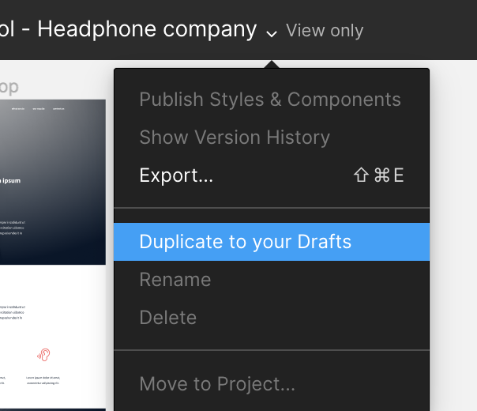

# Project 2063: CSS, advanced
----

*For this project, we expect you to look at these concepts:*

* [Some pointers about CSS](/concepts/840)
* [CSS fundamentals](/concepts/841)
* [CSS advanced](/concepts/847)

## Resources

**Read or watch**:

* [Learn to Code HTML & CSS](https://learn.shayhowe.com/html-css/)(*until “Creating Lists” included*)
* [Inline Styles in HTML](https://www.codecademy.com/article/html-inline-styles)
* [Specifics on CSS Specificity](https://specifishity.com/specifishity.pdf)
* [CSS SpeciFishity](https://specifishity.com/specifishity.pdf)
* [CSS](https://developer.mozilla.org/en-US/docs/Learn_web_development/Core/Styling_basics)
* [MDN](https://developer.mozilla.org/en-US/)
## Learning Objectives

At the end of this project, you are expected to be able to[explain to anyone](https://fs.blog/feynman-learning-technique/),**without the help of Google**:

### General

* What is CSS
* How to add style to an element
* What is a class
* What is a selector
* How to compute CSS Specificity Value
* What are Box properties in CSS
* How does the browser load a webpage
## Requirements

### General

* All your files should end with a new line
* A`README.md`file, at the root of the folder of the project is mandatory
* You are**not allowed**to install, import or use external libraries. This website must be build with only HTML/CSS/JavaScript. No NodeJS, React, VueJS, Bootstrap, etc.
* Your code should be W3C compliant and validate with[W3C-Validator](https://github.com/hs-hq/W3C-Validator)

----
## Tasks
---
### 0. README and objectives!

This project is following the <!--plain-NL-->`HTML, advanced`<!--inline-NL--> project - please make sure all tasks of this previous one are fully done.<!--plain-NL-->

For this project, you will focus on the CSS and the style of the page.<!--plain-NL-->

This designer file will be available on <!--plain-->[Figma](https://www.figma.com/) <!--link--> - feel free to create an account to access the final result here:<!--plain-->

- Page in Figma
- fig file

And “Duplicate to your Drafts” to have access to all design details. (if not already done)<!--plain-NL-->

Important notes with Figma:<!--plain-NL-->

- if your computer doesn’t have missing fonts, you can find them here: source-sans-pro and Spin-Cycle-OT
- some values are in float - feel free to round them

For this task, please write an amazing <!--plain-NL-->`README.md`<!--inline-NL--> and copy the <!--plain-NL-->`index.html`<!--inline-NL--> file from <!--plain-NL-->`0x02. HTML, advanced`<!--inline-NL-->

**Repo:**

- GitHub repository: `atlas-web-development`
- Directory: `css_advanced`
- File: `README.md, index.html`

---
### 1. Import the style

Before starting the implementation of the Style:<!--plain-NL-->

- Create the file `styles.css`
- Import `styles.css` in the `head` of your `index.html`

**Repo:**

- GitHub repository: `atlas-web-development`
- Directory: `css_advanced`
- File: `index.html, styles.css`

---
### 2. Header and Banner

Based on the <!--plain-->[Figma](https://www.figma.com/file/XrEAsu1vQj5fhVaNG38d2W/Homepage) <!--link--> file, add the correct styling to the <!--plain-->`header`<!--inline--> and first <!--plain-->`section`<!--inline--> in <!--plain-->`main`<!--inline-->

**Reminders:**<!--code-NL-->

- All colors values, width, height and images are part of the Figma
- Keep your CSS simple and clean - use as simple as you can CSS selectors
- Be accurate - the final result should be the same as the page at the end!

**Repo:**

- GitHub repository: `atlas-web-development`
- Directory: `css_advanced`
- File: `styles.css`

---
### 3. Quotes

Based on the <!--plain-->[Figma](https://www.figma.com/file/XrEAsu1vQj5fhVaNG38d2W/Homepage) <!--link--> file, add the correct styling to the quote <!--plain-->`section`<!--inline-->

**Tips:**<!--code-NL-->

- You can start to see similar or common style, time to start to centralize your style and CSS selectors

**Repo:**

- GitHub repository: `atlas-web-development`
- Directory: `css_advanced`
- File: `styles.css`

---
### 4. Videos list

Based on the <!--plain-->[Figma](https://www.figma.com/file/XrEAsu1vQj5fhVaNG38d2W/Homepage) <!--link--> file, add the correct styling to the videos list <!--plain-->`section`<!--inline-->

**Repo:**

- GitHub repository: `atlas-web-development`
- Directory: `css_advanced`
- File: `styles.css`

---
### 5. Membership

Based on the <!--plain-->[Figma](https://www.figma.com/file/XrEAsu1vQj5fhVaNG38d2W/Homepage) <!--link--> file, add the correct styling to the membership <!--plain-->`section`<!--inline-->

**Repo:**

- GitHub repository: `atlas-web-development`
- Directory: `css_advanced`
- File: `styles.css`

---
### 6. FAQ

Based on the <!--plain-->[Figma](https://www.figma.com/file/XrEAsu1vQj5fhVaNG38d2W/Homepage) <!--link--> file, add the correct styling to the FAQ <!--plain-->`section`<!--inline-->

**Repo:**

- GitHub repository: `atlas-web-development`
- Directory: `css_advanced`
- File: `styles.css`

---
### 7. Footer

Based on the <!--plain-->[Figma](https://www.figma.com/file/XrEAsu1vQj5fhVaNG38d2W/Homepage) <!--link--> file, add the correct styling to the <!--plain-->`footer`<!--inline-->

**Repo:**

- GitHub repository: `atlas-web-development`
- Directory: `css_advanced`
- File: `styles.css`

---
### 8. Make it live!

Yes, you made it!<!--plain-NL-->

You just finish to implement your first web page from a designer file, Congrats!<!--plain-NL-->

It’s time to deploy it in Github, by using <!--plain-->[Github Pages](https://pages.github.com/) <!--link-->