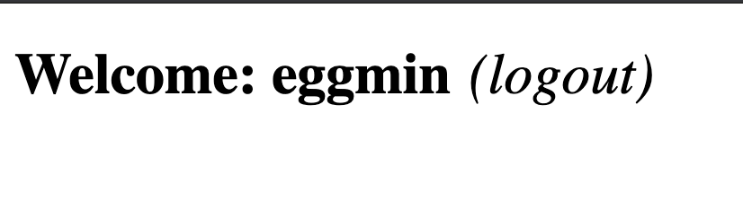

# Project 2381: Cookies & local storage
----

## Resources

**Read or watch:**

* [Cookies and Javascript](https://www.w3schools.com/js/js_cookies.asp)
* [HTTP Cookies](https://developer.mozilla.org/en-US/docs/Web/HTTP/Cookies)
* [js-cookie](https://github.com/js-cookie/js-cookie)
* [Web storage](https://www.w3schools.com/html/html5_webstorage.asp)
## Learning Objectives

* Understand how to create cookies using Javascript
* Learn how to set specific settings for the cookie
* Learn how to read cookies with Javascript
* How to use js-cookie for easy cookie manipulation
* How to use the browser web storage
* The differences between local storage and session storage
## Requirements

* Allowed editors:`vi`,`vim`,`emacs`,`Visual Studio Code`
* All your files should end with a new line
* A`README.md`file, at the root of the folder of the project, is mandatory
* Your code should use the`js`extension
* All of your code will be compiled/executed on Ubuntu 18.04 using Node 12.x and npm 6.x
* `src/index.js`should stay empty - all your Javascript must be in your HTML, inside`<script>`tag
**Great!**You've completed the quiz successfully! Keep going!#### Question #0

What are Web Cookies? (select all correct answers)

 * Web Cookies are data

 * Web Cookies is online biscuit

 * Web Cookies are small text stored in your browser

 * Web Cookies are an array of values

 * Web Cookies are a “key/value pair” storing system

#### Question #1

Are Local Storage data send to HTTP requests?

 * Yes

 * No

#### Question #2

Are Cookie send to HTTP requests?

 * Yes

 * No

----
## Tasks
---
### 0. Create basic cookie

**Install your development environment:**<!--code-NL-->

- Install`webpack-dev-server` by running `npm install webpack-dev-server --save-dev` (if you have some errors of missing dependencies, install these packages: `npm i -D webpack` and `npm i -D webpack-cli`)
- Create an empty file `src/index.js`
- Run your server with `node_modules/.bin/webpack-dev-server`

**In a file 0-index.html, create a basic html template:**<!--code-NL-->

- Add two text inputs, with the id `firstname` and `email`
- Add one button with the text “Log me in” that will call the function `setCookies`
- Add one button with the text “Show the cookies” that will call the function `showCookies`
- Create a function `setCookies`:

It should set the cookie `firstname` with the value in the `firstname` input
It should set the cookie `email` with the value in the `email` input
- It should set the cookie `firstname` with the value in the `firstname` input
- It should set the cookie `email` with the value in the `email` input
- Create a function `showCookies`:

It should create a DOM element `p`
It should set the inner html with `Cookies:` and the value of the cookie
It should append the paragraph at the bottom of the page
- It should create a DOM element `p`
- It should set the inner html with `Cookies:` and the value of the cookie
- It should append the paragraph at the bottom of the page

Create a function <!--plain-NL-->`setCookies`<!--inline-NL-->:<!--plain-NL-->

- It should set the cookie `firstname` with the value in the `firstname` input
- It should set the cookie `email` with the value in the `email` input

Create a function <!--plain-NL-->`showCookies`<!--inline-NL-->:<!--plain-NL-->

- It should create a DOM element `p`
- It should set the inner html with `Cookies:` and the value of the cookie
- It should append the paragraph at the bottom of the page

**Requirements:**<!--code-NL-->

- Try to make your page to look as close to the image below as possible

- Access your code with `http://localhost:8080/0-index.html`
- Use vanilla javascript to complete the task

**Tips:**<!--code-NL-->

- If you are using VSCode, you can use the plugin live server
- Make sure you have created and configured `webpack.config.js`

**Repo:**

- GitHub repository: `atlas-web_front_end`
- Directory: `Cookies_local_storage`
- File: `package.json, src/index.js, 0-index.html`

---
### 1. Create cookie with expiration date and specific path

**In a file 1-index.html:**<!--code-NL-->

- Reuse the code of the previous task
- Modify the way you are setting cookies to expire in 10 days

**Requirements:**<!--code-NL-->

- Access your code with `http://localhost:8080/1-index.html`
- Use vanilla javascript to complete the task

**Repo:**

- GitHub repository: `atlas-web_front_end`
- Directory: `Cookies_local_storage`
- File: `1-index.html`

---
### 2. Read cookie

**In a file 2-index.html:**<!--code-NL-->

- Reuse the code of the previous task
- Create a function `getCookie`:

It accepts `name` as argument
It should return the value of the cookie with the `name` passed in argument
If the cookie does not exist, it should return an empty string
- It accepts `name` as argument
- It should return the value of the cookie with the `name` passed in argument
- If the cookie does not exist, it should return an empty string
- Modify the function `showCookies`:

It should display the paragraph `Email: EMAIL - Firstname: FIRSTNAME`
- It should display the paragraph `Email: EMAIL - Firstname: FIRSTNAME`

Reuse the code of the previous task<!--plain-NL-->

Create a function <!--plain-NL-->`getCookie`<!--inline-NL-->:<!--plain-NL-->

- It accepts `name` as argument
- It should return the value of the cookie with the `name` passed in argument
- If the cookie does not exist, it should return an empty string

Modify the function <!--plain-NL-->`showCookies`<!--inline-NL-->:<!--plain-NL-->

- It should display the paragraph `Email: EMAIL - Firstname: FIRSTNAME`

**Requirements:**<!--code-NL-->

- Access your code with `http://localhost:8080/2-index.html`
- Use vanilla javascript to complete the task

**Repo:**

- GitHub repository: `atlas-web_front_end`
- Directory: `Cookies_local_storage`
- File: `2-index.html`

---
### 3. Delete cookie and mini application

**in a file 3-index.html, reuse your code from the previous task**<!--code-NL-->

- add a `div` in html that will contain the login form:

You can reuse the one you previously wrote
It has one `h2`
It has two text inputs
It has one button
- You can reuse the one you previously wrote
- It has one `h2`
- It has two text inputs
- It has one button
- Write a function named `showForm`:

It should remove the Welcome message if it exists
It should show the form
- It should remove the Welcome message if it exists
- It should show the form
- Write a function named `hideForm`:

It should hide the form
- It should hide the form
- Write a function named `deleteCookiesAndShowForm`:

It should remove the two cookies
it should show the form by calling the `showForm` function
- It should remove the two cookies
- it should show the form by calling the `showForm` function
- Write a function named `showWelcomeMessageOrForm`:

if user is not logged in, the function `showForm` is called
If the user is logged in, replace the body of the page with a `h1`

It should display `Welcome FIRSTNAME (logout)`
`(logout)` should be a link

The link font should be display in normal weight, italic, and 10px to the right of the message
On click, call the function `deleteCookiesAndShowForm`, hide the welcome message, and show the form
- if user is not logged in, the function `showForm` is called
- If the user is logged in, replace the body of the page with a `h1`

It should display `Welcome FIRSTNAME (logout)`
`(logout)` should be a link

The link font should be display in normal weight, italic, and 10px to the right of the message
On click, call the function `deleteCookiesAndShowForm`, hide the welcome message, and show the form
- It should display `Welcome FIRSTNAME (logout)`
- `(logout)` should be a link

The link font should be display in normal weight, italic, and 10px to the right of the message
On click, call the function `deleteCookiesAndShowForm`, hide the welcome message, and show the form
- The link font should be display in normal weight, italic, and 10px to the right of the message
- On click, call the function `deleteCookiesAndShowForm`, hide the welcome message, and show the form

add a <!--plain-NL-->`div`<!--inline-NL--> in html that will contain the login form:<!--plain-NL-->

- You can reuse the one you previously wrote
- It has one `h2`
- It has two text inputs
- It has one button

Write a function named <!--plain-NL-->`showForm`<!--inline-NL-->:<!--plain-NL-->

- It should remove the Welcome message if it exists
- It should show the form

Write a function named <!--plain-NL-->`hideForm`<!--inline-NL-->:<!--plain-NL-->

- It should hide the form

Write a function named <!--plain-NL-->`deleteCookiesAndShowForm`<!--inline-NL-->:<!--plain-NL-->

- It should remove the two cookies
- it should show the form by calling the `showForm` function

Write a function named <!--plain-NL-->`showWelcomeMessageOrForm`<!--inline-NL-->:<!--plain-NL-->

- if user is not logged in, the function `showForm` is called
- If the user is logged in, replace the body of the page with a `h1`

It should display `Welcome FIRSTNAME (logout)`
`(logout)` should be a link

The link font should be display in normal weight, italic, and 10px to the right of the message
On click, call the function `deleteCookiesAndShowForm`, hide the welcome message, and show the form
- It should display `Welcome FIRSTNAME (logout)`
- `(logout)` should be a link

The link font should be display in normal weight, italic, and 10px to the right of the message
On click, call the function `deleteCookiesAndShowForm`, hide the welcome message, and show the form
- The link font should be display in normal weight, italic, and 10px to the right of the message
- On click, call the function `deleteCookiesAndShowForm`, hide the welcome message, and show the form

- It should display `Welcome FIRSTNAME (logout)`
- `(logout)` should be a link

The link font should be display in normal weight, italic, and 10px to the right of the message
On click, call the function `deleteCookiesAndShowForm`, hide the welcome message, and show the form
- The link font should be display in normal weight, italic, and 10px to the right of the message
- On click, call the function `deleteCookiesAndShowForm`, hide the welcome message, and show the form

- The link font should be display in normal weight, italic, and 10px to the right of the message
- On click, call the function `deleteCookiesAndShowForm`, hide the welcome message, and show the form

**Requirements:**<!--code-NL-->

- Access your code with `http://localhost:8080/3-index.html`
- Use vanilla javascript to complete the task
- Build the Welcome message with Javascript without using HTML

**The login form should look like the image below**<!--code-NL-->

**When a user is logged in the page should look like the image below**<!--code-NL-->

**Repo:**

- GitHub repository: `atlas-web_front_end`
- Directory: `Cookies_local_storage`
- File: `3-index.html`

---
### 4. Use js-cookie

**Reusing the code from the previous task:**<!--code-NL-->

- Add `js-cookie` to your html page using the `jsdelivr` CDN
- Delete the `getCookie` function and use `js-cookie` get function instead
- Use `js-cookie` remove function within `deleteCookiesAndShowForm` function
- Use `js-cookie` set function within `setCookiesAndShowWelcomeMessage` function (new function that sets cookies and calls `showWelcomeMessageOrForm`)

**Requirements:**<!--code-NL-->

- Access your code with `http://localhost:8080/4-index.html`
- Build the Welcome message with Javascript without using HTML
- Use `js-cookie` for every cookie manipulation

**Repo:**

- GitHub repository: `atlas-web_front_end`
- Directory: `Cookies_local_storage`
- File: `4-index.html`

---
### 5. Local storage

**Let’s build a basic shopping cart in a new file. Setup your files with the following:**<!--code-NL-->

- Create an array `availableItems` that will contain all the available items. Add the strings `Shampoo`, `Soap`, `Sponge`, and `Water` in the array
- If Local storage is not enabled on your browser, display an alert that will contain the message `Sorry, your browser does not support Web storage. Try again with a better one`
- If local storage is available it should allow the user to see the application and call the function `createStore` and `displayCart`

**Create a function addItemToCart:**<!--code-NL-->

- It takes on argument `item` (string)
- It adds a key to the local storage of the name of the item, and set the value to `true`

**Create a function createStore:**<!--code-NL-->

- Create a `ul` and append it to the DOM
- Loop through the array of items, and create a list item to add to the `ul`
- The item should display the name of the available product
- On click the item should call the function `addItemToCart`

**Create a function displayCart:**<!--code-NL-->

- If the local storage does not contain any item, this function does not do anything
- If the local storage contains any item, it should display the message `You previously had X items in your cart` in a `p` element that you can append to the body

**Tips:**<!--code-NL-->

- At this time, you should be able to see the list of available items
- If you click on two of them and refresh the browser, you should see the message `You previously had 2 items in your cart`
- If you open a new tab, you should also see the message `You previously had 2 items in your cart`

**Requirements:**<!--code-NL-->

- Build the DOM using Javascript only
- You must use the local storage of your browser and not a cookie or session storage
- Access your code with `http://localhost:8080/5-index.html`
- Build every feature with vanilla Javascript only

**Repo:**

- GitHub repository: `atlas-web_front_end`
- Directory: `Cookies_local_storage`
- File: `5-index.html`

---
### 6. Session storage

Reusing the code from the previous task, replace the use of local storage by session storage<!--plain-NL-->

**Tips:**<!--code-NL-->

- At this time, you should be able to see the list of available items
- If you click on two of them and refresh the browser, you should see the message `You previously had 2 items in your cart`
- If you open a new tab, you should not see any message

**Requirements:**<!--code-NL-->

- Build the DOM using Javascript only
- You must use the session storage of your browser and not a cookie or local storage
- Access your code with `http://localhost:8080/6-index.html`
- Build every feature with vanilla Javascript only

**Repo:**

- GitHub repository: `atlas-web_front_end`
- Directory: `Cookies_local_storage`
- File: `6-index.html`

---
### 7. Advanced use of web storage

**In a new file, let’s build a more advanced cart system using Session Storage. Setup your files with the following:**<!--code-NL-->

- Create an array `availableItems` that will contain all the available items. Add the strings `Shampoo`, `Soap`, `Sponge`, and `Water` to the array
- If session storage is not enabled on your browser, display an alert that will contain the message `Sorry, your browser does not support Web storage. Try again with a better one`
- If session storage is available it should allow the user to see the application and call the function `createStore` and `displayCart`

**Create a function getCartFromStorage:**<!--code-NL-->

- It should parse a string into a JSON object, returning the content of the cart stored in Session storage
- If there is no cart, it should return an empty object

**Create a function addItemToCart:**<!--code-NL-->

- It accepts `item`(string) as argument
- It adds to the cart object the item
- If the same item is added multiple times, the cart store the quantity
- It stores the value of the cart object in a string for the key `cart` in the Session Storage
- It calls `displayCart`

**Create a function removeItemfromCart:**<!--code-NL-->

- It accepts `item`(string) as argument
- It remove the entire item from the cart
- Store the value of the cart object in a string for the key `cart` in the Session Storage
- It calls `displayCart`

**Create a function clearCart:**<!--code-NL-->

- It should clear the entire Session storage
- it calls `displayCart`

**Create a function createStore:**<!--code-NL-->

- It should add a `h2` tag with the text `Available products:`
- It should add a list with every item available for purchase
- When the user click on an item, it should add it to the cart

**Create a function displayCart:**<!--code-NL-->

- It should add inside a `h2` tag with the text `Your cart:`
- It should add an empty `div` tag
- If the `div` tag already exist, it should remove any list child
- It calls updateCart

**Create a function updateCart:**<!--code-NL-->

- It should add a list to the `div` tag created previously
- If the cart is empty, it should add an item `Your cart is empty`
- If the cart is not empty, it should add the list of items within the cart with the following format: `ITEM_NAME x QUANTITY (remove)`
- When the user clicks on remove, it should call the function `removeItemfromCart`
- At the top of the cart, add an item named `Clear my cart`. When the user clicks on it, it should call the function `clearCart`

**Tips:**<!--code-NL-->

- You can look at the GIF below to see how the interaction with the different elements works

**Requirements:**<!--code-NL-->

- Build the DOM using Javascript only
- You must use the session storage of your browser and not a cookie or local storage
- Access your code with `http://localhost:8080/7-index.html`
- Build every feature with vanilla Javascript only
- `src/index.js` should stay empty - all your Javascript must be in your HTML, inside `&lt;script&gt;` tag

**Repo:**

- GitHub repository: `atlas-web_front_end`
- Directory: `Cookies_local_storage`
- File: `7-index.html`