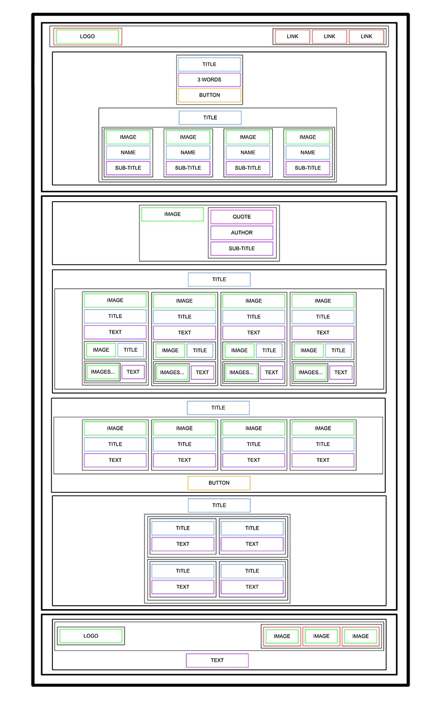
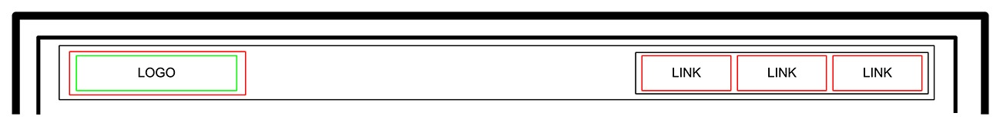
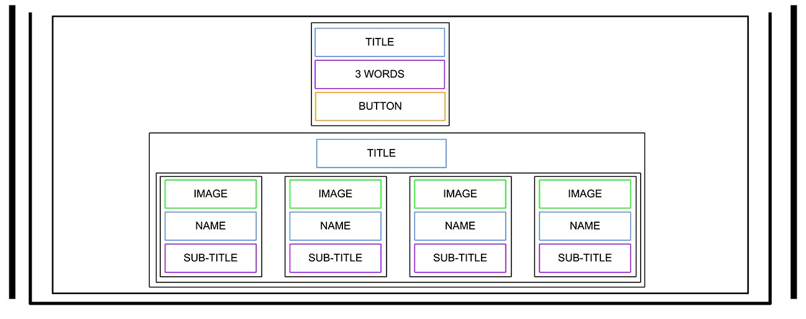
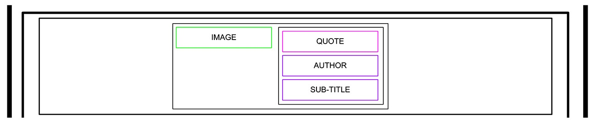
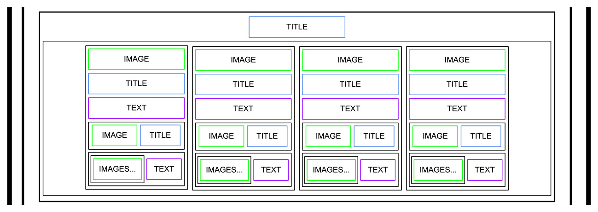
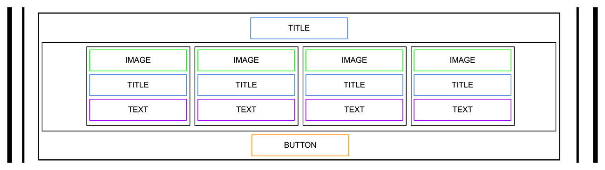
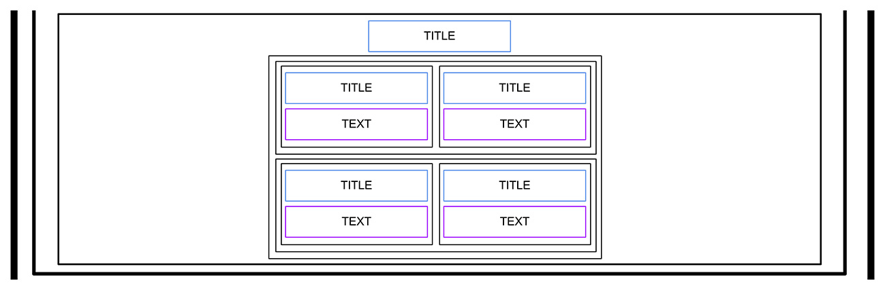
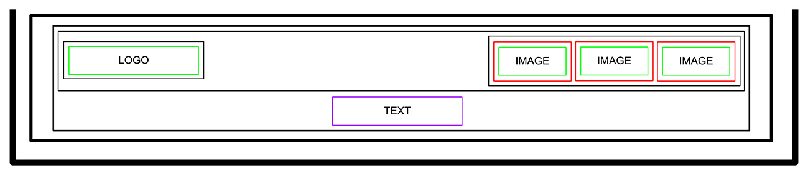

# Project 2062: HTML, advanced
----

*For this project, we expect you to look at these concepts:*

* [Some pointers about HTML](/concepts/834)
* [HTML - elements of a web page](/concepts/835)
* [HTML Foundations](/concepts/836)
* [HTML - Semantic sectioning elements](/concepts/837)
* [HTML Semantic Elements](/concepts/838)
* [HTML Validation](/concepts/839)

## Resources

**Read or watch**:

* [Learn to Code HTML & CSS](https://learn.shayhowe.com/html-css/)(*until “Creating Lists” included*)
* [Introduction to HTML](https://developer.mozilla.org/en-US/docs/Learn_web_development/Core/Structuring_content)
* [MDN](https://developer.mozilla.org/en-US/)
## Learning Objectives

At the end of this project, you are expected to be able to[explain to anyone](https://fs.blog/feynman-learning-technique/),**without the help of Google**:

### General

* What is HTML
* How to create an HTML page from a wireframe
* What is a markup language
* What is the DOM
* What is an element / tag
* What is an attribute
* What the purpose of each HTML tag
## Requirements

### General

* All your files should end with a new line
* A`README.md`file, at the root of the folder of the project is mandatory
* You are**not allowed**to install, import or use external libraries. This website must be build with only HTML/CSS/JavaScript. No NodeJS, React, VueJS, Bootstrap, etc.
* Your code should be W3C compliant and validate with[W3C-Validator](https://github.com/hs-hq/W3C-Validator)

----
## Tasks
---
### 0. README and objectives!

In this and coming projects, you will implement from scratch a webpage from a designer file.<!--plain-NL-->

For this first project, you will focus on the HTML structure only - <!--plain-NL-->**no CSS, no style - just pure HTML semantic.**<!--code-NL-->

This designer file will be available on <!--plain-->[Figma](https://www.figma.com/) <!--link--> - feel free to create an account to access the final result here:<!--plain-->

- Page in Figma
- fig file

And “Duplicate to your Drafts” to have access to all design details.<!--plain-NL-->

Important notes with Figma:<!--plain-NL-->

- if your computer doesn’t have missing fonts, you can find them here: source-sans-pro and Spin-Cycle-OT
- some values are in float - feel free to round them

For this task, please write an amazing <!--plain-NL-->`README.md`<!--inline-NL-->

**Repo:**

- GitHub repository: `atlas-web-development`
- Directory: `html_advanced`
- File: `README.md`

---
### 1. Header

Let’s start at the top: <!--plain-NL-->**the header**<!--code-NL-->

Here is the wireframe of it:<!--plain-NL-->

- Create the HTML skeleton (`html`, `head`, `body`, etc.)
- In the body, add a `header` tag
- Inside this `header`:

Add a link element with an image inside
Add a block of 3 link elements
- Add a link element with an image inside
- Add a block of 3 link elements

- Add a link element with an image inside
- Add a block of 3 link elements

**Repo:**

- GitHub repository: `atlas-web-development`
- Directory: `html_advanced`
- File: `index.html`

---
### 2. Banner

Now, the banner inside the <!--plain-NL-->`main`<!--inline-NL-->:<!--plain-NL-->

Add a <!--plain-NL-->`main`<!--inline-NL--> tag that has a <!--plain-NL-->`section`<!--inline-NL--> element inside.<!--plain-NL-->

In this <!--plain-NL-->`section`<!--inline-NL--> element, add:<!--plain-NL-->

- A block containing:

A heading tag (level 1, don’t forget to use the correct heading value)
A text element
A button tag
- A heading tag (level 1, don’t forget to use the correct heading value)
- A text element
- A button tag
- Another block containing:

Another heading tag (level 2, be careful about which one you are using)
A block containing 4 blocks - each block containing:

An image
A heading tag (level 3)
A text
- Another heading tag (level 2, be careful about which one you are using)
- A block containing 4 blocks - each block containing:

An image
A heading tag (level 3)
A text
- An image
- A heading tag (level 3)
- A text

- A heading tag (level 1, don’t forget to use the correct heading value)
- A text element
- A button tag

- Another heading tag (level 2, be careful about which one you are using)
- A block containing 4 blocks - each block containing:

An image
A heading tag (level 3)
A text
- An image
- A heading tag (level 3)
- A text

- An image
- A heading tag (level 3)
- A text

**Repo:**

- GitHub repository: `atlas-web-development`
- Directory: `html_advanced`
- File: `index.html`

---
### 3. Quote

Under the banner, we will add the quote block:<!--plain-NL-->

The quote section is inside the <!--plain-NL-->`main`<!--inline-NL-->:<!--plain-NL-->

- Create a new `section` for the quote
- Inside, add a block containing:

An image
Another block with inside:

A blockquote tag
A text tag for the quote author
Another text
- An image
- Another block with inside:

A blockquote tag
A text tag for the quote author
Another text
- A blockquote tag
- A text tag for the quote author
- Another text

- An image
- Another block with inside:

A blockquote tag
A text tag for the quote author
Another text
- A blockquote tag
- A text tag for the quote author
- Another text

- A blockquote tag
- A text tag for the quote author
- Another text

**Repo:**

- GitHub repository: `atlas-web-development`
- Directory: `html_advanced`
- File: `index.html`

---
### 4. Videos

Let’s now add the videos list:<!--plain-NL-->

New <!--plain-NL-->`section`<!--inline-NL--> containing:<!--plain-NL-->

- A heading tag (level 1)
- A block containing the 4 video blocks - each of them are composed with:

An image
A heading (level 2)
A text
Add a block for the author information:

An image
A heading (level 3)

A block for the rating:

A block of images (one star = one image)
A text
- An image
- A heading (level 2)
- A text
- Add a block for the author information:

An image
A heading (level 3)
- An image
- A heading (level 3)
- A block for the rating:

A block of images (one star = one image)
A text
- A block of images (one star = one image)
- A text

- An image
- A heading (level 2)
- A text
- Add a block for the author information:

An image
A heading (level 3)
- An image
- A heading (level 3)
- A block for the rating:

A block of images (one star = one image)
A text
- A block of images (one star = one image)
- A text

- An image
- A heading (level 3)

- A block of images (one star = one image)
- A text

**Repo:**

- GitHub repository: `atlas-web-development`
- Directory: `html_advanced`
- File: `index.html`

---
### 5. Membership

The Membership section is similar to the videos list:<!--plain-NL-->

After the videos list section, add a new <!--plain-NL-->`section`<!--inline-NL--> containing:<!--plain-NL-->

- A heading (level 1)
- A block containing 4 block items - each block containing:

An image
A heading (level 2)
A text
- An image
- A heading (level 2)
- A text
- A button

- An image
- A heading (level 2)
- A text

**Repo:**

- GitHub repository: `atlas-web-development`
- Directory: `html_advanced`
- File: `index.html`

---
### 6. FAQ

The FAQ section is ending the page before the footer:<!--plain-NL-->

Add a <!--plain-NL-->`section`<!--inline-NL--> for the FAQ containing:<!--plain-NL-->

- A heading (level 1)
- A block that contains 2 “row blocks”
- Each “row block” contains 2 “item blocks”
- Each “item block” is composed of:

A heading (level 2)
A text
- A heading (level 2)
- A text

- A heading (level 2)
- A text

Hint: There is no “row block” tag, “row” is referring to the styling that will be applied in a future project. It just means two “rows” containing two “items” each, also containing their own elements.<!--plain-NL-->

**Repo:**

- GitHub repository: `atlas-web-development`
- Directory: `html_advanced`
- File: `index.html`

---
### 7. Footer

And… the footer!<!--plain-NL-->

After the last <!--plain-NL-->`section`<!--inline-NL-->, outside of the <!--plain-NL-->`main`<!--inline-NL-->, add a <!--plain-NL-->`footer`<!--inline-NL-->:<!--plain-NL-->

- A block (used later for centering the footer content), inside this block:

Another block with:

An image
Another block containing:

3 Images with link

A text
- Another block with:

An image
Another block containing:

3 Images with link
- An image
- Another block containing:

3 Images with link
- 3 Images with link
- A text

- Another block with:

An image
Another block containing:

3 Images with link
- An image
- Another block containing:

3 Images with link
- 3 Images with link
- A text

- An image
- Another block containing:

3 Images with link
- 3 Images with link

- 3 Images with link

And… that’s it for the moment - the result should not be shiny, don’t worry, CSS is coming…<!--plain-NL-->

**Repo:**

- GitHub repository: `atlas-web-development`
- Directory: `html_advanced`
- File: `index.html`