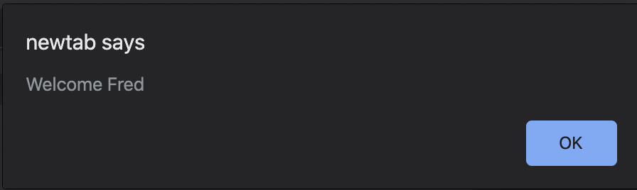
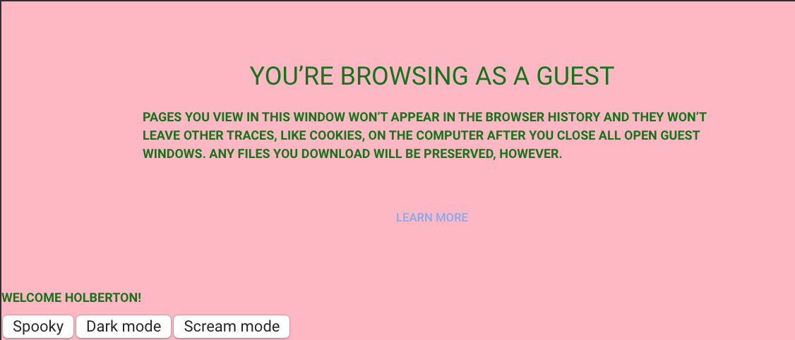
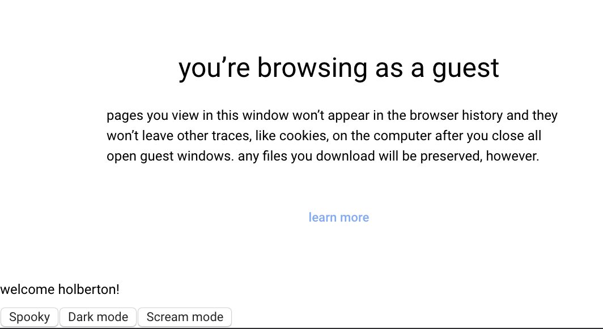

# Project 2142: JavaScript advanced
----


## Resources

**Read or watch:**

* [Lexical scoping](https://javascript.info/closure)
* [Closure](https://www.w3schools.com/js/js_function_closures.asp)
* [Call stack](https://developer.mozilla.org/en-US/docs/Glossary/Call_stack)
* [Binding](https://javascript.info/bind)
* [Callbacks](https://javascript.info/callbacks)
## Learning Objectives

* What is lexical scoping in JavaScript
* What is closure in JavaScript
* How to use closure
* How to chain different closures
* How to simulate private methods with Closure
* The execution stack order with JavaScript
* How to use binding
* How to use callbacks
## Requirements

* Allowed editors:`vi`,`vim`,`emacs`,`Visual Studio Code`
* All your files should end with a new line
* A`README.md`file, at the root of the folder of the project, is mandatory
* Your code should use the`js`extension
**Great!**You've completed the quiz successfully! Keep going!#### Question #0

What’s the result of this block of code?

``
```
let i = 12;
console.log(i);
```

 * 10

 * 12

 * 14

 * undefined

#### Question #1

What’s the result of this block of code?

``
```
let i = 12;
{
  i = 15;
}
console.log(i);
```

 * 10

 * 12

 * 15

 * undefined

#### Question #2

What’s the result of this block of code?

``
```
{
  let i = 12;
}
console.log(i);
```

 * 10

 * 12

 * 14

 * undefined

#### Question #3

What’s the result of this block of code?

``
```
let i = 12;
function increase() {
  i += 1;
}
console.log(i);
```

 * 10

 * 12

 * 13

 * 14

 * undefined

#### Question #4

What’s the result of this block of code?

``
```
let i = 12;
function increase() {
  i += 1;
}
increase();
console.log(i);
```

 * 10

 * 12

 * 13

 * 14

 * undefined

#### Question #5

What’s the result of this block of code?

``
```
let i = 12;
function increase() {
  let i = 14;
}
increase();
console.log(i);
```

 * 10

 * 12

 * 13

 * 14

 * undefined


----
## Tasks
---
### 0. Lexical scoping and welcome message

Create a function named <!--plain-NL-->`welcome`<!--inline-NL-->:<!--plain-NL-->

- It takes two arguments: `firstName` (string) and `lastName` (string)
- It contains a variable named `fullName`, that will contains the `firstName` followed by a space and then the `lastName`
- Within the `welcome` function, write a function named `displayFullName`:


It should display an alert with the message `Welcome` + the variable `fullName` + and exclamation mark.
- It should display an alert with the message `Welcome` + the variable `fullName` + and exclamation mark.
- Call the function `displayFullName` at the end of the function `welcome`

- It should display an alert with the message `Welcome` + the variable `fullName` + and exclamation mark.

**How to test**<!--code-NL-->

- Open your web inspector in the tab “Console”
- Copy paste your code
- Run `welcome('Holberton', 'School');` should prompt an alert with this content: `Welcome Holberton School!`
- `alert(fullName)`, should return a reference error `fullName is not defined`

**Repo:**

- GitHub repository: `atlas-web_front_end`
- Directory: `Javascript_advanced`
- File: `0-welcome.js`


---
### 1. Closure Scope Chain

- Create a variable named `globalVariable` with value `Welcome`
- Create a function `outer` that:


alerts the content of the variable `globalVariable`
creates a variable named `course` with value `Holberton`
creates a function `inner` that:


alerts the content of the variable `globalVariable` and `course` (concatenated)
creates a variable named `exclamation` with value `!`
creates a function `inception` that alerts the content of the variable `globalVariable`, `course`, and `exclamation` (concatenated)
calls the function `inception`

calls the function `inner`
- alerts the content of the variable `globalVariable`
- creates a variable named `course` with value `Holberton`
- creates a function `inner` that:


alerts the content of the variable `globalVariable` and `course` (concatenated)
creates a variable named `exclamation` with value `!`
creates a function `inception` that alerts the content of the variable `globalVariable`, `course`, and `exclamation` (concatenated)
calls the function `inception`
- alerts the content of the variable `globalVariable` and `course` (concatenated)
- creates a variable named `exclamation` with value `!`
- creates a function `inception` that alerts the content of the variable `globalVariable`, `course`, and `exclamation` (concatenated)
- calls the function `inception`
- calls the function `inner`
- Call the function `outer`

- alerts the content of the variable `globalVariable`
- creates a variable named `course` with value `Holberton`
- creates a function `inner` that:


alerts the content of the variable `globalVariable` and `course` (concatenated)
creates a variable named `exclamation` with value `!`
creates a function `inception` that alerts the content of the variable `globalVariable`, `course`, and `exclamation` (concatenated)
calls the function `inception`
- alerts the content of the variable `globalVariable` and `course` (concatenated)
- creates a variable named `exclamation` with value `!`
- creates a function `inception` that alerts the content of the variable `globalVariable`, `course`, and `exclamation` (concatenated)
- calls the function `inception`
- calls the function `inner`

- alerts the content of the variable `globalVariable` and `course` (concatenated)
- creates a variable named `exclamation` with value `!`
- creates a function `inception` that alerts the content of the variable `globalVariable`, `course`, and `exclamation` (concatenated)
- calls the function `inception`

**Compose the code:**<!--code-NL-->

- Write the function `inception` within `inner`
- Write the function `inner` within `outer`
- Call the function `outer` in the main code (outside any function)
- Call the function `inner` within `outer`
- Call the function `inception` within `inner`

**Requirements:**<!--code-NL-->

- Running the script should display three popups one by one with the text `Welcome`, `Welcome Holberton`, and `Welcome Holberton!`

**Repo:**

- GitHub repository: `atlas-web_front_end`
- Directory: `Javascript_advanced`
- File: `1-nested_functions.js`


---
### 2. Closure

Write a  function named <!--plain-NL-->`welcomeMessage`<!--inline-NL-->:<!--plain-NL-->

- It accepts one argument `fullName` (string)
- It should be a closure for an alert displaying `Welcome &lt;fullName&gt;`

After this function definition, create three variables:<!--plain-NL-->

- `guillaume` contains a call `welcomeMessage` with `Guillaume` as argument
- `alex` contains a call `welcomeMessage` with `Alex` as argument
- `fred` contains a call `welcomeMessage` with `Fred` as argument

**How to test:**<!--code-NL-->

- In your web console, cop/paste your file
- Executing the following in the console:

```
guillaume();
alex();
fred();

```

Should display three alerts like below:<!--plain-NL-->




**Repo:**

- GitHub repository: `atlas-web_front_end`
- Directory: `Javascript_advanced`
- File: `2-function_me.js`


---
### 3. Closure and loops

Write a function named <!--plain-NL-->`createClassRoom`<!--inline-NL-->:<!--plain-NL-->

- It takes into argument `numbersOfStudents` (number)
- Inside, it contains a function `studentSeat`, that takes into argument `seat` (number) and returns a function that returns the `seat` number
- After the definition of `studentSeat`, create and populate a variable `students` (array)


Using a loop from 0 to `numbersOfStudents`, pass the number of iteration + 1 to `studentSeat` and add its return value to the `students` array
- Using a loop from 0 to `numbersOfStudents`, pass the number of iteration + 1 to `studentSeat` and add its return value to the `students` array
- Returns the `students` array

- Using a loop from 0 to `numbersOfStudents`, pass the number of iteration + 1 to `studentSeat` and add its return value to the `students` array

Create a closure <!--plain-NL-->`classRoom`<!--inline-NL-->, calling <!--plain-NL-->`createClassRoom`<!--inline-NL--> with 10 students<!--plain-NL-->

**Requirements:**<!--code-NL-->

Executing the following code:<!--plain-NL-->

```
console.log(classRoom[0]());
console.log(classRoom[3]());
console.log(classRoom[9]());

```

Should return<!--plain-NL-->

```
1
4
10

```

**Repo:**

- GitHub repository: `atlas-web_front_end`
- Directory: `Javascript_advanced`
- File: `3-classrooms.js`


---
### 4. Complex Closure

Create a function <!--plain-NL-->`divideBy`<!--inline-NL-->:<!--plain-NL-->

- It takes into argument `firstNumber` (number)
- It returns a function that takes into argument `secondNumber` (number)


It returns the second number divided by the first number
- It returns the second number divided by the first number

- It returns the second number divided by the first number

Create a function <!--plain-NL-->`addBy`<!--inline-NL-->:<!--plain-NL-->

- It takes into argument `firstNumber` (number)
- It returns a function that takes into argument `secondNumber` (number)


It returns the sum of the two numbers
- It returns the sum of the two numbers

- It returns the sum of the two numbers

Create four closures:<!--plain-NL-->

- `addBy100`, that uses the function `addBy` with the number 100
- `addBy1000`, that uses the function `addBy` with the number 1000
- `divideBy10`, that uses the function `divideBy` with the number 10
- `divideBy100`, that uses the function `divideBy` with the number 100

**Requirements:**<!--code-NL-->

Executing the following code:<!--plain-NL-->

```
console.log(addBy100(20));
console.log(divideBy10(20));
console.log(divideBy100(200));
console.log(addBy1000(20));

```

Should display in the console:<!--plain-NL-->

```
120
2
2
1020

```

**Repo:**

- GitHub repository: `atlas-web_front_end`
- Directory: `Javascript_advanced`
- File: `4-math.js`


---
### 5. Changing DOM with closure

Create a function named <!--plain-NL-->`changeMode`<!--inline-NL-->:<!--plain-NL-->

- It accepts 5 arguments `size` (number), `weight` (string), `transform` (string), `background` (string), `color` (string)
- Using closure, it changes the style of the entire page and set the `font-size`, `font-weight`, `text-transform`, `background-color`, and `color`

Write a function named <!--plain-NL-->`main`<!--inline-NL-->:<!--plain-NL-->

- Set a variable named `spooky` that passes the arguments `9`, `bold`, `uppercase`, `pink`, `green` to `changeMode`
- Set a variable named `darkMode` that passes the arguments `12`, `bold`, `capitalize`, `black`, `white` to `changeMode`
- Set a variable named `screamMode` that passes the arguments `12`, `normal`, `lowercase`, `white`, `black` to `changeMode`
- Add a paragraph to the body of the page with the text `Welcome Holberton!`
- Add a button to the body with the text `Spooky`
- Add a button to the body with the text `Dark mode`
- Add a button to the body with the text `Scream mode`
- When clicking on each button, the page CSS should change to the different themes you created previously

Call the <!--plain-NL-->`main`<!--inline-NL--> function<!--plain-NL-->

**Requirements:**<!--code-NL-->

- Use vanilla JavaScript to add the elements to the DOM and change the style of the page
- JQuery not allowed!

Clicking the <!--plain-NL-->`Spooky`<!--inline-NL--> button should change the web page to look something like this:<!--plain-NL-->




Clicking the <!--plain-NL-->`Dark mode`<!--inline-NL--> button should change the web page to look something like this:<!--plain-NL-->


Clicking the <!--plain-NL-->`Scream mode`<!--inline-NL--> button should change the web page to look something like this:<!--plain-NL-->




**Repo:**

- GitHub repository: `atlas-web_front_end`
- Directory: `Javascript_advanced`
- File: `5-mode.js`


---
### 6. Private methods with closure

Write a class named <!--plain-NL-->`studentHogwarts`<!--inline-NL-->:<!--plain-NL-->

- It contains two variables `privateScore` set to 0, and `name` set to `null`
- It contains one private method `changeScoreBy`, it takes `points` in argument and add it to `privateScore`
- The class gives access to four public methods (return an object):


`setName`, it takes into argument `newName`, and set the private variable `name`
`rewardStudent`, it calls the method `changeScoreBy` with 1
`penalizeStudent`, it calls the method `changeScoreBy` with -1
`getScore`, it returns `name: score` (ex: `Harry: 14`)
- `setName`, it takes into argument `newName`, and set the private variable `name`
- `rewardStudent`, it calls the method `changeScoreBy` with 1
- `penalizeStudent`, it calls the method `changeScoreBy` with -1
- `getScore`, it returns `name: score` (ex: `Harry: 14`)

- `setName`, it takes into argument `newName`, and set the private variable `name`
- `rewardStudent`, it calls the method `changeScoreBy` with 1
- `penalizeStudent`, it calls the method `changeScoreBy` with -1
- `getScore`, it returns `name: score` (ex: `Harry: 14`)

Create one variable named <!--plain-NL-->`harry`<!--inline-NL-->, that is an instance of <!--plain-NL-->`studentHogwarts`<!--inline-NL-->:<!--plain-NL-->

- Set the name of the object to `Harry`
- Reward the student four times
- Log to the console the name and score

Create one variable named <!--plain-NL-->`draco`<!--inline-NL-->, that is an instance of <!--plain-NL-->`studentHogwarts`<!--inline-NL-->:<!--plain-NL-->

- Sets the name of the object to `Draco`
- Reward the student one time
- Penalize the student three times
- Log to the console the name and score

**Requirements:**<!--code-NL-->

- Executing the code should display in the console

```
Harry: 4
Draco: -2

```

**Repo:**

- GitHub repository: `atlas-web_front_end`
- Directory: `Javascript_advanced`
- File: `6-hogwarts.js`


---
### 7. Stack order and setTimeout

**Write the following commands in the following order:**<!--code-NL-->

- Log to the console `Start of the execution queue`
- Log to the console `Final code block to be executed` using `setTimeout` (with delay of 0)
- Using a loop that iterates 100 times, each iteration logs to the console the iteration number
- Log to the console `End of the loop printing`

**Requirements:**<!--code-NL-->

- Your code should log to the console the following:

```
Start of the execution queue
1
2
...
100
End of the loop printing
Final code block to be executed

```

**Repo:**

- GitHub repository: `atlas-web_front_end`
- Directory: `Javascript_advanced`
- File: `7-timeout.js`


---
### 8. Stack order in functions

Write a function <!--plain-NL-->`processPayment`<!--inline-NL-->:<!--plain-NL-->

- It takes one argument `amount` (number)
- It logs to the console `Collecting payment of &lt;amount&gt;`

Write a function named <!--plain-NL-->`processOrder`<!--inline-NL-->:<!--plain-NL-->

- It takes two arguments `orderId` (number), and `amount` (number)
- It logs to the console `&lt;orderId&gt; is being processed`
- It calls the function `processPayment`
- It logs to the console `&lt;orderId&gt; has been fully processed`

In the main part of the code:<!--plain-NL-->

- Logs to the console `Processing orders`
- Call `processOrder` with `12321` and `10.99`
- Call `processOrder` with `12322` and `12.99`
- Call `processOrder` with `12323` and `15.0`
- Logs to the console `All the orders have been processed`

**Requirements:**<!--code-NL-->

- Your code should log the following to the console

```
Processing orders
12321 is being processed
Collecting payment of 10.99
12321 has been fully processed
12322 is being processed
Collecting payment of 12.99
12322 has been fully processed
12323 is being processed
Collecting payment of 15
12323 has been fully processed
All the orders have been processed

```

**Repo:**

- GitHub repository: `atlas-web_front_end`
- Directory: `Javascript_advanced`
- File: `8-payments.js`


---
### 9. Prime numbers & timing execution

Write a function named <!--plain-NL-->`countPrimeNumbers`<!--inline-NL-->:<!--plain-NL-->

- It will return the number of prime numbers from 2 to 100

Log to the console the time in milliseconds to execute the function in this format: <!--plain-NL-->`Execution time of printing countPrimeNumbers was <time used> milliseconds.`<!--inline-NL-->

**Requirements:**<!--code-NL-->

- You must use `performance` API to measure the time needed to execute the function (`performance.now()`)
- Your code should display something in the range of `Execution time of printing countPrimeNumbers was 0.2700000002514571 milliseconds.`

**Repo:**

- GitHub repository: `atlas-web_front_end`
- Directory: `Javascript_advanced`
- File: `9-prime.js`


---
### 10. Execution stack & timing execution

Reuse the function <!--plain-NL-->`countPrimeNumbers`<!--inline-NL--> from <!--plain-NL-->`9-prime.js`<!--inline-NL--> (copy/paste)<!--plain-NL-->

- Execute the function `countPrimeNumbers` 100 times
- Log to the console the time in milliseconds to execute the function 100 times

**Requirements:**<!--code-NL-->

- Your code should display something in the range of `Execution time of calculating prime numbers 100 times was 40.865000002551824 milliseconds.`

**Repo:**

- GitHub repository: `atlas-web_front_end`
- Directory: `Javascript_advanced`
- File: `10-prime.js`


---
### 11. Changing stack order using setTimeout

Reuse the function <!--plain-NL-->`countPrimeNumbers`<!--inline-NL--> from <!--plain-NL-->`10-prime.js`<!--inline-NL--> (copy/paste)<!--plain-NL-->

- Log to the console the time in milleseconds to execute the function 100 times
- Find a way to actually do most of the calculation at the end of the execution stack

**Requirements:**<!--code-NL-->

- Your code should display something in the range of `Execution time of calculating prime numbers 100 times was 0.03999999910593033 milliseconds.`
- Use `setTimeout` keyword to change the stack order

**Repo:**

- GitHub repository: `atlas-web_front_end`
- Directory: `Javascript_advanced`
- File: `11-prime.js`


---
### 12. Binding

Create an object named <!--plain-NL-->`roomDimensions`<!--inline-NL--> with the following three attributes:<!--plain-NL-->

- `width`: `50`
- `length`: `100`
- `getArea`: function that returns the surface area of a the object using the `width` and `length`

Create a variable named <!--plain-NL-->`boundGetArea`<!--inline-NL-->, that will bind the object <!--plain-NL-->`roomDimensions`<!--inline-NL--> to the <!--plain-NL-->`getArea`<!--inline-NL--> function<!--plain-NL-->

**Repo:**

- GitHub repository: `atlas-web_front_end`
- Directory: `Javascript_advanced`
- File: `12-room_area.js`


---
### 13. Binding + Closure

Write an object <!--plain-NL-->`user`<!--inline-NL--> with the attributes:<!--plain-NL-->

- `hobby`: `Calligraphy`
- `favoriteSport`: `Hockey`
- `astrologicalSign`: `Aries`
- `firstName`: `Guillaume`
- `lastName`: `Johns`
- `location`: `Netherlands`
- `occupation`: `Engineer`

Create a function named <!--plain-NL-->`logWelcomeUser`<!--inline-NL-->:<!--plain-NL-->

- It takes one argument `welcomeString` (String)
- It logs to the console `&lt;welcomeString&gt;, &lt;firstName&gt;. Your occupation is: &lt;occupation&gt;`

Create a variable named <!--plain-NL-->`bindLogWelcomeUser`<!--inline-NL-->. It binds the <!--plain-NL-->`logWelcomeUser`<!--inline-NL--> function to the <!--plain-NL-->`user`<!--inline-NL--> object.<!--plain-NL-->

Call the function with the string <!--plain-NL-->`Welcome`<!--inline-NL-->

**Requirements:**<!--code-NL-->

- Calling `bindLogWelcomeUser('Hello');` should return `Hello, Buillaume. Your occupation is: Engineer`

**Repo:**

- GitHub repository: `atlas-web_front_end`
- Directory: `Javascript_advanced`
- File: `13-bind_user.js`


---
### 14. Simple callback

Write a new function named <!--plain-NL-->`createElement`<!--inline-NL-->:<!--plain-NL-->

- It accepts one argument `data` (String)
- It creates a paragraph element
- The content of the paragraph is set to `data`
- It appends to the document `body` the paragraph

Create a new function named <!--plain-NL-->`queryWikipedia`<!--inline-NL-->:<!--plain-NL-->

- It accepts one argument `callback` (function)
- Using `XMLHttpRequest`, it get the article of Stack Overflow with the URL `https://en.wikipedia.org/w/api.php?format=json&amp;action=query&amp;prop=extracts&amp;exintro&amp;explaintext&amp;redirects=1&amp;titles=Stack%20Overflow&amp;origin=*`
- Once the fetch is correctly executed, it calls the `callback` function with the `extract` of the API response

Call <!--plain-NL-->`queryWikipedia`<!--inline-NL--> with <!--plain-NL-->`createElement`<!--inline-NL--> as callback<!--plain-NL-->

**Requirements:**<!--code-NL-->

- Use vanilla javascript to run the Ajax query (no jQuery or other framework)
- You must not call `createElement` within `queryWikipedia` directly

**Repo:**

- GitHub repository: `atlas-web_front_end`
- Directory: `Javascript_advanced`
- File: `14-wikipedia.js`