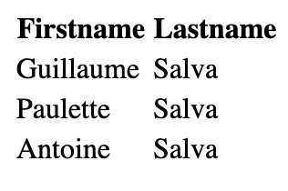
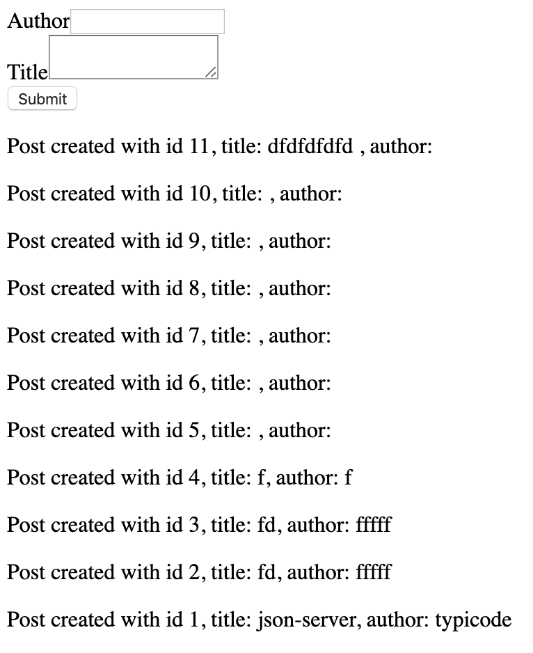

# Project 2380: jQuery advanced
----


## Resources

**Read or watch:**

* [jQuery CDN](https://releases.jquery.com/)
* [jQuery API Documentation](https://api.jquery.com/)
* [Json server](https://github.com/typicode/json-server/tree/v0)
## Learning Objectives

* Learn how to load jQuery from a CDN in a page
* Learn the different ways to create DOM elements with jQuery
* Learn how to modify elements
* Learn how to add new elements to a page with different positions
* Learn how to add a click handler on an element
* Learn how to send GET, POST, DELETE or any type of AJAX query with jQuery
* Learn how to create a pagination
## Requirements

* Allowed editors:`vi`,`vim`,`emacs`,`Visual Studio Code`
* All your files should end with a new line
* A`README.md`file, at the root of the folder of the project, is mandatory

----
## Tasks
---
### 0. Setup your dev environment

You are given this starter HTML for this task:<!--plain-NL-->

```
<!DOCTYPE html>
<html lang="en" dir="ltr">

    <head>

        <meta charset="utf-8" />
        <title>Task 0</title>

    </head>

    <body>

    </body>

</html>

```

**In a file 0-index.html:**<!--code-NL-->

- Load the latest version of jQuery using their `code.jquery.com` CDN
- Use the Slim &amp; minified version of jQuery
- When the page is being loaded, verify that jQuery is loaded correctly
- If jQuery is ready to be used, log to the console `jQuery has been loaded correctly`
- If jQuery has not been loaded properly, log to the console `jQuery has not been loaded correctly`

**Requirements**<!--code-NL-->

- Make sure your code is in a `script` of type `application/javascript`

**Repo:**

- GitHub repository: `atlas-web_front_end`
- Directory: `JQuery_advanced`
- File: `0-index.html`


---
### 1. Creating a DOM element

**In a file 1-index.html, reuse the template you created previously.**<!--code-NL-->

- Remove the code that verifies jQuery loaded and logs messages to the console
- Create a function named `createTextElement`:


Within the function, create a `p` HTML element
The paragraph should display `Lorem ipsum dolor sit amet, consectetur adipiscing elit. Sed in diam risus. Nunc sit amet euismod ipsum. Aenean tempus ex sed est volutpat, sed sodales velit tempus. Class aptent taciti sociosqu ad litora torquent per conubia nostra, per inceptos himenaeos. Proin auctor sollicitudin eleifend. Vivamus porta enim vitae mauris commodo, vitae tempor tellus elementum. Quisque sed pellentesque nulla, at eleifend nisi. Phasellus eget tincidunt ex. Lorem ipsum dolor sit amet, consectetur adipiscing elit.`
Add the paragraph to the `body` of the page
- Within the function, create a `p` HTML element
- The paragraph should display `Lorem ipsum dolor sit amet, consectetur adipiscing elit. Sed in diam risus. Nunc sit amet euismod ipsum. Aenean tempus ex sed est volutpat, sed sodales velit tempus. Class aptent taciti sociosqu ad litora torquent per conubia nostra, per inceptos himenaeos. Proin auctor sollicitudin eleifend. Vivamus porta enim vitae mauris commodo, vitae tempor tellus elementum. Quisque sed pellentesque nulla, at eleifend nisi. Phasellus eget tincidunt ex. Lorem ipsum dolor sit amet, consectetur adipiscing elit.`
- Add the paragraph to the `body` of the page
- Call the `createTextElement` function

- Within the function, create a `p` HTML element
- The paragraph should display `Lorem ipsum dolor sit amet, consectetur adipiscing elit. Sed in diam risus. Nunc sit amet euismod ipsum. Aenean tempus ex sed est volutpat, sed sodales velit tempus. Class aptent taciti sociosqu ad litora torquent per conubia nostra, per inceptos himenaeos. Proin auctor sollicitudin eleifend. Vivamus porta enim vitae mauris commodo, vitae tempor tellus elementum. Quisque sed pellentesque nulla, at eleifend nisi. Phasellus eget tincidunt ex. Lorem ipsum dolor sit amet, consectetur adipiscing elit.`
- Add the paragraph to the `body` of the page

**Requirements:**<!--code-NL-->

- You must use jQuery only to generate the HTML tag and attach it to the page
- Use the keyword `append` to attach the element to the page

**Repo:**

- GitHub repository: `atlas-web_front_end`
- Directory: `JQuery_advanced`
- File: `1-index.html`


---
### 2. Creating multiple DOM elements at once

**In a file 2-index.html, reuse the template you created previously.**<!--code-NL-->

- Remove the function `createTextElement`
- Create a function named `createFamilyTree`:


It should create a table element


The head of the table should display `Firstname` and `Lastname` in two cells
The body of the table should three rows
The first row should contain two cells with `Guillaume` and `Salva`
The second row should contain two cells with `Paulette` and `Salva`
The third row should contain two cells with `Antoine` and `Salva`

Use the keyword `append` only once to attach all the elements of the table to the page
- It should create a table element


The head of the table should display `Firstname` and `Lastname` in two cells
The body of the table should three rows
The first row should contain two cells with `Guillaume` and `Salva`
The second row should contain two cells with `Paulette` and `Salva`
The third row should contain two cells with `Antoine` and `Salva`
- The head of the table should display `Firstname` and `Lastname` in two cells
- The body of the table should three rows
- The first row should contain two cells with `Guillaume` and `Salva`
- The second row should contain two cells with `Paulette` and `Salva`
- The third row should contain two cells with `Antoine` and `Salva`
- Use the keyword `append` only once to attach all the elements of the table to the page
- Call the `createFamilyTree` function

- It should create a table element


The head of the table should display `Firstname` and `Lastname` in two cells
The body of the table should three rows
The first row should contain two cells with `Guillaume` and `Salva`
The second row should contain two cells with `Paulette` and `Salva`
The third row should contain two cells with `Antoine` and `Salva`
- The head of the table should display `Firstname` and `Lastname` in two cells
- The body of the table should three rows
- The first row should contain two cells with `Guillaume` and `Salva`
- The second row should contain two cells with `Paulette` and `Salva`
- The third row should contain two cells with `Antoine` and `Salva`
- Use the keyword `append` only once to attach all the elements of the table to the page

- The head of the table should display `Firstname` and `Lastname` in two cells
- The body of the table should three rows
- The first row should contain two cells with `Guillaume` and `Salva`
- The second row should contain two cells with `Paulette` and `Salva`
- The third row should contain two cells with `Antoine` and `Salva`

**Requirements:**<!--code-NL-->

- You must use jQuery only to generate the HTML tag and attach it to the page
- The entire table code should be contained in one string

**The table created by your script should look like this**<!--code-NL-->


**Repo:**

- GitHub repository: `atlas-web_front_end`
- Directory: `JQuery_advanced`
- File: `2-index.html`


---
### 3. Chain DOM elements

**In a file 3-index.html, reuse the template you created previously. Reuse also the function named createFamilyTree:**<!--code-NL-->

- The table is containing the exact same values as the previous task
- This time, create each element one by one
- Use the keywords `append` for each element and `text` for the cells
- Do not create any intermediate variable
- Call the `createFamilyTree` function

**Tips:**<!--code-NL-->

- You can append multiple elements at once, by separating the elements with a comma

**Requirements:**<!--code-NL-->

- You must use jQuery only to generate the HTML tag and attach it to the page

**The table created by your script should look like this**<!--code-NL-->




**Repo:**

- GitHub repository: `atlas-web_front_end`
- Directory: `JQuery_advanced`
- File: `3-index.html`


---
### 4. HTML function

**In a file 4-index.html, reuse the template you created in the previous task. Reuse also the function named createFamilyTree.**<!--code-NL-->

- Create a new function `replaceFamilyTree`:


It should replace the children of the `tbody` elements with a new `tr`
The `tr` element should contain two cells with `Gerard` and `Bonissa` in each
- It should replace the children of the `tbody` elements with a new `tr`
- The `tr` element should contain two cells with `Gerard` and `Bonissa` in each
- Make sure `createFamilyTree` and `replaceFamilyTree` are called

- It should replace the children of the `tbody` elements with a new `tr`
- The `tr` element should contain two cells with `Gerard` and `Bonissa` in each

**Requirements:**<!--code-NL-->

- You must use the keyword `html` to replace the content of the table

**The table created by your script should look like this**<!--code-NL-->


**Repo:**

- GitHub repository: `atlas-web_front_end`
- Directory: `JQuery_advanced`
- File: `4-index.html`


---
### 5. Click attribute and remove function

**In a file 5-index.html, reuse the template you created previously.**<!--code-NL-->

- Remove the `createFamilyTree` and `replaceFamilyTree` functions
- Create a function `createFamilyTree`:


It should append to the `body` an empty table, with `thead` and two cells with text `Firstname` and `Lastname`, respectively
It should append an empty `tbody` element to the `table` after the `thead`
- It should append to the `body` an empty table, with `thead` and two cells with text `Firstname` and `Lastname`, respectively
- It should append an empty `tbody` element to the `table` after the `thead`
- Create a function `addNewMember`:


It accepts two arguments `firstName`(string) and `lastName`(string)
It appends to the body of the `table` a new row with three cells
The first cell displays the `firstName`, the second cell displays the `lastName`
The third cell displays `(x)`
On click on the third cell, it should remove the row
Add CSS to the third cell to have an `orange` background
- It accepts two arguments `firstName`(string) and `lastName`(string)
- It appends to the body of the `table` a new row with three cells
- The first cell displays the `firstName`, the second cell displays the `lastName`
- The third cell displays `(x)`
- On click on the third cell, it should remove the row
- Add CSS to the third cell to have an `orange` background
- Calls the function `createFamilyTree`
- Using `addNewMember`, generate a fake table with:


the first row `Guillaume`, `Salva`
the second row `Arielle`, `Snizt`
the third row `Fanette`, `Snizt`
the fourth row `Gerard`, `Snizt`
the fifth row `Victor`, `Salva`
- the first row `Guillaume`, `Salva`
- the second row `Arielle`, `Snizt`
- the third row `Fanette`, `Snizt`
- the fourth row `Gerard`, `Snizt`
- the fifth row `Victor`, `Salva`

- It should append to the `body` an empty table, with `thead` and two cells with text `Firstname` and `Lastname`, respectively
- It should append an empty `tbody` element to the `table` after the `thead`

- It accepts two arguments `firstName`(string) and `lastName`(string)
- It appends to the body of the `table` a new row with three cells
- The first cell displays the `firstName`, the second cell displays the `lastName`
- The third cell displays `(x)`
- On click on the third cell, it should remove the row
- Add CSS to the third cell to have an `orange` background

- the first row `Guillaume`, `Salva`
- the second row `Arielle`, `Snizt`
- the third row `Fanette`, `Snizt`
- the fourth row `Gerard`, `Snizt`
- the fifth row `Victor`, `Salva`

**Requirements:**<!--code-NL-->

- You must use the keywords `click`, `css`, and `remove`

**The table created by your script should look like this:**<!--code-NL-->


**Repo:**

- GitHub repository: `atlas-web_front_end`
- Directory: `JQuery_advanced`
- File: `5-index.html`


---
### 6. Val, before, and prepend functions

**In a file 6-index.html, reuse the template you created previously.**<!--code-NL-->

- Reuse the function `createFamilyTree` you wrote in the previous task
- Reuse the function `addNewMember` you wrote in the previous task, and add the following modification:


The function should accept a new argument `position`(string)
When position is equal to `before`, it should add the row at the top of the table
Otherwise, it should add the row at the bottom of the table
- The function should accept a new argument `position`(string)
- When position is equal to `before`, it should add the row at the top of the table
- Otherwise, it should add the row at the bottom of the table
- Write a function `createForm`:


It should add before the table two `input` of type `text`
It should add a `select` with two options as well: `before` and `after` with corresponding `Before` and `After` text
It should add a `input` of type `submit` as well


When the user clicks on the submit, it should call the function `addNewMember` with the value of the two inputs and the value of the select element
- It should add before the table two `input` of type `text`
- It should add a `select` with two options as well: `before` and `after` with corresponding `Before` and `After` text
- It should add a `input` of type `submit` as well


When the user clicks on the submit, it should call the function `addNewMember` with the value of the two inputs and the value of the select element
- When the user clicks on the submit, it should call the function `addNewMember` with the value of the two inputs and the value of the select element
- Call the function `createFamilyTree`
- Call the function `createForm`

- The function should accept a new argument `position`(string)
- When position is equal to `before`, it should add the row at the top of the table
- Otherwise, it should add the row at the bottom of the table

- It should add before the table two `input` of type `text`
- It should add a `select` with two options as well: `before` and `after` with corresponding `Before` and `After` text
- It should add a `input` of type `submit` as well


When the user clicks on the submit, it should call the function `addNewMember` with the value of the two inputs and the value of the select element
- When the user clicks on the submit, it should call the function `addNewMember` with the value of the two inputs and the value of the select element

- When the user clicks on the submit, it should call the function `addNewMember` with the value of the two inputs and the value of the select element

**Requirements:**<!--code-NL-->

- You must use the keywords `first`, `before`, and `prepend`
- To select the second input, use the `nth-of-type` selector

**The form created by your script should look like this:**<!--code-NL-->


**Repo:**

- GitHub repository: `atlas-web_front_end`
- Directory: `JQuery_advanced`
- File: `6-index.html`


---
### 7. Query - Setup your dev environment

**In a file 7-index.html, reuse the template you created in the previous task**<!--code-NL-->

- Remove the functions from the `script`
- Import jQuery using the CDN and make sure you can access the ajax methods
- Create a form:

Create a function `createSearchForm`, it should append to the body:


An empty `input` of type `text` without ID, name, or class
An `input` of type `submit`

When the user clicks on the submit button, it should query the function `queryWikipedia` that you are going to create with the value of the text `input`

An empty `ul` element
- Create a function `createSearchForm`, it should append to the body:


An empty `input` of type `text` without ID, name, or class
An `input` of type `submit`

When the user clicks on the submit button, it should query the function `queryWikipedia` that you are going to create with the value of the text `input`

An empty `ul` element
- An empty `input` of type `text` without ID, name, or class
- An `input` of type `submit`

When the user clicks on the submit button, it should query the function `queryWikipedia` that you are going to create with the value of the text `input`
- When the user clicks on the submit button, it should query the function `queryWikipedia` that you are going to create with the value of the text `input`
- An empty `ul` element
- Create a function `addNewArticle` to add new items to a list

It accepts three arguments `id`(string), `title`(string), and `snippet`(string)
It create an element `li`

Within the `li`, add two `paragraph` elements


The first paragraph contains a `span` tag with the following text: `id -`, then a `b` element with the `title`
The second paragraph, should contain the `snippet`


Appends the `li` to the `ul` element (created by `createSearchForm`)
- It accepts three arguments `id`(string), `title`(string), and `snippet`(string)
- It create an element `li`

Within the `li`, add two `paragraph` elements


The first paragraph contains a `span` tag with the following text: `id -`, then a `b` element with the `title`
The second paragraph, should contain the `snippet`
- Within the `li`, add two `paragraph` elements


The first paragraph contains a `span` tag with the following text: `id -`, then a `b` element with the `title`
The second paragraph, should contain the `snippet`
- The first paragraph contains a `span` tag with the following text: `id -`, then a `b` element with the `title`
- The second paragraph, should contain the `snippet`
- Appends the `li` to the `ul` element (created by `createSearchForm`)
- Implement a get function: create a function `queryWikipedia`

It accepts one argument `search`(string)
Create a data object with attributes required to query a search using the string passed in the argument with Wikipedia
For each result returned by the API, call the function `addNewArticle` with the result’s `pageid`, `title`, and `snippet`
- It accepts one argument `search`(string)
- Create a data object with attributes required to query a search using the string passed in the argument with Wikipedia
- For each result returned by the API, call the function `addNewArticle` with the result’s `pageid`, `title`, and `snippet`
- Call the function `createSearchForm` when the page loads

Import jQuery using the CDN and make sure you can access the ajax methods<!--plain-NL-->

Create a form:<!--plain-NL-->

- Create a function `createSearchForm`, it should append to the body:


An empty `input` of type `text` without ID, name, or class
An `input` of type `submit`

When the user clicks on the submit button, it should query the function `queryWikipedia` that you are going to create with the value of the text `input`

An empty `ul` element
- An empty `input` of type `text` without ID, name, or class
- An `input` of type `submit`

When the user clicks on the submit button, it should query the function `queryWikipedia` that you are going to create with the value of the text `input`
- When the user clicks on the submit button, it should query the function `queryWikipedia` that you are going to create with the value of the text `input`
- An empty `ul` element

- An empty `input` of type `text` without ID, name, or class
- An `input` of type `submit`

When the user clicks on the submit button, it should query the function `queryWikipedia` that you are going to create with the value of the text `input`
- When the user clicks on the submit button, it should query the function `queryWikipedia` that you are going to create with the value of the text `input`
- An empty `ul` element

- When the user clicks on the submit button, it should query the function `queryWikipedia` that you are going to create with the value of the text `input`

Create a function <!--plain-NL-->`addNewArticle`<!--inline-NL--> to add new items to a list<!--plain-NL-->

- It accepts three arguments `id`(string), `title`(string), and `snippet`(string)
- It create an element `li`

Within the `li`, add two `paragraph` elements


The first paragraph contains a `span` tag with the following text: `id -`, then a `b` element with the `title`
The second paragraph, should contain the `snippet`
- Within the `li`, add two `paragraph` elements


The first paragraph contains a `span` tag with the following text: `id -`, then a `b` element with the `title`
The second paragraph, should contain the `snippet`
- The first paragraph contains a `span` tag with the following text: `id -`, then a `b` element with the `title`
- The second paragraph, should contain the `snippet`
- Appends the `li` to the `ul` element (created by `createSearchForm`)

- Within the `li`, add two `paragraph` elements


The first paragraph contains a `span` tag with the following text: `id -`, then a `b` element with the `title`
The second paragraph, should contain the `snippet`
- The first paragraph contains a `span` tag with the following text: `id -`, then a `b` element with the `title`
- The second paragraph, should contain the `snippet`

- The first paragraph contains a `span` tag with the following text: `id -`, then a `b` element with the `title`
- The second paragraph, should contain the `snippet`

Implement a get function: create a function <!--plain-NL-->`queryWikipedia`<!--inline-NL-->

- It accepts one argument `search`(string)
- Create a data object with attributes required to query a search using the string passed in the argument with Wikipedia
- For each result returned by the API, call the function `addNewArticle` with the result’s `pageid`, `title`, and `snippet`

Call the function <!--plain-NL-->`createSearchForm`<!--inline-NL--> when the page loads<!--plain-NL-->

**Requirements:**<!--code-NL-->

- Look at the documentation from Wikipedia to query the API `https://www.mediawiki.org/wiki/API:Search`
- Use the minified only version of jQuery, so you can access the ajax methods
- When adding the `snippet`, make sure that the HTML coming from Wikipedia is correctly displayed

**The form created by your script should look like this:**<!--code-NL-->


**Query results should display like this:**<!--code-NL-->


**Repo:**

- GitHub repository: `atlas-web_front_end`
- Directory: `JQuery_advanced`
- File: `7-index.html`


---
### 8. Pagination

**In a file 8-index.html, reuse the code from the previous task**<!--code-NL-->

- Modify the function `createSearchForm`:

It should append to the body another list, with the id `pagination`
- It should append to the body another list, with the id `pagination`
- Modify the function `queryWikipedia`:

Add a new parameter named `offset`(number)
By default, the offset should be set to `0`
Modify the data object to add the `offset`
When you receive the response from the API, call the function `buildPagination` that you are going to create below
- Add a new parameter named `offset`(number)
- By default, the offset should be set to `0`
- Modify the data object to add the `offset`
- When you receive the response from the API, call the function `buildPagination` that you are going to create below
- Create a new function named `buildPagination`:

It accepts three arguments `numberOfItems`(number), `itemsPerPage`(number), and `currentOffset`(number)
When the function is called, reset the pagination list to an empty tag
Write a loop that will display the pagination (using the total number of items divided by the number of items per page)
For each page, create a list item


Add some CSS for each item (`cursor: 'pointer'`, `10px` margin left, and bold when this is the current page)
The text of the item should be the page number
When clicking on a page number, it should call the function `queryWikipedia` with the right offset
- It accepts three arguments `numberOfItems`(number), `itemsPerPage`(number), and `currentOffset`(number)
- When the function is called, reset the pagination list to an empty tag
- Write a loop that will display the pagination (using the total number of items divided by the number of items per page)
- For each page, create a list item


Add some CSS for each item (`cursor: 'pointer'`, `10px` margin left, and bold when this is the current page)
The text of the item should be the page number
When clicking on a page number, it should call the function `queryWikipedia` with the right offset
- Add some CSS for each item (`cursor: 'pointer'`, `10px` margin left, and bold when this is the current page)
- The text of the item should be the page number
- When clicking on a page number, it should call the function `queryWikipedia` with the right offset

Modify the function <!--plain-NL-->`createSearchForm`<!--inline-NL-->:<!--plain-NL-->

- It should append to the body another list, with the id `pagination`

Modify the function <!--plain-NL-->`queryWikipedia`<!--inline-NL-->:<!--plain-NL-->

- Add a new parameter named `offset`(number)
- By default, the offset should be set to `0`
- Modify the data object to add the `offset`
- When you receive the response from the API, call the function `buildPagination` that you are going to create below

Create a new function named <!--plain-NL-->`buildPagination`<!--inline-NL-->:<!--plain-NL-->

- It accepts three arguments `numberOfItems`(number), `itemsPerPage`(number), and `currentOffset`(number)
- When the function is called, reset the pagination list to an empty tag
- Write a loop that will display the pagination (using the total number of items divided by the number of items per page)
- For each page, create a list item


Add some CSS for each item (`cursor: 'pointer'`, `10px` margin left, and bold when this is the current page)
The text of the item should be the page number
When clicking on a page number, it should call the function `queryWikipedia` with the right offset
- Add some CSS for each item (`cursor: 'pointer'`, `10px` margin left, and bold when this is the current page)
- The text of the item should be the page number
- When clicking on a page number, it should call the function `queryWikipedia` with the right offset

- Add some CSS for each item (`cursor: 'pointer'`, `10px` margin left, and bold when this is the current page)
- The text of the item should be the page number
- When clicking on a page number, it should call the function `queryWikipedia` with the right offset

**Requirements:**<!--code-NL-->

- Use the `totalhits` value from Wikipedia to define the total number of items
- Display 10 items per page
- Make sure your pages are displayed in an horizontal line

**The form created by your script should look like this:**<!--code-NL-->


**The query results should display like this, notice how the 12 is in bold, because that is the current page**<!--code-NL-->


**Repo:**

- GitHub repository: `atlas-web_front_end`
- Directory: `JQuery_advanced`
- File: `8-index.html`


---
### 9. Wrap/unwrap

**In a file 9-index.html, reuse the code from the previous task**<!--code-NL-->

- In the header, add some CSS, with the `style` tag:

Add a new class named `loading`

Set the opacity at 0.2 within that class
- Add a new class named `loading`

Set the opacity at 0.2 within that class
- Set the opacity at 0.2 within that class
- In your `script` with your other functions, create a function named `displayLoading`:

It accepts one argument `loading`
It select the first `ul` element of the page
If `loading` is true, it wraps the element with a `div` tag and the class `loading`
If `loading` is false, it unwrap the `ul` from the `div`
- It accepts one argument `loading`
- It select the first `ul` element of the page
- If `loading` is true, it wraps the element with a `div` tag and the class `loading`
- If `loading` is false, it unwrap the `ul` from the `div`
- Modify the `queryWikipedia` function:

It should call the function `displayLoading` before querying the API
Once the API returns the value, it should remove the opacity by calling the function again
- It should call the function `displayLoading` before querying the API
- Once the API returns the value, it should remove the opacity by calling the function again

In the header, add some CSS, with the <!--plain-NL-->`style`<!--inline-NL--> tag:<!--plain-NL-->

- Add a new class named `loading`

Set the opacity at 0.2 within that class
- Set the opacity at 0.2 within that class

- Set the opacity at 0.2 within that class

In your <!--plain-NL-->`script`<!--inline-NL--> with your other functions, create a function named <!--plain-NL-->`displayLoading`<!--inline-NL-->:<!--plain-NL-->

- It accepts one argument `loading`
- It select the first `ul` element of the page
- If `loading` is true, it wraps the element with a `div` tag and the class `loading`
- If `loading` is false, it unwrap the `ul` from the `div`

Modify the <!--plain-NL-->`queryWikipedia`<!--inline-NL--> function:<!--plain-NL-->

- It should call the function `displayLoading` before querying the API
- Once the API returns the value, it should remove the opacity by calling the function again

**Requirements:**<!--code-NL-->

- You must use the `wrap` and `unwrap` functions of Jquery

**How the page should look when results are loading**<!--code-NL-->


**Repo:**

- GitHub repository: `atlas-web_front_end`
- Directory: `JQuery_advanced`
- File: `9-index.html`


---
### 10. Another Get API

**Setup your dev environment**<!--code-NL-->

- Install `json-server` locally within your projects using `npm`:
- Run the server using `node_modules/.bin/json-server --watch db.json`

**You are provided with this db.json, don’t forget to push it, you can change the values of the id, title, author, postId, name as you like**<!--code-NL-->

```
{
  "posts": [
    {
      "id": 1,
      "title": "json-server",
      "author": "typicode"
    },
    {
      "title": "fd",
      "author": "fffff",
      "id": 2
    },
    {
      "title": "fd",
      "author": "fffff",
      "id": 3
    },
    {
      "title": "f",
      "author": "f",
      "id": 4
    },
    {
      "title": "",
      "author": "",
      "id": 5
    },
    {
      "title": "",
      "author": "",
      "id": 6
    },
    {
      "title": "",
      "author": "",
      "id": 7
    },
    {
      "title": "",
      "author": "",
      "id": 8
    },
    {
      "title": "",
      "author": "",
      "id": 9
    },
    {
      "title": "",
      "author": "",
      "id": 10
    }
  ],
  "comments": [
    {
      "id": 1,
      "body": "some comment",
      "postId": 1
    }
  ],
  "profile": {
    "name": "typicode"
  }
}

```

**In a file 10-index.html:**<!--code-NL-->

- Reuse your template from the previous task, remove the functions in your `script` and the `style` in the head
- Make sure you import jQuery using the CDN and make sure you can access the ajax methods
- Create a function `addPostRow`:

It takes into argument `data` (object)
It append to the body a paragraph
The paragraph should contain a `span` element with the text `Post created with id ID, title: TITLE, author: AUTHOR`

Each variable is contained in the `data` object
- It takes into argument `data` (object)
- It append to the body a paragraph
- The paragraph should contain a `span` element with the text `Post created with id ID, title: TITLE, author: AUTHOR`

Each variable is contained in the `data` object
- Each variable is contained in the `data` object
- Create a function named `listPosts`:

It should query your local server on the `posts` endpoint
When the server return a 200 response, it should call the function `addPostRow` for each element in the response
When the server is unavailable, display an alert with the message `Server Error`
- It should query your local server on the `posts` endpoint
- When the server return a 200 response, it should call the function `addPostRow` for each element in the response
- When the server is unavailable, display an alert with the message `Server Error`
- Call the function `listPosts` when your page loads

Make sure you import jQuery using the CDN and make sure you can access the ajax methods<!--plain-NL-->

Create a function <!--plain-NL-->`addPostRow`<!--inline-NL-->:<!--plain-NL-->

- It takes into argument `data` (object)
- It append to the body a paragraph
- The paragraph should contain a `span` element with the text `Post created with id ID, title: TITLE, author: AUTHOR`

Each variable is contained in the `data` object
- Each variable is contained in the `data` object

- Each variable is contained in the `data` object

Create a function named <!--plain-NL-->`listPosts`<!--inline-NL-->:<!--plain-NL-->

- It should query your local server on the `posts` endpoint
- When the server return a 200 response, it should call the function `addPostRow` for each element in the response
- When the server is unavailable, display an alert with the message `Server Error`

Call the function <!--plain-NL-->`listPosts`<!--inline-NL--> when your page loads<!--plain-NL-->

**Requirements:**<!--code-NL-->

- You must use the `get` function from jQuery

**Repo:**

- GitHub repository: `atlas-web_front_end`
- Directory: `JQuery_advanced`
- File: `10-index.html, db.json`


---
### 11. Post query

**In a file 11-index.html, reuse the code you previously wrote**<!--code-NL-->

- Create a new function `buildForm`:

It appends to the body a `form` element
Inside the form, add a `div` element, with a `label` for `author` with text `Author` and an `input` of type `text` with id `author`
Inside the form, add a `div` element, with a `label` for `title` with text `Title` and a `textarea` with id `title`
Inside the form, add an `input` of type `submit`
When clicking on the submit button, call the function `sendForm` detailed below
- It appends to the body a `form` element
- Inside the form, add a `div` element, with a `label` for `author` with text `Author` and an `input` of type `text` with id `author`
- Inside the form, add a `div` element, with a `label` for `title` with text `Title` and a `textarea` with id `title`
- Inside the form, add an `input` of type `submit`
- When clicking on the submit button, call the function `sendForm` detailed below
- Create a new function `sendForm`:

It should add after the `form`, the text `About to send the query to the API`
It should create a data object, with the `title` and `author` attributes. The values are the ones within the inputs
It should send a `POST` query to your server endpoint `posts` with the data
If the query succeed, call the function `addPostRow` with the data coming back from the API
If the query does not succeed, it should display an alert with the message `Error sending the POST query`
- It should add after the `form`, the text `About to send the query to the API`
- It should create a data object, with the `title` and `author` attributes. The values are the ones within the inputs
- It should send a `POST` query to your server endpoint `posts` with the data
- If the query succeed, call the function `addPostRow` with the data coming back from the API
- If the query does not succeed, it should display an alert with the message `Error sending the POST query`
- Call the functions `listPosts` and `buildForm` when your page loads

Create a new function <!--plain-NL-->`buildForm`<!--inline-NL-->:<!--plain-NL-->

- It appends to the body a `form` element
- Inside the form, add a `div` element, with a `label` for `author` with text `Author` and an `input` of type `text` with id `author`
- Inside the form, add a `div` element, with a `label` for `title` with text `Title` and a `textarea` with id `title`
- Inside the form, add an `input` of type `submit`
- When clicking on the submit button, call the function `sendForm` detailed below

Create a new function <!--plain-NL-->`sendForm`<!--inline-NL-->:<!--plain-NL-->

- It should add after the `form`, the text `About to send the query to the API`
- It should create a data object, with the `title` and `author` attributes. The values are the ones within the inputs
- It should send a `POST` query to your server endpoint `posts` with the data
- If the query succeed, call the function `addPostRow` with the data coming back from the API
- If the query does not succeed, it should display an alert with the message `Error sending the POST query`

Call the functions <!--plain-NL-->`listPosts`<!--inline-NL--> and <!--plain-NL-->`buildForm`<!--inline-NL--> when your page loads<!--plain-NL-->

**Requirements:**<!--code-NL-->

- When clicking on the label, the input text should be selected by the browser
- When pressing enter on the input text, the form should be submitted without reloading the page
- You must use the `after` function from jQuery

**With the JSON server running, your 11-index.html should look something like this in your browser (does not have to be exactly the same, rows and values depend on what’s in your db.json)**<!--code-NL-->




**Repo:**

- GitHub repository: `atlas-web_front_end`
- Directory: `JQuery_advanced`
- File: `11-index.html, db.json`


---
### 12. Delete query

**In a file 12-index.html, reuse your code from the previous task**<!--code-NL-->

- Modify the function `addPostRow`:

Add an id attribute to the paragraph with `row-ID` (the ID being the one of the post)
Append a `span` element with the text `(delete)` to the `p`, this `span` should come before the `span` with the post information


On click, call the function `deletePost` with the post id
- Add an id attribute to the paragraph with `row-ID` (the ID being the one of the post)
- Append a `span` element with the text `(delete)` to the `p`, this `span` should come before the `span` with the post information


On click, call the function `deletePost` with the post id
- On click, call the function `deletePost` with the post id
- Create a function `deletePost`:

It accepts one argument `id`(number)
Send a `DELETE` query to the `posts` endpoint with the id of the post
If the query is successful, remove the row from the body
If the query is not successful, display an alert with the message `Post was not deleted`
- It accepts one argument `id`(number)
- Send a `DELETE` query to the `posts` endpoint with the id of the post
- If the query is successful, remove the row from the body
- If the query is not successful, display an alert with the message `Post was not deleted`

Modify the function <!--plain-NL-->`addPostRow`<!--inline-NL-->:<!--plain-NL-->

- Add an id attribute to the paragraph with `row-ID` (the ID being the one of the post)
- Append a `span` element with the text `(delete)` to the `p`, this `span` should come before the `span` with the post information


On click, call the function `deletePost` with the post id
- On click, call the function `deletePost` with the post id

- On click, call the function `deletePost` with the post id

Create a function <!--plain-NL-->`deletePost`<!--inline-NL-->:<!--plain-NL-->

- It accepts one argument `id`(number)
- Send a `DELETE` query to the `posts` endpoint with the id of the post
- If the query is successful, remove the row from the body
- If the query is not successful, display an alert with the message `Post was not deleted`

**Requirements:**<!--code-NL-->

- You must use the function `remove` from jQuery

**With your JSON server running, 12-index.html should look like this in your browser, actual rows and values depend on what’s in your db.json**<!--code-NL-->


**Repo:**

- GitHub repository: `atlas-web_front_end`
- Directory: `JQuery_advanced`
- File: `12-index.html, db.json`