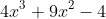

# Project 2278: Calculus
----


## Resources

**Read or watch**:

* [Sigma Notation](https://www.youtube.com/watch?v=TjMLzklnn2c)(*starting at 0:32*)
* [&Pi; Product Notation](https://www.youtube.com/watch?v=sP1-EQJKSgk)(*up to 0:20*)
* [Sigma and Pi Notation](https://mathmaine.com/2010/04/01/sigma-and-pi-notation/)
* [What is a Series?](https://virtualnerd.com/algebra-2/sequences-series/define/defining-series/series-definition)
* [What is a Mathematical Series?](https://www.quickanddirtytips.com/)
* [List of mathematical series: Sums of powers](https://en.wikipedia.org/wiki/List_of_mathematical_series#Sums_of_powers)
* [Bernoulli Numbers(Bn)](https://en.wikipedia.org/wiki/Bernoulli_number)
* [Bernoulli Polynomials(Bn(x))](https://en.wikipedia.org/wiki/Bernoulli_polynomials)
* [Derivative (mathematics)](https://simple.wikipedia.org/wiki/Derivative_%28mathematics%29)
* [Calculus for ML](https://ml-cheatsheet.readthedocs.io/en/latest/calculus.html)
* [1 of 2: Seeing the big picture](https://www.youtube.com/watch?v=tt2DGYOi3hc)
* [2 of 2: First Principles](https://www.youtube.com/watch?v=50Bda5VKbqA)
* [1 of 2: Finding the Derivative](https://www.youtube.com/watch?v=fXYhyyJpFe8)
* [2 of 2: What do we discover?](https://www.youtube.com/watch?v=Un0RcTMPJ64)
* [Deriving a Rule for Differentiating Powers of x](https://www.youtube.com/watch?v=I8IM9P-2TRU)
* [1 of 3: Introducing a substitution](https://www.youtube.com/watch?v=U0m4MsOgETw)
* [2 of 3: Combining derivatives](https://www.youtube.com/watch?v=z-tEsz0bSrA)
* [How To Understand Derivatives: The Product, Power & Chain Rules](https://betterexplained.com/articles/derivatives-product-power-chain/)
* [Product Rule](https://en.wikipedia.org/wiki/Product_rule)
* [Common Derivatives and Integrals](https://www.coastal.edu/media/academics/universitycollege/mathcenter/handouts/calculus/deranint.PDF)
* [Introduction to partial derivatives](https://mathinsight.org/partial_derivative_introduction)
* [Partial derivatives - How to solve?](https://www.youtube.com/watch?v=rnoToCoEK48)
* [Integral](https://en.wikipedia.org/wiki/Integral)
* [Integration and the fundamental theorem of calculus](https://www.youtube.com/watch?v=rfG8ce4nNh0)
* [Introduction to Integration](https://www.mathsisfun.com/calculus/integration-introduction.html)
* [Indefinite Integral - Basic Integration Rules, Problems, Formulas, Trig Functions, Calculus](https://www.youtube.com/watch?v=o75AqTInKDU)
* [Definite Integrals](https://www.mathsisfun.com/calculus/integration-definite.html)
* [Definite Integral](https://www.youtube.com/watch?v=Gc3QvUB0PkI)
* [Multiple integral](https://en.wikipedia.org/wiki/Multiple_integral)
* [Double integral 1](https://www.youtube.com/watch?v=85zGYB-34jQ)
* [Double integrals 2](https://www.youtube.com/watch?v=TdLD2Zh-nUQ)
## Learning Objectives

At the end of this project, you are expected to be able to[explain to anyone](https://fs.blog/feynman-learning-technique/),**without the help of Google**:

### General

* Summation and Product notation
* What is a series?
* Common series
* What is a derivative?
* What is the product rule?
* What is the chain rule?
* Common derivative rules
* What is a partial derivative?
* What is an indefinite integral?
* What is a definite integral?
* What is a double integral?
## Requirements

### Multiple Choice Questions

* Allowed editors:`vi`,`vim`,`emacs`
* Type the number of the correct answer in your answer file
* All your files should end with a new line

Example:

What is 9 squared?

1. 99
2. 81
3. 3
4. 18
``
```
alexa@ubuntu$ cat answer_file
2
alexa@ubuntu$
```
### Python Scripts

* Allowed editors:`vi`,`vim`,`emacs`
* All your files will be interpreted/compiled on Ubuntu 20.04 LTS using`python3`(version 3.9)
* All your files should end with a new line
* The first line of all your files should be exactly`#!/usr/bin/env python3`
* A`README.md`file, at the root of the folder of the project, is mandatory
* Your code should use the`pycodestyle`style (version 2.11.1)
* All your modules should have documentation (`python3 -c 'print(__import__("my_module").__doc__)'`)
* All your classes should have documentation (`python3 -c 'print(__import__("my_module").MyClass.__doc__)'`)
* All your functions (inside and outside a class) should have documentation (`python3 -c 'print(__import__("my_module").my_function.__doc__)'`and`python3 -c 'print(__import__("my_module").MyClass.my_function.__doc__)'`)
* Unless otherwise noted, you are not allowed to import any module
* All your files must be executable
* The length of your files will be tested using`wc`

----
## Tasks
---
### 0. Sigma is for Sum


**Repo:**

- GitHub repository: `atlas-machine_learning`
- Directory: `math/calculus`
- File: `0-sigma_is_for_sum`


---
### 1. The Greeks pronounce it sEEgma


**Repo:**

- GitHub repository: `atlas-machine_learning`
- Directory: `math/calculus`
- File: `1-seegma`


---
### 2. Pi is for Product


**Repo:**

- GitHub repository: `atlas-machine_learning`
- Directory: `math/calculus`
- File: `2-pi_is_for_product`


---
### 3. The Greeks pronounce it pEE


**Repo:**

- GitHub repository: `atlas-machine_learning`
- Directory: `math/calculus`
- File: `3-pee`


---
### 4. Hello, derivatives!

 where <!--plain-NL-->




**Repo:**

- GitHub repository: `atlas-machine_learning`
- Directory: `math/calculus`
- File: `4-hello_derivatives`


---
### 5. A log on the fire


**Repo:**

- GitHub repository: `atlas-machine_learning`
- Directory: `math/calculus`
- File: `5-log_on_fire`


---
### 6. It is difficult to free fools from the chains they revere


**Repo:**

- GitHub repository: `atlas-machine_learning`
- Directory: `math/calculus`
- File: `6-voltaire`


---
### 7. Partial truths are often more insidious than total falsehoods

 where <!--plain-NL--> and  <!--plain-NL-->


**Repo:**

- GitHub repository: `atlas-machine_learning`
- Directory: `math/calculus`
- File: `7-partial_truths`


---
### 8. Put it all together and what do you get?

 where <!--plain-NL-->


**Repo:**

- GitHub repository: `atlas-machine_learning`
- Directory: `math/calculus`
- File: `8-all-together`


---
### 9. Our life is the sum total of all the decisions we make every day, and those decisions are determined by our priorities

Write a function <!--plain-NL-->`def summation_i_squared(n):`<!--inline-NL--> that calculates <!--plain-NL-->:<!--plain-NL-->


- `n` is the stopping condition
- Return the integer value of the sum
- If `n` is not a valid number, return `None`
- You are not allowed to use any loops

```
alexa@ubuntu:calculus$ cat 9-main.py 
#!/usr/bin/env python3

summation_i_squared = __import__('9-sum_total').summation_i_squared

n = 5
print(summation_i_squared(n))
alexa@ubuntu:calculus$ ./9-main.py 
55
alexa@ubuntu:calculus$

```

**Repo:**

- GitHub repository: `atlas-machine_learning`
- Directory: `math/calculus`
- File: `9-sum_total.py`


---
### 10. Derive happiness in oneself from a good day's work

Write a function <!--plain-NL-->`def poly_derivative(poly):`<!--inline-NL--> that calculates the derivative of a polynomial: <!--plain-NL-->

- `poly` is a list of coefficients representing a polynomial


the index of the list represents the power of `x` that the coefficient belongs to
Example: if , `poly` is equal to `[5, 3, 0, 1]`
- the index of the list represents the power of `x` that the coefficient belongs to
- Example: if , `poly` is equal to `[5, 3, 0, 1]`
- If `poly` is not valid, return `None`
- If the derivative is `0`, return `[0]`
- Return a new list of coefficients representing the derivative of the polynomial

- the index of the list represents the power of `x` that the coefficient belongs to
- Example: if , `poly` is equal to `[5, 3, 0, 1]`


```
alexa@ubuntu:calculus$ cat 10-main.py 
#!/usr/bin/env python3

poly_derivative = __import__('10-matisse').poly_derivative

poly = [5, 3, 0, 1]
print(poly_derivative(poly))
alexa@ubuntu:calculus$ ./10-main.py 
[3, 0, 3]
alexa@ubuntu:calculus$

```

**Repo:**

- GitHub repository: `atlas-machine_learning`
- Directory: `math/calculus`
- File: `10-matisse.py`


---
### 11. Good grooming is integral and impeccable style is a must


**Repo:**

- GitHub repository: `atlas-machine_learning`
- Directory: `math/calculus`
- File: `11-integral`


---
### 12. We are all an integral part of the web of life


**Repo:**

- GitHub repository: `atlas-machine_learning`
- Directory: `math/calculus`
- File: `12-integral`


---
### 13. Create a definite plan for carrying out your desire and begin at once


**Repo:**

- GitHub repository: `atlas-machine_learning`
- Directory: `math/calculus`
- File: `13-definite`


---
### 14. My talents fall within definite limitations


**Repo:**

- GitHub repository: `atlas-machine_learning`
- Directory: `math/calculus`
- File: `14-definite`


---
### 15. Winners are people with definite purpose in life


**Repo:**

- GitHub repository: `atlas-machine_learning`
- Directory: `math/calculus`
- File: `15-definite`


---
### 16. Double whammy


**Repo:**

- GitHub repository: `atlas-machine_learning`
- Directory: `math/calculus`
- File: `16-double`


---
### 17. Integrate

Write a function <!--plain-NL-->`def poly_integral(poly, C=0):`<!--inline-NL--> that calculates the integral of a polynomial: <!--plain-NL-->

- `poly` is a list of coefficients representing a polynomial


the index of the list represents the power of `x` that the coefficient belongs to
Example: if , `poly` is equal to `[5, 3, 0, 1]`
- the index of the list represents the power of `x` that the coefficient belongs to
- Example: if , `poly` is equal to `[5, 3, 0, 1]`
- `C` is an integer representing the integration constant
- If a coefficient is a whole number, it should be represented as an integer
- If `poly` or `C` are not valid, return `None`
- Return a new list of coefficients representing the integral of the polynomial
- The returned list should be as small as possible

- the index of the list represents the power of `x` that the coefficient belongs to
- Example: if , `poly` is equal to `[5, 3, 0, 1]`


```
alexa@ubuntu:calculus$ cat 17-main.py 
#!/usr/bin/env python3

poly_integral = __import__('17-integrate').poly_integral

poly = [5, 3, 0, 1]
print(poly_integral(poly))
alexa@ubuntu:calculus$ ./17-main.py 
[0, 5, 1.5, 0, 0.25]
alexa@ubuntu:calculus$

```

**Repo:**

- GitHub repository: `atlas-machine_learning`
- Directory: `math/calculus`
- File: `17-integrate.py`