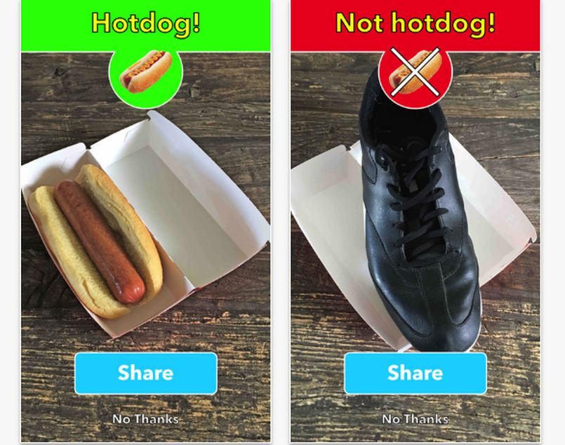

# Project 2427: Classification - reading
----

## Background Context

Welcome to your first project on supervised learning!

This project is split in 2 parts: reading (this one) and exercises

At the end of the second part, you should be able to build your own binary image classifier from scratch.

As you might already see, there are a**LOT**of resources for you to read/watch. This project doesn’t have any task after the quiz, but you we**highly**recommend that you are spending this project time for understanding all resources. At the end of it, you should have a decent understanding of all the topics mentioned in**Learning Objectives**.

You may also notice that there are multiple resources that cover the same topic, with some more technical than others. If you find yourself getting lost in a resource, move on to another and come back to the more technical one after you intuitively understand that topic.

## Resources

**Read or watch**:

* [Supervised vs. Unsupervised Machine Learning](https://blogs.oracle.com/datascience/supervised-vs-unsupervised-machine-learning)
* [How would you explain neural networks to someone who knows very little about AI or neurology?](https://www.quora.com/How-would-you-explain-neural-networks-to-someone-who-knows-very-little-about-AI-or-neurology/answer/Yohan-John)
* [Using Neural Nets to Recognize Handwritten Digits](http://neuralnetworksanddeeplearning.com/chap1.html)(*until “A simple network to classify handwritten digits” (excluded)*)
* [Forward propagation](https://www.youtube.com/watch?v=wL17g67vU88)
* [Understanding Activation Functions in Neural Networks](https://medium.com/the-theory-of-everything/understanding-activation-functions-in-neural-networks-9491262884e0)
* [Loss function](https://en.wikipedia.org/wiki/Loss_function)
* [Gradient descent](https://en.wikipedia.org/wiki/Gradient_descent)
* [Calculus on Computational Graphs: Backpropagation](http://colah.github.io/posts/2015-08-Backprop/)
* [Backpropagation calculus](https://www.youtube.com/watch?v=tIeHLnjs5U8)
* [What is a Neural Network?](https://www.youtube.com/watch?v=n1l-9lIMW7E&index=2&list=PLkDaE6sCZn6Ec-XTbcX1uRg2_u4xOEky0)
* [Supervised Learning with a Neural Network](https://www.youtube.com/watch?v=BYGpKPY9pO0&list=PLkDaE6sCZn6Ec-XTbcX1uRg2_u4xOEky0&t=0s&index=4)
* [Binary Classification](https://www.youtube.com/watch?v=eqEc66RFY0I&list=PLkDaE6sCZn6Ec-XTbcX1uRg2_u4xOEky0&index=7)
* [Logistic Regression](https://www.youtube.com/watch?v=hjrYrynGWGA&index=8&list=PLkDaE6sCZn6Ec-XTbcX1uRg2_u4xOEky0)
* [Logistic Regression Cost Function](https://www.youtube.com/watch?v=SHEPb1JHw5o&index=9&list=PLkDaE6sCZn6Ec-XTbcX1uRg2_u4xOEky0)
* [Gradient Descent](https://www.youtube.com/watch?v=uJryes5Vk1o&list=PLkDaE6sCZn6Ec-XTbcX1uRg2_u4xOEky0&index=10)
* [Computation Graph](https://www.youtube.com/watch?v=hCP1vGoCdYU&list=PLkDaE6sCZn6Ec-XTbcX1uRg2_u4xOEky0&index=13)
* [Logistic Regression Gradient Descent](https://www.youtube.com/watch?v=z_xiwjEdAC4&index=15&list=PLkDaE6sCZn6Ec-XTbcX1uRg2_u4xOEky0)
* [Vectorization](https://www.youtube.com/watch?v=qsIrQi0fzbY&index=17&list=PLkDaE6sCZn6Ec-XTbcX1uRg2_u4xOEky0)
* [Vectorizing Logistic Regression](https://www.youtube.com/watch?v=okpqeEUdEkY&list=PLkDaE6sCZn6Ec-XTbcX1uRg2_u4xOEky0&index=19)
* [Vectorizing Logistic Regression’s Gradient Computation](https://www.youtube.com/watch?v=2BkqApHKwn0&index=20&list=PLkDaE6sCZn6Ec-XTbcX1uRg2_u4xOEky0)
* [A Note on Python/Numpy Vectors](https://www.youtube.com/watch?v=V2QlTmh6P2Y&index=22&list=PLkDaE6sCZn6Ec-XTbcX1uRg2_u4xOEky0)
* [Neural Network Representations](https://www.youtube.com/watch?v=CcRkHl75Z-Y&index=26&list=PLkDaE6sCZn6Ec-XTbcX1uRg2_u4xOEky0)
* [Computing Neural Network Output](https://www.youtube.com/watch?v=rMOdrD61IoU&index=27&list=PLkDaE6sCZn6Ec-XTbcX1uRg2_u4xOEky0)
* [Vectorizing Across Multiple Examples](https://www.youtube.com/watch?v=xy5MOQpx3aQ&list=PLkDaE6sCZn6Ec-XTbcX1uRg2_u4xOEky0&index=28)
* [Gradient Descent For Neural Networks](https://www.youtube.com/watch?v=7bLEWDZng_M&list=PLkDaE6sCZn6Ec-XTbcX1uRg2_u4xOEky0&index=33)
* [Random Initialization](https://www.youtube.com/watch?v=6by6Xas_Kho&index=35&list=PLkDaE6sCZn6Ec-XTbcX1uRg2_u4xOEky0)
* [Deep L-Layer Neural Network](https://www.youtube.com/watch?v=2gw5tE2ziqA&index=36&list=PLkDaE6sCZn6Ec-XTbcX1uRg2_u4xOEky0)
* [Train/Dev/Test Sets](https://www.youtube.com/watch?v=1waHlpKiNyY&list=PLkDaE6sCZn6Hn0vK8co82zjQtt3T2Nkqc)
* [Random Initialization For Neural Networks : A Thing Of The Past](https://medium.com/towards-data-science/random-initialization-for-neural-networks-a-thing-of-the-past-bfcdd806bf9e)
* [Initialization of deep networks](http://ww1.deepdish.io/?sub1=716da9aa-ca59-11ed-a5ba-cf97d0a020a6)
* [Multiclass classification](https://en.wikipedia.org/wiki/Multiclass_classification)
* [Derivation: Derivatives for Common Neural Network Activation Functions](https://theclevermachine.wordpress.com/2014/09/08/derivation-derivatives-for-common-neural-network-activation-functions/)
* [What is One Hot Encoding? Why And When do you have to use it?](https://hackernoon.com/what-is-one-hot-encoding-why-and-when-do-you-have-to-use-it-e3c6186d008f?gi=a4f47cf027f7)
* [Softmax function](https://en.wikipedia.org/wiki/Softmax_function)
* [What is the intuition behind SoftMax function?](https://www.quora.com/What-is-the-intuition-behind-SoftMax-function)
* [Cross entropy](https://en.wikipedia.org/wiki/Cross_entropy)
* [Loss Functions: Cross-Entropy](https://ml-cheatsheet.readthedocs.io/en/latest/loss_functions.html#cross-entropy)
* [Softmax Regression](https://www.youtube.com/watch?v=LLux1SW--oM&list=PLkDaE6sCZn6Hn0vK8co82zjQtt3T2Nkqc&index=31)(*Note: I suggest watching this video at 1.5x - 2x speed*)
* [Training Softmax Classifier](https://www.youtube.com/watch?v=ueO_Ph0Pyqk&list=PLkDaE6sCZn6Hn0vK8co82zjQtt3T2Nkqc&index=32)(*Note: I suggest watching this video at 1.5x - 2x speed*)
* [numpy.zeros](https://numpy.org/doc/1.18/reference/generated/numpy.zeros.html)
* [numpy.random.randn](https://docs.scipy.org/doc/numpy-1.15.1/reference/generated/numpy.random.randn.html)
* [numpy.exp](https://numpy.org/doc/1.18/reference/generated/numpy.exp.html)
* [numpy.log](https://numpy.org/doc/1.18/reference/generated/numpy.log.html)
* [numpy.sqrt](https://numpy.org/doc/1.18/reference/generated/numpy.sqrt.html)
* [numpy.where](https://numpy.org/doc/1.18/reference/generated/numpy.where.html)
* [numpy.max](https://docs.scipy.org/doc/numpy-1.15.0/reference/generated/numpy.amax.html)
* [numpy.sum](https://docs.scipy.org/doc/numpy-1.15.0/reference/generated/numpy.sum.html)
* [numpy.argmax](https://docs.scipy.org/doc/numpy-1.15.0/reference/generated/numpy.argmax.html)
* [What is Pickle in python?](https://yasoob.me/2013/08/02/what-is-pickle-in-python/)
* [pickle](https://docs.python.org/3/library/pickle.html)
* [pickle.dump](https://docs.python.org/3/library/pickle.html#pickle.dump)
* [pickle.load](https://docs.python.org/3/library/pickle.html#pickle.load)

**Optional**:

* [Predictive analytics](https://en.wikipedia.org/wiki/Predictive_analytics)
* [Maximum Likelihood Estimation](https://medium.com/towards-data-science/maximum-likelihood-estimation-984af2dcfcac)
## Learning Objectives

At the end of this project, you are expected to be able to[explain to anyone](https://fs.blog/feynman-learning-technique/),**without the help of Google**:

### General

* What is a model?
* What is supervised learning?
* What is a prediction?
* What is a node?
* What is a weight?
* What is a bias?
* What are activation functions?
  * Sigmoid?
  * Tanh?
  * Relu?
  * Softmax?

* What is a layer?
* What is a hidden layer?
* What is Logistic Regression?
* What is a loss function?
* What is a cost function?
* What is forward propagation?
* What is Gradient Descent?
* What is back propagation?
* What is a Computation Graph?
* How to initialize weights/biases
* The importance of vectorization
* How to split up your data
* What is multiclass classification?
* What is a one-hot vector?
* How to encode/decode one-hot vectors
* What is the softmax function and when do you use it?
* What is cross-entropy loss?
* What is pickling in Python?
**Great!**You've completed the quiz successfully! Keep going!#### Question #0

What’s a hidden layer?

 * A layer of neurons that the output can’t see

 * A layer of neurons between the input and the output

 * A layer of neurons that the input can’t see

 * A layer of neurons that the input and output can’t see

 * A black box

#### Question #1

What’s a channel?

 * A connection between neurons with weight

 * A connection between neurons with an activation function

 * A data path betweens the input and the output

 * A fast-track connection between the input and the output

#### Question #2

What’s an activation function?

 * It’s a mathematical equation that determines if an input has the right type

 * It’s a mathematical equation that validates the entire neural network

 * It’s a mathematical equation that returns the sinusoid of the input

 * It’s a mathematical equation that determines the output of a neural network attached to each neuron

#### Question #3

Can a step function be an activation function?

 * Yes

 * No

 * Maybe

#### Question #4

Which other activation functions exist? (select all correct answers)

 * Linear

 * LRU

 * ReLU

 * Sigma

 * Sigmoid

#### Question #5

How many possible values a logistic regression can output?

 * 1

 * 2

 * 3

 * 4

 * 5 or more

#### Question #6

After how many classes could we consider we are doing a Multiclass classification?

 * At least 1

 * At least 2

 * At least 3

----
## Tasks
---
### 0. Quiz Passed!

Done! nothing else to do.<!--plain-NL-->