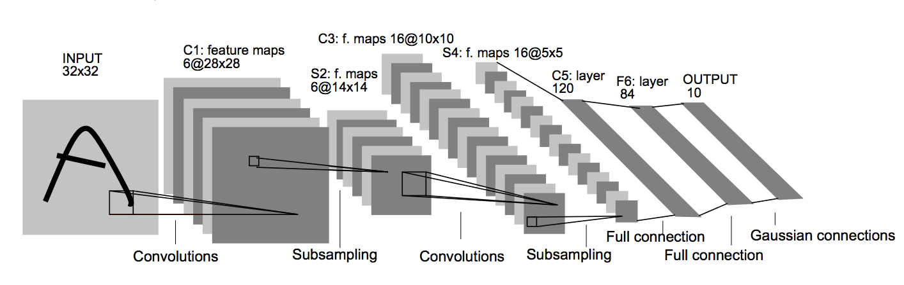

# Project 2303: Convolutional Neural Networks
----


## Resources

**Read or watch**:

* [Convolutional neural network](https://en.wikipedia.org/wiki/Convolutional_neural_network)
* [Convolutional Neural Networks (CNNs) explained](https://www.youtube.com/watch?v=YRhxdVk_sIs)
* [The best explanation of Convolutional Neural Networks on the Internet!](https://medium.com/technologymadeeasy/the-best-explanation-of-convolutional-neural-networks-on-the-internet-fbb8b1ad5df8)(*It’s pretty good but I wouldn’t call it the best…*)
* [Machine Learning is Fun! Part 3: Deep Learning and Convolutional Neural Networks](https://medium.com/@ageitgey/machine-learning-is-fun-part-3-deep-learning-and-convolutional-neural-networks-f40359318721)
* [Convolutional Neural Networks: The Biologically-Inspired Model](https://www.codementor.io/@james_aka_yale/convolutional-neural-networks-the-biologically-inspired-model-iq6s48zms)
* [Back Propagation in Convolutional Neural Networks — Intuition and Code](https://becominghuman.ai/back-propagation-in-convolutional-neural-networks-intuition-and-code-714ef1c38199?gi=ea312f672c66)
* [Backpropagation in a convolutional layer](https://medium.com/towards-data-science/backpropagation-in-a-convolutional-layer-24c8d64d8509)
* [Convolutional Neural Network – Backward Propagation of the Pooling Layers](https://lanstonchu.wordpress.com/2018/09/01/convolutional-neural-network-cnn-backward-propagation-of-the-pooling-layers/)
* [Pooling Layer](https://www.jefkine.com/general/2016/09/05/backpropagation-in-convolutional-neural-networks/#pooling-layer)
* [deeplearning.ai](https://www.deeplearning.ai/)videos (*Note: I suggest watching these videos at 1.5x - 2x speed*):
  * [Why Convolutions](https://www.youtube.com/watch?v=ay3zYUeuyhU&list=PLkDaE6sCZn6Gl29AoE31iwdVwSG-KnDzF&index=11)
  * [One Layer of a Convolutional Net](https://www.youtube.com/watch?v=jPOAS7uCODQ&list=PLkDaE6sCZn6Gl29AoE31iwdVwSG-KnDzF&index=7)
  * [Simple Convolutional Network Example](https://www.youtube.com/watch?v=3PyJA9AfwSk&list=PLkDaE6sCZn6Gl29AoE31iwdVwSG-KnDzF&index=8)
  * [CNN Example](https://www.youtube.com/watch?v=bXJx7y51cl0&list=PLkDaE6sCZn6Gl29AoE31iwdVwSG-KnDzF&index=10)

* [Gradient-Based Learning Applied to Document Recognition (LeNet-5)](https://yann.lecun.com/exdb/publis/pdf/lecun-01a.pdf)

**References**:

* [tf.layers.Conv2D](https://docs.w3cub.com/tensorflow~2.9/compat/v1/layers/conv2d)
* [tf.keras.layers.Conv2D](https://www.tensorflow.org/api_docs/python/tf/keras/layers/Conv2D)
* [tf.layers.AveragePooling2D](https://docs.w3cub.com/tensorflow~2.9/compat/v1/layers/averagepooling2d)
* [tf.keras.layers.AveragePooling2D](https://www.tensorflow.org/api_docs/python/tf/keras/layers/AveragePooling2D)
* [tf.layers.MaxPooling2D](https://docs.w3cub.com/tensorflow~2.9/compat/v1/layers/maxpooling2d)
* [tf.keras.layers.MaxPooling2D](https://www.tensorflow.org/api_docs/python/tf/keras/layers/MaxPool2D)
* [tf.layers.Flatten](https://docs.w3cub.com/tensorflow~2.9/compat/v1/layers/flatten)
* [tf.keras.layers.Flatten](https://www.tensorflow.org/api_docs/python/tf/keras/layers/Flatten)
* [Reproducibility in Keras Models](https://keras.io/examples/keras_recipes/reproducibility_recipes/)
## Learning Objectives

At the end of this project, you are expected to be able to[explain to anyone](https://fs.blog/feynman-learning-technique/),**without the help of Google**:

### General

* What is a convolutional layer?
* What is a pooling layer?
* Forward propagation over convolutional and pooling layers
* Back propagation over convolutional and pooling layers
* How to build a CNN using Tensorflow and Keras
## Requirements

### General

* Allowed editors:`vi`,`vim`,`emacs`
* All your files will be interpreted/compiled on Ubuntu 20.04 LTS using`python3`(version 3.9)
* Your files will be executed with`numpy`(version 1.25.2) and`tensorflow`(version 2.15)
* All your files should end with a new line
* The first line of all your files should be exactly`#!/usr/bin/env python3`
* A`README.md`file, at the root of the folder of the project, is mandatory
* Your code should use the`pycodestyle`style (version 2.11.1)
* All your modules should have documentation (`python3 -c 'print(__import__("my_module").__doc__)'`)
* All your classes should have documentation (`python3 -c 'print(__import__("my_module").MyClass.__doc__)'`)
* All your functions (inside and outside a class) should have documentation (`python3 -c 'print(__import__("my_module").my_function.__doc__)'`and`python3 -c 'print(__import__("my_module").MyClass.my_function.__doc__)'`)
* Unless otherwise noted, you are not allowed to import any module
* All your files must be executable
* The length of your files will be tested using`wc`

----
## Tasks
---
### 0. Convolutional Forward Prop

Write a function <!--plain-NL-->`def conv_forward(A_prev, W, b, activation, padding="same", stride=(1, 1)):`<!--inline-NL--> that performs forward propagation over a convolutional layer of a neural network:<!--plain-NL-->

- `A_prev` is a `numpy.ndarray` of shape `(m, h_prev, w_prev, c_prev)` containing the output of the previous layer


`m` is the number of examples
`h_prev` is the height of the previous layer
`w_prev` is the width of the previous layer
`c_prev` is the number of channels in the previous layer
- `m` is the number of examples
- `h_prev` is the height of the previous layer
- `w_prev` is the width of the previous layer
- `c_prev` is the number of channels in the previous layer
- `W` is a `numpy.ndarray` of shape `(kh, kw, c_prev, c_new)` containing the kernels for the convolution


`kh` is the filter height
`kw` is the filter width
`c_prev` is the number of channels in the previous layer
`c_new` is the number of channels in the output
- `kh` is the filter height
- `kw` is the filter width
- `c_prev` is the number of channels in the previous layer
- `c_new` is the number of channels in the output
- `b` is a `numpy.ndarray` of shape `(1, 1, 1, c_new)` containing the biases applied to the convolution
- `activation` is an activation function applied to the convolution
- `padding` is a string that is either `same` or `valid`, indicating the type of padding used
- `stride` is a tuple of `(sh, sw)` containing the strides for the convolution


`sh` is the stride for the height
`sw` is the stride for the width
- `sh` is the stride for the height
- `sw` is the stride for the width
- you may `import numpy as np`
- Returns: the output of the convolutional layer

- `m` is the number of examples
- `h_prev` is the height of the previous layer
- `w_prev` is the width of the previous layer
- `c_prev` is the number of channels in the previous layer

- `kh` is the filter height
- `kw` is the filter width
- `c_prev` is the number of channels in the previous layer
- `c_new` is the number of channels in the output

- `sh` is the stride for the height
- `sw` is the stride for the width

```
ubuntu@alexa-ml:~/supervised_learning/cnn$ cat 0-main.py
#!/usr/bin/env python3

import matplotlib.pyplot as plt
import numpy as np
conv_forward = __import__('0-conv_forward').conv_forward

if __name__ == "__main__":
    np.random.seed(0)
    lib = np.load('MNIST.npz')
    X_train = lib['X_train']
    m, h, w = X_train.shape
    X_train_c = X_train.reshape((-1, h, w, 1))

    W = np.random.randn(3, 3, 1, 2)
    b = np.random.randn(1, 1, 1, 2)

    def relu(Z):
        return np.maximum(Z, 0)

    plt.imshow(X_train[0])
    plt.show()
    A = conv_forward(X_train_c, W, b, relu, padding='valid')
    print(A.shape)
    plt.imshow(A[0, :, :, 0])
    plt.show()
    plt.imshow(A[0, :, :, 1])
    plt.show()
ubuntu@alexa-ml:~/supervised_learning/cnn$ ./0-main.py

```


```
(50000, 26, 26, 2)

```


**Repo:**

- GitHub repository: `atlas-machine_learning`
- Directory: `supervised_learning/cnn`
- File: `0-conv_forward.py`


---
### 1. Pooling Forward Prop

Write a function <!--plain-NL-->`def pool_forward(A_prev, kernel_shape, stride=(1, 1), mode='max'):`<!--inline-NL--> that performs forward propagation over a pooling layer of a neural network:<!--plain-NL-->

- `A_prev` is a `numpy.ndarray` of shape `(m, h_prev, w_prev, c_prev)` containing the output of the previous layer


`m` is the number of examples
`h_prev` is the height of the previous layer
`w_prev` is the width of the previous layer
`c_prev` is the number of channels in the previous layer
- `m` is the number of examples
- `h_prev` is the height of the previous layer
- `w_prev` is the width of the previous layer
- `c_prev` is the number of channels in the previous layer
- `kernel_shape` is a tuple of `(kh, kw)` containing the size of the kernel for the pooling


`kh` is the kernel height
`kw` is the kernel width
- `kh` is the kernel height
- `kw` is the kernel width
- `stride` is a tuple of `(sh, sw)` containing the strides for the pooling


`sh` is the stride for the height
`sw` is the stride for the width
- `sh` is the stride for the height
- `sw` is the stride for the width
- `mode` is a string containing either `max` or `avg`, indicating whether to perform maximum or average pooling, respectively
- you may `import numpy as np`
- Returns: the output of the pooling layer

- `m` is the number of examples
- `h_prev` is the height of the previous layer
- `w_prev` is the width of the previous layer
- `c_prev` is the number of channels in the previous layer

- `kh` is the kernel height
- `kw` is the kernel width

- `sh` is the stride for the height
- `sw` is the stride for the width

```
ubuntu@alexa-ml:~/supervised_learning/cnn$ cat 1-main.py 
#!/usr/bin/env python3

import matplotlib.pyplot as plt
import numpy as np
pool_forward = __import__('1-pool_forward').pool_forward

if __name__ == "__main__":
    np.random.seed(0)
    lib = np.load('MNIST.npz')
    X_train = lib['X_train']
    m, h, w = X_train.shape
    X_train_a = X_train.reshape((-1, h, w, 1))
    X_train_b = 1 - X_train_a
    X_train_c = np.concatenate((X_train_a, X_train_b), axis=3)

    print(X_train_c.shape)
    plt.imshow(X_train_c[0, :, :, 0])
    plt.show()
    plt.imshow(X_train_c[0, :, :, 1])
    plt.show()
    A = pool_forward(X_train_c, (2, 2), stride=(2, 2))
    print(A.shape)
    plt.imshow(A[0, :, :, 0])
    plt.show()
    plt.imshow(A[0, :, :, 1])
    plt.show()
ubuntu@alexa-ml:~/supervised_learning/cnn$ ./1-main.py 
(50000, 28, 28, 2)

```


```
(50000, 14, 14, 2)

```


**Repo:**

- GitHub repository: `atlas-machine_learning`
- Directory: `supervised_learning/cnn`
- File: `1-pool_forward.py`


---
### 2. Convolutional Back Prop

Write a function <!--plain-NL-->`def conv_backward(dZ, A_prev, W, b, padding="same", stride=(1, 1)):`<!--inline-NL--> that performs back propagation over a convolutional layer of a neural network:<!--plain-NL-->

- `dZ` is a `numpy.ndarray` of shape `(m, h_new, w_new, c_new)` containing the partial derivatives with respect to the unactivated output of the convolutional layer


`m` is the number of examples
`h_new` is the height of the output
`w_new` is the width of the output
`c_new` is the number of channels in the output
- `m` is the number of examples
- `h_new` is the height of the output
- `w_new` is the width of the output
- `c_new` is the number of channels in the output
- `A_prev` is a `numpy.ndarray` of shape `(m, h_prev, w_prev, c_prev)` containing the output of the previous layer


`h_prev` is the height of the previous layer
`w_prev` is the width of the previous layer
`c_prev` is the number of channels in the previous layer
- `h_prev` is the height of the previous layer
- `w_prev` is the width of the previous layer
- `c_prev` is the number of channels in the previous layer
- `W` is a `numpy.ndarray` of shape `(kh, kw, c_prev, c_new)` containing the kernels for the convolution


`kh` is the filter height
`kw` is the filter width
- `kh` is the filter height
- `kw` is the filter width
- `b` is a `numpy.ndarray` of shape `(1, 1, 1, c_new)` containing the biases applied to the convolution
- `padding` is a string that is either `same` or `valid`, indicating the type of padding used
- `stride` is a tuple of `(sh, sw)` containing the strides for the convolution


`sh` is the stride for the height
`sw` is the stride for the width
- `sh` is the stride for the height
- `sw` is the stride for the width
- you may `import numpy as np`
- Returns: the partial derivatives with respect to the previous layer (`dA_prev`), the kernels (`dW`), and the biases (`db`), respectively

- `m` is the number of examples
- `h_new` is the height of the output
- `w_new` is the width of the output
- `c_new` is the number of channels in the output

- `h_prev` is the height of the previous layer
- `w_prev` is the width of the previous layer
- `c_prev` is the number of channels in the previous layer

- `kh` is the filter height
- `kw` is the filter width

- `sh` is the stride for the height
- `sw` is the stride for the width

```
ubuntu@alexa-ml:~/supervised_learning/cnn$ cat 2-main.py
#!/usr/bin/env python3

import numpy as np
conv_backward = __import__('2-conv_backward').conv_backward

if __name__ == "__main__":
    np.random.seed(0)
    lib = np.load('MNIST.npz')
    X_train = lib['X_train']
    _, h, w = X_train.shape
    X_train_c = X_train[:10].reshape((-1, h, w, 1))

    W = np.random.randn(3, 3, 1, 2)
    b = np.random.randn(1, 1, 1, 2)

    dZ = np.random.randn(10, h - 2, w - 2, 2)
    print(conv_backward(dZ, X_train_c, W, b, padding="valid"))
ubuntu@alexa-ml:~/supervised_learning/cnn$ ./2-main.py
(array([[[[-4.24205748],
         [ 0.19390938],
         [-2.80168847],
         ...,
         [-2.93059274],
         [-0.74257184],
         [ 1.23556676]],

        [[-1.00865794],
         [ 0.24929631],
         [ 2.99153975],
         ...,
         [ 0.43357888],
         [ 4.96415936],
         [-0.44667327]],

        [[-1.87909273],
         [-1.52898354],
         [-1.03988664],
         ...,
         [-2.08719794],
         [ 0.72118428],
         [ 0.43712847]],

        ...,

        [[-1.85981381],
         [-4.35543293],
         [ 3.57636107],
         ...,
         [ 2.11136296],
         [ 0.53958723],
         [-3.52000282]],

        [[-1.0499573 ],
         [-2.04696766],
         [-3.65137871],
         ...,
         [-0.52756967],
         [-0.08825488],
         [ 0.62158883]],

        [[-0.33383597],
         [-0.68426308],
         [-1.16737412],
         ...,
         [ 0.38028383],
         [ 0.90910959],
         [ 1.1018034 ]]],


       [[[ 1.3242862 ],
         [ 3.35050521],
         [-2.61244835],
         ...,
         [-5.35657632],
         [ 0.76179689],
         [ 2.18585273]],

        [[ 0.41947984],
         [ 2.29805997],
         [ 0.70448521],
         ...,
         [-0.15055621],
         [-1.85010471],
         [ 0.22182008]],

        [[-0.44134373],
         [ 1.70998625],
         [-0.43519259],
         ...,
         [-0.84228164],
         [ 0.06743225],
         [-0.33952493]],

        ...,

        [[-0.84072841],
         [ 2.23096657],
         [ 4.2740757 ],
         ...,
         [-1.64328314],
         [-1.00825088],
         [ 0.06493264]],

        [[ 0.51461905],
         [ 1.74947396],
         [ 3.12442805],
         ...,
         [ 2.64632352],
         [ 1.11166957],
         [-2.17004665]],

        [[-0.15977939],
         [ 0.71088702],
         [ 0.58870058],
         ...,
         [ 0.79037467],
         [-1.872449  ],
         [ 0.22958953]]],


       [[[-2.55102529],
         [-1.43443829],
         [-6.43429192],
         ...,
         [ 4.43919873],
         [-2.3961974 ],
         [ 1.12105391]],

        [[-3.49933601],
         [ 2.97808   ],
         [-5.94765644],
         ...,
         [-1.52227952],
         [ 0.71633969],
         [-2.69268038]],

        [[-0.6049378 ],
         [ 3.00515277],
         [-3.82581326],
         ...,
         [-0.82612782],
         [ 1.10270878],
         [ 0.57341665]],

        ...,

        [[ 2.47206612],
         [ 6.12030267],
         [ 4.85570283],
         ...,
         [ 1.7069348 ],
         [-3.26558701],
         [-2.19265787]],

        [[ 0.82794065],
         [ 2.50876332],
         [ 4.94170337],
         ...,
         [-4.11611469],
         [-1.89129533],
         [ 1.02817795]],

        [[ 0.61583613],
         [ 1.21100799],
         [ 1.26340831],
         ...,
         [-1.46870175],
         [-2.48288945],
         [-2.49803816]]],


       ...,


       [[[ 0.36480084],
         [ 4.05009666],
         [ 2.40882213],
         ...,
         [-1.39742733],
         [-1.58184928],
         [ 1.5492834 ]],

        [[-0.59246796],
         [-5.14195445],
         [-4.73361645],
         ...,
         [-6.29937402],
         [ 2.57781547],
         [-6.22413954]],

        [[ 0.28940123],
         [ 3.30399397],
         [-9.92107171],
         ...,
         [-4.7873951 ],
         [-5.51345667],
         [ 2.59603062]],

        ...,

        [[ 0.31895703],
         [ 2.7620854 ],
         [ 2.40446498],
         ...,
         [ 2.68160757],
         [ 2.3774331 ],
         [-5.17924359]],

        [[-0.84079478],
         [ 0.92656007],
         [ 1.69220611],
         ...,
         [ 0.23381858],
         [ 0.65019692],
         [ 2.52647242]],

        [[-0.21035363],
         [-0.49657321],
         [-0.97588817],
         ...,
         [ 1.37568796],
         [ 0.75783393],
         [-2.06076966]]],


       [[[-0.8764177 ],
         [ 0.04226753],
         [-3.92342249],
         ...,
         [-3.04784534],
         [-0.40436888],
         [ 0.42939003]],

        [[-1.99854061],
         [-1.36763433],
         [-3.31601105],
         ...,
         [ 3.56163624],
         [-5.45977866],
         [-1.1221114 ]],

        [[-2.97880521],
         [-7.02474334],
         [-2.6208715 ],
         ...,
         [-2.66868613],
         [-3.35947227],
         [ 1.52739149]],

        ...,

        [[-0.76204177],
         [-2.39471119],
         [ 1.88614862],
         ...,
         [ 8.52140674],
         [ 2.87244213],
         [ 5.4831909 ]],

        [[-0.28094631],
         [-1.54524622],
         [-2.26649997],
         ...,
         [ 4.01337541],
         [ 1.72949251],
         [ 0.26894907]],

        [[ 0.2333244 ],
         [ 0.15360826],
         [ 0.61304729],
         ...,
         [ 4.82873779],
         [ 1.58564885],
         [ 3.77278834]]],


       [[[-4.64117569],
         [-6.30127451],
         [-1.35549413],
         ...,
         [ 5.73490276],
         [ 4.48763997],
         [ 0.90584946]],

        [[-2.06780074],
         [ 0.74310235],
         [ 2.32306348],
         ...,
         [-1.93057052],
         [ 1.73865934],
         [ 1.29870813]],

        [[ 0.48429556],
         [-3.18452582],
         [-3.1882709 ],
         ...,
         [ 1.14229413],
         [-0.68614631],
         [ 0.48510011]],

        ...,

        [[ 1.31359094],
         [ 1.80393793],
         [-2.56324511],
         ...,
         [ 1.87402318],
         [ 2.10343171],
         [ 4.90609163]],

        [[ 0.984754  ],
         [ 0.49587505],
         [-0.26741779],
         ...,
         [ 1.93306272],
         [ 3.19125427],
         [-0.9173847 ]],

        [[ 0.87318188],
         [ 0.96086254],
         [ 1.69739496],
         ...,
         [-0.28586324],
         [ 2.24643738],
         [ 0.74045003]]]]), array([[[[ 10.13352674, -25.15674655]],

        [[ 33.27872337, -64.99062958]],

        [[ 31.29539025, -77.29275492]]],


       [[[ 10.61025981, -31.7337223 ]],

        [[ 10.34048231, -65.19271124]],

        [[ -1.73024336, -76.98703808]]],


       [[[ -1.49204439, -33.46094911]],

        [[  4.04542976, -63.47295685]],

        [[  2.9243666 , -64.29296016]]]]), array([[[[-113.18404846, -121.902714  ]]]]))
ubuntu@alexa-ml:~/supervised_learning/cnn$

```

**Repo:**

- GitHub repository: `atlas-machine_learning`
- Directory: `supervised_learning/cnn`
- File: `2-conv_backward.py`


---
### 3. Pooling Back Prop

Write a function <!--plain-NL-->`def pool_backward(dA, A_prev, kernel_shape, stride=(1, 1), mode='max'):`<!--inline-NL--> that performs back propagation over a pooling layer of a neural network:<!--plain-NL-->

- `dA` is a `numpy.ndarray` of shape `(m, h_new, w_new, c_new)` containing the partial derivatives with respect to the output of the pooling layer


`m` is the number of examples
`h_new` is the height of the output
`w_new` is the width of the output
`c` is the number of channels
- `m` is the number of examples
- `h_new` is the height of the output
- `w_new` is the width of the output
- `c` is the number of channels
- `A_prev` is a `numpy.ndarray` of shape `(m, h_prev, w_prev, c)` containing the output of the previous layer


`h_prev` is the height of the previous layer
`w_prev` is the width of the previous layer
- `h_prev` is the height of the previous layer
- `w_prev` is the width of the previous layer
- `kernel_shape` is a tuple of `(kh, kw)` containing the size of the kernel for the pooling


`kh` is the kernel height
`kw` is the kernel width
- `kh` is the kernel height
- `kw` is the kernel width
- `stride` is a tuple of `(sh, sw)` containing the strides for the pooling


`sh` is the stride for the height
`sw` is the stride for the width
- `sh` is the stride for the height
- `sw` is the stride for the width
- `mode` is a string containing either `max` or `avg`, indicating whether to perform maximum or average pooling, respectively
- you may `import numpy as np`
- Returns: the partial derivatives with respect to the previous layer (`dA_prev`)

- `m` is the number of examples
- `h_new` is the height of the output
- `w_new` is the width of the output
- `c` is the number of channels

- `h_prev` is the height of the previous layer
- `w_prev` is the width of the previous layer

- `kh` is the kernel height
- `kw` is the kernel width

- `sh` is the stride for the height
- `sw` is the stride for the width

```
ubuntu@alexa-ml:~/supervised_learning/cnn$ cat 3-main.py
#!/usr/bin/env python3

import numpy as np
pool_backward = __import__('3-pool_backward').pool_backward

if __name__ == "__main__":
    np.random.seed(0)
    lib = np.load('MNIST.npz')
    X_train = lib['X_train']
    _, h, w = X_train.shape
    X_train_a = X_train[:10].reshape((-1, h, w, 1))
    X_train_b = 1 - X_train_a
    X_train_c = np.concatenate((X_train_a, X_train_b), axis=3)

    dA = np.random.randn(10, h // 3, w // 3, 2)
    print(pool_backward(dA, X_train_c, (3, 3), stride=(3, 3)))
ubuntu@alexa-ml:~/supervised_learning/cnn$ ./3-main.py
[[[[ 1.76405235  0.40015721]
   [ 1.76405235  0.40015721]
   [ 1.76405235  0.40015721]
   ...
   [ 1.49407907 -0.20515826]
   [ 1.49407907 -0.20515826]
   [ 0.          0.        ]]

  [[ 1.76405235  0.40015721]
   [ 1.76405235  0.40015721]
   [ 1.76405235  0.40015721]
   ...
   [ 1.49407907 -0.20515826]
   [ 1.49407907 -0.20515826]
   [ 0.          0.        ]]

  [[ 1.76405235  0.40015721]
   [ 1.76405235  0.40015721]
   [ 1.76405235  0.40015721]
   ...
   [ 1.49407907 -0.20515826]
   [ 1.49407907 -0.20515826]
   [ 0.          0.        ]]

  ...

  [[ 2.38314477  0.94447949]
   [ 2.38314477  0.94447949]
   [ 2.38314477  0.94447949]
   ...
   [-0.49803245  1.92953205]
   [-0.49803245  1.92953205]
   [ 0.          0.        ]]

  [[ 2.38314477  0.94447949]
   [ 2.38314477  0.94447949]
   [ 2.38314477  0.94447949]
   ...
   [-0.49803245  1.92953205]
   [-0.49803245  1.92953205]
   [ 0.          0.        ]]

  [[ 0.          0.        ]
   [ 0.          0.        ]
   [ 0.          0.        ]
   ...
   [ 0.          0.        ]
   [ 0.          0.        ]
   [ 0.          0.        ]]]


 [[[ 0.94942081  0.08755124]
   [ 0.94942081  0.08755124]
   [ 0.94942081  0.08755124]
   ...
   [-0.4555325   0.01747916]
   [-0.4555325   0.01747916]
   [ 0.          0.        ]]

  [[ 0.94942081  0.08755124]
   [ 0.94942081  0.08755124]
   [ 0.94942081  0.08755124]
   ...
   [-0.4555325   0.01747916]
   [-0.4555325   0.01747916]
   [ 0.          0.        ]]

  [[ 0.94942081  0.08755124]
   [ 0.94942081  0.08755124]
   [ 0.94942081  0.08755124]
   ...
   [-0.4555325   0.01747916]
   [-0.4555325   0.01747916]
   [ 0.          0.        ]]

  ...

  [[-1.33425847 -1.34671751]
   [-1.33425847 -1.34671751]
   [-1.33425847 -1.34671751]
   ...
   [ 0.27451636 -0.89091508]
   [ 0.27451636 -0.89091508]
   [ 0.          0.        ]]

  [[-1.33425847 -1.34671751]
   [-1.33425847 -1.34671751]
   [-1.33425847 -1.34671751]
   ...
   [ 0.27451636 -0.89091508]
   [ 0.27451636 -0.89091508]
   [ 0.          0.        ]]

  [[ 0.          0.        ]
   [ 0.          0.        ]
   [ 0.          0.        ]
   ...
   [ 0.          0.        ]
   [ 0.          0.        ]
   [ 0.          0.        ]]]


 [[[-1.15735526 -0.31229225]
   [-1.15735526 -0.31229225]
   [-1.15735526 -0.31229225]
   ...
   [ 1.0685094  -0.4533858 ]
   [ 1.0685094  -0.4533858 ]
   [ 0.          0.        ]]

  [[-1.15735526 -0.31229225]
   [-1.15735526 -0.31229225]
   [-1.15735526 -0.31229225]
   ...
   [ 1.0685094  -0.4533858 ]
   [ 1.0685094  -0.4533858 ]
   [ 0.          0.        ]]

  [[-1.15735526 -0.31229225]
   [-1.15735526 -0.31229225]
   [-1.15735526 -0.31229225]
   ...
   [ 1.0685094  -0.4533858 ]
   [ 1.0685094  -0.4533858 ]
   [ 0.          0.        ]]

  ...

  [[-2.28862004  0.25148442]
   [-2.28862004  0.25148442]
   [-2.28862004  0.25148442]
   ...
   [ 0.86259601 -2.65561909]
   [ 0.86259601 -2.65561909]
   [ 0.          0.        ]]

  [[-2.28862004  0.25148442]
   [-2.28862004  0.25148442]
   [-2.28862004  0.25148442]
   ...
   [ 0.86259601 -2.65561909]
   [ 0.86259601 -2.65561909]
   [ 0.          0.        ]]

  [[ 0.          0.        ]
   [ 0.          0.        ]
   [ 0.          0.        ]
   ...
   [ 0.          0.        ]
   [ 0.          0.        ]
   [ 0.          0.        ]]]


 ...


 [[[-0.12824197 -0.27177157]
   [-0.12824197 -0.27177157]
   [-0.12824197 -0.27177157]
   ...
   [-0.03331928 -1.5308035 ]
   [-0.03331928 -1.5308035 ]
   [ 0.          0.        ]]

  [[-0.12824197 -0.27177157]
   [-0.12824197 -0.27177157]
   [-0.12824197 -0.27177157]
   ...
   [-0.03331928 -1.5308035 ]
   [-0.03331928 -1.5308035 ]
   [ 0.          0.        ]]

  [[-0.12824197 -0.27177157]
   [-0.12824197 -0.27177157]
   [-0.12824197 -0.27177157]
   ...
   [-0.03331928 -1.5308035 ]
   [-0.03331928 -1.5308035 ]
   [ 0.          0.        ]]

  ...

  [[-1.31771734  0.54100822]
   [-1.31771734  0.54100822]
   [-1.31771734  0.54100822]
   ...
   [ 1.60852216 -0.56157875]
   [ 1.60852216 -0.56157875]
   [ 0.          0.        ]]

  [[-1.31771734  0.54100822]
   [-1.31771734  0.54100822]
   [-1.31771734  0.54100822]
   ...
   [ 1.60852216 -0.56157875]
   [ 1.60852216 -0.56157875]
   [ 0.          0.        ]]

  [[ 0.          0.        ]
   [ 0.          0.        ]
   [ 0.          0.        ]
   ...
   [ 0.          0.        ]
   [ 0.          0.        ]
   [ 0.          0.        ]]]


 [[[ 0.20727075  0.30773257]
   [ 0.20727075  0.30773257]
   [ 0.20727075  0.30773257]
   ...
   [-0.25595767 -0.34804638]
   [-0.25595767 -0.34804638]
   [ 0.          0.        ]]

  [[ 0.20727075  0.30773257]
   [ 0.20727075  0.30773257]
   [ 0.20727075  0.30773257]
   ...
   [-0.25595767 -0.34804638]
   [-0.25595767 -0.34804638]
   [ 0.          0.        ]]

  [[ 0.20727075  0.30773257]
   [ 0.20727075  0.30773257]
   [ 0.20727075  0.30773257]
   ...
   [-0.25595767 -0.34804638]
   [-0.25595767 -0.34804638]
   [ 0.          0.        ]]

  ...

  [[ 0.1474344  -0.97746488]
   [ 0.1474344  -0.97746488]
   [ 0.1474344  -0.97746488]
   ...
   [-1.00432271 -0.99819173]
   [-1.00432271 -0.99819173]
   [ 0.          0.        ]]

  [[ 0.1474344  -0.97746488]
   [ 0.1474344  -0.97746488]
   [ 0.1474344  -0.97746488]
   ...
   [-1.00432271 -0.99819173]
   [-1.00432271 -0.99819173]
   [ 0.          0.        ]]

  [[ 0.          0.        ]
   [ 0.          0.        ]
   [ 0.          0.        ]
   ...
   [ 0.          0.        ]
   [ 0.          0.        ]
   [ 0.          0.        ]]]


 [[[-1.37304255 -1.06774201]
   [-1.37304255 -1.06774201]
   [-1.37304255 -1.06774201]
   ...
   [-0.02852887 -0.32473027]
   [-0.02852887 -0.32473027]
   [ 0.          0.        ]]

  [[-1.37304255 -1.06774201]
   [-1.37304255 -1.06774201]
   [-1.37304255 -1.06774201]
   ...
   [-0.02852887 -0.32473027]
   [-0.02852887 -0.32473027]
   [ 0.          0.        ]]

  [[-1.37304255 -1.06774201]
   [-1.37304255 -1.06774201]
   [-1.37304255 -1.06774201]
   ...
   [-0.02852887 -0.32473027]
   [-0.02852887 -0.32473027]
   [ 0.          0.        ]]

  ...

  [[-1.00603686 -0.82154983]
   [-1.00603686 -0.82154983]
   [-1.00603686 -0.82154983]
   ...
   [ 1.00859729  0.52759738]
   [ 1.00859729  0.52759738]
   [ 0.          0.        ]]

  [[-1.00603686 -0.82154983]
   [-1.00603686 -0.82154983]
   [-1.00603686 -0.82154983]
   ...
   [ 1.00859729  0.52759738]
   [ 1.00859729  0.52759738]
   [ 0.          0.        ]]

  [[ 0.          0.        ]
   [ 0.          0.        ]
   [ 0.          0.        ]
   ...
   [ 0.          0.        ]
   [ 0.          0.        ]
   [ 0.          0.        ]]]]
ubuntu@alexa-ml:~/supervised_learning/cnn$

```

**Repo:**

- GitHub repository: `atlas-machine_learning`
- Directory: `supervised_learning/cnn`
- File: `3-pool_backward.py`


---
### 4. LeNet-5 (Tensorflow 1)




Write a function <!--plain-NL-->`def lenet5(x, y):`<!--inline-NL--> that builds a modified version of the <!--plain-NL-->`LeNet-5`<!--inline-NL--> architecture using <!--plain-NL-->`tensorflow`<!--inline-NL-->:<!--plain-NL-->

- `x` is a `tf.placeholder` of shape `(m, 28, 28, 1)` containing the input images for the network


`m` is the number of images
- `m` is the number of images
- `y` is a `tf.placeholder` of shape `(m, 10)` containing the one-hot labels for the network
- The model should consist of the following layers in order:


Convolutional layer with 6 kernels of shape 5x5 with `same` padding
Max pooling layer with kernels of shape 2x2 with 2x2 strides
Convolutional layer with 16 kernels of shape 5x5 with `valid` padding
Max pooling layer with kernels of shape 2x2 with 2x2 strides
Fully connected layer with 120 nodes
Fully connected layer with 84 nodes
Fully connected softmax output layer with 10 nodes
- Convolutional layer with 6 kernels of shape 5x5 with `same` padding
- Max pooling layer with kernels of shape 2x2 with 2x2 strides
- Convolutional layer with 16 kernels of shape 5x5 with `valid` padding
- Max pooling layer with kernels of shape 2x2 with 2x2 strides
- Fully connected layer with 120 nodes
- Fully connected layer with 84 nodes
- Fully connected softmax output layer with 10 nodes
- All layers requiring initialization should initialize their kernels with the `he_normal` initialization method: `tf.keras.initializers.VarianceScaling(scale=2.0)`
- All hidden layers requiring activation should use the `relu` activation function
- you may `import tensorflow.compat.v1 as tf`
- you may **NOT** use `tf.keras` only for the `he_normal` method.
- Returns:


a tensor for the softmax activated output
a training operation that utilizes `Adam` optimization (with default hyperparameters)
a tensor for the loss of the netowrk
a tensor for the accuracy of the network
- a tensor for the softmax activated output
- a training operation that utilizes `Adam` optimization (with default hyperparameters)
- a tensor for the loss of the netowrk
- a tensor for the accuracy of the network

- `m` is the number of images

- Convolutional layer with 6 kernels of shape 5x5 with `same` padding
- Max pooling layer with kernels of shape 2x2 with 2x2 strides
- Convolutional layer with 16 kernels of shape 5x5 with `valid` padding
- Max pooling layer with kernels of shape 2x2 with 2x2 strides
- Fully connected layer with 120 nodes
- Fully connected layer with 84 nodes
- Fully connected softmax output layer with 10 nodes

- a tensor for the softmax activated output
- a training operation that utilizes `Adam` optimization (with default hyperparameters)
- a tensor for the loss of the netowrk
- a tensor for the accuracy of the network

```
ubuntu@alexa-ml:~/supervised_learning/cnn$ cat 4-main.py 
#!/usr/bin/env python3

import matplotlib.pyplot as plt
import numpy as np
import os
import random
import tensorflow.compat.v1 as tf
tf.disable_eager_execution()

lenet5 = __import__('4-lenet5').lenet5

if __name__ == "__main__":

    SEED = 0
    os.environ['PYTHONHASHSEED'] = str(SEED)
    os.environ['TF_DETERMINISTIC_OPS'] = '1'
    random.seed(SEED)
    tf.set_random_seed(SEED)
    np.random.seed(SEED)

    lib = np.load('MNIST.npz')
    X_train = lib['X_train']
    Y_train = lib['Y_train']
    X_valid = lib['X_valid']
    Y_valid = lib['Y_valid']
    m, h, w = X_train.shape
    X_train_c = X_train.reshape((-1, h, w, 1))
    X_valid_c = X_valid.reshape((-1, h, w, 1))
    x = tf.placeholder(tf.float32, (None, h, w, 1))
    y = tf.placeholder(tf.int32, (None,))
    y_oh = tf.one_hot(y, 10)
    y_pred, train_op, loss, acc = lenet5(x, y_oh)
    batch_size = 32
    epochs = 10
    init = tf.global_variables_initializer()
    with tf.Session() as sess:
        sess.run(init)
        for epoch in range(epochs):
            cost, accuracy = sess.run((loss, acc), feed_dict={x:X_train_c, y:Y_train})
            cost_valid, accuracy_valid = sess.run((loss, acc), feed_dict={x:X_valid_c, y:Y_valid})
            print("After {} epochs: cost {}, accuracy {}, validation cost {}, validation accuracy {}".format(epoch, cost, accuracy, cost_valid, accuracy_valid))
            p = np.random.permutation(m)
            X_shuffle = X_train_c[p]
            Y_shuffle = Y_train[p]
            for i in range(0, m, batch_size):
                X_batch = X_shuffle[i:i+batch_size]
                Y_batch = Y_shuffle[i:i+batch_size]
                sess.run(train_op, feed_dict={x:X_batch, y:Y_batch})
        cost, accuracy = sess.run((loss, acc), feed_dict={x:X_train_c, y:Y_train})
        cost_valid, accuracy_valid = sess.run((loss, acc), feed_dict={x:X_valid_c, y:Y_valid})
        print("After {} epochs: cost {}, accuracy {}, validation cost {}, validation accuracy {}".format(epochs, cost, accuracy, cost_valid, accuracy_valid))
        Y_pred = sess.run(y_pred, feed_dict={x:X_valid_c, y:Y_valid})
        print(Y_pred[0])
        Y_pred = np.argmax(Y_pred, 1)
        plt.imshow(X_valid[0])
        plt.title(str(Y_valid[0]) + ' : ' + str(Y_pred[0]))
        plt.show()
ubuntu@alexa-ml:~/supervised_learning/cnn$ ./4-main.py 
After 0 epochs: cost 2.4077744483947754, accuracy 0.08017999678850174, validation cost 2.3991377353668213, validation accuracy 0.08389999717473984
After 1 epochs: cost 0.06423446536064148, accuracy 0.9803000092506409, validation cost 0.07012931257486343, validation accuracy 0.9789999723434448
After 2 epochs: cost 0.04934203252196312, accuracy 0.9838200211524963, validation cost 0.0633002445101738, validation accuracy 0.983299970626831
After 3 epochs: cost 0.039077628403902054, accuracy 0.9871799945831299, validation cost 0.05440785363316536, validation accuracy 0.984000027179718
After 4 epochs: cost 0.03427783027291298, accuracy 0.9894800186157227, validation cost 0.06619603931903839, validation accuracy 0.9819999933242798
After 5 epochs: cost 0.0313744880259037, accuracy 0.9894599914550781, validation cost 0.06283169984817505, validation accuracy 0.982699990272522
After 6 epochs: cost 0.02034291811287403, accuracy 0.9933199882507324, validation cost 0.044825684279203415, validation accuracy 0.9887999892234802
After 7 epochs: cost 0.023882726207375526, accuracy 0.9922000169754028, validation cost 0.0697770044207573, validation accuracy 0.9848999977111816
After 8 epochs: cost 0.040861163288354874, accuracy 0.9881399869918823, validation cost 0.0831351950764656, validation accuracy 0.9797999858856201
After 9 epochs: cost 0.010383064858615398, accuracy 0.9965800046920776, validation cost 0.05331932380795479, validation accuracy 0.9879999756813049
After 10 epochs: cost 0.011353784240782261, accuracy 0.9961599707603455, validation cost 0.06270723789930344, validation accuracy 0.9871000051498413
[4.9532323e-15 2.8068514e-13 3.5988846e-12 9.9999994e-01 3.0477355e-15
 3.7397399e-10 7.6442852e-15 5.9525670e-12 3.7335268e-09 6.6338588e-12]

```


**Repo:**

- GitHub repository: `atlas-machine_learning`
- Directory: `supervised_learning/cnn`
- File: `4-lenet5.py`


---
### 5. LeNet-5 (Keras)

Write a function <!--plain-NL-->`def lenet5(X):`<!--inline-NL--> that builds a modified version of the <!--plain-NL-->`LeNet-5`<!--inline-NL--> architecture using <!--plain-NL-->`keras`<!--inline-NL-->:<!--plain-NL-->

- `X` is a `K.Input` of shape `(m, 28, 28, 1)` containing the input images for the network


`m` is the number of images
- `m` is the number of images
- The model should consist of the following layers in order:


Convolutional layer with 6 kernels of shape 5x5 with `same` padding
Max pooling layer with kernels of shape 2x2 with 2x2 strides
Convolutional layer with 16 kernels of shape 5x5 with `valid` padding
Max pooling layer with kernels of shape 2x2 with 2x2 strides
Fully connected layer with 120 nodes
Fully connected layer with 84 nodes
Fully connected softmax output layer with 10 nodes
- Convolutional layer with 6 kernels of shape 5x5 with `same` padding
- Max pooling layer with kernels of shape 2x2 with 2x2 strides
- Convolutional layer with 16 kernels of shape 5x5 with `valid` padding
- Max pooling layer with kernels of shape 2x2 with 2x2 strides
- Fully connected layer with 120 nodes
- Fully connected layer with 84 nodes
- Fully connected softmax output layer with 10 nodes
- All layers requiring initialization should initialize their kernels with the `he_normal` initialization method
- The `seed` for the `he_normal` initializer should be set to `zero` for each layer to ensure reproducibility.
- All hidden layers requiring activation should use the `relu` activation function
- you may `from tensorflow import keras as K`
- Returns: a `K.Model` compiled to use `Adam` optimization (with default hyperparameters) and `accuracy` metrics

- `m` is the number of images

- Convolutional layer with 6 kernels of shape 5x5 with `same` padding
- Max pooling layer with kernels of shape 2x2 with 2x2 strides
- Convolutional layer with 16 kernels of shape 5x5 with `valid` padding
- Max pooling layer with kernels of shape 2x2 with 2x2 strides
- Fully connected layer with 120 nodes
- Fully connected layer with 84 nodes
- Fully connected softmax output layer with 10 nodes

```
ubuntu@alexa-ml:~/supervised_learning/cnn$ cat 5-main.py
#!/usr/bin/env python3

import matplotlib.pyplot as plt
import os
import random
import numpy as np
import tensorflow as tf
from tensorflow import keras as K

SEED = 0
os.environ['PYTHONHASHSEED'] = str(SEED)
os.environ['TF_ENABLE_ONEDNN_OPTS']= '0'
random.seed(SEED)
np.random.seed(SEED)
tf.random.set_seed(SEED)

lenet5 = __import__('5-lenet5').lenet5

if __name__ == "__main__":
    lib = np.load('MNIST.npz')
    X_train = lib['X_train']
    m, h, w = X_train.shape
    X_train_c = X_train.reshape((-1, h, w, 1))
    Y_train = lib['Y_train']
    Y_train_oh = K.utils.to_categorical(Y_train, num_classes=10)
    X_valid = lib['X_valid']
    X_valid_c = X_valid.reshape((-1, h, w, 1))
    Y_valid = lib['Y_valid']
    Y_valid_oh = K.utils.to_categorical(Y_valid, num_classes=10)
    X = K.Input(shape=(h, w, 1))
    model = lenet5(X)
    batch_size = 32
    epochs = 5
    model.fit(X_train_c, Y_train_oh, batch_size=batch_size, epochs=epochs,
                       validation_data=(X_valid_c, Y_valid_oh))
    Y_pred = model.predict(X_valid_c)
    print(Y_pred[0])
    Y_pred = np.argmax(Y_pred, 1)
    plt.imshow(X_valid[0])
    plt.title(str(Y_valid[0]) + ' : ' + str(Y_pred[0]))
    plt.show()

ubuntu@alexa-ml:~/supervised_learning/cnn$ ./5-main.py
Epoch 1/5
1563/1563 [==============================] - 12s 7ms/step - loss: 0.1763 - accuracy: 0.9457 - val_loss: 0.0710 - val_accuracy: 0.9776
Epoch 2/5
1563/1563 [==============================] - 11s 7ms/step - loss: 0.0612 - accuracy: 0.9807 - val_loss: 0.0644 - val_accuracy: 0.9799
Epoch 3/5
1563/1563 [==============================] - 12s 7ms/step - loss: 0.0429 - accuracy: 0.9868 - val_loss: 0.0552 - val_accuracy: 0.9854
Epoch 4/5
1563/1563 [==============================] - 12s 7ms/step - loss: 0.0325 - accuracy: 0.9898 - val_loss: 0.0478 - val_accuracy: 0.9873
Epoch 5/5
1563/1563 [==============================] - 12s 7ms/step - loss: 0.0267 - accuracy: 0.9912 - val_loss: 0.0482 - val_accuracy: 0.9866
313/313 [==============================] - 1s 3ms/step
[2.5147939e-12 8.5886125e-09 4.2762651e-09 9.9999958e-01 2.0942421e-13
 1.4706772e-07 9.2056961e-13 3.4526308e-09 2.6811605e-07 7.2691093e-09]

```


**Repo:**

- GitHub repository: `atlas-machine_learning`
- Directory: `supervised_learning/cnn`
- File: `5-lenet5.py`


---
### 6. Summarize Like a Pro

A common practice in the machine learning industry is to read and review journal articles on a weekly basis. Read and write a summary of Krizhevsky et. al.‘s 2012 paper <!--plain-->[ImageNet Classification with Deep Convolutional Neural Networks](https://papers.nips.cc/paper/2012/file/c399862d3b9d6b76c8436e924a68c45b-Paper.pdf) <!--link-->. Your summary should include:<!--plain-->

- **Introduction:** Give the necessary background to the study and state its purpose.
- **Procedures:** Describe the specifics of what this study involved.
- **Results:** In your own words, discuss the major findings and results.
- **Conclusion:** In your own words, summarize the researchers’ conclusions.
- **Personal Notes:** Give your reaction to the study.

Your posts should have examples and at least one picture, at the top. Publish your blog post on Medium or LinkedIn, and share it at least on Twitter and LinkedIn.<!--plain-NL-->

When done, please add all URLs below (blog post, tweet, etc.)<!--plain-NL-->

Please, remember that these blogs must be written in English to further your technical ability in a variety of settings.<!--plain-NL-->