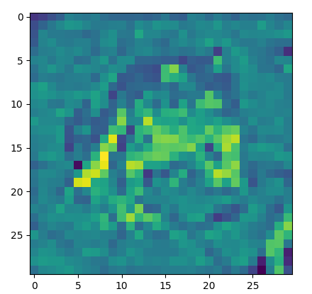
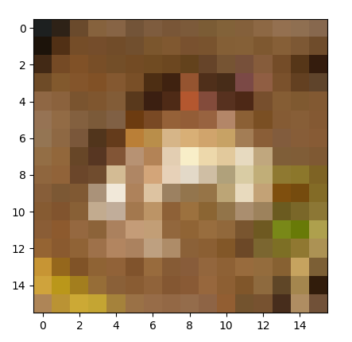

# Project 2301: Convolutions and Pooling
----


## Resources

**Read or watch**:

* [Image Kernels](https://setosa.io/ev/image-kernels/)
* [Undrestanding Convolutional Layers](https://github.com/Machinelearninguru/Image-Processing-Computer-Vision/blob/master/Convolutional%20Neural%20Network/Convolutional%20Layers/README.md)
* [A Comprehensive Guide to Convolutional Neural Networks — the ELI5 way](https://medium.com/towards-data-science/a-comprehensive-guide-to-convolutional-neural-networks-the-eli5-way-3bd2b1164a53)
* [What is max pooling in convolutional neural networks?](https://www.quora.com/What-is-max-pooling-in-convolutional-neural-networks)
* [Edge Detection Examples](https://www.youtube.com/watch?v=XuD4C8vJzEQ&list=PLkDaE6sCZn6Gl29AoE31iwdVwSG-KnDzF&index=2)
* [Padding](https://www.youtube.com/watch?v=smHa2442Ah4&list=PLkDaE6sCZn6Gl29AoE31iwdVwSG-KnDzF&index=4)
* [Strided Convolutions](https://www.youtube.com/watch?v=tQYZaDn_kSg&list=PLkDaE6sCZn6Gl29AoE31iwdVwSG-KnDzF&index=5)
* [Convolutions over Volumes](https://www.youtube.com/watch?v=KTB_OFoAQcc&index=6&list=PLkDaE6sCZn6Gl29AoE31iwdVwSG-KnDzF)
* [Pooling Layers](https://www.youtube.com/watch?v=8oOgPUO-TBY&index=9&list=PLkDaE6sCZn6Gl29AoE31iwdVwSG-KnDzF)

**Definitions to skim:**

* [Convolution](https://en.wikipedia.org/wiki/Convolution)
* [Kernel (image processing)](https://en.wikipedia.org/wiki/Kernel_(image_processing))

**References:**

* [numpy.pad](https://numpy.org/doc/stable/reference/generated/numpy.pad.html)
* [A guide to convolution arithmetic for deep learning](http://arxiv.org/pdf/1603.07285)
## Learning Objectives

At the end of this project, you are expected to be able to[explain to anyone](https://fs.blog/feynman-learning-technique/),**without the help of Google**:

### General

* What is a convolution?
* What is max pooling? average pooling?
* What is a kernel/filter?
* What is padding?
* What is “same” padding? “valid” padding?
* What is a stride?
* What are channels?
* How to perform a convolution over an image
* How to perform max/average pooling over an image
## Requirements

### General

* Allowed editors:`vi`,`vim`,`emacs`
* All your files will be interpreted/compiled on Ubuntu 20.04 LTS using`python3`(version 3.9)
* Your files will be executed with`numpy`(version 1.25.2)
* All your files should end with a new line
* The first line of all your files should be exactly`#!/usr/bin/env python3`
* A`README.md`file, at the root of the folder of the project, is mandatory
* Your code should use the`pycodestyle`style (version 2.11.1)
* All your modules should have documentation (`python3 -c 'print(__import__("my_module").__doc__)'`)
* All your classes should have documentation (`python3 -c 'print(__import__("my_module").MyClass.__doc__)'`)
* All your functions (inside and outside a class) should have documentation (`python3 -c 'print(__import__("my_module").my_function.__doc__)'`and`python3 -c 'print(__import__("my_module").MyClass.my_function.__doc__)'`)
* Unless otherwise noted, you are not allowed to import any module except`import numpy as np`
* You are not allowed to use`np.convolve`
* All your files must be executable
* The length of your files will be tested using`wc`
## More Info

### Testing

Please download[this dataset](https://s3.eu-west-3.amazonaws.com/hbtn.intranet.project.files/holbertonschool-ml/animals_1.npz)for use in some of the following main files.


----
## Tasks
---
### 0. Valid Convolution

Write a function <!--plain-NL-->`def convolve_grayscale_valid(images, kernel):`<!--inline-NL--> that performs a valid convolution on grayscale images:<!--plain-NL-->

- `images` is a `numpy.ndarray` with shape `(m, h, w)` containing multiple grayscale images


`m` is the number of images
`h` is the height in pixels of the images
`w` is the width in pixels of the images
- `m` is the number of images
- `h` is the height in pixels of the images
- `w` is the width in pixels of the images
- `kernel` is a `numpy.ndarray` with shape `(kh, kw)` containing the kernel for the convolution


`kh` is the height of the kernel
`kw` is the width of the kernel
- `kh` is the height of the kernel
- `kw` is the width of the kernel
- You are only allowed to use two `for` loops; any other loops of any kind are not allowed
- Returns: a `numpy.ndarray` containing the convolved images

- `m` is the number of images
- `h` is the height in pixels of the images
- `w` is the width in pixels of the images

- `kh` is the height of the kernel
- `kw` is the width of the kernel

```
ubuntu@alexa-ml:~/math/convolutions_and_pooling$ cat 0-main.py 
#!/usr/bin/env python3

import matplotlib.pyplot as plt
import numpy as np
convolve_grayscale_valid = __import__('0-convolve_grayscale_valid').convolve_grayscale_valid


if __name__ == '__main__':

    dataset = np.load('MNIST.npz')
    images = dataset['X_train']
    print(images.shape)
    kernel = np.array([[1 ,0, -1], [1, 0, -1], [1, 0, -1]])
    images_conv = convolve_grayscale_valid(images, kernel)
    print(images_conv.shape)

    plt.imshow(images[0], cmap='gray')
    plt.show()
    plt.imshow(images_conv[0], cmap='gray')
    plt.show()
ubuntu@alexa-ml:~/math/convolutions_and_pooling$ ./0-main.py 
(50000, 28, 28)
(50000, 26, 26)

```


**Repo:**

- GitHub repository: `atlas-machine_learning`
- Directory: `math/convolutions_and_pooling`
- File: `0-convolve_grayscale_valid.py`


---
### 1. Same Convolution

Write a function <!--plain-NL-->`def convolve_grayscale_same(images, kernel):`<!--inline-NL--> that performs a same convolution on grayscale images:<!--plain-NL-->

- `images` is a `numpy.ndarray` with shape `(m, h, w)` containing multiple grayscale images


`m` is the number of images
`h` is the height in pixels of the images
`w` is the width in pixels of the images
- `m` is the number of images
- `h` is the height in pixels of the images
- `w` is the width in pixels of the images
- `kernel` is a `numpy.ndarray` with shape `(kh, kw)` containing the kernel for the convolution


`kh` is the height of the kernel
`kw` is the width of the kernel
- `kh` is the height of the kernel
- `kw` is the width of the kernel
- if necessary, the image should be padded with 0’s
- You are only allowed to use two `for` loops; any other loops of any kind are not allowed
- Returns: a `numpy.ndarray` containing the convolved images

- `m` is the number of images
- `h` is the height in pixels of the images
- `w` is the width in pixels of the images

- `kh` is the height of the kernel
- `kw` is the width of the kernel

```
ubuntu@alexa-ml:~/math/convolutions_and_pooling$ cat 1-main.py 
#!/usr/bin/env python3

import matplotlib.pyplot as plt
import numpy as np
convolve_grayscale_same = __import__('1-convolve_grayscale_same').convolve_grayscale_same


if __name__ == '__main__':

    dataset = np.load('MNIST.npz')
    images = dataset['X_train']
    print(images.shape)
    kernel = np.array([[1 ,0, -1], [1, 0, -1], [1, 0, -1]])
    images_conv = convolve_grayscale_same(images, kernel)
    print(images_conv.shape)

    plt.imshow(images[0], cmap='gray')
    plt.show()
    plt.imshow(images_conv[0], cmap='gray')
    plt.show()
ubuntu@alexa-ml:~/math/convolutions_and_pooling$ ./1-main.py 
(50000, 28, 28)
(50000, 28, 28)

```


**Repo:**

- GitHub repository: `atlas-machine_learning`
- Directory: `math/convolutions_and_pooling`
- File: `1-convolve_grayscale_same.py`


---
### 2. Convolution with Padding

Write a function <!--plain-NL-->`def convolve_grayscale_padding(images, kernel, padding):`<!--inline-NL--> that performs a convolution on grayscale images with custom padding:<!--plain-NL-->

- `images` is a `numpy.ndarray` with shape `(m, h, w)` containing multiple grayscale images


`m` is the number of images
`h` is the height in pixels of the images
`w` is the width in pixels of the images
- `m` is the number of images
- `h` is the height in pixels of the images
- `w` is the width in pixels of the images
- `kernel` is a `numpy.ndarray` with shape `(kh, kw)` containing the kernel for the convolution


`kh` is the height of the kernel
`kw` is the width of the kernel
- `kh` is the height of the kernel
- `kw` is the width of the kernel
- `padding` is a tuple of `(ph, pw)`

`ph` is the padding for the height of the image
`pw` is the padding for the width of the image
the image should be padded with 0’s
- `ph` is the padding for the height of the image
- `pw` is the padding for the width of the image
- the image should be padded with 0’s
- You are only allowed to use two `for` loops; any other loops of any kind are not allowed
- Returns: a `numpy.ndarray` containing the convolved images

- `m` is the number of images
- `h` is the height in pixels of the images
- `w` is the width in pixels of the images

- `kh` is the height of the kernel
- `kw` is the width of the kernel

- `ph` is the padding for the height of the image
- `pw` is the padding for the width of the image
- the image should be padded with 0’s

```
ubuntu@alexa-ml:~/math/convolutions_and_pooling$ cat 2-main.py 
#!/usr/bin/env python3

import matplotlib.pyplot as plt
import numpy as np
convolve_grayscale_padding = __import__('2-convolve_grayscale_padding').convolve_grayscale_padding


if __name__ == '__main__':

    dataset = np.load('MNIST.npz')
    images = dataset['X_train']
    print(images.shape)
    kernel = np.array([[1 ,0, -1], [1, 0, -1], [1, 0, -1]])
    images_conv = convolve_grayscale_padding(images, kernel, (2, 4))
    print(images_conv.shape)

    plt.imshow(images[0], cmap='gray')
    plt.show()
    plt.imshow(images_conv[0], cmap='gray')
    plt.show()
ubuntu@alexa-ml:~/math/convolutions_and_pooling$ ./2-main.py 
(50000, 28, 28)
(50000, 30, 34)

```


**Repo:**

- GitHub repository: `atlas-machine_learning`
- Directory: `math/convolutions_and_pooling`
- File: `2-convolve_grayscale_padding.py`


---
### 3. Strided Convolution

Write a function <!--plain-NL-->`def convolve_grayscale(images, kernel, padding='same', stride=(1, 1)):`<!--inline-NL--> that performs a convolution on grayscale images:<!--plain-NL-->

- `images` is a `numpy.ndarray` with shape `(m, h, w)` containing multiple grayscale images


`m` is the number of images
`h` is the height in pixels of the images
`w` is the width in pixels of the images
- `m` is the number of images
- `h` is the height in pixels of the images
- `w` is the width in pixels of the images
- `kernel` is a `numpy.ndarray` with shape `(kh, kw)` containing the kernel for the convolution


`kh` is the height of the kernel
`kw` is the width of the kernel
- `kh` is the height of the kernel
- `kw` is the width of the kernel
- `padding` is either a tuple of `(ph, pw)`, ‘same’, or ‘valid’


if ‘same’, performs a same convolution
if ‘valid’, performs a valid convolution
if a tuple:


`ph` is the padding for the height of the image
`pw` is the padding for the width of the image

the image should be padded with 0’s
- if ‘same’, performs a same convolution
- if ‘valid’, performs a valid convolution
- if a tuple:


`ph` is the padding for the height of the image
`pw` is the padding for the width of the image
- `ph` is the padding for the height of the image
- `pw` is the padding for the width of the image
- the image should be padded with 0’s
- `stride` is a tuple of `(sh, sw)`

`sh` is the stride for the height of the image
`sw` is the stride for the width of the image
- `sh` is the stride for the height of the image
- `sw` is the stride for the width of the image
- You are only allowed to use two `for` loops; any other loops of any kind are not allowed *Hint: loop over `i` and `j`*
- Returns: a `numpy.ndarray` containing the convolved images

- `m` is the number of images
- `h` is the height in pixels of the images
- `w` is the width in pixels of the images

- `kh` is the height of the kernel
- `kw` is the width of the kernel

- if ‘same’, performs a same convolution
- if ‘valid’, performs a valid convolution
- if a tuple:


`ph` is the padding for the height of the image
`pw` is the padding for the width of the image
- `ph` is the padding for the height of the image
- `pw` is the padding for the width of the image
- the image should be padded with 0’s

- `ph` is the padding for the height of the image
- `pw` is the padding for the width of the image

- `sh` is the stride for the height of the image
- `sw` is the stride for the width of the image

```
ubuntu@alexa-ml:~/math/convolutions_and_pooling$ cat 3-main.py 
#!/usr/bin/env python3

import matplotlib.pyplot as plt
import numpy as np
convolve_grayscale = __import__('3-convolve_grayscale').convolve_grayscale


if __name__ == '__main__':

    dataset = np.load('MNIST.npz')
    images = dataset['X_train']
    print(images.shape)
    kernel = np.array([[1 ,0, -1], [1, 0, -1], [1, 0, -1]])
    images_conv = convolve_grayscale(images, kernel, padding='valid', stride=(2, 2))
    print(images_conv.shape)

    plt.imshow(images[0], cmap='gray')
    plt.show()
    plt.imshow(images_conv[0], cmap='gray')
    plt.show()
ubuntu@alexa-ml:~/math/convolutions_and_pooling$ ./3-main.py 
(50000, 28, 28)
(50000, 13, 13)

```


**Repo:**

- GitHub repository: `atlas-machine_learning`
- Directory: `math/convolutions_and_pooling`
- File: `3-convolve_grayscale.py`


---
### 4. Convolution with Channels

Write a function <!--plain-NL-->`def convolve_channels(images, kernel, padding='same', stride=(1, 1)):`<!--inline-NL--> that performs a convolution on images with channels:<!--plain-NL-->

- `images` is a `numpy.ndarray` with shape `(m, h, w, c)` containing multiple images


`m` is the number of images
`h` is the height in pixels of the images
`w` is the width in pixels of the images
`c` is the number of channels in the image
- `m` is the number of images
- `h` is the height in pixels of the images
- `w` is the width in pixels of the images
- `c` is the number of channels in the image
- `kernel` is a `numpy.ndarray` with shape `(kh, kw, c)` containing the kernel for the convolution


`kh` is the height of the kernel
`kw` is the width of the kernel
- `kh` is the height of the kernel
- `kw` is the width of the kernel
- `padding` is either a tuple of `(ph, pw)`, ‘same’, or ‘valid’


if ‘same’, performs a same convolution
if ‘valid’, performs a valid convolution
if a tuple:


`ph` is the padding for the height of the image
`pw` is the padding for the width of the image

the image should be padded with 0’s
- if ‘same’, performs a same convolution
- if ‘valid’, performs a valid convolution
- if a tuple:


`ph` is the padding for the height of the image
`pw` is the padding for the width of the image
- `ph` is the padding for the height of the image
- `pw` is the padding for the width of the image
- the image should be padded with 0’s
- `stride` is a tuple of `(sh, sw)`

`sh` is the stride for the height of the image
`sw` is the stride for the width of the image
- `sh` is the stride for the height of the image
- `sw` is the stride for the width of the image
- You are only allowed to use two `for` loops; any other loops of any kind are not allowed
- Returns: a `numpy.ndarray` containing the convolved images

- `m` is the number of images
- `h` is the height in pixels of the images
- `w` is the width in pixels of the images
- `c` is the number of channels in the image

- `kh` is the height of the kernel
- `kw` is the width of the kernel

- if ‘same’, performs a same convolution
- if ‘valid’, performs a valid convolution
- if a tuple:


`ph` is the padding for the height of the image
`pw` is the padding for the width of the image
- `ph` is the padding for the height of the image
- `pw` is the padding for the width of the image
- the image should be padded with 0’s

- `ph` is the padding for the height of the image
- `pw` is the padding for the width of the image

- `sh` is the stride for the height of the image
- `sw` is the stride for the width of the image

```
ubuntu@alexa-ml:~/math/convolutions_and_pooling$ cat 4-main.py 
#!/usr/bin/env python3

import matplotlib.pyplot as plt
import numpy as np
convolve_channels = __import__('4-convolve_channels').convolve_channels


if __name__ == '__main__':

    dataset = np.load('animals_1.npz')
    images = dataset['data']
    print(images.shape)
    kernel = np.array([[[0, 0, 0], [-1, -1, -1], [0, 0, 0]], [[-1, -1, -1], [5, 5, 5], [-1, -1, -1]], [[0, 0, 0], [-1, -1, -1], [0, 0, 0]]])
    images_conv = convolve_channels(images, kernel, padding='valid')
    print(images_conv.shape)

    plt.imshow(images[0])
    plt.show()
    plt.imshow(images_conv[0])
    plt.show()
ubuntu@alexa-ml:~/math/convolutions_and_pooling$ ./4-main.py 
(10000, 32, 32, 3)
(10000, 30, 30)

```


**Repo:**

- GitHub repository: `atlas-machine_learning`
- Directory: `math/convolutions_and_pooling`
- File: `4-convolve_channels.py`


---
### 5. Multiple Kernels

Write a function <!--plain-NL-->`def convolve(images, kernels, padding='same', stride=(1, 1)):`<!--inline-NL--> that performs a convolution on images using multiple kernels:<!--plain-NL-->

- `images` is a `numpy.ndarray` with shape `(m, h, w, c)` containing multiple images


`m` is the number of images
`h` is the height in pixels of the images
`w` is the width in pixels of the images
`c` is the number of channels in the image
- `m` is the number of images
- `h` is the height in pixels of the images
- `w` is the width in pixels of the images
- `c` is the number of channels in the image
- `kernels` is a `numpy.ndarray` with shape `(kh, kw, c, nc)` containing the kernels for the convolution


`kh` is the height of a kernel
`kw` is the width of a kernel
`nc` is the number of kernels
- `kh` is the height of a kernel
- `kw` is the width of a kernel
- `nc` is the number of kernels
- `padding` is either a tuple of `(ph, pw)`, ‘same’, or ‘valid’


if ‘same’, performs a same convolution
if ‘valid’, performs a valid convolution
if a tuple:


`ph` is the padding for the height of the image
`pw` is the padding for the width of the image

the image should be padded with 0’s
- if ‘same’, performs a same convolution
- if ‘valid’, performs a valid convolution
- if a tuple:


`ph` is the padding for the height of the image
`pw` is the padding for the width of the image
- `ph` is the padding for the height of the image
- `pw` is the padding for the width of the image
- the image should be padded with 0’s
- `stride` is a tuple of `(sh, sw)`

`sh` is the stride for the height of the image
`sw` is the stride for the width of the image
- `sh` is the stride for the height of the image
- `sw` is the stride for the width of the image
- You are only allowed to use three `for` loops; any other loops of any kind are not allowed
- Returns: a `numpy.ndarray` containing the convolved images

- `m` is the number of images
- `h` is the height in pixels of the images
- `w` is the width in pixels of the images
- `c` is the number of channels in the image

- `kh` is the height of a kernel
- `kw` is the width of a kernel
- `nc` is the number of kernels

- if ‘same’, performs a same convolution
- if ‘valid’, performs a valid convolution
- if a tuple:


`ph` is the padding for the height of the image
`pw` is the padding for the width of the image
- `ph` is the padding for the height of the image
- `pw` is the padding for the width of the image
- the image should be padded with 0’s

- `ph` is the padding for the height of the image
- `pw` is the padding for the width of the image

- `sh` is the stride for the height of the image
- `sw` is the stride for the width of the image

```
ubuntu@alexa-ml:~/math/convolutions_and_pooling$ cat 5-main.py 
#!/usr/bin/env python3

import matplotlib.pyplot as plt
import numpy as np
convolve = __import__('5-convolve').convolve


if __name__ == '__main__':

    dataset = np.load('animals_1.npz')
    images = dataset['data']
    print(images.shape)
    kernels = np.array([[[[0, 1, 1], [0, 1, 1], [0, 1, 1]], [[-1, 0, 1], [-1, 0, 1], [-1, 0, 1]], [[0, -1, 1], [0, -1, 1], [0, -1, 1]]],
                       [[[-1, 1, 0], [-1, 1, 0], [-1, 1, 0]], [[5, 0, 0], [5, 0, 0], [5, 0, 0]], [[-1, -1, 0], [-1, -1, 0], [-1, -1, 0]]],
                       [[[0, 1, -1], [0, 1, -1], [0, 1, -1]], [[-1, 0, -1], [-1, 0, -1], [-1, 0, -1]], [[0, -1, -1], [0, -1, -1], [0, -1, -1]]]])

    images_conv = convolve(images, kernels, padding='valid')
    print(images_conv.shape)

    plt.imshow(images[0])
    plt.show()
    plt.imshow(images_conv[0, :, :, 0])
    plt.show()
    plt.imshow(images_conv[0, :, :, 1])
    plt.show()
    plt.imshow(images_conv[0, :, :, 2])
    plt.show()
ubuntu@alexa-ml:~/math/convolutions_and_pooling$ ./5-main.py 
(10000, 32, 32, 3)
(10000, 30, 30, 3)

```





**Repo:**

- GitHub repository: `atlas-machine_learning`
- Directory: `math/convolutions_and_pooling`
- File: `5-convolve.py`


---
### 6. Pooling

Write a function <!--plain-NL-->`def pool(images, kernel_shape, stride, mode='max'):`<!--inline-NL--> that performs pooling on images:<!--plain-NL-->

- `images` is a `numpy.ndarray` with shape `(m, h, w, c)` containing multiple images


`m` is the number of images
`h` is the height in pixels of the images
`w` is the width in pixels of the images
`c` is the number of channels in the image
- `m` is the number of images
- `h` is the height in pixels of the images
- `w` is the width in pixels of the images
- `c` is the number of channels in the image
- `kernel_shape` is a tuple of `(kh, kw)` containing the kernel shape for the pooling


`kh` is the height of the kernel
`kw` is the width of the kernel
- `kh` is the height of the kernel
- `kw` is the width of the kernel
- `stride` is a tuple of `(sh, sw)`

`sh` is the stride for the height of the image
`sw` is the stride for the width of the image
- `sh` is the stride for the height of the image
- `sw` is the stride for the width of the image
- `mode` indicates the type of pooling


`max` indicates max pooling
`avg` indicates average pooling
- `max` indicates max pooling
- `avg` indicates average pooling
- You are only allowed to use two `for` loops; any other loops of any kind are not allowed
- Returns: a `numpy.ndarray` containing the pooled images

- `m` is the number of images
- `h` is the height in pixels of the images
- `w` is the width in pixels of the images
- `c` is the number of channels in the image

- `kh` is the height of the kernel
- `kw` is the width of the kernel

- `sh` is the stride for the height of the image
- `sw` is the stride for the width of the image

- `max` indicates max pooling
- `avg` indicates average pooling

```
ubuntu@alexa-ml:~/math/convolutions_and_pooling$ cat 6-main.py 
#!/usr/bin/env python3

import matplotlib.pyplot as plt
import numpy as np
pool = __import__('6-pool').pool


if __name__ == '__main__':

    dataset = np.load('animals_1.npz')
    images = dataset['data']
    print(images.shape)
    images_pool = pool(images, (2, 2), (2, 2), mode='avg')
    print(images_pool.shape)

    plt.imshow(images[0])
    plt.show()
    plt.imshow(images_pool[0] / 255)
    plt.show()
ubuntu@alexa-ml:~/math/convolutions_and_pooling$ ./6-main.py 
(10000, 32, 32, 3)
(10000, 16, 16, 3)

```




**Repo:**

- GitHub repository: `atlas-machine_learning`
- Directory: `math/convolutions_and_pooling`
- File: `6-pool.py`