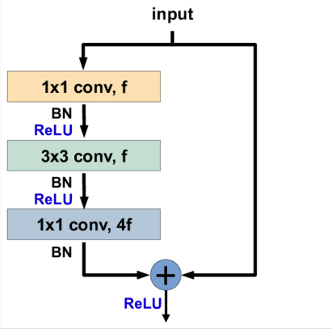
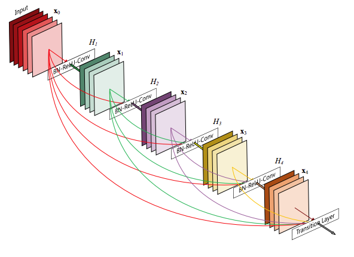

# Project 2305: Deep Convolutional Architectures
----


## Resources

**Read or watch**:

* [Vanishing Gradient Problem](https://en.wikipedia.org/wiki/Vanishing_gradient_problem)
* [1x1 Convolutions](https://www.youtube.com/watch?reload=9&v=SIpcirNNGAk)
* [What does 1x1 convolution mean in a neural network?](https://stats.stackexchange.com/questions/194142/what-does-1x1-convolution-mean-in-a-neural-network)
* [GoogLeNet Tutorial](https://www.youtube.com/watch?v=_XF7N6rp9Jw)
* [Review: GoogLeNet (Inception v1)— Winner of ILSVRC 2014 (Image Classification)](https://medium.com/coinmonks/paper-review-of-googlenet-inception-v1-winner-of-ilsvlc-2014-image-classification-c2b3565a64e7)
* [Residual Neural Network](https://en.wikipedia.org/wiki/Residual_neural_network)
* [An Overview of ResNet and its Variants](https://stephanosterburg.gitbook.io/scrapbook/coding/intro-to-tensorflow-for-ai-ml-and-dl/an-overview-of-resnet-and-its-variants)
* [Review: ResNet — Winner of ILSVRC 2015 (Image Classification, Localization, Detection)](https://medium.com/towards-data-science/review-resnet-winner-of-ilsvrc-2015-image-classification-localization-detection-e39402bfa5d8)
* [Deep Residual Learning for Image Recognition](https://www.youtube.com/watch?v=C6tLw-rPQ2o)
* [Review: ResNeXt — 1st Runner Up in ILSVRC 2016 (Image Classification)](https://medium.com/towards-data-science/review-resnext-1st-runner-up-of-ilsvrc-2016-image-classification-15d7f17b42ac)
* [Review: DenseNet — Dense Convolutional Network (Image Classification)](https://medium.com/towards-data-science/review-densenet-image-classification-b6631a8ef803)
* [Densely Connected Convolutional Networks](https://www.youtube.com/watch?v=-W6y8xnd--U)
* [Network In Network](https://www.youtube.com/watch?v=c1RBQzKsDCk&list=PLkDaE6sCZn6Gl29AoE31iwdVwSG-KnDzF&index=16)(*Note: I suggest watching this video at 1.5x - 2x speed*)
* [Inception Network Motivation](https://www.youtube.com/watch?v=C86ZXvgpejM&list=PLkDaE6sCZn6Gl29AoE31iwdVwSG-KnDzF&index=17)(*Note: I suggest watching this video at 1.5x - 2x speed*)
* [Inception Network](https://www.youtube.com/watch?v=KfV8CJh7hE0&list=PLkDaE6sCZn6Gl29AoE31iwdVwSG-KnDzF&index=18)(*Note: I suggest watching this video at 1.5x - 2x speed*)
* [Resnets](https://www.youtube.com/watch?v=ZILIbUvp5lk&list=PLkDaE6sCZn6Gl29AoE31iwdVwSG-KnDzF&index=14)(*Note: I suggest watching this video at 1.5x - 2x speed*)
* [Why ResNets Work](https://www.youtube.com/watch?v=RYth6EbBUqM&list=PLkDaE6sCZn6Gl29AoE31iwdVwSG-KnDzF&index=15)(*Note: I suggest watching this video at 1.5x - 2x speed*)
* [Network in Network (2014)](http://arxiv.org/pdf/1312.4400)
* [Going Deeper with Convolutions (2014)](http://arxiv.org/pdf/1409.4842)
* [Highway Networks (2015)](http://arxiv.org/pdf/1505.00387)
* [Deep Residual Learning for Image Recognition (2015)](http://arxiv.org/pdf/1512.03385)
* [Aggregated Residual Transformations for Deep Neural Networks (2017)](http://arxiv.org/pdf/1611.05431)
* [Densely Connected Convolutional Networks (2018)](http://arxiv.org/pdf/1608.06993)
* [Multi-Scale Dense Networks for Resource Efficient Image Classification (2018)](http://arxiv.org/pdf/1703.09844)
## Learning Objectives

At the end of this project, you are expected to be able to[explain to anyone](https://fs.blog/feynman-learning-technique/),**without the help of Google**:

### General

* What is a skip connection?
* What is a bottleneck layer?
* What is the Inception Network?
* What is ResNet? ResNeXt? DenseNet?
* How to replicate a network architecture by reading a journal article
## Requirements

### General

* Allowed editors:`vi`,`vim`,`emacs`
* All your files will be interpreted/compiled on Ubuntu 20.04 LTS using`python3`(version 3.9)
* Your files will be executed with`numpy`(version 1.25.2) and`tensorflow`(version 2.15)
* All your files should end with a new line
* The first line of all your files should be exactly`#!/usr/bin/env python3`
* A`README.md`file, at the root of the folder of the project, is mandatory
* Your code should use the`pycodestyle`style (version 2.11.1)
* All your modules should have documentation (`python3 -c 'print(__import__("my_module").__doc__)'`)
* All your classes should have documentation (`python3 -c 'print(__import__("my_module").MyClass.__doc__)'`)
* All your functions (inside and outside a class) should have documentation (`python3 -c 'print(__import__("my_module").my_function.__doc__)'`and`python3 -c 'print(__import__("my_module").MyClass.my_function.__doc__)'`)
* Unless otherwise noted, you are not allowed to import any module except`from tensorflow import keras as K`
* All your files must be executable
* The length of your files will be tested using`wc`

----
## Tasks
---
### 0. Inception Block


Write a function <!--plain-->`def inception_block(A_prev, filters):`<!--inline--> that builds an inception block as described in <!--plain-->[Going Deeper with Convolutions (2014)](http://arxiv.org/pdf/1409.4842) <!--link-->:<!--plain-->

- `A_prev` is the output from the previous layer
- `filters` is a tuple or list containing `F1`, `F3R`, `F3`,`F5R`, `F5`, `FPP`, respectively:


`F1` is the number of filters in the 1x1 convolution
`F3R` is the number of filters in the 1x1 convolution before the 3x3 convolution
`F3` is the number of filters in the 3x3 convolution
`F5R` is the number of filters in the 1x1 convolution before the 5x5 convolution
`F5` is the number of filters in the 5x5 convolution
`FPP` is the number of filters in the 1x1 convolution after the max pooling
- `F1` is the number of filters in the 1x1 convolution
- `F3R` is the number of filters in the 1x1 convolution before the 3x3 convolution
- `F3` is the number of filters in the 3x3 convolution
- `F5R` is the number of filters in the 1x1 convolution before the 5x5 convolution
- `F5` is the number of filters in the 5x5 convolution
- `FPP` is the number of filters in the 1x1 convolution after the max pooling
- All convolutions inside the inception block should use a rectified linear activation (ReLU)
- Returns: the concatenated output of the inception block

- `F1` is the number of filters in the 1x1 convolution
- `F3R` is the number of filters in the 1x1 convolution before the 3x3 convolution
- `F3` is the number of filters in the 3x3 convolution
- `F5R` is the number of filters in the 1x1 convolution before the 5x5 convolution
- `F5` is the number of filters in the 5x5 convolution
- `FPP` is the number of filters in the 1x1 convolution after the max pooling

```
ubuntu@alexa-ml:~/supervised_learning/deep_cnns$ cat 0-main.py 
#!/usr/bin/env python3

from tensorflow import keras as K
inception_block = __import__('0-inception_block').inception_block

if __name__ == '__main__':
    X = K.Input(shape=(224, 224, 3))
    Y = inception_block(X, [64, 96, 128, 16, 32, 32])
    model = K.models.Model(inputs=X, outputs=Y)
    model.summary()
ubuntu@alexa-ml:~/supervised_learning/deep_cnns$ ./0-main.py 
Model: "model"
__________________________________________________________________________________________________
 Layer (type)                Output Shape                 Param #   Connected to
==================================================================================================
 input_1 (InputLayer)        [(None, 224, 224, 3)]        0         []

 conv2d_1 (Conv2D)           (None, 224, 224, 96)         384       ['input_1[0][0]']

 conv2d_3 (Conv2D)           (None, 224, 224, 16)         64        ['input_1[0][0]']

 max_pooling2d (MaxPooling2  (None, 224, 224, 3)          0         ['input_1[0][0]']
 D)

 conv2d (Conv2D)             (None, 224, 224, 64)         256       ['input_1[0][0]']

 conv2d_2 (Conv2D)           (None, 224, 224, 128)        110720    ['conv2d_1[0][0]']

 conv2d_4 (Conv2D)           (None, 224, 224, 32)         12832     ['conv2d_3[0][0]']

 conv2d_5 (Conv2D)           (None, 224, 224, 32)         128       ['max_pooling2d[0][0]']

 concatenate (Concatenate)   (None, 224, 224, 256)        0         ['conv2d[0][0]',
                                                                     'conv2d_2[0][0]',
                                                                     'conv2d_4[0][0]',
                                                                     'conv2d_5[0][0]']

==================================================================================================
Total params: 124384 (485.88 KB)
Trainable params: 124384 (485.88 KB)
Non-trainable params: 0 (0.00 Byte)
__________________________________________________________________________________________________
ubuntu@alexa-ml:~/supervised_learning/deep_cnns$

```

**Repo:**

- GitHub repository: `atlas-machine_learning`
- Directory: `supervised_learning/deep_cnns`
- File: `0-inception_block.py`


---
### 1. Inception Network

Write a function <!--plain-->`def inception_network():`<!--inline--> that builds the inception network as described in <!--plain-->[Going Deeper with Convolutions (2014)](http://arxiv.org/pdf/1409.4842) <!--link-->:<!--plain-->

- You can assume the input data will have shape (224, 224, 3)
- All convolutions inside and outside the inception block should use a rectified linear activation (ReLU)
- You may use `inception_block = __import__('0-inception_block').inception_block`
- Returns: the keras model


```
ubuntu@alexa-ml:~/supervised_learning/deep_cnns$ cat 1-main.py 
#!/usr/bin/env python3

from tensorflow import keras as K

inception_network = __import__('1-inception_network').inception_network

if __name__ == '__main__':
    model = inception_network()
    model.summary()
ubuntu@alexa-ml:~/supervised_learning/deep_cnns$ ./1-main.py 
Model: "model"
__________________________________________________________________________________________________
 Layer (type)                Output Shape                 Param #   Connected to                  
==================================================================================================
 input_1 (InputLayer)        [(None, 224, 224, 3)]        0         []                            

 conv2d (Conv2D)             (None, 112, 112, 64)         9472      ['input_1[0][0]']             

 max_pooling2d (MaxPooling2  (None, 56, 56, 64)           0         ['conv2d[0][0]']              
 D)                                                                                               

 conv2d_1 (Conv2D)           (None, 56, 56, 64)           4160      ['max_pooling2d[0][0]']       

 conv2d_2 (Conv2D)           (None, 56, 56, 192)          110784    ['conv2d_1[0][0]']            

 max_pooling2d_1 (MaxPoolin  (None, 28, 28, 192)          0         ['conv2d_2[0][0]']            
 g2D)                                                                                             

 conv2d_4 (Conv2D)           (None, 28, 28, 96)           18528     ['max_pooling2d_1[0][0]']     

 conv2d_6 (Conv2D)           (None, 28, 28, 16)           3088      ['max_pooling2d_1[0][0]']     

 max_pooling2d_2 (MaxPoolin  (None, 28, 28, 192)          0         ['max_pooling2d_1[0][0]']     
 g2D)                                                                                             

 conv2d_3 (Conv2D)           (None, 28, 28, 64)           12352     ['max_pooling2d_1[0][0]']     

 conv2d_5 (Conv2D)           (None, 28, 28, 128)          110720    ['conv2d_4[0][0]']            

 conv2d_7 (Conv2D)           (None, 28, 28, 32)           12832     ['conv2d_6[0][0]']            

 conv2d_8 (Conv2D)           (None, 28, 28, 32)           6176      ['max_pooling2d_2[0][0]']     

 concatenate (Concatenate)   (None, 28, 28, 256)          0         ['conv2d_3[0][0]',            
                                                                     'conv2d_5[0][0]',            
                                                                     'conv2d_7[0][0]',            
                                                                     'conv2d_8[0][0]']            

 conv2d_10 (Conv2D)          (None, 28, 28, 128)          32896     ['concatenate[0][0]']         

 conv2d_12 (Conv2D)          (None, 28, 28, 32)           8224      ['concatenate[0][0]']         

 max_pooling2d_3 (MaxPoolin  (None, 28, 28, 256)          0         ['concatenate[0][0]']         
 g2D)                                                                                             

 conv2d_9 (Conv2D)           (None, 28, 28, 128)          32896     ['concatenate[0][0]']         

 conv2d_11 (Conv2D)          (None, 28, 28, 192)          221376    ['conv2d_10[0][0]']           

 conv2d_13 (Conv2D)          (None, 28, 28, 96)           76896     ['conv2d_12[0][0]']           

 conv2d_14 (Conv2D)          (None, 28, 28, 64)           16448     ['max_pooling2d_3[0][0]']     

 concatenate_1 (Concatenate  (None, 28, 28, 480)          0         ['conv2d_9[0][0]',            
 )                                                                   'conv2d_11[0][0]',           
                                                                     'conv2d_13[0][0]',           
                                                                     'conv2d_14[0][0]']           

 max_pooling2d_4 (MaxPoolin  (None, 14, 14, 480)          0         ['concatenate_1[0][0]']       
 g2D)                                                                                             

 conv2d_16 (Conv2D)          (None, 14, 14, 96)           46176     ['max_pooling2d_4[0][0]']     

 conv2d_18 (Conv2D)          (None, 14, 14, 16)           7696      ['max_pooling2d_4[0][0]']     

 max_pooling2d_5 (MaxPoolin  (None, 14, 14, 480)          0         ['max_pooling2d_4[0][0]']     
 g2D)                                                                                             

 conv2d_15 (Conv2D)          (None, 14, 14, 192)          92352     ['max_pooling2d_4[0][0]']     

 conv2d_17 (Conv2D)          (None, 14, 14, 208)          179920    ['conv2d_16[0][0]']           

 conv2d_19 (Conv2D)          (None, 14, 14, 48)           19248     ['conv2d_18[0][0]']           

 conv2d_20 (Conv2D)          (None, 14, 14, 64)           30784     ['max_pooling2d_5[0][0]']     

 concatenate_2 (Concatenate  (None, 14, 14, 512)          0         ['conv2d_15[0][0]',           
 )                                                                   'conv2d_17[0][0]',           
                                                                     'conv2d_19[0][0]',           
                                                                     'conv2d_20[0][0]']           

 conv2d_22 (Conv2D)          (None, 14, 14, 112)          57456     ['concatenate_2[0][0]']       

 conv2d_24 (Conv2D)          (None, 14, 14, 24)           12312     ['concatenate_2[0][0]']       

 max_pooling2d_6 (MaxPoolin  (None, 14, 14, 512)          0         ['concatenate_2[0][0]']       
 g2D)                                                                                             

 conv2d_21 (Conv2D)          (None, 14, 14, 160)          82080     ['concatenate_2[0][0]']       

 conv2d_23 (Conv2D)          (None, 14, 14, 224)          226016    ['conv2d_22[0][0]']           

 conv2d_25 (Conv2D)          (None, 14, 14, 64)           38464     ['conv2d_24[0][0]']           

 conv2d_26 (Conv2D)          (None, 14, 14, 64)           32832     ['max_pooling2d_6[0][0]']     

 concatenate_3 (Concatenate  (None, 14, 14, 512)          0         ['conv2d_21[0][0]',           
 )                                                                   'conv2d_23[0][0]',           
                                                                     'conv2d_25[0][0]',           
                                                                     'conv2d_26[0][0]']           

 conv2d_28 (Conv2D)          (None, 14, 14, 128)          65664     ['concatenate_3[0][0]']       

 conv2d_30 (Conv2D)          (None, 14, 14, 24)           12312     ['concatenate_3[0][0]']       

 max_pooling2d_7 (MaxPoolin  (None, 14, 14, 512)          0         ['concatenate_3[0][0]']       
 g2D)                                                                                             

 conv2d_27 (Conv2D)          (None, 14, 14, 128)          65664     ['concatenate_3[0][0]']       

 conv2d_29 (Conv2D)          (None, 14, 14, 256)          295168    ['conv2d_28[0][0]']           

 conv2d_31 (Conv2D)          (None, 14, 14, 64)           38464     ['conv2d_30[0][0]']           

 conv2d_32 (Conv2D)          (None, 14, 14, 64)           32832     ['max_pooling2d_7[0][0]']     

 concatenate_4 (Concatenate  (None, 14, 14, 512)          0         ['conv2d_27[0][0]',           
 )                                                                   'conv2d_29[0][0]',           
                                                                     'conv2d_31[0][0]',           
                                                                     'conv2d_32[0][0]']           

 conv2d_34 (Conv2D)          (None, 14, 14, 144)          73872     ['concatenate_4[0][0]']       

 conv2d_36 (Conv2D)          (None, 14, 14, 32)           16416     ['concatenate_4[0][0]']       

 max_pooling2d_8 (MaxPoolin  (None, 14, 14, 512)          0         ['concatenate_4[0][0]']       
 g2D)                                                                                             

 conv2d_33 (Conv2D)          (None, 14, 14, 112)          57456     ['concatenate_4[0][0]']       

 conv2d_35 (Conv2D)          (None, 14, 14, 288)          373536    ['conv2d_34[0][0]']           

 conv2d_37 (Conv2D)          (None, 14, 14, 64)           51264     ['conv2d_36[0][0]']           

 conv2d_38 (Conv2D)          (None, 14, 14, 64)           32832     ['max_pooling2d_8[0][0]']     

 concatenate_5 (Concatenate  (None, 14, 14, 528)          0         ['conv2d_33[0][0]',           
 )                                                                   'conv2d_35[0][0]',           
                                                                     'conv2d_37[0][0]',           
                                                                     'conv2d_38[0][0]']           

 conv2d_40 (Conv2D)          (None, 14, 14, 160)          84640     ['concatenate_5[0][0]']       

 conv2d_42 (Conv2D)          (None, 14, 14, 32)           16928     ['concatenate_5[0][0]']       

 max_pooling2d_9 (MaxPoolin  (None, 14, 14, 528)          0         ['concatenate_5[0][0]']       
 g2D)                                                                                             

 conv2d_39 (Conv2D)          (None, 14, 14, 256)          135424    ['concatenate_5[0][0]']       

 conv2d_41 (Conv2D)          (None, 14, 14, 320)          461120    ['conv2d_40[0][0]']           

 conv2d_43 (Conv2D)          (None, 14, 14, 128)          102528    ['conv2d_42[0][0]']           

 conv2d_44 (Conv2D)          (None, 14, 14, 128)          67712     ['max_pooling2d_9[0][0]']     

 concatenate_6 (Concatenate  (None, 14, 14, 832)          0         ['conv2d_39[0][0]',           
 )                                                                   'conv2d_41[0][0]',           
                                                                     'conv2d_43[0][0]',           
                                                                     'conv2d_44[0][0]']           

 max_pooling2d_10 (MaxPooli  (None, 7, 7, 832)            0         ['concatenate_6[0][0]']       
 ng2D)                                                                                            

 conv2d_46 (Conv2D)          (None, 7, 7, 160)            133280    ['max_pooling2d_10[0][0]']    

 conv2d_48 (Conv2D)          (None, 7, 7, 32)             26656     ['max_pooling2d_10[0][0]']    

 max_pooling2d_11 (MaxPooli  (None, 7, 7, 832)            0         ['max_pooling2d_10[0][0]']    
 ng2D)                                                                                            

 conv2d_45 (Conv2D)          (None, 7, 7, 256)            213248    ['max_pooling2d_10[0][0]']    

 conv2d_47 (Conv2D)          (None, 7, 7, 320)            461120    ['conv2d_46[0][0]']           

 conv2d_49 (Conv2D)          (None, 7, 7, 128)            102528    ['conv2d_48[0][0]']           

 conv2d_50 (Conv2D)          (None, 7, 7, 128)            106624    ['max_pooling2d_11[0][0]']    

 concatenate_7 (Concatenate  (None, 7, 7, 832)            0         ['conv2d_45[0][0]',           
 )                                                                   'conv2d_47[0][0]',           
                                                                     'conv2d_49[0][0]',           
                                                                     'conv2d_50[0][0]']           

 conv2d_52 (Conv2D)          (None, 7, 7, 192)            159936    ['concatenate_7[0][0]']       

 conv2d_54 (Conv2D)          (None, 7, 7, 48)             39984     ['concatenate_7[0][0]']       

 max_pooling2d_12 (MaxPooli  (None, 7, 7, 832)            0         ['concatenate_7[0][0]']       
 ng2D)                                                                                            

 conv2d_51 (Conv2D)          (None, 7, 7, 384)            319872    ['concatenate_7[0][0]']       

 conv2d_53 (Conv2D)          (None, 7, 7, 384)            663936    ['conv2d_52[0][0]']           

 conv2d_55 (Conv2D)          (None, 7, 7, 128)            153728    ['conv2d_54[0][0]']           

 conv2d_56 (Conv2D)          (None, 7, 7, 128)            106624    ['max_pooling2d_12[0][0]']    

 concatenate_8 (Concatenate  (None, 7, 7, 1024)           0         ['conv2d_51[0][0]',           
 )                                                                   'conv2d_53[0][0]',           
                                                                     'conv2d_55[0][0]',           
                                                                     'conv2d_56[0][0]']           

 average_pooling2d (Average  (None, 1, 1, 1024)           0         ['concatenate_8[0][0]']       
 Pooling2D)                                                                                       

 dropout (Dropout)           (None, 1, 1, 1024)           0         ['average_pooling2d[0][0]']   

 dense (Dense)               (None, 1, 1, 1000)           1025000   ['dropout[0][0]']             

==================================================================================================
Total params: 6998552 (26.70 MB)
Trainable params: 6998552 (26.70 MB)
Non-trainable params: 0 (0.00 Byte)
__________________________________________________________________________________________________
ubuntu@alexa-ml:~/supervised_learning/deep_cnns$

```

**Repo:**

- GitHub repository: `atlas-machine_learning`
- Directory: `supervised_learning/deep_cnns`
- File: `1-inception_network.py`


---
### 2. Identity Block




Write a function <!--plain-->`def identity_block(A_prev, filters):`<!--inline--> that builds an identity block as described in <!--plain-->[Deep Residual Learning for Image Recognition (2015)](http://arxiv.org/pdf/1512.03385) <!--link-->:<!--plain-->

- `A_prev` is the output from the previous layer
- `filters` is a tuple or list containing `F11`, `F3`, `F12`, respectively:


`F11` is the number of filters in the first 1x1 convolution
`F3` is the number of filters in the 3x3 convolution
`F12` is the number of filters in the second 1x1 convolution
- `F11` is the number of filters in the first 1x1 convolution
- `F3` is the number of filters in the 3x3 convolution
- `F12` is the number of filters in the second 1x1 convolution
- All convolutions inside the block should be followed by batch normalization along the channels axis and a rectified linear activation (ReLU), respectively.
- All weights should use he normal initialization
- The `seed` for the `he_normal` initializer should be set to `zero`
- Returns: the activated output of the identity block

- `F11` is the number of filters in the first 1x1 convolution
- `F3` is the number of filters in the 3x3 convolution
- `F12` is the number of filters in the second 1x1 convolution

```
ubuntu@alexa-ml:~/supervised_learning/deep_cnns$ cat 2-main.py 
#!/usr/bin/env python3

from tensorflow import keras as K
identity_block = __import__('2-identity_block').identity_block

if __name__ == '__main__':
    X = K.Input(shape=(224, 224, 256))
    Y = identity_block(X, [64, 64, 256])
    model = K.models.Model(inputs=X, outputs=Y)
    model.summary()
ubuntu@alexa-ml:~/supervised_learning/deep_cnns$ ./2-main.py 
Model: "model"
__________________________________________________________________________________________________
 Layer (type)                Output Shape                 Param #   Connected to                  
==================================================================================================
 input_1 (InputLayer)        [(None, 224, 224, 256)]      0         []                            

 conv2d (Conv2D)             (None, 224, 224, 64)         16448     ['input_1[0][0]']             

 batch_normalization (Batch  (None, 224, 224, 64)         256       ['conv2d[0][0]']              
 Normalization)                                                                                   

 activation (Activation)     (None, 224, 224, 64)         0         ['batch_normalization[0][0]'] 

 conv2d_1 (Conv2D)           (None, 224, 224, 64)         36928     ['activation[0][0]']          

 batch_normalization_1 (Bat  (None, 224, 224, 64)         256       ['conv2d_1[0][0]']            
 chNormalization)                                                                                 

 activation_1 (Activation)   (None, 224, 224, 64)         0         ['batch_normalization_1[0][0]'
                                                                    ]                             

 conv2d_2 (Conv2D)           (None, 224, 224, 256)        16640     ['activation_1[0][0]']        

 batch_normalization_2 (Bat  (None, 224, 224, 256)        1024      ['conv2d_2[0][0]']            
 chNormalization)                                                                                 

 add (Add)                   (None, 224, 224, 256)        0         ['batch_normalization_2[0][0]'
                                                                    , 'input_1[0][0]']            

 activation_2 (Activation)   (None, 224, 224, 256)        0         ['add[0][0]']                 

==================================================================================================
Total params: 71552 (279.50 KB)
Trainable params: 70784 (276.50 KB)
Non-trainable params: 768 (3.00 KB)
__________________________________________________________________________________________________
ubuntu@alexa-ml:~/supervised_learning/deep_cnns$ 

```

**Repo:**

- GitHub repository: `atlas-machine_learning`
- Directory: `supervised_learning/deep_cnns`
- File: `2-identity_block.py`


---
### 3. Projection Block


Write a function <!--plain-->`def projection_block(A_prev, filters, s=2):`<!--inline--> that builds a projection block as described in <!--plain-->[Deep Residual Learning for Image Recognition (2015)](http://arxiv.org/pdf/1512.03385) <!--link-->:<!--plain-->

- `A_prev` is the output from the previous layer
- `filters` is a tuple or list containing `F11`, `F3`, `F12`, respectively:


`F11` is the number of filters in the first 1x1 convolution
`F3` is the number of filters in the 3x3 convolution
`F12` is the number of filters in the second 1x1 convolution as well as the 1x1 convolution in the shortcut connection
- `F11` is the number of filters in the first 1x1 convolution
- `F3` is the number of filters in the 3x3 convolution
- `F12` is the number of filters in the second 1x1 convolution as well as the 1x1 convolution in the shortcut connection
- `s` is the stride of the first convolution in both the main path and the shortcut connection
- All convolutions inside the block should be followed by batch normalization along the channels axis and a rectified linear activation (ReLU), respectively.
- All weights should use he normal initialization
- The `seed` for the `he_normal` initializer should be set to `zero`
- Returns: the activated output of the projection block

- `F11` is the number of filters in the first 1x1 convolution
- `F3` is the number of filters in the 3x3 convolution
- `F12` is the number of filters in the second 1x1 convolution as well as the 1x1 convolution in the shortcut connection

```
ubuntu@alexa-ml:~/supervised_learning/deep_cnns$ cat 3-main.py 
#!/usr/bin/env python3

from tensorflow import keras as K
projection_block = __import__('3-projection_block').projection_block

if __name__ == '__main__':
    X = K.Input(shape=(224, 224, 3))
    Y = projection_block(X, [64, 64, 256])
    model = K.models.Model(inputs=X, outputs=Y)
    model.summary()
ubuntu@alexa-ml:~/supervised_learning/deep_cnns$ ./3-main.py 
Model: "model"
__________________________________________________________________________________________________
 Layer (type)                Output Shape                 Param #   Connected to                  
==================================================================================================
 input_1 (InputLayer)        [(None, 224, 224, 3)]        0         []                            

 conv2d (Conv2D)             (None, 112, 112, 64)         256       ['input_1[0][0]']             

 batch_normalization (Batch  (None, 112, 112, 64)         256       ['conv2d[0][0]']              
 Normalization)                                                                                   

 activation (Activation)     (None, 112, 112, 64)         0         ['batch_normalization[0][0]'] 

 conv2d_1 (Conv2D)           (None, 112, 112, 64)         36928     ['activation[0][0]']          

 batch_normalization_1 (Bat  (None, 112, 112, 64)         256       ['conv2d_1[0][0]']            
 chNormalization)                                                                                 

 activation_1 (Activation)   (None, 112, 112, 64)         0         ['batch_normalization_1[0][0]'
                                                                    ]                             

 conv2d_2 (Conv2D)           (None, 112, 112, 256)        16640     ['activation_1[0][0]']        

 conv2d_3 (Conv2D)           (None, 112, 112, 256)        1024      ['input_1[0][0]']             

 batch_normalization_2 (Bat  (None, 112, 112, 256)        1024      ['conv2d_2[0][0]']            
 chNormalization)                                                                                 

 batch_normalization_3 (Bat  (None, 112, 112, 256)        1024      ['conv2d_3[0][0]']            
 chNormalization)                                                                                 

 add (Add)                   (None, 112, 112, 256)        0         ['batch_normalization_2[0][0]'
                                                                    , 'batch_normalization_3[0][0]
                                                                    ']                            

 activation_2 (Activation)   (None, 112, 112, 256)        0         ['add[0][0]']                 

==================================================================================================
Total params: 57408 (224.25 KB)
Trainable params: 56128 (219.25 KB)
Non-trainable params: 1280 (5.00 KB)
__________________________________________________________________________________________________
ubuntu@alexa-ml:~/supervised_learning/deep_cnns$

```

**Repo:**

- GitHub repository: `atlas-machine_learning`
- Directory: `supervised_learning/deep_cnns`
- File: `3-projection_block.py`


---
### 4. ResNet-50

Write a function <!--plain-->`def resnet50():`<!--inline--> that builds the ResNet-50 architecture as described in <!--plain-->[Deep Residual Learning for Image Recognition (2015)](http://arxiv.org/pdf/1512.03385) <!--link-->:<!--plain-->

- You can assume the input data will have shape (224, 224, 3)
- All convolutions inside and outside the blocks should be followed by batch normalization along the channels axis and a rectified linear activation (ReLU), respectively.
- All weights should use he normal initialization
- The `seed` for the `he_normal` initializer should be set to `zero`
- You may use:


`identity_block = __import__('2-identity_block').identity_block`
`projection_block = __import__('3-projection_block').projection_block`
- `identity_block = __import__('2-identity_block').identity_block`
- `projection_block = __import__('3-projection_block').projection_block`
- Returns: the keras model

- `identity_block = __import__('2-identity_block').identity_block`
- `projection_block = __import__('3-projection_block').projection_block`


```
ubuntu@alexa-ml:~/supervised_learning/deep_cnns$ cat 4-main.py 
#!/usr/bin/env python3

from tensorflow import keras as K
resnet50 = __import__('4-resnet50').resnet50

if __name__ == '__main__':
    model = resnet50()
    model.summary()
ubuntu@alexa-ml:~/supervised_learning/deep_cnns$ ./4-main.py 
Model: "model"
__________________________________________________________________________________________________
 Layer (type)                Output Shape                 Param #   Connected to                  
==================================================================================================
 input_1 (InputLayer)        [(None, 224, 224, 3)]        0         []                            

 conv2d (Conv2D)             (None, 112, 112, 64)         9472      ['input_1[0][0]']             

 batch_normalization (Batch  (None, 112, 112, 64)         256       ['conv2d[0][0]']              
 Normalization)                                                                                   

 activation (Activation)     (None, 112, 112, 64)         0         ['batch_normalization[0][0]'] 

 max_pooling2d (MaxPooling2  (None, 56, 56, 64)           0         ['activation[0][0]']          
 D)                                                                                               

 conv2d_1 (Conv2D)           (None, 56, 56, 64)           4160      ['max_pooling2d[0][0]']       

 batch_normalization_1 (Bat  (None, 56, 56, 64)           256       ['conv2d_1[0][0]']            
 chNormalization)                                                                                 

 activation_1 (Activation)   (None, 56, 56, 64)           0         ['batch_normalization_1[0][0]'
                                                                    ]                             

 conv2d_2 (Conv2D)           (None, 56, 56, 64)           36928     ['activation_1[0][0]']        

 batch_normalization_2 (Bat  (None, 56, 56, 64)           256       ['conv2d_2[0][0]']            
 chNormalization)                                                                                 

 activation_2 (Activation)   (None, 56, 56, 64)           0         ['batch_normalization_2[0][0]'
                                                                    ]                             

 conv2d_3 (Conv2D)           (None, 56, 56, 256)          16640     ['activation_2[0][0]']        

 conv2d_4 (Conv2D)           (None, 56, 56, 256)          16640     ['max_pooling2d[0][0]']       

 batch_normalization_3 (Bat  (None, 56, 56, 256)          1024      ['conv2d_3[0][0]']            
 chNormalization)                                                                                 

 batch_normalization_4 (Bat  (None, 56, 56, 256)          1024      ['conv2d_4[0][0]']            
 chNormalization)                                                                                 

 add (Add)                   (None, 56, 56, 256)          0         ['batch_normalization_3[0][0]'
                                                                    , 'batch_normalization_4[0][0]
                                                                    ']                            

 activation_3 (Activation)   (None, 56, 56, 256)          0         ['add[0][0]']                 

 conv2d_5 (Conv2D)           (None, 56, 56, 64)           16448     ['activation_3[0][0]']        

 batch_normalization_5 (Bat  (None, 56, 56, 64)           256       ['conv2d_5[0][0]']            
 chNormalization)                                                                                 

 activation_4 (Activation)   (None, 56, 56, 64)           0         ['batch_normalization_5[0][0]'
                                                                    ]                             

 conv2d_6 (Conv2D)           (None, 56, 56, 64)           36928     ['activation_4[0][0]']        

 batch_normalization_6 (Bat  (None, 56, 56, 64)           256       ['conv2d_6[0][0]']            
 chNormalization)                                                                                 

 activation_5 (Activation)   (None, 56, 56, 64)           0         ['batch_normalization_6[0][0]'
                                                                    ]                             

 conv2d_7 (Conv2D)           (None, 56, 56, 256)          16640     ['activation_5[0][0]']        

 batch_normalization_7 (Bat  (None, 56, 56, 256)          1024      ['conv2d_7[0][0]']            
 chNormalization)                                                                                 

 add_1 (Add)                 (None, 56, 56, 256)          0         ['batch_normalization_7[0][0]'
                                                                    , 'activation_3[0][0]']       

 activation_6 (Activation)   (None, 56, 56, 256)          0         ['add_1[0][0]']               

 conv2d_8 (Conv2D)           (None, 56, 56, 64)           16448     ['activation_6[0][0]']        

 batch_normalization_8 (Bat  (None, 56, 56, 64)           256       ['conv2d_8[0][0]']            
 chNormalization)                                                                                 

 activation_7 (Activation)   (None, 56, 56, 64)           0         ['batch_normalization_8[0][0]'
                                                                    ]                             

 conv2d_9 (Conv2D)           (None, 56, 56, 64)           36928     ['activation_7[0][0]']        

 batch_normalization_9 (Bat  (None, 56, 56, 64)           256       ['conv2d_9[0][0]']            
 chNormalization)                                                                                 

 activation_8 (Activation)   (None, 56, 56, 64)           0         ['batch_normalization_9[0][0]'
                                                                    ]                             

 conv2d_10 (Conv2D)          (None, 56, 56, 256)          16640     ['activation_8[0][0]']        

 batch_normalization_10 (Ba  (None, 56, 56, 256)          1024      ['conv2d_10[0][0]']           
 tchNormalization)                                                                                

 add_2 (Add)                 (None, 56, 56, 256)          0         ['batch_normalization_10[0][0]
                                                                    ',                            
                                                                     'activation_6[0][0]']        

 activation_9 (Activation)   (None, 56, 56, 256)          0         ['add_2[0][0]']               

 conv2d_11 (Conv2D)          (None, 28, 28, 128)          32896     ['activation_9[0][0]']        

 batch_normalization_11 (Ba  (None, 28, 28, 128)          512       ['conv2d_11[0][0]']           
 tchNormalization)                                                                                

 activation_10 (Activation)  (None, 28, 28, 128)          0         ['batch_normalization_11[0][0]
                                                                    ']                            

 conv2d_12 (Conv2D)          (None, 28, 28, 128)          147584    ['activation_10[0][0]']       

 batch_normalization_12 (Ba  (None, 28, 28, 128)          512       ['conv2d_12[0][0]']           
 tchNormalization)                                                                                

 activation_11 (Activation)  (None, 28, 28, 128)          0         ['batch_normalization_12[0][0]
                                                                    ']                            

 conv2d_13 (Conv2D)          (None, 28, 28, 512)          66048     ['activation_11[0][0]']       

 conv2d_14 (Conv2D)          (None, 28, 28, 512)          131584    ['activation_9[0][0]']        

 batch_normalization_13 (Ba  (None, 28, 28, 512)          2048      ['conv2d_13[0][0]']           
 tchNormalization)                                                                                

 batch_normalization_14 (Ba  (None, 28, 28, 512)          2048      ['conv2d_14[0][0]']           
 tchNormalization)                                                                                

 add_3 (Add)                 (None, 28, 28, 512)          0         ['batch_normalization_13[0][0]
                                                                    ',                            
                                                                     'batch_normalization_14[0][0]
                                                                    ']                            

 activation_12 (Activation)  (None, 28, 28, 512)          0         ['add_3[0][0]']               

 conv2d_15 (Conv2D)          (None, 28, 28, 128)          65664     ['activation_12[0][0]']       

 batch_normalization_15 (Ba  (None, 28, 28, 128)          512       ['conv2d_15[0][0]']           
 tchNormalization)                                                                                

 activation_13 (Activation)  (None, 28, 28, 128)          0         ['batch_normalization_15[0][0]
                                                                    ']                            

 conv2d_16 (Conv2D)          (None, 28, 28, 128)          147584    ['activation_13[0][0]']       

 batch_normalization_16 (Ba  (None, 28, 28, 128)          512       ['conv2d_16[0][0]']           
 tchNormalization)                                                                                

 activation_14 (Activation)  (None, 28, 28, 128)          0         ['batch_normalization_16[0][0]
                                                                    ']                            

 conv2d_17 (Conv2D)          (None, 28, 28, 512)          66048     ['activation_14[0][0]']       

 batch_normalization_17 (Ba  (None, 28, 28, 512)          2048      ['conv2d_17[0][0]']           
 tchNormalization)                                                                                

 add_4 (Add)                 (None, 28, 28, 512)          0         ['batch_normalization_17[0][0]
                                                                    ',                            
                                                                     'activation_12[0][0]']       

 activation_15 (Activation)  (None, 28, 28, 512)          0         ['add_4[0][0]']               

 conv2d_18 (Conv2D)          (None, 28, 28, 128)          65664     ['activation_15[0][0]']       

 batch_normalization_18 (Ba  (None, 28, 28, 128)          512       ['conv2d_18[0][0]']           
 tchNormalization)                                                                                

 activation_16 (Activation)  (None, 28, 28, 128)          0         ['batch_normalization_18[0][0]
                                                                    ']                            

 conv2d_19 (Conv2D)          (None, 28, 28, 128)          147584    ['activation_16[0][0]']       

 batch_normalization_19 (Ba  (None, 28, 28, 128)          512       ['conv2d_19[0][0]']           
 tchNormalization)                                                                                

 activation_17 (Activation)  (None, 28, 28, 128)          0         ['batch_normalization_19[0][0]
                                                                    ']                            

 conv2d_20 (Conv2D)          (None, 28, 28, 512)          66048     ['activation_17[0][0]']       

 batch_normalization_20 (Ba  (None, 28, 28, 512)          2048      ['conv2d_20[0][0]']           
 tchNormalization)                                                                                

 add_5 (Add)                 (None, 28, 28, 512)          0         ['batch_normalization_20[0][0]
                                                                    ',                            
                                                                     'activation_15[0][0]']       

 activation_18 (Activation)  (None, 28, 28, 512)          0         ['add_5[0][0]']               

 conv2d_21 (Conv2D)          (None, 28, 28, 128)          65664     ['activation_18[0][0]']       

 batch_normalization_21 (Ba  (None, 28, 28, 128)          512       ['conv2d_21[0][0]']           
 tchNormalization)                                                                                

 activation_19 (Activation)  (None, 28, 28, 128)          0         ['batch_normalization_21[0][0]
                                                                    ']                            

 conv2d_22 (Conv2D)          (None, 28, 28, 128)          147584    ['activation_19[0][0]']       

 batch_normalization_22 (Ba  (None, 28, 28, 128)          512       ['conv2d_22[0][0]']           
 tchNormalization)                                                                                

 activation_20 (Activation)  (None, 28, 28, 128)          0         ['batch_normalization_22[0][0]
                                                                    ']                            

 conv2d_23 (Conv2D)          (None, 28, 28, 512)          66048     ['activation_20[0][0]']       

 batch_normalization_23 (Ba  (None, 28, 28, 512)          2048      ['conv2d_23[0][0]']           
 tchNormalization)                                                                                

 add_6 (Add)                 (None, 28, 28, 512)          0         ['batch_normalization_23[0][0]
                                                                    ',                            
                                                                     'activation_18[0][0]']       

 activation_21 (Activation)  (None, 28, 28, 512)          0         ['add_6[0][0]']               

 conv2d_24 (Conv2D)          (None, 14, 14, 256)          131328    ['activation_21[0][0]']       

 batch_normalization_24 (Ba  (None, 14, 14, 256)          1024      ['conv2d_24[0][0]']           
 tchNormalization)                                                                                

 activation_22 (Activation)  (None, 14, 14, 256)          0         ['batch_normalization_24[0][0]
                                                                    ']                            

 conv2d_25 (Conv2D)          (None, 14, 14, 256)          590080    ['activation_22[0][0]']       

 batch_normalization_25 (Ba  (None, 14, 14, 256)          1024      ['conv2d_25[0][0]']           
 tchNormalization)                                                                                

 activation_23 (Activation)  (None, 14, 14, 256)          0         ['batch_normalization_25[0][0]
                                                                    ']                            

 conv2d_26 (Conv2D)          (None, 14, 14, 1024)         263168    ['activation_23[0][0]']       

 conv2d_27 (Conv2D)          (None, 14, 14, 1024)         525312    ['activation_21[0][0]']       

 batch_normalization_26 (Ba  (None, 14, 14, 1024)         4096      ['conv2d_26[0][0]']           
 tchNormalization)                                                                                

 batch_normalization_27 (Ba  (None, 14, 14, 1024)         4096      ['conv2d_27[0][0]']           
 tchNormalization)                                                                                

 add_7 (Add)                 (None, 14, 14, 1024)         0         ['batch_normalization_26[0][0]
                                                                    ',                            
                                                                     'batch_normalization_27[0][0]
                                                                    ']                            

 activation_24 (Activation)  (None, 14, 14, 1024)         0         ['add_7[0][0]']               

 conv2d_28 (Conv2D)          (None, 14, 14, 256)          262400    ['activation_24[0][0]']       

 batch_normalization_28 (Ba  (None, 14, 14, 256)          1024      ['conv2d_28[0][0]']           
 tchNormalization)                                                                                

 activation_25 (Activation)  (None, 14, 14, 256)          0         ['batch_normalization_28[0][0]
                                                                    ']                            

 conv2d_29 (Conv2D)          (None, 14, 14, 256)          590080    ['activation_25[0][0]']       

 batch_normalization_29 (Ba  (None, 14, 14, 256)          1024      ['conv2d_29[0][0]']           
 tchNormalization)                                                                                

 activation_26 (Activation)  (None, 14, 14, 256)          0         ['batch_normalization_29[0][0]
                                                                    ']                            

 conv2d_30 (Conv2D)          (None, 14, 14, 1024)         263168    ['activation_26[0][0]']       

 batch_normalization_30 (Ba  (None, 14, 14, 1024)         4096      ['conv2d_30[0][0]']           
 tchNormalization)                                                                                

 add_8 (Add)                 (None, 14, 14, 1024)         0         ['batch_normalization_30[0][0]
                                                                    ',                            
                                                                     'activation_24[0][0]']       

 activation_27 (Activation)  (None, 14, 14, 1024)         0         ['add_8[0][0]']               

 conv2d_31 (Conv2D)          (None, 14, 14, 256)          262400    ['activation_27[0][0]']       

 batch_normalization_31 (Ba  (None, 14, 14, 256)          1024      ['conv2d_31[0][0]']           
 tchNormalization)                                                                                

 activation_28 (Activation)  (None, 14, 14, 256)          0         ['batch_normalization_31[0][0]
                                                                    ']                            

 conv2d_32 (Conv2D)          (None, 14, 14, 256)          590080    ['activation_28[0][0]']       

 batch_normalization_32 (Ba  (None, 14, 14, 256)          1024      ['conv2d_32[0][0]']           
 tchNormalization)                                                                                

 activation_29 (Activation)  (None, 14, 14, 256)          0         ['batch_normalization_32[0][0]
                                                                    ']                            

 conv2d_33 (Conv2D)          (None, 14, 14, 1024)         263168    ['activation_29[0][0]']       

 batch_normalization_33 (Ba  (None, 14, 14, 1024)         4096      ['conv2d_33[0][0]']           
 tchNormalization)                                                                                

 add_9 (Add)                 (None, 14, 14, 1024)         0         ['batch_normalization_33[0][0]
                                                                    ',                            
                                                                     'activation_27[0][0]']       

 activation_30 (Activation)  (None, 14, 14, 1024)         0         ['add_9[0][0]']               

 conv2d_34 (Conv2D)          (None, 14, 14, 256)          262400    ['activation_30[0][0]']       

 batch_normalization_34 (Ba  (None, 14, 14, 256)          1024      ['conv2d_34[0][0]']           
 tchNormalization)                                                                                

 activation_31 (Activation)  (None, 14, 14, 256)          0         ['batch_normalization_34[0][0]
                                                                    ']                            

 conv2d_35 (Conv2D)          (None, 14, 14, 256)          590080    ['activation_31[0][0]']       

 batch_normalization_35 (Ba  (None, 14, 14, 256)          1024      ['conv2d_35[0][0]']           
 tchNormalization)                                                                                

 activation_32 (Activation)  (None, 14, 14, 256)          0         ['batch_normalization_35[0][0]
                                                                    ']                            

 conv2d_36 (Conv2D)          (None, 14, 14, 1024)         263168    ['activation_32[0][0]']       

 batch_normalization_36 (Ba  (None, 14, 14, 1024)         4096      ['conv2d_36[0][0]']           
 tchNormalization)                                                                                

 add_10 (Add)                (None, 14, 14, 1024)         0         ['batch_normalization_36[0][0]
                                                                    ',                            
                                                                     'activation_30[0][0]']       

 activation_33 (Activation)  (None, 14, 14, 1024)         0         ['add_10[0][0]']              

 conv2d_37 (Conv2D)          (None, 14, 14, 256)          262400    ['activation_33[0][0]']       

 batch_normalization_37 (Ba  (None, 14, 14, 256)          1024      ['conv2d_37[0][0]']           
 tchNormalization)                                                                                

 activation_34 (Activation)  (None, 14, 14, 256)          0         ['batch_normalization_37[0][0]
                                                                    ']                            

 conv2d_38 (Conv2D)          (None, 14, 14, 256)          590080    ['activation_34[0][0]']       

 batch_normalization_38 (Ba  (None, 14, 14, 256)          1024      ['conv2d_38[0][0]']           
 tchNormalization)                                                                                

 activation_35 (Activation)  (None, 14, 14, 256)          0         ['batch_normalization_38[0][0]
                                                                    ']                            

 conv2d_39 (Conv2D)          (None, 14, 14, 1024)         263168    ['activation_35[0][0]']       

 batch_normalization_39 (Ba  (None, 14, 14, 1024)         4096      ['conv2d_39[0][0]']           
 tchNormalization)                                                                                

 add_11 (Add)                (None, 14, 14, 1024)         0         ['batch_normalization_39[0][0]
                                                                    ',                            
                                                                     'activation_33[0][0]']       

 activation_36 (Activation)  (None, 14, 14, 1024)         0         ['add_11[0][0]']              

 conv2d_40 (Conv2D)          (None, 14, 14, 256)          262400    ['activation_36[0][0]']       

 batch_normalization_40 (Ba  (None, 14, 14, 256)          1024      ['conv2d_40[0][0]']           
 tchNormalization)                                                                                

 activation_37 (Activation)  (None, 14, 14, 256)          0         ['batch_normalization_40[0][0]
                                                                    ']                            

 conv2d_41 (Conv2D)          (None, 14, 14, 256)          590080    ['activation_37[0][0]']       

 batch_normalization_41 (Ba  (None, 14, 14, 256)          1024      ['conv2d_41[0][0]']           
 tchNormalization)                                                                                

 activation_38 (Activation)  (None, 14, 14, 256)          0         ['batch_normalization_41[0][0]
                                                                    ']                            

 conv2d_42 (Conv2D)          (None, 14, 14, 1024)         263168    ['activation_38[0][0]']       

 batch_normalization_42 (Ba  (None, 14, 14, 1024)         4096      ['conv2d_42[0][0]']           
 tchNormalization)                                                                                

 add_12 (Add)                (None, 14, 14, 1024)         0         ['batch_normalization_42[0][0]
                                                                    ',                            
                                                                     'activation_36[0][0]']       

 activation_39 (Activation)  (None, 14, 14, 1024)         0         ['add_12[0][0]']              

 conv2d_43 (Conv2D)          (None, 7, 7, 512)            524800    ['activation_39[0][0]']       

 batch_normalization_43 (Ba  (None, 7, 7, 512)            2048      ['conv2d_43[0][0]']           
 tchNormalization)                                                                                

 activation_40 (Activation)  (None, 7, 7, 512)            0         ['batch_normalization_43[0][0]
                                                                    ']                            

 conv2d_44 (Conv2D)          (None, 7, 7, 512)            2359808   ['activation_40[0][0]']       

 batch_normalization_44 (Ba  (None, 7, 7, 512)            2048      ['conv2d_44[0][0]']           
 tchNormalization)                                                                                

 activation_41 (Activation)  (None, 7, 7, 512)            0         ['batch_normalization_44[0][0]
                                                                    ']                            

 conv2d_45 (Conv2D)          (None, 7, 7, 2048)           1050624   ['activation_41[0][0]']       

 conv2d_46 (Conv2D)          (None, 7, 7, 2048)           2099200   ['activation_39[0][0]']       

 batch_normalization_45 (Ba  (None, 7, 7, 2048)           8192      ['conv2d_45[0][0]']           
 tchNormalization)                                                                                

 batch_normalization_46 (Ba  (None, 7, 7, 2048)           8192      ['conv2d_46[0][0]']           
 tchNormalization)                                                                                

 add_13 (Add)                (None, 7, 7, 2048)           0         ['batch_normalization_45[0][0]
                                                                    ',                            
                                                                     'batch_normalization_46[0][0]
                                                                    ']                            

 activation_42 (Activation)  (None, 7, 7, 2048)           0         ['add_13[0][0]']              

 conv2d_47 (Conv2D)          (None, 7, 7, 512)            1049088   ['activation_42[0][0]']       

 batch_normalization_47 (Ba  (None, 7, 7, 512)            2048      ['conv2d_47[0][0]']           
 tchNormalization)                                                                                

 activation_43 (Activation)  (None, 7, 7, 512)            0         ['batch_normalization_47[0][0]
                                                                    ']                            

 conv2d_48 (Conv2D)          (None, 7, 7, 512)            2359808   ['activation_43[0][0]']       

 batch_normalization_48 (Ba  (None, 7, 7, 512)            2048      ['conv2d_48[0][0]']           
 tchNormalization)                                                                                

 activation_44 (Activation)  (None, 7, 7, 512)            0         ['batch_normalization_48[0][0]
                                                                    ']                            

 conv2d_49 (Conv2D)          (None, 7, 7, 2048)           1050624   ['activation_44[0][0]']       

 batch_normalization_49 (Ba  (None, 7, 7, 2048)           8192      ['conv2d_49[0][0]']           
 tchNormalization)                                                                                

 add_14 (Add)                (None, 7, 7, 2048)           0         ['batch_normalization_49[0][0]
                                                                    ',                            
                                                                     'activation_42[0][0]']       

 activation_45 (Activation)  (None, 7, 7, 2048)           0         ['add_14[0][0]']              

 conv2d_50 (Conv2D)          (None, 7, 7, 512)            1049088   ['activation_45[0][0]']       

 batch_normalization_50 (Ba  (None, 7, 7, 512)            2048      ['conv2d_50[0][0]']           
 tchNormalization)                                                                                

 activation_46 (Activation)  (None, 7, 7, 512)            0         ['batch_normalization_50[0][0]
                                                                    ']                            

 conv2d_51 (Conv2D)          (None, 7, 7, 512)            2359808   ['activation_46[0][0]']       

 batch_normalization_51 (Ba  (None, 7, 7, 512)            2048      ['conv2d_51[0][0]']           
 tchNormalization)                                                                                

 activation_47 (Activation)  (None, 7, 7, 512)            0         ['batch_normalization_51[0][0]
                                                                    ']                            

 conv2d_52 (Conv2D)          (None, 7, 7, 2048)           1050624   ['activation_47[0][0]']       

 batch_normalization_52 (Ba  (None, 7, 7, 2048)           8192      ['conv2d_52[0][0]']           
 tchNormalization)                                                                                

 add_15 (Add)                (None, 7, 7, 2048)           0         ['batch_normalization_52[0][0]
                                                                    ',                            
                                                                     'activation_45[0][0]']       

 activation_48 (Activation)  (None, 7, 7, 2048)           0         ['add_15[0][0]']              

 average_pooling2d (Average  (None, 1, 1, 2048)           0         ['activation_48[0][0]']       
 Pooling2D)                                                                                       

 dense (Dense)               (None, 1, 1, 1000)           2049000   ['average_pooling2d[0][0]']   

==================================================================================================
Total params: 25636712 (97.80 MB)
Trainable params: 25583592 (97.59 MB)
Non-trainable params: 53120 (207.50 KB)
__________________________________________________________________________________________________
ubuntu@alexa-ml:~/supervised_learning/deep_cnns$ 

```

**Repo:**

- GitHub repository: `atlas-machine_learning`
- Directory: `supervised_learning/deep_cnns`
- File: `4-resnet50.py`


---
### 5. Dense Block




Write a function <!--plain-->`def dense_block(X, nb_filters, growth_rate, layers):`<!--inline--> that builds a dense block as described in <!--plain-->[Densely Connected Convolutional Networks](http://arxiv.org/pdf/1608.06993) <!--link-->:<!--plain-->

- `X` is the output from the previous layer
- `nb_filters` is an integer representing the number of filters in `X`
- `growth_rate` is the growth rate for the dense block
- `layers` is the number of layers in the dense block
- You should use the bottleneck layers used for DenseNet-B
- All weights should use he normal initialization
- The `seed` for the `he_normal` initializer should be set to `zero`
- All convolutions should be preceded by Batch Normalization and a rectified linear activation (ReLU), respectively
- Returns: The concatenated output of each layer within the Dense Block and the number of filters within the concatenated outputs, respectively

```
ubuntu@alexa-ml:~/supervised_learning/deep_cnns$ cat 5-main.py
#!/usr/bin/env python3

from tensorflow import keras as K
dense_block = __import__('5-dense_block').dense_block

if __name__ == '__main__':
    X = K.Input(shape=(56, 56, 64))
    Y, nb_filters = dense_block(X, 64, 32, 6)
    model = K.models.Model(inputs=X, outputs=Y)
    model.summary()
    print(nb_filters)
ubuntu@alexa-ml:~/supervised_learning/deep_cnns$ ./5-main.py
Model: "model"
__________________________________________________________________________________________________
 Layer (type)                Output Shape                 Param #   Connected to                  
==================================================================================================
 input_1 (InputLayer)        [(None, 56, 56, 64)]         0         []                            

 batch_normalization (Batch  (None, 56, 56, 64)           256       ['input_1[0][0]']             
 Normalization)                                                                                   

 activation (Activation)     (None, 56, 56, 64)           0         ['batch_normalization[0][0]'] 

 conv2d (Conv2D)             (None, 56, 56, 128)          8320      ['activation[0][0]']          

 batch_normalization_1 (Bat  (None, 56, 56, 128)          512       ['conv2d[0][0]']              
 chNormalization)                                                                                 

 activation_1 (Activation)   (None, 56, 56, 128)          0         ['batch_normalization_1[0][0]'
                                                                    ]                             

 conv2d_1 (Conv2D)           (None, 56, 56, 32)           36896     ['activation_1[0][0]']        

 concatenate (Concatenate)   (None, 56, 56, 96)           0         ['input_1[0][0]',             
                                                                     'conv2d_1[0][0]']            

 batch_normalization_2 (Bat  (None, 56, 56, 96)           384       ['concatenate[0][0]']         
 chNormalization)                                                                                 

 activation_2 (Activation)   (None, 56, 56, 96)           0         ['batch_normalization_2[0][0]'
                                                                    ]                             

 conv2d_2 (Conv2D)           (None, 56, 56, 128)          12416     ['activation_2[0][0]']        

 batch_normalization_3 (Bat  (None, 56, 56, 128)          512       ['conv2d_2[0][0]']            
 chNormalization)                                                                                 

 activation_3 (Activation)   (None, 56, 56, 128)          0         ['batch_normalization_3[0][0]'
                                                                    ]                             

 conv2d_3 (Conv2D)           (None, 56, 56, 32)           36896     ['activation_3[0][0]']        

 concatenate_1 (Concatenate  (None, 56, 56, 128)          0         ['concatenate[0][0]',         
 )                                                                   'conv2d_3[0][0]']            

 batch_normalization_4 (Bat  (None, 56, 56, 128)          512       ['concatenate_1[0][0]']       
 chNormalization)                                                                                 

 activation_4 (Activation)   (None, 56, 56, 128)          0         ['batch_normalization_4[0][0]'
                                                                    ]                             

 conv2d_4 (Conv2D)           (None, 56, 56, 128)          16512     ['activation_4[0][0]']        

 batch_normalization_5 (Bat  (None, 56, 56, 128)          512       ['conv2d_4[0][0]']            
 chNormalization)                                                                                 

 activation_5 (Activation)   (None, 56, 56, 128)          0         ['batch_normalization_5[0][0]'
                                                                    ]                             

 conv2d_5 (Conv2D)           (None, 56, 56, 32)           36896     ['activation_5[0][0]']        

 concatenate_2 (Concatenate  (None, 56, 56, 160)          0         ['concatenate_1[0][0]',       
 )                                                                   'conv2d_5[0][0]']            

 batch_normalization_6 (Bat  (None, 56, 56, 160)          640       ['concatenate_2[0][0]']       
 chNormalization)                                                                                 

 activation_6 (Activation)   (None, 56, 56, 160)          0         ['batch_normalization_6[0][0]'
                                                                    ]                             

 conv2d_6 (Conv2D)           (None, 56, 56, 128)          20608     ['activation_6[0][0]']        

 batch_normalization_7 (Bat  (None, 56, 56, 128)          512       ['conv2d_6[0][0]']            
 chNormalization)                                                                                 

 activation_7 (Activation)   (None, 56, 56, 128)          0         ['batch_normalization_7[0][0]'
                                                                    ]                             

 conv2d_7 (Conv2D)           (None, 56, 56, 32)           36896     ['activation_7[0][0]']        

 concatenate_3 (Concatenate  (None, 56, 56, 192)          0         ['concatenate_2[0][0]',       
 )                                                                   'conv2d_7[0][0]']            

 batch_normalization_8 (Bat  (None, 56, 56, 192)          768       ['concatenate_3[0][0]']       
 chNormalization)                                                                                 

 activation_8 (Activation)   (None, 56, 56, 192)          0         ['batch_normalization_8[0][0]'
                                                                    ]                             

 conv2d_8 (Conv2D)           (None, 56, 56, 128)          24704     ['activation_8[0][0]']        

 batch_normalization_9 (Bat  (None, 56, 56, 128)          512       ['conv2d_8[0][0]']            
 chNormalization)                                                                                 

 activation_9 (Activation)   (None, 56, 56, 128)          0         ['batch_normalization_9[0][0]'
                                                                    ]                             

 conv2d_9 (Conv2D)           (None, 56, 56, 32)           36896     ['activation_9[0][0]']        

 concatenate_4 (Concatenate  (None, 56, 56, 224)          0         ['concatenate_3[0][0]',       
 )                                                                   'conv2d_9[0][0]']            

 batch_normalization_10 (Ba  (None, 56, 56, 224)          896       ['concatenate_4[0][0]']       
 tchNormalization)                                                                                

 activation_10 (Activation)  (None, 56, 56, 224)          0         ['batch_normalization_10[0][0]
                                                                    ']                            

 conv2d_10 (Conv2D)          (None, 56, 56, 128)          28800     ['activation_10[0][0]']       

 batch_normalization_11 (Ba  (None, 56, 56, 128)          512       ['conv2d_10[0][0]']           
 tchNormalization)                                                                                

 activation_11 (Activation)  (None, 56, 56, 128)          0         ['batch_normalization_11[0][0]
                                                                    ']                            

 conv2d_11 (Conv2D)          (None, 56, 56, 32)           36896     ['activation_11[0][0]']       

 concatenate_5 (Concatenate  (None, 56, 56, 256)          0         ['concatenate_4[0][0]',       
 )                                                                   'conv2d_11[0][0]']           

==================================================================================================
Total params: 339264 (1.29 MB)
Trainable params: 336000 (1.28 MB)
Non-trainable params: 3264 (12.75 KB)
__________________________________________________________________________________________________
256
ubuntu@alexa-ml:~/supervised_learning/deep_cnns$

```

**Repo:**

- GitHub repository: `atlas-machine_learning`
- Directory: `supervised_learning/deep_cnns`
- File: `5-dense_block.py`


---
### 6. Transition Layer

Write a function <!--plain-->`def transition_layer(X, nb_filters, compression):`<!--inline--> that builds a transition layer as described in <!--plain-->[Densely Connected Convolutional Networks](http://arxiv.org/pdf/1608.06993) <!--link-->:<!--plain-->

- `X` is the output from the previous layer
- `nb_filters` is an integer representing the number of filters in `X`
- `compression` is the compression factor for the transition layer
- Your code should implement compression as used in DenseNet-C
- All weights should use he normal initialization
- The `seed` for the `he_normal` initializer should be set to `zero`
- All convolutions should be preceded by Batch Normalization and a rectified linear activation (ReLU), respectively
- Returns: The output of the transition layer and the number of filters within the output, respectively

```
ubuntu@alexa-ml:~/supervised_learning/deep_cnns$ cat 6-main.py
#!/usr/bin/env python3

from tensorflow import keras as K

transition_layer = __import__('6-transition_layer').transition_layer

if __name__ == '__main__':
    X = K.Input(shape=(56, 56, 256))
    Y, nb_filters = transition_layer(X, 256, 0.5)
    model = K.models.Model(inputs=X, outputs=Y)
    model.summary()
    print(nb_filters)
ubuntu@alexa-ml:~/supervised_learning/deep_cnns$ ./6-main.py
Model: "model"
_________________________________________________________________
 Layer (type)                Output Shape              Param #   
=================================================================
 input_1 (InputLayer)        [(None, 56, 56, 256)]     0         

 batch_normalization (Batch  (None, 56, 56, 256)       1024      
 Normalization)                                                  

 activation (Activation)     (None, 56, 56, 256)       0         

 conv2d (Conv2D)             (None, 56, 56, 128)       32896     

 average_pooling2d (Average  (None, 28, 28, 128)       0         
 Pooling2D)                                                      

=================================================================
Total params: 33920 (132.50 KB)
Trainable params: 33408 (130.50 KB)
Non-trainable params: 512 (2.00 KB)
_________________________________________________________________
128
ubuntu@alexa-ml:~/supervised_learning/deep_cnns$ 

```

**Repo:**

- GitHub repository: `atlas-machine_learning`
- Directory: `supervised_learning/deep_cnns`
- File: `6-transition_layer.py`


---
### 7. DenseNet-121

Write a function <!--plain-->`def densenet121(growth_rate=32, compression=1.0):`<!--inline--> that builds the DenseNet-121 architecture as described in <!--plain-->[Densely Connected Convolutional Networks](http://arxiv.org/pdf/1608.06993) <!--link-->:<!--plain-->

- `growth_rate` is the growth rate
- `compression` is the compression factor
- You can assume the input data will have shape (224, 224, 3)
- All convolutions should be preceded by Batch Normalization and a rectified linear activation (ReLU), respectively
- All weights should use he normal initialization
- The `seed` for the `he_normal` initializer should be set to `zero`
- You may use:


`dense_block = __import__('5-dense_block').dense_block`
`transition_layer = __import__('6-transition_layer').transition_layer`
- `dense_block = __import__('5-dense_block').dense_block`
- `transition_layer = __import__('6-transition_layer').transition_layer`
- Returns: the keras model

- `dense_block = __import__('5-dense_block').dense_block`
- `transition_layer = __import__('6-transition_layer').transition_layer`


```
ubuntu@alexa-ml:~/supervised_learning/deep_cnns$ cat 7-main.py 
#!/usr/bin/env python3

densenet121 = __import__('7-densenet121').densenet121

if __name__ == '__main__':
    model = densenet121(32, 0.5)
    model.summary()
ubuntu@alexa-ml:~/supervised_learning/deep_cnns$ ./7-main.py 
Model: "model"
__________________________________________________________________________________________________
 Layer (type)                Output Shape                 Param #   Connected to                  
==================================================================================================
 input_1 (InputLayer)        [(None, 224, 224, 3)]        0         []                            

 batch_normalization (Batch  (None, 224, 224, 3)          12        ['input_1[0][0]']             
 Normalization)                                                                                   

 activation (Activation)     (None, 224, 224, 3)          0         ['batch_normalization[0][0]'] 

 conv2d (Conv2D)             (None, 112, 112, 64)         9472      ['activation[0][0]']          

 max_pooling2d (MaxPooling2  (None, 56, 56, 64)           0         ['conv2d[0][0]']              
 D)                                                                                               

 batch_normalization_1 (Bat  (None, 56, 56, 64)           256       ['max_pooling2d[0][0]']       
 chNormalization)                                                                                 

 activation_1 (Activation)   (None, 56, 56, 64)           0         ['batch_normalization_1[0][0]'
                                                                    ]                             

 conv2d_1 (Conv2D)           (None, 56, 56, 128)          8320      ['activation_1[0][0]']        

 batch_normalization_2 (Bat  (None, 56, 56, 128)          512       ['conv2d_1[0][0]']            
 chNormalization)                                                                                 

 activation_2 (Activation)   (None, 56, 56, 128)          0         ['batch_normalization_2[0][0]'
                                                                    ]                             

 conv2d_2 (Conv2D)           (None, 56, 56, 32)           36896     ['activation_2[0][0]']        

 concatenate (Concatenate)   (None, 56, 56, 96)           0         ['max_pooling2d[0][0]',       
                                                                     'conv2d_2[0][0]']            

 batch_normalization_3 (Bat  (None, 56, 56, 96)           384       ['concatenate[0][0]']         
 chNormalization)                                                                                 

 activation_3 (Activation)   (None, 56, 56, 96)           0         ['batch_normalization_3[0][0]'
                                                                    ]                             

 conv2d_3 (Conv2D)           (None, 56, 56, 128)          12416     ['activation_3[0][0]']        

 batch_normalization_4 (Bat  (None, 56, 56, 128)          512       ['conv2d_3[0][0]']            
 chNormalization)                                                                                 

 activation_4 (Activation)   (None, 56, 56, 128)          0         ['batch_normalization_4[0][0]'
                                                                    ]                             

 conv2d_4 (Conv2D)           (None, 56, 56, 32)           36896     ['activation_4[0][0]']        

 concatenate_1 (Concatenate  (None, 56, 56, 128)          0         ['concatenate[0][0]',         
 )                                                                   'conv2d_4[0][0]']            

 batch_normalization_5 (Bat  (None, 56, 56, 128)          512       ['concatenate_1[0][0]']       
 chNormalization)                                                                                 

 activation_5 (Activation)   (None, 56, 56, 128)          0         ['batch_normalization_5[0][0]'
                                                                    ]                             

 conv2d_5 (Conv2D)           (None, 56, 56, 128)          16512     ['activation_5[0][0]']        

 batch_normalization_6 (Bat  (None, 56, 56, 128)          512       ['conv2d_5[0][0]']            
 chNormalization)                                                                                 

 activation_6 (Activation)   (None, 56, 56, 128)          0         ['batch_normalization_6[0][0]'
                                                                    ]                             

 conv2d_6 (Conv2D)           (None, 56, 56, 32)           36896     ['activation_6[0][0]']        

 concatenate_2 (Concatenate  (None, 56, 56, 160)          0         ['concatenate_1[0][0]',       
 )                                                                   'conv2d_6[0][0]']            

 batch_normalization_7 (Bat  (None, 56, 56, 160)          640       ['concatenate_2[0][0]']       
 chNormalization)                                                                                 

 activation_7 (Activation)   (None, 56, 56, 160)          0         ['batch_normalization_7[0][0]'
                                                                    ]                             

 conv2d_7 (Conv2D)           (None, 56, 56, 128)          20608     ['activation_7[0][0]']        

 batch_normalization_8 (Bat  (None, 56, 56, 128)          512       ['conv2d_7[0][0]']            
 chNormalization)                                                                                 

 activation_8 (Activation)   (None, 56, 56, 128)          0         ['batch_normalization_8[0][0]'
                                                                    ]                             

 conv2d_8 (Conv2D)           (None, 56, 56, 32)           36896     ['activation_8[0][0]']        

 concatenate_3 (Concatenate  (None, 56, 56, 192)          0         ['concatenate_2[0][0]',       
 )                                                                   'conv2d_8[0][0]']            

 batch_normalization_9 (Bat  (None, 56, 56, 192)          768       ['concatenate_3[0][0]']       
 chNormalization)                                                                                 

 activation_9 (Activation)   (None, 56, 56, 192)          0         ['batch_normalization_9[0][0]'
                                                                    ]                             

 conv2d_9 (Conv2D)           (None, 56, 56, 128)          24704     ['activation_9[0][0]']        

 batch_normalization_10 (Ba  (None, 56, 56, 128)          512       ['conv2d_9[0][0]']            
 tchNormalization)                                                                                

 activation_10 (Activation)  (None, 56, 56, 128)          0         ['batch_normalization_10[0][0]
                                                                    ']                            

 conv2d_10 (Conv2D)          (None, 56, 56, 32)           36896     ['activation_10[0][0]']       

 concatenate_4 (Concatenate  (None, 56, 56, 224)          0         ['concatenate_3[0][0]',       
 )                                                                   'conv2d_10[0][0]']           

 batch_normalization_11 (Ba  (None, 56, 56, 224)          896       ['concatenate_4[0][0]']       
 tchNormalization)                                                                                

 activation_11 (Activation)  (None, 56, 56, 224)          0         ['batch_normalization_11[0][0]
                                                                    ']                            

 conv2d_11 (Conv2D)          (None, 56, 56, 128)          28800     ['activation_11[0][0]']       

 batch_normalization_12 (Ba  (None, 56, 56, 128)          512       ['conv2d_11[0][0]']           
 tchNormalization)                                                                                

 activation_12 (Activation)  (None, 56, 56, 128)          0         ['batch_normalization_12[0][0]
                                                                    ']                            

 conv2d_12 (Conv2D)          (None, 56, 56, 32)           36896     ['activation_12[0][0]']       

 concatenate_5 (Concatenate  (None, 56, 56, 256)          0         ['concatenate_4[0][0]',       
 )                                                                   'conv2d_12[0][0]']           

 batch_normalization_13 (Ba  (None, 56, 56, 256)          1024      ['concatenate_5[0][0]']       
 tchNormalization)                                                                                

 activation_13 (Activation)  (None, 56, 56, 256)          0         ['batch_normalization_13[0][0]
                                                                    ']                            

 conv2d_13 (Conv2D)          (None, 56, 56, 128)          32896     ['activation_13[0][0]']       

 average_pooling2d (Average  (None, 28, 28, 128)          0         ['conv2d_13[0][0]']           
 Pooling2D)                                                                                       

 batch_normalization_14 (Ba  (None, 28, 28, 128)          512       ['average_pooling2d[0][0]']   
 tchNormalization)                                                                                

 activation_14 (Activation)  (None, 28, 28, 128)          0         ['batch_normalization_14[0][0]
                                                                    ']                            

 conv2d_14 (Conv2D)          (None, 28, 28, 128)          16512     ['activation_14[0][0]']       

 batch_normalization_15 (Ba  (None, 28, 28, 128)          512       ['conv2d_14[0][0]']           
 tchNormalization)                                                                                

 activation_15 (Activation)  (None, 28, 28, 128)          0         ['batch_normalization_15[0][0]
                                                                    ']                            

 conv2d_15 (Conv2D)          (None, 28, 28, 32)           36896     ['activation_15[0][0]']       

 concatenate_6 (Concatenate  (None, 28, 28, 160)          0         ['average_pooling2d[0][0]',   
 )                                                                   'conv2d_15[0][0]']           

 batch_normalization_16 (Ba  (None, 28, 28, 160)          640       ['concatenate_6[0][0]']       
 tchNormalization)                                                                                

 activation_16 (Activation)  (None, 28, 28, 160)          0         ['batch_normalization_16[0][0]
                                                                    ']                            

 conv2d_16 (Conv2D)          (None, 28, 28, 128)          20608     ['activation_16[0][0]']       

 batch_normalization_17 (Ba  (None, 28, 28, 128)          512       ['conv2d_16[0][0]']           
 tchNormalization)                                                                                

 activation_17 (Activation)  (None, 28, 28, 128)          0         ['batch_normalization_17[0][0]
                                                                    ']                            

 conv2d_17 (Conv2D)          (None, 28, 28, 32)           36896     ['activation_17[0][0]']       

 concatenate_7 (Concatenate  (None, 28, 28, 192)          0         ['concatenate_6[0][0]',       
 )                                                                   'conv2d_17[0][0]']           

 batch_normalization_18 (Ba  (None, 28, 28, 192)          768       ['concatenate_7[0][0]']       
 tchNormalization)                                                                                

 activation_18 (Activation)  (None, 28, 28, 192)          0         ['batch_normalization_18[0][0]
                                                                    ']                            

 conv2d_18 (Conv2D)          (None, 28, 28, 128)          24704     ['activation_18[0][0]']       

 batch_normalization_19 (Ba  (None, 28, 28, 128)          512       ['conv2d_18[0][0]']           
 tchNormalization)                                                                                

 activation_19 (Activation)  (None, 28, 28, 128)          0         ['batch_normalization_19[0][0]
                                                                    ']                            

 conv2d_19 (Conv2D)          (None, 28, 28, 32)           36896     ['activation_19[0][0]']       

 concatenate_8 (Concatenate  (None, 28, 28, 224)          0         ['concatenate_7[0][0]',       
 )                                                                   'conv2d_19[0][0]']           

 batch_normalization_20 (Ba  (None, 28, 28, 224)          896       ['concatenate_8[0][0]']       
 tchNormalization)                                                                                

 activation_20 (Activation)  (None, 28, 28, 224)          0         ['batch_normalization_20[0][0]
                                                                    ']                            

 conv2d_20 (Conv2D)          (None, 28, 28, 128)          28800     ['activation_20[0][0]']       

 batch_normalization_21 (Ba  (None, 28, 28, 128)          512       ['conv2d_20[0][0]']           
 tchNormalization)                                                                                

 activation_21 (Activation)  (None, 28, 28, 128)          0         ['batch_normalization_21[0][0]
                                                                    ']                            

 conv2d_21 (Conv2D)          (None, 28, 28, 32)           36896     ['activation_21[0][0]']       

 concatenate_9 (Concatenate  (None, 28, 28, 256)          0         ['concatenate_8[0][0]',       
 )                                                                   'conv2d_21[0][0]']           

 batch_normalization_22 (Ba  (None, 28, 28, 256)          1024      ['concatenate_9[0][0]']       
 tchNormalization)                                                                                

 activation_22 (Activation)  (None, 28, 28, 256)          0         ['batch_normalization_22[0][0]
                                                                    ']                            

 conv2d_22 (Conv2D)          (None, 28, 28, 128)          32896     ['activation_22[0][0]']       

 batch_normalization_23 (Ba  (None, 28, 28, 128)          512       ['conv2d_22[0][0]']           
 tchNormalization)                                                                                

 activation_23 (Activation)  (None, 28, 28, 128)          0         ['batch_normalization_23[0][0]
                                                                    ']                            

 conv2d_23 (Conv2D)          (None, 28, 28, 32)           36896     ['activation_23[0][0]']       

 concatenate_10 (Concatenat  (None, 28, 28, 288)          0         ['concatenate_9[0][0]',       
 e)                                                                  'conv2d_23[0][0]']           

 batch_normalization_24 (Ba  (None, 28, 28, 288)          1152      ['concatenate_10[0][0]']      
 tchNormalization)                                                                                

 activation_24 (Activation)  (None, 28, 28, 288)          0         ['batch_normalization_24[0][0]
                                                                    ']                            

 conv2d_24 (Conv2D)          (None, 28, 28, 128)          36992     ['activation_24[0][0]']       

 batch_normalization_25 (Ba  (None, 28, 28, 128)          512       ['conv2d_24[0][0]']           
 tchNormalization)                                                                                

 activation_25 (Activation)  (None, 28, 28, 128)          0         ['batch_normalization_25[0][0]
                                                                    ']                            

 conv2d_25 (Conv2D)          (None, 28, 28, 32)           36896     ['activation_25[0][0]']       

 concatenate_11 (Concatenat  (None, 28, 28, 320)          0         ['concatenate_10[0][0]',      
 e)                                                                  'conv2d_25[0][0]']           

 batch_normalization_26 (Ba  (None, 28, 28, 320)          1280      ['concatenate_11[0][0]']      
 tchNormalization)                                                                                

 activation_26 (Activation)  (None, 28, 28, 320)          0         ['batch_normalization_26[0][0]
                                                                    ']                            

 conv2d_26 (Conv2D)          (None, 28, 28, 128)          41088     ['activation_26[0][0]']       

 batch_normalization_27 (Ba  (None, 28, 28, 128)          512       ['conv2d_26[0][0]']           
 tchNormalization)                                                                                

 activation_27 (Activation)  (None, 28, 28, 128)          0         ['batch_normalization_27[0][0]
                                                                    ']                            

 conv2d_27 (Conv2D)          (None, 28, 28, 32)           36896     ['activation_27[0][0]']       

 concatenate_12 (Concatenat  (None, 28, 28, 352)          0         ['concatenate_11[0][0]',      
 e)                                                                  'conv2d_27[0][0]']           

 batch_normalization_28 (Ba  (None, 28, 28, 352)          1408      ['concatenate_12[0][0]']      
 tchNormalization)                                                                                

 activation_28 (Activation)  (None, 28, 28, 352)          0         ['batch_normalization_28[0][0]
                                                                    ']                            

 conv2d_28 (Conv2D)          (None, 28, 28, 128)          45184     ['activation_28[0][0]']       

 batch_normalization_29 (Ba  (None, 28, 28, 128)          512       ['conv2d_28[0][0]']           
 tchNormalization)                                                                                

 activation_29 (Activation)  (None, 28, 28, 128)          0         ['batch_normalization_29[0][0]
                                                                    ']                            

 conv2d_29 (Conv2D)          (None, 28, 28, 32)           36896     ['activation_29[0][0]']       

 concatenate_13 (Concatenat  (None, 28, 28, 384)          0         ['concatenate_12[0][0]',      
 e)                                                                  'conv2d_29[0][0]']           

 batch_normalization_30 (Ba  (None, 28, 28, 384)          1536      ['concatenate_13[0][0]']      
 tchNormalization)                                                                                

 activation_30 (Activation)  (None, 28, 28, 384)          0         ['batch_normalization_30[0][0]
                                                                    ']                            

 conv2d_30 (Conv2D)          (None, 28, 28, 128)          49280     ['activation_30[0][0]']       

 batch_normalization_31 (Ba  (None, 28, 28, 128)          512       ['conv2d_30[0][0]']           
 tchNormalization)                                                                                

 activation_31 (Activation)  (None, 28, 28, 128)          0         ['batch_normalization_31[0][0]
                                                                    ']                            

 conv2d_31 (Conv2D)          (None, 28, 28, 32)           36896     ['activation_31[0][0]']       

 concatenate_14 (Concatenat  (None, 28, 28, 416)          0         ['concatenate_13[0][0]',      
 e)                                                                  'conv2d_31[0][0]']           

 batch_normalization_32 (Ba  (None, 28, 28, 416)          1664      ['concatenate_14[0][0]']      
 tchNormalization)                                                                                

 activation_32 (Activation)  (None, 28, 28, 416)          0         ['batch_normalization_32[0][0]
                                                                    ']                            

 conv2d_32 (Conv2D)          (None, 28, 28, 128)          53376     ['activation_32[0][0]']       

 batch_normalization_33 (Ba  (None, 28, 28, 128)          512       ['conv2d_32[0][0]']           
 tchNormalization)                                                                                

 activation_33 (Activation)  (None, 28, 28, 128)          0         ['batch_normalization_33[0][0]
                                                                    ']                            

 conv2d_33 (Conv2D)          (None, 28, 28, 32)           36896     ['activation_33[0][0]']       

 concatenate_15 (Concatenat  (None, 28, 28, 448)          0         ['concatenate_14[0][0]',      
 e)                                                                  'conv2d_33[0][0]']           

 batch_normalization_34 (Ba  (None, 28, 28, 448)          1792      ['concatenate_15[0][0]']      
 tchNormalization)                                                                                

 activation_34 (Activation)  (None, 28, 28, 448)          0         ['batch_normalization_34[0][0]
                                                                    ']                            

 conv2d_34 (Conv2D)          (None, 28, 28, 128)          57472     ['activation_34[0][0]']       

 batch_normalization_35 (Ba  (None, 28, 28, 128)          512       ['conv2d_34[0][0]']           
 tchNormalization)                                                                                

 activation_35 (Activation)  (None, 28, 28, 128)          0         ['batch_normalization_35[0][0]
                                                                    ']                            

 conv2d_35 (Conv2D)          (None, 28, 28, 32)           36896     ['activation_35[0][0]']       

 concatenate_16 (Concatenat  (None, 28, 28, 480)          0         ['concatenate_15[0][0]',      
 e)                                                                  'conv2d_35[0][0]']           

 batch_normalization_36 (Ba  (None, 28, 28, 480)          1920      ['concatenate_16[0][0]']      
 tchNormalization)                                                                                

 activation_36 (Activation)  (None, 28, 28, 480)          0         ['batch_normalization_36[0][0]
                                                                    ']                            

 conv2d_36 (Conv2D)          (None, 28, 28, 128)          61568     ['activation_36[0][0]']       

 batch_normalization_37 (Ba  (None, 28, 28, 128)          512       ['conv2d_36[0][0]']           
 tchNormalization)                                                                                

 activation_37 (Activation)  (None, 28, 28, 128)          0         ['batch_normalization_37[0][0]
                                                                    ']                            

 conv2d_37 (Conv2D)          (None, 28, 28, 32)           36896     ['activation_37[0][0]']       

 concatenate_17 (Concatenat  (None, 28, 28, 512)          0         ['concatenate_16[0][0]',      
 e)                                                                  'conv2d_37[0][0]']           

 batch_normalization_38 (Ba  (None, 28, 28, 512)          2048      ['concatenate_17[0][0]']      
 tchNormalization)                                                                                

 activation_38 (Activation)  (None, 28, 28, 512)          0         ['batch_normalization_38[0][0]
                                                                    ']                            

 conv2d_38 (Conv2D)          (None, 28, 28, 256)          131328    ['activation_38[0][0]']       

 average_pooling2d_1 (Avera  (None, 14, 14, 256)          0         ['conv2d_38[0][0]']           
 gePooling2D)                                                                                     

 batch_normalization_39 (Ba  (None, 14, 14, 256)          1024      ['average_pooling2d_1[0][0]'] 
 tchNormalization)                                                                                

 activation_39 (Activation)  (None, 14, 14, 256)          0         ['batch_normalization_39[0][0]
                                                                    ']                            

 conv2d_39 (Conv2D)          (None, 14, 14, 128)          32896     ['activation_39[0][0]']       

 batch_normalization_40 (Ba  (None, 14, 14, 128)          512       ['conv2d_39[0][0]']           
 tchNormalization)                                                                                

 activation_40 (Activation)  (None, 14, 14, 128)          0         ['batch_normalization_40[0][0]
                                                                    ']                            

 conv2d_40 (Conv2D)          (None, 14, 14, 32)           36896     ['activation_40[0][0]']       

 concatenate_18 (Concatenat  (None, 14, 14, 288)          0         ['average_pooling2d_1[0][0]', 
 e)                                                                  'conv2d_40[0][0]']           

 batch_normalization_41 (Ba  (None, 14, 14, 288)          1152      ['concatenate_18[0][0]']      
 tchNormalization)                                                                                

 activation_41 (Activation)  (None, 14, 14, 288)          0         ['batch_normalization_41[0][0]
                                                                    ']                            

 conv2d_41 (Conv2D)          (None, 14, 14, 128)          36992     ['activation_41[0][0]']       

 batch_normalization_42 (Ba  (None, 14, 14, 128)          512       ['conv2d_41[0][0]']           
 tchNormalization)                                                                                

 activation_42 (Activation)  (None, 14, 14, 128)          0         ['batch_normalization_42[0][0]
                                                                    ']                            

 conv2d_42 (Conv2D)          (None, 14, 14, 32)           36896     ['activation_42[0][0]']       

 concatenate_19 (Concatenat  (None, 14, 14, 320)          0         ['concatenate_18[0][0]',      
 e)                                                                  'conv2d_42[0][0]']           

 batch_normalization_43 (Ba  (None, 14, 14, 320)          1280      ['concatenate_19[0][0]']      
 tchNormalization)                                                                                

 activation_43 (Activation)  (None, 14, 14, 320)          0         ['batch_normalization_43[0][0]
                                                                    ']                            

 conv2d_43 (Conv2D)          (None, 14, 14, 128)          41088     ['activation_43[0][0]']       

 batch_normalization_44 (Ba  (None, 14, 14, 128)          512       ['conv2d_43[0][0]']           
 tchNormalization)                                                                                

 activation_44 (Activation)  (None, 14, 14, 128)          0         ['batch_normalization_44[0][0]
                                                                    ']                            

 conv2d_44 (Conv2D)          (None, 14, 14, 32)           36896     ['activation_44[0][0]']       

 concatenate_20 (Concatenat  (None, 14, 14, 352)          0         ['concatenate_19[0][0]',      
 e)                                                                  'conv2d_44[0][0]']           

 batch_normalization_45 (Ba  (None, 14, 14, 352)          1408      ['concatenate_20[0][0]']      
 tchNormalization)                                                                                

 activation_45 (Activation)  (None, 14, 14, 352)          0         ['batch_normalization_45[0][0]
                                                                    ']                            

 conv2d_45 (Conv2D)          (None, 14, 14, 128)          45184     ['activation_45[0][0]']       

 batch_normalization_46 (Ba  (None, 14, 14, 128)          512       ['conv2d_45[0][0]']           
 tchNormalization)                                                                                

 activation_46 (Activation)  (None, 14, 14, 128)          0         ['batch_normalization_46[0][0]
                                                                    ']                            

 conv2d_46 (Conv2D)          (None, 14, 14, 32)           36896     ['activation_46[0][0]']       

 concatenate_21 (Concatenat  (None, 14, 14, 384)          0         ['concatenate_20[0][0]',      
 e)                                                                  'conv2d_46[0][0]']           

 batch_normalization_47 (Ba  (None, 14, 14, 384)          1536      ['concatenate_21[0][0]']      
 tchNormalization)                                                                                

 activation_47 (Activation)  (None, 14, 14, 384)          0         ['batch_normalization_47[0][0]
                                                                    ']                            

 conv2d_47 (Conv2D)          (None, 14, 14, 128)          49280     ['activation_47[0][0]']       

 batch_normalization_48 (Ba  (None, 14, 14, 128)          512       ['conv2d_47[0][0]']           
 tchNormalization)                                                                                

 activation_48 (Activation)  (None, 14, 14, 128)          0         ['batch_normalization_48[0][0]
                                                                    ']                            

 conv2d_48 (Conv2D)          (None, 14, 14, 32)           36896     ['activation_48[0][0]']       

 concatenate_22 (Concatenat  (None, 14, 14, 416)          0         ['concatenate_21[0][0]',      
 e)                                                                  'conv2d_48[0][0]']           

 batch_normalization_49 (Ba  (None, 14, 14, 416)          1664      ['concatenate_22[0][0]']      
 tchNormalization)                                                                                

 activation_49 (Activation)  (None, 14, 14, 416)          0         ['batch_normalization_49[0][0]
                                                                    ']                            

 conv2d_49 (Conv2D)          (None, 14, 14, 128)          53376     ['activation_49[0][0]']       

 batch_normalization_50 (Ba  (None, 14, 14, 128)          512       ['conv2d_49[0][0]']           
 tchNormalization)                                                                                

 activation_50 (Activation)  (None, 14, 14, 128)          0         ['batch_normalization_50[0][0]
                                                                    ']                            

 conv2d_50 (Conv2D)          (None, 14, 14, 32)           36896     ['activation_50[0][0]']       

 concatenate_23 (Concatenat  (None, 14, 14, 448)          0         ['concatenate_22[0][0]',      
 e)                                                                  'conv2d_50[0][0]']           

 batch_normalization_51 (Ba  (None, 14, 14, 448)          1792      ['concatenate_23[0][0]']      
 tchNormalization)                                                                                

 activation_51 (Activation)  (None, 14, 14, 448)          0         ['batch_normalization_51[0][0]
                                                                    ']                            

 conv2d_51 (Conv2D)          (None, 14, 14, 128)          57472     ['activation_51[0][0]']       

 batch_normalization_52 (Ba  (None, 14, 14, 128)          512       ['conv2d_51[0][0]']           
 tchNormalization)                                                                                

 activation_52 (Activation)  (None, 14, 14, 128)          0         ['batch_normalization_52[0][0]
                                                                    ']                            

 conv2d_52 (Conv2D)          (None, 14, 14, 32)           36896     ['activation_52[0][0]']       

 concatenate_24 (Concatenat  (None, 14, 14, 480)          0         ['concatenate_23[0][0]',      
 e)                                                                  'conv2d_52[0][0]']           

 batch_normalization_53 (Ba  (None, 14, 14, 480)          1920      ['concatenate_24[0][0]']      
 tchNormalization)                                                                                

 activation_53 (Activation)  (None, 14, 14, 480)          0         ['batch_normalization_53[0][0]
                                                                    ']                            

 conv2d_53 (Conv2D)          (None, 14, 14, 128)          61568     ['activation_53[0][0]']       

 batch_normalization_54 (Ba  (None, 14, 14, 128)          512       ['conv2d_53[0][0]']           
 tchNormalization)                                                                                

 activation_54 (Activation)  (None, 14, 14, 128)          0         ['batch_normalization_54[0][0]
                                                                    ']                            

 conv2d_54 (Conv2D)          (None, 14, 14, 32)           36896     ['activation_54[0][0]']       

 concatenate_25 (Concatenat  (None, 14, 14, 512)          0         ['concatenate_24[0][0]',      
 e)                                                                  'conv2d_54[0][0]']           

 batch_normalization_55 (Ba  (None, 14, 14, 512)          2048      ['concatenate_25[0][0]']      
 tchNormalization)                                                                                

 activation_55 (Activation)  (None, 14, 14, 512)          0         ['batch_normalization_55[0][0]
                                                                    ']                            

 conv2d_55 (Conv2D)          (None, 14, 14, 128)          65664     ['activation_55[0][0]']       

 batch_normalization_56 (Ba  (None, 14, 14, 128)          512       ['conv2d_55[0][0]']           
 tchNormalization)                                                                                

 activation_56 (Activation)  (None, 14, 14, 128)          0         ['batch_normalization_56[0][0]
                                                                    ']                            

 conv2d_56 (Conv2D)          (None, 14, 14, 32)           36896     ['activation_56[0][0]']       

 concatenate_26 (Concatenat  (None, 14, 14, 544)          0         ['concatenate_25[0][0]',      
 e)                                                                  'conv2d_56[0][0]']           

 batch_normalization_57 (Ba  (None, 14, 14, 544)          2176      ['concatenate_26[0][0]']      
 tchNormalization)                                                                                

 activation_57 (Activation)  (None, 14, 14, 544)          0         ['batch_normalization_57[0][0]
                                                                    ']                            

 conv2d_57 (Conv2D)          (None, 14, 14, 128)          69760     ['activation_57[0][0]']       

 batch_normalization_58 (Ba  (None, 14, 14, 128)          512       ['conv2d_57[0][0]']           
 tchNormalization)                                                                                

 activation_58 (Activation)  (None, 14, 14, 128)          0         ['batch_normalization_58[0][0]
                                                                    ']                            

 conv2d_58 (Conv2D)          (None, 14, 14, 32)           36896     ['activation_58[0][0]']       

 concatenate_27 (Concatenat  (None, 14, 14, 576)          0         ['concatenate_26[0][0]',      
 e)                                                                  'conv2d_58[0][0]']           

 batch_normalization_59 (Ba  (None, 14, 14, 576)          2304      ['concatenate_27[0][0]']      
 tchNormalization)                                                                                

 activation_59 (Activation)  (None, 14, 14, 576)          0         ['batch_normalization_59[0][0]
                                                                    ']                            

 conv2d_59 (Conv2D)          (None, 14, 14, 128)          73856     ['activation_59[0][0]']       

 batch_normalization_60 (Ba  (None, 14, 14, 128)          512       ['conv2d_59[0][0]']           
 tchNormalization)                                                                                

 activation_60 (Activation)  (None, 14, 14, 128)          0         ['batch_normalization_60[0][0]
                                                                    ']                            

 conv2d_60 (Conv2D)          (None, 14, 14, 32)           36896     ['activation_60[0][0]']       

 concatenate_28 (Concatenat  (None, 14, 14, 608)          0         ['concatenate_27[0][0]',      
 e)                                                                  'conv2d_60[0][0]']           

 batch_normalization_61 (Ba  (None, 14, 14, 608)          2432      ['concatenate_28[0][0]']      
 tchNormalization)                                                                                

 activation_61 (Activation)  (None, 14, 14, 608)          0         ['batch_normalization_61[0][0]
                                                                    ']                            

 conv2d_61 (Conv2D)          (None, 14, 14, 128)          77952     ['activation_61[0][0]']       

 batch_normalization_62 (Ba  (None, 14, 14, 128)          512       ['conv2d_61[0][0]']           
 tchNormalization)                                                                                

 activation_62 (Activation)  (None, 14, 14, 128)          0         ['batch_normalization_62[0][0]
                                                                    ']                            

 conv2d_62 (Conv2D)          (None, 14, 14, 32)           36896     ['activation_62[0][0]']       

 concatenate_29 (Concatenat  (None, 14, 14, 640)          0         ['concatenate_28[0][0]',      
 e)                                                                  'conv2d_62[0][0]']           

 batch_normalization_63 (Ba  (None, 14, 14, 640)          2560      ['concatenate_29[0][0]']      
 tchNormalization)                                                                                

 activation_63 (Activation)  (None, 14, 14, 640)          0         ['batch_normalization_63[0][0]
                                                                    ']                            

 conv2d_63 (Conv2D)          (None, 14, 14, 128)          82048     ['activation_63[0][0]']       

 batch_normalization_64 (Ba  (None, 14, 14, 128)          512       ['conv2d_63[0][0]']           
 tchNormalization)                                                                                

 activation_64 (Activation)  (None, 14, 14, 128)          0         ['batch_normalization_64[0][0]
                                                                    ']                            

 conv2d_64 (Conv2D)          (None, 14, 14, 32)           36896     ['activation_64[0][0]']       

 concatenate_30 (Concatenat  (None, 14, 14, 672)          0         ['concatenate_29[0][0]',      
 e)                                                                  'conv2d_64[0][0]']           

 batch_normalization_65 (Ba  (None, 14, 14, 672)          2688      ['concatenate_30[0][0]']      
 tchNormalization)                                                                                

 activation_65 (Activation)  (None, 14, 14, 672)          0         ['batch_normalization_65[0][0]
                                                                    ']                            

 conv2d_65 (Conv2D)          (None, 14, 14, 128)          86144     ['activation_65[0][0]']       

 batch_normalization_66 (Ba  (None, 14, 14, 128)          512       ['conv2d_65[0][0]']           
 tchNormalization)                                                                                

 activation_66 (Activation)  (None, 14, 14, 128)          0         ['batch_normalization_66[0][0]
                                                                    ']                            

 conv2d_66 (Conv2D)          (None, 14, 14, 32)           36896     ['activation_66[0][0]']       

 concatenate_31 (Concatenat  (None, 14, 14, 704)          0         ['concatenate_30[0][0]',      
 e)                                                                  'conv2d_66[0][0]']           

 batch_normalization_67 (Ba  (None, 14, 14, 704)          2816      ['concatenate_31[0][0]']      
 tchNormalization)                                                                                

 activation_67 (Activation)  (None, 14, 14, 704)          0         ['batch_normalization_67[0][0]
                                                                    ']                            

 conv2d_67 (Conv2D)          (None, 14, 14, 128)          90240     ['activation_67[0][0]']       

 batch_normalization_68 (Ba  (None, 14, 14, 128)          512       ['conv2d_67[0][0]']           
 tchNormalization)                                                                                

 activation_68 (Activation)  (None, 14, 14, 128)          0         ['batch_normalization_68[0][0]
                                                                    ']                            

 conv2d_68 (Conv2D)          (None, 14, 14, 32)           36896     ['activation_68[0][0]']       

 concatenate_32 (Concatenat  (None, 14, 14, 736)          0         ['concatenate_31[0][0]',      
 e)                                                                  'conv2d_68[0][0]']           

 batch_normalization_69 (Ba  (None, 14, 14, 736)          2944      ['concatenate_32[0][0]']      
 tchNormalization)                                                                                

 activation_69 (Activation)  (None, 14, 14, 736)          0         ['batch_normalization_69[0][0]
                                                                    ']                            

 conv2d_69 (Conv2D)          (None, 14, 14, 128)          94336     ['activation_69[0][0]']       

 batch_normalization_70 (Ba  (None, 14, 14, 128)          512       ['conv2d_69[0][0]']           
 tchNormalization)                                                                                

 activation_70 (Activation)  (None, 14, 14, 128)          0         ['batch_normalization_70[0][0]
                                                                    ']                            

 conv2d_70 (Conv2D)          (None, 14, 14, 32)           36896     ['activation_70[0][0]']       

 concatenate_33 (Concatenat  (None, 14, 14, 768)          0         ['concatenate_32[0][0]',      
 e)                                                                  'conv2d_70[0][0]']           

 batch_normalization_71 (Ba  (None, 14, 14, 768)          3072      ['concatenate_33[0][0]']      
 tchNormalization)                                                                                

 activation_71 (Activation)  (None, 14, 14, 768)          0         ['batch_normalization_71[0][0]
                                                                    ']                            

 conv2d_71 (Conv2D)          (None, 14, 14, 128)          98432     ['activation_71[0][0]']       

 batch_normalization_72 (Ba  (None, 14, 14, 128)          512       ['conv2d_71[0][0]']           
 tchNormalization)                                                                                

 activation_72 (Activation)  (None, 14, 14, 128)          0         ['batch_normalization_72[0][0]
                                                                    ']                            

 conv2d_72 (Conv2D)          (None, 14, 14, 32)           36896     ['activation_72[0][0]']       

 concatenate_34 (Concatenat  (None, 14, 14, 800)          0         ['concatenate_33[0][0]',      
 e)                                                                  'conv2d_72[0][0]']           

 batch_normalization_73 (Ba  (None, 14, 14, 800)          3200      ['concatenate_34[0][0]']      
 tchNormalization)                                                                                

 activation_73 (Activation)  (None, 14, 14, 800)          0         ['batch_normalization_73[0][0]
                                                                    ']                            

 conv2d_73 (Conv2D)          (None, 14, 14, 128)          102528    ['activation_73[0][0]']       

 batch_normalization_74 (Ba  (None, 14, 14, 128)          512       ['conv2d_73[0][0]']           
 tchNormalization)                                                                                

 activation_74 (Activation)  (None, 14, 14, 128)          0         ['batch_normalization_74[0][0]
                                                                    ']                            

 conv2d_74 (Conv2D)          (None, 14, 14, 32)           36896     ['activation_74[0][0]']       

 concatenate_35 (Concatenat  (None, 14, 14, 832)          0         ['concatenate_34[0][0]',      
 e)                                                                  'conv2d_74[0][0]']           

 batch_normalization_75 (Ba  (None, 14, 14, 832)          3328      ['concatenate_35[0][0]']      
 tchNormalization)                                                                                

 activation_75 (Activation)  (None, 14, 14, 832)          0         ['batch_normalization_75[0][0]
                                                                    ']                            

 conv2d_75 (Conv2D)          (None, 14, 14, 128)          106624    ['activation_75[0][0]']       

 batch_normalization_76 (Ba  (None, 14, 14, 128)          512       ['conv2d_75[0][0]']           
 tchNormalization)                                                                                

 activation_76 (Activation)  (None, 14, 14, 128)          0         ['batch_normalization_76[0][0]
                                                                    ']                            

 conv2d_76 (Conv2D)          (None, 14, 14, 32)           36896     ['activation_76[0][0]']       

 concatenate_36 (Concatenat  (None, 14, 14, 864)          0         ['concatenate_35[0][0]',      
 e)                                                                  'conv2d_76[0][0]']           

 batch_normalization_77 (Ba  (None, 14, 14, 864)          3456      ['concatenate_36[0][0]']      
 tchNormalization)                                                                                

 activation_77 (Activation)  (None, 14, 14, 864)          0         ['batch_normalization_77[0][0]
                                                                    ']                            

 conv2d_77 (Conv2D)          (None, 14, 14, 128)          110720    ['activation_77[0][0]']       

 batch_normalization_78 (Ba  (None, 14, 14, 128)          512       ['conv2d_77[0][0]']           
 tchNormalization)                                                                                

 activation_78 (Activation)  (None, 14, 14, 128)          0         ['batch_normalization_78[0][0]
                                                                    ']                            

 conv2d_78 (Conv2D)          (None, 14, 14, 32)           36896     ['activation_78[0][0]']       

 concatenate_37 (Concatenat  (None, 14, 14, 896)          0         ['concatenate_36[0][0]',      
 e)                                                                  'conv2d_78[0][0]']           

 batch_normalization_79 (Ba  (None, 14, 14, 896)          3584      ['concatenate_37[0][0]']      
 tchNormalization)                                                                                

 activation_79 (Activation)  (None, 14, 14, 896)          0         ['batch_normalization_79[0][0]
                                                                    ']                            

 conv2d_79 (Conv2D)          (None, 14, 14, 128)          114816    ['activation_79[0][0]']       

 batch_normalization_80 (Ba  (None, 14, 14, 128)          512       ['conv2d_79[0][0]']           
 tchNormalization)                                                                                

 activation_80 (Activation)  (None, 14, 14, 128)          0         ['batch_normalization_80[0][0]
                                                                    ']                            

 conv2d_80 (Conv2D)          (None, 14, 14, 32)           36896     ['activation_80[0][0]']       

 concatenate_38 (Concatenat  (None, 14, 14, 928)          0         ['concatenate_37[0][0]',      
 e)                                                                  'conv2d_80[0][0]']           

 batch_normalization_81 (Ba  (None, 14, 14, 928)          3712      ['concatenate_38[0][0]']      
 tchNormalization)                                                                                

 activation_81 (Activation)  (None, 14, 14, 928)          0         ['batch_normalization_81[0][0]
                                                                    ']                            

 conv2d_81 (Conv2D)          (None, 14, 14, 128)          118912    ['activation_81[0][0]']       

 batch_normalization_82 (Ba  (None, 14, 14, 128)          512       ['conv2d_81[0][0]']           
 tchNormalization)                                                                                

 activation_82 (Activation)  (None, 14, 14, 128)          0         ['batch_normalization_82[0][0]
                                                                    ']                            

 conv2d_82 (Conv2D)          (None, 14, 14, 32)           36896     ['activation_82[0][0]']       

 concatenate_39 (Concatenat  (None, 14, 14, 960)          0         ['concatenate_38[0][0]',      
 e)                                                                  'conv2d_82[0][0]']           

 batch_normalization_83 (Ba  (None, 14, 14, 960)          3840      ['concatenate_39[0][0]']      
 tchNormalization)                                                                                

 activation_83 (Activation)  (None, 14, 14, 960)          0         ['batch_normalization_83[0][0]
                                                                    ']                            

 conv2d_83 (Conv2D)          (None, 14, 14, 128)          123008    ['activation_83[0][0]']       

 batch_normalization_84 (Ba  (None, 14, 14, 128)          512       ['conv2d_83[0][0]']           
 tchNormalization)                                                                                

 activation_84 (Activation)  (None, 14, 14, 128)          0         ['batch_normalization_84[0][0]
                                                                    ']                            

 conv2d_84 (Conv2D)          (None, 14, 14, 32)           36896     ['activation_84[0][0]']       

 concatenate_40 (Concatenat  (None, 14, 14, 992)          0         ['concatenate_39[0][0]',      
 e)                                                                  'conv2d_84[0][0]']           

 batch_normalization_85 (Ba  (None, 14, 14, 992)          3968      ['concatenate_40[0][0]']      
 tchNormalization)                                                                                

 activation_85 (Activation)  (None, 14, 14, 992)          0         ['batch_normalization_85[0][0]
                                                                    ']                            

 conv2d_85 (Conv2D)          (None, 14, 14, 128)          127104    ['activation_85[0][0]']       

 batch_normalization_86 (Ba  (None, 14, 14, 128)          512       ['conv2d_85[0][0]']           
 tchNormalization)                                                                                

 activation_86 (Activation)  (None, 14, 14, 128)          0         ['batch_normalization_86[0][0]
                                                                    ']                            

 conv2d_86 (Conv2D)          (None, 14, 14, 32)           36896     ['activation_86[0][0]']       

 concatenate_41 (Concatenat  (None, 14, 14, 1024)         0         ['concatenate_40[0][0]',      
 e)                                                                  'conv2d_86[0][0]']           

 batch_normalization_87 (Ba  (None, 14, 14, 1024)         4096      ['concatenate_41[0][0]']      
 tchNormalization)                                                                                

 activation_87 (Activation)  (None, 14, 14, 1024)         0         ['batch_normalization_87[0][0]
                                                                    ']                            

 conv2d_87 (Conv2D)          (None, 14, 14, 512)          524800    ['activation_87[0][0]']       

 average_pooling2d_2 (Avera  (None, 7, 7, 512)            0         ['conv2d_87[0][0]']           
 gePooling2D)                                                                                     

 batch_normalization_88 (Ba  (None, 7, 7, 512)            2048      ['average_pooling2d_2[0][0]'] 
 tchNormalization)                                                                                

 activation_88 (Activation)  (None, 7, 7, 512)            0         ['batch_normalization_88[0][0]
                                                                    ']                            

 conv2d_88 (Conv2D)          (None, 7, 7, 128)            65664     ['activation_88[0][0]']       

 batch_normalization_89 (Ba  (None, 7, 7, 128)            512       ['conv2d_88[0][0]']           
 tchNormalization)                                                                                

 activation_89 (Activation)  (None, 7, 7, 128)            0         ['batch_normalization_89[0][0]
                                                                    ']                            

 conv2d_89 (Conv2D)          (None, 7, 7, 32)             36896     ['activation_89[0][0]']       

 concatenate_42 (Concatenat  (None, 7, 7, 544)            0         ['average_pooling2d_2[0][0]', 
 e)                                                                  'conv2d_89[0][0]']           

 batch_normalization_90 (Ba  (None, 7, 7, 544)            2176      ['concatenate_42[0][0]']      
 tchNormalization)                                                                                

 activation_90 (Activation)  (None, 7, 7, 544)            0         ['batch_normalization_90[0][0]
                                                                    ']                            

 conv2d_90 (Conv2D)          (None, 7, 7, 128)            69760     ['activation_90[0][0]']       

 batch_normalization_91 (Ba  (None, 7, 7, 128)            512       ['conv2d_90[0][0]']           
 tchNormalization)                                                                                

 activation_91 (Activation)  (None, 7, 7, 128)            0         ['batch_normalization_91[0][0]
                                                                    ']                            

 conv2d_91 (Conv2D)          (None, 7, 7, 32)             36896     ['activation_91[0][0]']       

 concatenate_43 (Concatenat  (None, 7, 7, 576)            0         ['concatenate_42[0][0]',      
 e)                                                                  'conv2d_91[0][0]']           

 batch_normalization_92 (Ba  (None, 7, 7, 576)            2304      ['concatenate_43[0][0]']      
 tchNormalization)                                                                                

 activation_92 (Activation)  (None, 7, 7, 576)            0         ['batch_normalization_92[0][0]
                                                                    ']                            

 conv2d_92 (Conv2D)          (None, 7, 7, 128)            73856     ['activation_92[0][0]']       

 batch_normalization_93 (Ba  (None, 7, 7, 128)            512       ['conv2d_92[0][0]']           
 tchNormalization)                                                                                

 activation_93 (Activation)  (None, 7, 7, 128)            0         ['batch_normalization_93[0][0]
                                                                    ']                            

 conv2d_93 (Conv2D)          (None, 7, 7, 32)             36896     ['activation_93[0][0]']       

 concatenate_44 (Concatenat  (None, 7, 7, 608)            0         ['concatenate_43[0][0]',      
 e)                                                                  'conv2d_93[0][0]']           

 batch_normalization_94 (Ba  (None, 7, 7, 608)            2432      ['concatenate_44[0][0]']      
 tchNormalization)                                                                                

 activation_94 (Activation)  (None, 7, 7, 608)            0         ['batch_normalization_94[0][0]
                                                                    ']                            

 conv2d_94 (Conv2D)          (None, 7, 7, 128)            77952     ['activation_94[0][0]']       

 batch_normalization_95 (Ba  (None, 7, 7, 128)            512       ['conv2d_94[0][0]']           
 tchNormalization)                                                                                

 activation_95 (Activation)  (None, 7, 7, 128)            0         ['batch_normalization_95[0][0]
                                                                    ']                            

 conv2d_95 (Conv2D)          (None, 7, 7, 32)             36896     ['activation_95[0][0]']       

 concatenate_45 (Concatenat  (None, 7, 7, 640)            0         ['concatenate_44[0][0]',      
 e)                                                                  'conv2d_95[0][0]']           

 batch_normalization_96 (Ba  (None, 7, 7, 640)            2560      ['concatenate_45[0][0]']      
 tchNormalization)                                                                                

 activation_96 (Activation)  (None, 7, 7, 640)            0         ['batch_normalization_96[0][0]
                                                                    ']                            

 conv2d_96 (Conv2D)          (None, 7, 7, 128)            82048     ['activation_96[0][0]']       

 batch_normalization_97 (Ba  (None, 7, 7, 128)            512       ['conv2d_96[0][0]']           
 tchNormalization)                                                                                

 activation_97 (Activation)  (None, 7, 7, 128)            0         ['batch_normalization_97[0][0]
                                                                    ']                            

 conv2d_97 (Conv2D)          (None, 7, 7, 32)             36896     ['activation_97[0][0]']       

 concatenate_46 (Concatenat  (None, 7, 7, 672)            0         ['concatenate_45[0][0]',      
 e)                                                                  'conv2d_97[0][0]']           

 batch_normalization_98 (Ba  (None, 7, 7, 672)            2688      ['concatenate_46[0][0]']      
 tchNormalization)                                                                                

 activation_98 (Activation)  (None, 7, 7, 672)            0         ['batch_normalization_98[0][0]
                                                                    ']                            

 conv2d_98 (Conv2D)          (None, 7, 7, 128)            86144     ['activation_98[0][0]']       

 batch_normalization_99 (Ba  (None, 7, 7, 128)            512       ['conv2d_98[0][0]']           
 tchNormalization)                                                                                

 activation_99 (Activation)  (None, 7, 7, 128)            0         ['batch_normalization_99[0][0]
                                                                    ']                            

 conv2d_99 (Conv2D)          (None, 7, 7, 32)             36896     ['activation_99[0][0]']       

 concatenate_47 (Concatenat  (None, 7, 7, 704)            0         ['concatenate_46[0][0]',      
 e)                                                                  'conv2d_99[0][0]']           

 batch_normalization_100 (B  (None, 7, 7, 704)            2816      ['concatenate_47[0][0]']      
 atchNormalization)                                                                               

 activation_100 (Activation  (None, 7, 7, 704)            0         ['batch_normalization_100[0][0
 )                                                                  ]']                           

 conv2d_100 (Conv2D)         (None, 7, 7, 128)            90240     ['activation_100[0][0]']      

 batch_normalization_101 (B  (None, 7, 7, 128)            512       ['conv2d_100[0][0]']          
 atchNormalization)                                                                               

 activation_101 (Activation  (None, 7, 7, 128)            0         ['batch_normalization_101[0][0
 )                                                                  ]']                           

 conv2d_101 (Conv2D)         (None, 7, 7, 32)             36896     ['activation_101[0][0]']      

 concatenate_48 (Concatenat  (None, 7, 7, 736)            0         ['concatenate_47[0][0]',      
 e)                                                                  'conv2d_101[0][0]']          

 batch_normalization_102 (B  (None, 7, 7, 736)            2944      ['concatenate_48[0][0]']      
 atchNormalization)                                                                               

 activation_102 (Activation  (None, 7, 7, 736)            0         ['batch_normalization_102[0][0
 )                                                                  ]']                           

 conv2d_102 (Conv2D)         (None, 7, 7, 128)            94336     ['activation_102[0][0]']      

 batch_normalization_103 (B  (None, 7, 7, 128)            512       ['conv2d_102[0][0]']          
 atchNormalization)                                                                               

 activation_103 (Activation  (None, 7, 7, 128)            0         ['batch_normalization_103[0][0
 )                                                                  ]']                           

 conv2d_103 (Conv2D)         (None, 7, 7, 32)             36896     ['activation_103[0][0]']      

 concatenate_49 (Concatenat  (None, 7, 7, 768)            0         ['concatenate_48[0][0]',      
 e)                                                                  'conv2d_103[0][0]']          

 batch_normalization_104 (B  (None, 7, 7, 768)            3072      ['concatenate_49[0][0]']      
 atchNormalization)                                                                               

 activation_104 (Activation  (None, 7, 7, 768)            0         ['batch_normalization_104[0][0
 )                                                                  ]']                           

 conv2d_104 (Conv2D)         (None, 7, 7, 128)            98432     ['activation_104[0][0]']      

 batch_normalization_105 (B  (None, 7, 7, 128)            512       ['conv2d_104[0][0]']          
 atchNormalization)                                                                               

 activation_105 (Activation  (None, 7, 7, 128)            0         ['batch_normalization_105[0][0
 )                                                                  ]']                           

 conv2d_105 (Conv2D)         (None, 7, 7, 32)             36896     ['activation_105[0][0]']      

 concatenate_50 (Concatenat  (None, 7, 7, 800)            0         ['concatenate_49[0][0]',      
 e)                                                                  'conv2d_105[0][0]']          

 batch_normalization_106 (B  (None, 7, 7, 800)            3200      ['concatenate_50[0][0]']      
 atchNormalization)                                                                               

 activation_106 (Activation  (None, 7, 7, 800)            0         ['batch_normalization_106[0][0
 )                                                                  ]']                           

 conv2d_106 (Conv2D)         (None, 7, 7, 128)            102528    ['activation_106[0][0]']      

 batch_normalization_107 (B  (None, 7, 7, 128)            512       ['conv2d_106[0][0]']          
 atchNormalization)                                                                               

 activation_107 (Activation  (None, 7, 7, 128)            0         ['batch_normalization_107[0][0
 )                                                                  ]']                           

 conv2d_107 (Conv2D)         (None, 7, 7, 32)             36896     ['activation_107[0][0]']      

 concatenate_51 (Concatenat  (None, 7, 7, 832)            0         ['concatenate_50[0][0]',      
 e)                                                                  'conv2d_107[0][0]']          

 batch_normalization_108 (B  (None, 7, 7, 832)            3328      ['concatenate_51[0][0]']      
 atchNormalization)                                                                               

 activation_108 (Activation  (None, 7, 7, 832)            0         ['batch_normalization_108[0][0
 )                                                                  ]']                           

 conv2d_108 (Conv2D)         (None, 7, 7, 128)            106624    ['activation_108[0][0]']      

 batch_normalization_109 (B  (None, 7, 7, 128)            512       ['conv2d_108[0][0]']          
 atchNormalization)                                                                               

 activation_109 (Activation  (None, 7, 7, 128)            0         ['batch_normalization_109[0][0
 )                                                                  ]']                           

 conv2d_109 (Conv2D)         (None, 7, 7, 32)             36896     ['activation_109[0][0]']      

 concatenate_52 (Concatenat  (None, 7, 7, 864)            0         ['concatenate_51[0][0]',      
 e)                                                                  'conv2d_109[0][0]']          

 batch_normalization_110 (B  (None, 7, 7, 864)            3456      ['concatenate_52[0][0]']      
 atchNormalization)                                                                               

 activation_110 (Activation  (None, 7, 7, 864)            0         ['batch_normalization_110[0][0
 )                                                                  ]']                           

 conv2d_110 (Conv2D)         (None, 7, 7, 128)            110720    ['activation_110[0][0]']      

 batch_normalization_111 (B  (None, 7, 7, 128)            512       ['conv2d_110[0][0]']          
 atchNormalization)                                                                               

 activation_111 (Activation  (None, 7, 7, 128)            0         ['batch_normalization_111[0][0
 )                                                                  ]']                           

 conv2d_111 (Conv2D)         (None, 7, 7, 32)             36896     ['activation_111[0][0]']      

 concatenate_53 (Concatenat  (None, 7, 7, 896)            0         ['concatenate_52[0][0]',      
 e)                                                                  'conv2d_111[0][0]']          

 batch_normalization_112 (B  (None, 7, 7, 896)            3584      ['concatenate_53[0][0]']      
 atchNormalization)                                                                               

 activation_112 (Activation  (None, 7, 7, 896)            0         ['batch_normalization_112[0][0
 )                                                                  ]']                           

 conv2d_112 (Conv2D)         (None, 7, 7, 128)            114816    ['activation_112[0][0]']      

 batch_normalization_113 (B  (None, 7, 7, 128)            512       ['conv2d_112[0][0]']          
 atchNormalization)                                                                               

 activation_113 (Activation  (None, 7, 7, 128)            0         ['batch_normalization_113[0][0
 )                                                                  ]']                           

 conv2d_113 (Conv2D)         (None, 7, 7, 32)             36896     ['activation_113[0][0]']      

 concatenate_54 (Concatenat  (None, 7, 7, 928)            0         ['concatenate_53[0][0]',      
 e)                                                                  'conv2d_113[0][0]']          

 batch_normalization_114 (B  (None, 7, 7, 928)            3712      ['concatenate_54[0][0]']      
 atchNormalization)                                                                               

 activation_114 (Activation  (None, 7, 7, 928)            0         ['batch_normalization_114[0][0
 )                                                                  ]']                           

 conv2d_114 (Conv2D)         (None, 7, 7, 128)            118912    ['activation_114[0][0]']      

 batch_normalization_115 (B  (None, 7, 7, 128)            512       ['conv2d_114[0][0]']          
 atchNormalization)                                                                               

 activation_115 (Activation  (None, 7, 7, 128)            0         ['batch_normalization_115[0][0
 )                                                                  ]']                           

 conv2d_115 (Conv2D)         (None, 7, 7, 32)             36896     ['activation_115[0][0]']      

 concatenate_55 (Concatenat  (None, 7, 7, 960)            0         ['concatenate_54[0][0]',      
 e)                                                                  'conv2d_115[0][0]']          

 batch_normalization_116 (B  (None, 7, 7, 960)            3840      ['concatenate_55[0][0]']      
 atchNormalization)                                                                               

 activation_116 (Activation  (None, 7, 7, 960)            0         ['batch_normalization_116[0][0
 )                                                                  ]']                           

 conv2d_116 (Conv2D)         (None, 7, 7, 128)            123008    ['activation_116[0][0]']      

 batch_normalization_117 (B  (None, 7, 7, 128)            512       ['conv2d_116[0][0]']          
 atchNormalization)                                                                               

 activation_117 (Activation  (None, 7, 7, 128)            0         ['batch_normalization_117[0][0
 )                                                                  ]']                           

 conv2d_117 (Conv2D)         (None, 7, 7, 32)             36896     ['activation_117[0][0]']      

 concatenate_56 (Concatenat  (None, 7, 7, 992)            0         ['concatenate_55[0][0]',      
 e)                                                                  'conv2d_117[0][0]']          

 batch_normalization_118 (B  (None, 7, 7, 992)            3968      ['concatenate_56[0][0]']      
 atchNormalization)                                                                               

 activation_118 (Activation  (None, 7, 7, 992)            0         ['batch_normalization_118[0][0
 )                                                                  ]']                           

 conv2d_118 (Conv2D)         (None, 7, 7, 128)            127104    ['activation_118[0][0]']      

 batch_normalization_119 (B  (None, 7, 7, 128)            512       ['conv2d_118[0][0]']          
 atchNormalization)                                                                               

 activation_119 (Activation  (None, 7, 7, 128)            0         ['batch_normalization_119[0][0
 )                                                                  ]']                           

 conv2d_119 (Conv2D)         (None, 7, 7, 32)             36896     ['activation_119[0][0]']      

 concatenate_57 (Concatenat  (None, 7, 7, 1024)           0         ['concatenate_56[0][0]',      
 e)                                                                  'conv2d_119[0][0]']          

 average_pooling2d_3 (Avera  (None, 1, 1, 1024)           0         ['concatenate_57[0][0]']      
 gePooling2D)                                                                                     

 dense (Dense)               (None, 1, 1, 1000)           1025000   ['average_pooling2d_3[0][0]'] 

==================================================================================================
Total params: 8068404 (30.78 MB)
Trainable params: 7986926 (30.47 MB)
Non-trainable params: 81478 (318.27 KB)
__________________________________________________________________________________________________
ubuntu@alexa-ml:~/supervised_learning/deep_cnns$

```

**Repo:**

- GitHub repository: `atlas-machine_learning`
- Directory: `supervised_learning/deep_cnns`
- File: `7-densenet121.py`