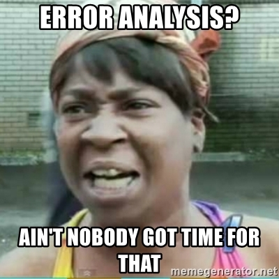
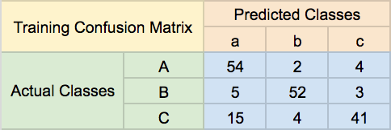
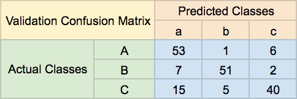

# Project 2295: Error Analysis
----




## Resources

**Read or watch**:

* [Confusion matrix](https://en.wikipedia.org/wiki/Confusion_matrix)
* [Type I and type II errors](https://en.wikipedia.org/wiki/Type_I_and_type_II_errors)
* [Sensitivity and specificity](https://en.wikipedia.org/wiki/Sensitivity_and_specificity)
* [Precision and recall](https://en.wikipedia.org/wiki/Precision_and_recall)
* [F1 score](https://en.wikipedia.org/wiki/F1_score)
* [What is a Confusion Matrix in Machine Learning?](https://machinelearningmastery.com/confusion-matrix-machine-learning/)
* [Simple guide to confusion matrix terminology](https://www.dataschool.io/simple-guide-to-confusion-matrix-terminology/)
* [Bias-variance tradeoff](https://en.wikipedia.org/wiki/Bias%E2%80%93variance_tradeoff)
* [What is bias and variance](https://www.quora.com/What-is-bias-and-variance)
* [Bayes error rate](https://en.wikipedia.org/wiki/Bayes_error_rate)
* [What is Bayes Error in machine learning?](https://stats.stackexchange.com/questions/302900/what-is-bayes-error-in-machine-learning)
* [Bias/Variance](https://www.youtube.com/watch?v=SjQyLhQIXSM&list=PLkDaE6sCZn6Hn0vK8co82zjQtt3T2Nkqc&index=2)(*Note: I suggest watching this video at 1.5x - 2x speed*)
* [Basic Recipe for Machine Learning](https://www.youtube.com/watch?v=C1N_PDHuJ6Q&list=PLkDaE6sCZn6Hn0vK8co82zjQtt3T2Nkqc&index=3)(*Note: I suggest watching this video at 1.5x - 2x speed*)
* [Why Human Level Performance](https://www.youtube.com/watch?v=J3HHOwcrkK8&index=8&list=PLkDaE6sCZn6E7jZ9sN_xHwSHOdjUxUW_b)(*Note: I suggest watching this video at 1.5x - 2x speed*)
* [Avoidable Bias](https://www.youtube.com/watch?v=CZf3oo0fuh0&index=9&list=PLkDaE6sCZn6E7jZ9sN_xHwSHOdjUxUW_b)(*Note: I suggest watching this video at 1.5x - 2x speed*)
* [Understanding Human-Level Performance](https://www.youtube.com/watch?v=NUmbgp1h64E&list=PLkDaE6sCZn6E7jZ9sN_xHwSHOdjUxUW_b&index=10)(*Note: I suggest watching this video at 1.5x - 2x speed*)
## Learning Objectives

At the end of this project, you are expected to be able to[explain to anyone](https://fs.blog/feynman-learning-technique/),**without the help of Google**:

### General

* What is the confusion matrix?
* What is type I error? type II?
* What is sensitivity? specificity? precision? recall?
* What is an F1 score?
* What is bias? variance?
* What is irreducible error?
* What is Bayes error?
* How can you approximate Bayes error?
* How to calculate bias and variance
* How to create a confusion matrix
## Requirements

### General

* Allowed editors:`vi`,`vim`,`emacs`
* All your files will be interpreted/compiled on Ubuntu 20.04 LTS using`python3`(version 3.9)
* Your files will be executed with`numpy`(version 1.25.2)
* All your files should end with a new line
* The first line of all your files should be exactly`#!/usr/bin/env python3`
* A`README.md`file, at the root of the folder of the project, is mandatory
* Your code should use the`pycodestyle`style (version 2.11.1)
* All your modules should have documentation (`python3 -c 'print(__import__("my_module").__doc__)'`)
* All your classes should have documentation (`python3 -c 'print(__import__("my_module").MyClass.__doc__)'`)
* All your functions (inside and outside a class) should have documentation (`python3 -c 'print(__import__("my_module").my_function.__doc__)'`and`python3 -c 'print(__import__("my_module").MyClass.my_function.__doc__)'`)
* Unless otherwise noted, you are not allowed to import any module except`import numpy as np`
* All your files must be executable
* The length of your files will be tested using`wc`

----
## Tasks
---
### 0. Create Confusion

Write the function <!--plain-NL-->`def create_confusion_matrix(labels, logits):`<!--inline-NL--> that creates a confusion matrix:<!--plain-NL-->

- `labels` is a one-hot `numpy.ndarray` of shape `(m, classes)` containing the correct labels for each data point


`m` is the number of data points
`classes` is the number of classes
- `m` is the number of data points
- `classes` is the number of classes
- `logits` is a one-hot `numpy.ndarray` of shape `(m, classes)` containing the predicted labels
- Returns: a confusion `numpy.ndarray` of shape `(classes, classes)` with row indices representing the correct labels and column indices representing the predicted labels

- `m` is the number of data points
- `classes` is the number of classes

To accompany the following main file, you are provided with <!--plain-->[labels_logits.npz](https://s3.eu-west-3.amazonaws.com/hbtn.intranet.project.files/holbertonschool-ml/labels_logits.npz) <!--link-->. This file does not need to be pushed to GitHub, nor will it be used to check your code.<!--plain-->

```
alexa@ubuntu-xenial:error_analysis$ cat 0-main.py 
#!/usr/bin/env python3

import numpy as np
create_confusion_matrix = __import__('0-create_confusion').create_confusion_matrix

if __name__ == '__main__':
    lib = np.load('labels_logits.npz')
    labels = lib['labels']
    logits = lib['logits']

    np.set_printoptions(suppress=True)
    confusion = create_confusion_matrix(labels, logits)
    print(confusion)
    np.savez_compressed('confusion.npz', confusion=confusion)
alexa@ubuntu-xenial:error_analysis$ ./0-main.py 
[[4701.    0.   36.   17.   12.   81.   38.   11.   35.    1.]
 [   0. 5494.   36.   21.    3.   38.    7.   13.   59.    7.]
 [  64.   93. 4188.  103.  108.   17.  162.   80.  132.   21.]
 [  30.   48.  171. 4310.    2.  252.   22.   86.  128.   52.]
 [  17.   27.   35.    0. 4338.   11.   84.    9.   27.  311.]
 [  89.   57.   45.  235.   70. 3631.  123.   33.  163.   60.]
 [  47.   32.   87.    1.   64.   83. 4607.    0.   29.    1.]
 [  26.   95.   75.    7.   58.   18.    1. 4682.   13.  200.]
 [  31.  153.   82.  174.   27.  179.   64.    7. 4003.  122.]
 [  48.   37.   39.   71.  220.   49.    8.  244.   46. 4226.]]
alexa@ubuntu-xenial:error_analysis$

```

**Repo:**

- GitHub repository: `atlas-machine_learning`
- Directory: `supervised_learning/error_analysis`
- File: `0-create_confusion.py`


---
### 1. Sensitivity

Write the function <!--plain-NL-->`def sensitivity(confusion):`<!--inline-NL--> that calculates the sensitivity for each class in a confusion matrix:<!--plain-NL-->

- `confusion` is a confusion `numpy.ndarray`  of shape `(classes, classes)` where row indices represent the correct labels and column indices represent the predicted labels


`classes` is the number of classes
- `classes` is the number of classes
- Returns: a `numpy.ndarray` of shape `(classes,)` containing the sensitivity of each class

- `classes` is the number of classes

```
alexa@ubuntu-xenial:error_analysis$ cat 1-main.py 
#!/usr/bin/env python3

import numpy as np
sensitivity = __import__('1-sensitivity').sensitivity

if __name__ == '__main__':
    confusion = np.load('confusion.npz')['confusion']

    np.set_printoptions(suppress=True)
    print(sensitivity(confusion))
alexa@ubuntu-xenial:error_analysis$ ./1-main.py 
[0.95316302 0.96759422 0.84299517 0.84493237 0.89277629 0.80581447
 0.93051909 0.9047343  0.82672449 0.84723336]
alexa@ubuntu-xenial:error_analysis$ 

```

`confusion.npz`<!--inline-NL--> :<!--plain-NL-->

- The file is coming from the output `0-create_confusion.py`
- Or you can use this one: confusion.npz

**Repo:**

- GitHub repository: `atlas-machine_learning`
- Directory: `supervised_learning/error_analysis`
- File: `1-sensitivity.py`


---
### 2. Precision

Write the function <!--plain-NL-->`def precision(confusion):`<!--inline-NL--> that calculates the precision for each class in a confusion matrix:<!--plain-NL-->

- `confusion` is a confusion `numpy.ndarray`  of shape `(classes, classes)` where row indices represent the correct labels and column indices represent the predicted labels


`classes` is the number of classes
- `classes` is the number of classes
- Returns: a `numpy.ndarray` of shape `(classes,)` containing the precision of each class

- `classes` is the number of classes

```
alexa@ubuntu-xenial:error_analysis$ cat 2-main.py 
#!/usr/bin/env python3

import numpy as np
precision = __import__('2-precision').precision

if __name__ == '__main__':
    confusion = np.load('confusion.npz')['confusion']

    np.set_printoptions(suppress=True)
    print(precision(confusion))
alexa@ubuntu-xenial:error_analysis$ ./2-main.py 
[0.93033841 0.91020543 0.87359199 0.87264628 0.88494492 0.83298922
 0.90050821 0.90648596 0.86364617 0.84503099]
alexa@ubuntu-xenial:error_analysis$

```

**Repo:**

- GitHub repository: `atlas-machine_learning`
- Directory: `supervised_learning/error_analysis`
- File: `2-precision.py`


---
### 3. Specificity

Write the function <!--plain-NL-->`def specificity(confusion):`<!--inline-NL--> that calculates the specificity for each class in a confusion matrix:<!--plain-NL-->

- `confusion` is a confusion `numpy.ndarray`  of shape `(classes, classes)` where row indices represent the correct labels and column indices represent the predicted labels


`classes` is the number of classes
- `classes` is the number of classes
- Returns: a `numpy.ndarray` of shape `(classes,)` containing the specificity of each class

- `classes` is the number of classes

```
alexa@ubuntu-xenial:error_analysis$ cat 3-main.py 
#!/usr/bin/env python3

import numpy as np
specificity = __import__('3-specificity').specificity

if __name__ == '__main__':
    confusion = np.load('confusion.npz')['confusion']

    np.set_printoptions(suppress=True)
    print(specificity(confusion))
alexa@ubuntu-xenial:error_analysis$ ./3-main.py 
[0.99218958 0.98777131 0.9865429  0.98599078 0.98750582 0.98399789
 0.98870119 0.98922476 0.98600469 0.98278237]
alexa@ubuntu-xenial:error_analysis$

```

When there are more than two classes in a confusion matrix, specificity is not a useful metric as there are inherently more actual negatives than actual positives. It is much better to use sensitivity (recall) and precision.<!--plain-NL-->

**Repo:**

- GitHub repository: `atlas-machine_learning`
- Directory: `supervised_learning/error_analysis`
- File: `3-specificity.py`


---
### 4. F1 score

Write the function <!--plain-NL-->`def f1_score(confusion):`<!--inline-NL--> that calculates the F1 score of a confusion matrix:<!--plain-NL-->

- `confusion` is a confusion `numpy.ndarray`  of shape `(classes, classes)` where row indices represent the correct labels and column indices represent the predicted labels


`classes` is the number of classes
- `classes` is the number of classes
- Returns: a `numpy.ndarray` of shape `(classes,)` containing the F1 score of each class
- You must use `sensitivity = __import__('1-sensitivity').sensitivity` and `precision = __import__('2-precision').precision` create previously

- `classes` is the number of classes

```
alexa@ubuntu-xenial:error_analysis$ cat 4-main.py 
#!/usr/bin/env python3

import numpy as np
f1_score = __import__('4-f1_score').f1_score

if __name__ == '__main__':
    confusion = np.load('confusion.npz')['confusion']

    np.set_printoptions(suppress=True)
    print(f1_score(confusion))
alexa@ubuntu-xenial:error_analysis$ ./4-main.py 
[0.94161242 0.93802288 0.8580209  0.85856574 0.88884336 0.81917654
 0.91526771 0.90560928 0.8447821  0.84613074]
alexa@ubuntu-xenial:error_analysis$

```

**Repo:**

- GitHub repository: `atlas-machine_learning`
- Directory: `supervised_learning/error_analysis`
- File: `4-f1_score.py`


---
### 5. Dealing with Error

In the text file <!--plain-NL-->`5-error_handling`<!--inline-NL-->, write the lettered answer to the question of how you should approach the following scenarios. Please write the answer to each scenario on a different line. If there is more than one way to approach a scenario, please use CSV formatting and place your answers in alphabetical order (ex. <!--plain-NL-->`A,B,C`<!--inline-NL-->):<!--plain-NL-->

Scenarios:<!--plain-NL-->

```
1. High Bias, High Variance
2. High Bias, Low Variance
3. Low Bias, High Variance
4. Low Bias, Low Variance

```

Approaches:<!--plain-NL-->

```
A. Train more
B. Try a different architecture
C. Get more data
D. Build a deeper network
E. Use regularization
F. Nothing

```

**Repo:**

- GitHub repository: `atlas-machine_learning`
- Directory: `supervised_learning/error_analysis`
- File: `5-error_handling`


---
### 6. Compare and Contrast

Given the following training and validation confusion matrices and the fact that human level performance has an error of ~14%, determine what the most important issue is and write the lettered answer in the file <!--plain-NL-->`6-compare_and_contrast`<!--inline-NL-->







Most important issue:<!--plain-NL-->

```
A. High Bias
B. High Variance
C. Nothing

```

**Repo:**

- GitHub repository: `atlas-machine_learning`
- Directory: `supervised_learning/error_analysis`
- File: `6-compare_and_contrast`