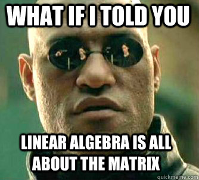

# Project 2275: Linear Algebra
----


*For this project, we expect you to look at this concept:*

* [Using Vagrant on your personal computer](/concepts/885)



## Resources

**Read or watch**:

* [Introduction to vectors](https://www.youtube.com/watch?v=fNk_zzaMoSs)
* [What is a matrix?](https://math.stackexchange.com/questions/2782717/what-exactly-is-a-matrix)(*not[the matrix](https://www.imdb.com/title/tt0133093/)*)
* [Transpose](https://en.wikipedia.org/wiki/Transpose)
* [Understanding the dot product](https://betterexplained.com/articles/vector-calculus-understanding-the-dot-product/)
* [Matrix Multiplication](https://www.youtube.com/watch?v=BzWahqwaS8k)
* [What is the relationship between matrix multiplication and the dot product?](https://www.quora.com/What-is-the-relationship-between-matrix-multiplication-and-the-dot-product)
* [The Dot Product, Matrix Multiplication, and the Magic of Orthogonal Matrices](https://www.youtube.com/watch?v=rW2ypKLLxGk)(*advanced*)
* [numpy tutorial](https://numpy.org/doc/stable/user/quickstart.html)(*until Shape Manipulation (excluded)*)
* [numpy basics](https://www.oreilly.com/library/view/python-for-data/9781449323592/ch04.html)(*until Universal Functions (included)*)
* [array indexing](https://docs.scipy.org/doc/numpy-1.15.0/reference/arrays.indexing.html#basic-slicing-and-indexing)
* [numerical operations on arrays](http://scipy-lectures.org/intro/numpy/operations.html)
* [Broadcasting](https://numpy.org/doc/stable/user/basics.broadcasting.html)
* [numpy mutations and broadcasting](https://medium.com/towards-data-science/two-cool-features-of-python-numpy-mutating-by-slicing-and-broadcasting-3b0b86e8b4c7)
* [numpy.ndarray](https://docs.scipy.org/doc/numpy-1.15.0/reference/arrays.ndarray.html)
* [numpy.ndarray.shape](https://docs.scipy.org/doc/numpy-1.15.0/reference/generated/numpy.ndarray.shape.html#numpy.ndarray.shape)
* [numpy.transpose](https://numpy.org/doc/stable/reference/generated/numpy.transpose.html)
* [numpy.ndarray.transpose](https://numpy.org/doc/stable/reference/generated/numpy.ndarray.transpose.html)
* [numpy.matmul](https://numpy.org/doc/stable/reference/generated/numpy.matmul.html)
## Learning Objectives

At the end of this project, you are expected to be able to[explain to anyone](https://fs.blog/feynman-learning-technique/),**without the help of Google**:

### General

* What is a vector?
* What is a matrix?
* What is a transpose?
* What is the shape of a matrix?
* What is an axis?
* What is a slice?
* How do you slice a vector/matrix?
* What are element-wise operations?
* How do you concatenate vectors/matrices?
* What is the dot product?
* What is matrix multiplication?
* What is`Numpy`?
* What is parallelization and why is it important?
* What is broadcasting?
## Requirements

### Python Scripts

* Allowed editors:`vi`,`vim`,`emacs`
* All your files will be interpreted/compiled on Ubuntu 20.04 LTS using python3 (version 3.9)
* Your files will be executed with`numpy`(version 1.25.2)
* All your files should end with a new line
* The first line of all your files should be exactly`#!/usr/bin/env python3`
* A`README.md`file, at the root of the folder of the project, is mandatory
* Your code should follow`pycodestyle`(version 2.11.1)
* All your modules should have documentation (`python3 -c 'print(__import__("my_module").__doc__)'`)
* All your classes should have documentation (`python3 -c 'print(__import__("my_module").MyClass.__doc__)'`)
* All your functions (inside and outside a class) should have documentation (`python3 -c 'print(__import__("my_module").my_function.__doc__)'`and`python3 -c 'print(__import__("my_module").MyClass.my_function.__doc__)'`)
* **Unless otherwise noted, you are not allowed to import any module**
* All your files must be executable
* The length of your files will be tested using`wc`

----
## Tasks
---
### 0. Slice Me Up

Complete the following source code (found below):<!--plain-NL-->

- `arr1` should be the first two numbers of `arr`
- `arr2` should be the last five numbers of `arr`
- `arr3` should be the 2nd through 6th numbers of `arr`
- You are not allowed to use any loops or conditional statements
- Your program should be exactly 8 lines

```
alexa@ubuntu-xenial:linear_algebra$ cat 0-slice_me_up.py 
#!/usr/bin/env python3
arr = [9, 8, 2, 3, 9, 4, 1, 0, 3]
arr1 =  # your code here
arr2 =  # your code here
arr3 =  # your code here
print("The first two numbers of the array are: {}".format(arr1))
print("The last five numbers of the array are: {}".format(arr2))
print("The 2nd through 6th numbers of the array are: {}".format(arr3))
alexa@ubuntu-xenial:linear_algebra$ ./0-slice_me_up.py 
The first two numbers of the array are: [9, 8]
The last five numbers of the array are: [9, 4, 1, 0, 3]
The 2nd through 6th numbers of the array are: [8, 2, 3, 9, 4]
alexa@ubuntu-xenial:linear_algebra$ wc -l 0-slice_me_up.py 
8 0-slice_me_up.py
alexa@ubuntu-xenial:linear_algebra$ 

```

**Repo:**

- GitHub repository: `atlas-machine_learning`
- Directory: `math/linear_algebra`
- File: `0-slice_me_up.py`


---
### 1. Trim Me Down

Complete the following source code (found below):<!--plain-NL-->

- `the_middle` should be a 2D matrix containing the 3rd and 4th columns of `matrix`
- You are not allowed to use any conditional statements
- You are only allowed to use one `for` loop
- Your program should be exactly 6 lines

```
alexa@ubuntu-xenial:linear_algebra$ cat 1-trim_me_down.py 
#!/usr/bin/env python3
matrix = [[1, 3, 9, 4, 5, 8], [2, 4, 7, 3, 4, 0], [0, 3, 4, 6, 1, 5]]
the_middle = []
# your code here
print("The middle columns of the matrix are: {}".format(the_middle))
alexa@ubuntu-xenial:linear_algebra$ ./1-trim_me_down.py 
The middle columns of the matrix are: [[9, 4], [7, 3], [4, 6]]
alexa@ubuntu-xenial:linear_algebra$ wc -l 1-trim_me_down.py 
6 1-trim_me_down.py
alexa@ubuntu-xenial:linear_algebra$ 

```

**Repo:**

- GitHub repository: `atlas-machine_learning`
- Directory: `math/linear_algebra`
- File: `1-trim_me_down.py`


---
### 2. Size Me Please

Write a function <!--plain-NL-->`def matrix_shape(matrix):`<!--inline-NL--> that calculates the shape of a matrix:<!--plain-NL-->

- You can assume all elements in the same dimension are of the same type/shape
- The shape should be returned as a list of integers

```
alexa@ubuntu-xenial:linear_algebra$ cat 2-main.py 
#!/usr/bin/env python3

matrix_shape = __import__('2-size_me_please').matrix_shape

mat1 = [[1, 2], [3, 4]]
print(matrix_shape(mat1))
mat2 = [[[1, 2, 3, 4, 5], [6, 7, 8, 9, 10], [11, 12, 13, 14, 15]],
        [[16, 17, 18, 19, 20], [21, 22, 23, 24, 25], [26, 27, 28, 29, 30]]]
print(matrix_shape(mat2))
alexa@ubuntu-xenial:linear_algebra$ ./2-main.py 
[2, 2]
[2, 3, 5]
alexa@ubuntu-xenial:linear_algebra$ 

```

**Repo:**

- GitHub repository: `atlas-machine_learning`
- Directory: `math/linear_algebra`
- File: `2-size_me_please.py`


---
### 3. Flip Me Over

Write a function <!--plain-NL-->`def matrix_transpose(matrix):`<!--inline-NL--> that returns the transpose of a 2D matrix, <!--plain-NL-->`matrix`<!--inline-NL-->:<!--plain-NL-->

- You must return a new matrix
- You can assume that `matrix` is never empty
- You can assume all elements in the same dimension are of the same type/shape

```
alexa@ubuntu-xenial:linear_algebra$ cat 3-main.py 
#!/usr/bin/env python3

matrix_transpose = __import__('3-flip_me_over').matrix_transpose

mat1 = [[1, 2], [3, 4]]
print(mat1)
print(matrix_transpose(mat1))
mat2 = [[1, 2, 3, 4, 5], [6, 7, 8, 9, 10], [11, 12, 13, 14, 15],
        [16, 17, 18, 19, 20], [21, 22, 23, 24, 25], [26, 27, 28, 29, 30]]
print(mat2)
print(matrix_transpose(mat2))
alexa@ubuntu-xenial:linear_algebra$ ./3-main.py 
[[1, 2], [3, 4]]
[[1, 3], [2, 4]]
[[1, 2, 3, 4, 5], [6, 7, 8, 9, 10], [11, 12, 13, 14, 15], [16, 17, 18, 19, 20], [21, 22, 23, 24, 25], [26, 27, 28, 29, 30]]
[[1, 6, 11, 16, 21, 26], [2, 7, 12, 17, 22, 27], [3, 8, 13, 18, 23, 28], [4, 9, 14, 19, 24, 29], [5, 10, 15, 20, 25, 30]]
alexa@ubuntu-xenial:linear_algebra$ 

```

**Repo:**

- GitHub repository: `atlas-machine_learning`
- Directory: `math/linear_algebra`
- File: `3-flip_me_over.py`


---
### 4. Line Up

Write a function <!--plain-NL-->`def add_arrays(arr1, arr2):`<!--inline-NL--> that adds two arrays element-wise:<!--plain-NL-->

- You can assume that `arr1` and `arr2` are lists of ints/floats
- You must return a new list
- If `arr1` and `arr2` are not the same shape, return `None`

```
alexa@ubuntu-xenial:linear_algebra$ cat 4-main.py 
#!/usr/bin/env python3

add_arrays = __import__('4-line_up').add_arrays

arr1 = [1, 2, 3, 4]
arr2 = [5, 6, 7, 8]
print(add_arrays(arr1, arr2))
print(arr1)
print(arr2)
print(add_arrays(arr1, [1, 2, 3]))
alexa@ubuntu-xenial:linear_algebra$ ./4-main.py 
[6, 8, 10, 12]
[1, 2, 3, 4]
[5, 6, 7, 8]
None
alexa@ubuntu-xenial:linear_algebra$ 

```

**Repo:**

- GitHub repository: `atlas-machine_learning`
- Directory: `math/linear_algebra`
- File: `4-line_up.py`


---
### 5. Across The Planes

Write a function <!--plain-NL-->`def add_matrices2D(mat1, mat2):`<!--inline-NL--> that adds two matrices element-wise:<!--plain-NL-->

- You can assume that `mat1` and `mat2` are 2D matrices containing ints/floats
- You can assume all elements in the same dimension are of the same type/shape
- You must return a new matrix
- If `mat1` and `mat2` are not the same shape, return `None`

```
alexa@ubuntu-xenial:linear_algebra$ cat 5-main.py 
#!/usr/bin/env python3

add_matrices2D = __import__('5-across_the_planes').add_matrices2D

mat1 = [[1, 2], [3, 4]]
mat2 = [[5, 6], [7, 8]]
print(add_matrices2D(mat1, mat2))
print(mat1)
print(mat2)
print(add_matrices2D(mat1, [[1, 2, 3], [4, 5, 6]]))
alexa@ubuntu-xenial:linear_algebra$ ./5-main.py 
[[6, 8], [10, 12]]
[[1, 2], [3, 4]]
[[5, 6], [7, 8]]
None
alexa@ubuntu-xenial:linear_algebra$ 

```

**Repo:**

- GitHub repository: `atlas-machine_learning`
- Directory: `math/linear_algebra`
- File: `5-across_the_planes.py`


---
### 6. Howdy Partner

Write a function <!--plain-NL-->`def cat_arrays(arr1, arr2):`<!--inline-NL--> that concatenates two arrays:<!--plain-NL-->

- You can assume that `arr1` and `arr2` are lists of ints/floats
- You must return a new list

```
alexa@ubuntu-xenial:linear_algebra$ cat 6-main.py 
#!/usr/bin/env python3

cat_arrays = __import__('6-howdy_partner').cat_arrays

arr1 = [1, 2, 3, 4, 5]
arr2 = [6, 7, 8]
print(cat_arrays(arr1, arr2))
print(arr1)
print(arr2)
alexa@ubuntu-xenial:linear_algebra$ ./6-main.py 
[1, 2, 3, 4, 5, 6, 7, 8]
[1, 2, 3, 4, 5]
[6, 7, 8]
alexa@ubuntu-xenial:linear_algebra$ 

```

**Repo:**

- GitHub repository: `atlas-machine_learning`
- Directory: `math/linear_algebra`
- File: `6-howdy_partner.py`


---
### 7. Gettin’ Cozy

Write a function <!--plain-NL-->`def cat_matrices2D(mat1, mat2, axis=0):`<!--inline-NL--> that concatenates two matrices along a specific axis:<!--plain-NL-->

- You can assume that `mat1` and `mat2` are 2D matrices containing ints/floats
- You can assume all elements in the same dimension are of the same type/shape
- You must return a new matrix
- If the two matrices cannot be concatenated, return `None`

```
alexa@ubuntu-xenial:linear_algebra$ cat 7-main.py 
#!/usr/bin/env python3

cat_matrices2D = __import__('7-gettin_cozy').cat_matrices2D

mat1 = [[1, 2], [3, 4]]
mat2 = [[5, 6]]
mat3 = [[7], [8]]
mat4 = cat_matrices2D(mat1, mat2)
mat5 = cat_matrices2D(mat1, mat3, axis=1)
print(mat4)
print(mat5)
mat1[0] = [9, 10]
mat1[1].append(5)
print(mat1)
print(mat4)
print(mat5)
alexa@ubuntu-xenial:linear_algebra$ ./7-main.py 
[[1, 2], [3, 4], [5, 6]]
[[1, 2, 7], [3, 4, 8]]
[[9, 10], [3, 4, 5]]
[[1, 2], [3, 4], [5, 6]]
[[1, 2, 7], [3, 4, 8]]
alexa@ubuntu-xenial:linear_algebra$ 

```

**Repo:**

- GitHub repository: `atlas-machine_learning`
- Directory: `math/linear_algebra`
- File: `7-gettin_cozy.py`


---
### 8. Ridin’ Bareback

Write a function <!--plain-NL-->`def mat_mul(mat1, mat2):`<!--inline-NL--> that performs matrix multiplication:<!--plain-NL-->

- You can assume that `mat1` and `mat2` are 2D matrices containing ints/floats
- You can assume all elements in the same dimension are of the same type/shape
- You must return a new matrix
- If the two matrices cannot be multiplied, return `None`

```
alexa@ubuntu-xenial:linear_algebra$ cat 8-main.py
#!/usr/bin/env python3

mat_mul = __import__('8-ridin_bareback').mat_mul

mat1 = [[1, 2],
        [3, 4],
        [5, 6]]
mat2 = [[1, 2, 3, 4],
        [5, 6, 7, 8]]
print(mat_mul(mat1, mat2))
alexa@ubuntu-xenial:linear_algebra$ ./8-main.py
[[11, 14, 17, 20], [23, 30, 37, 44], [35, 46, 57, 68]]
alexa@ubuntu-xenial:linear_algebra$ 

```

**Repo:**

- GitHub repository: `atlas-machine_learning`
- Directory: `math/linear_algebra`
- File: `8-ridin_bareback.py`


---
### 9. Let The Butcher Slice It

Complete the following source code (found below):<!--plain-NL-->

- `mat1` should be the middle two rows of `matrix`
- `mat2` should be the middle two columns of `matrix`
- `mat3` should be the bottom-right, square, 3x3 matrix of `matrix`
- You are not allowed to use any loops or conditional statements
- Your program should be exactly 10 lines

```
alexa@ubuntu-xenial:linear_algebra$ cat 9-let_the_butcher_slice_it.py 
#!/usr/bin/env python3
import numpy as np
matrix = np.array([[1, 2, 3, 4, 5, 6], [7, 8, 9, 10, 11, 12],
                   [13, 14, 15, 16, 17, 18], [19, 20, 21, 22, 23, 24]])
mat1 =  # your code here
mat2 =  # your code here
mat3 =  # your code here
print("The middle two rows of the matrix are:\n{}".format(mat1))
print("The middle two columns of the matrix are:\n{}".format(mat2))
print("The bottom-right, square, 3x3 matrix is:\n{}".format(mat3))
alexa@ubuntu-xenial:linear_algebra$ ./9-let_the_butcher_slice_it.py 
The middle two rows of the matrix are:
[[ 7  8  9 10 11 12]
 [13 14 15 16 17 18]]
The middle two columns of the matrix are:
[[ 3  4]
 [ 9 10]
 [15 16]
 [21 22]]
The bottom-right, square, 3x3 matrix is:
[[10 11 12]
 [16 17 18]
 [22 23 24]]
alexa@ubuntu-xenial:linear_algebra$ wc -l 9-let_the_butcher_slice_it.py 
10 9-let_the_butcher_slice_it.py
alexa@ubuntu-xenial:linear_algebra$ 

```

**Repo:**

- GitHub repository: `atlas-machine_learning`
- Directory: `math/linear_algebra`
- File: `9-let_the_butcher_slice_it.py`


---
### 10. I’ll Use My Scale

Write a function <!--plain-NL-->`def np_shape(matrix):`<!--inline-NL--> that calculates the shape of a <!--plain-NL-->`numpy.ndarray`<!--inline-NL-->:<!--plain-NL-->

- You are not allowed to use any loops or conditional statements
- You are not allowed to use `try/except` statements
- The shape should be returned as a tuple of integers

```
alexa@ubuntu-xenial:linear_algebra$ cat 10-main.py 
#!/usr/bin/env python3

import numpy as np
np_shape = __import__('10-ill_use_my_scale').np_shape

mat1 = np.array([1, 2, 3, 4, 5, 6])
mat2 = np.array([])
mat3 = np.array([[[1, 2, 3, 4, 5], [6, 7, 8, 9, 10]],
                 [[11, 12, 13, 14, 15], [16, 17, 18, 19, 20]]])
print(np_shape(mat1))
print(np_shape(mat2))
print(np_shape(mat3))
alexa@ubuntu-xenial:linear_algebra$ ./10-main.py 
(6,)
(0,)
(2, 2, 5)
alexa@ubuntu-xenial:linear_algebra$ 

```

**Repo:**

- GitHub repository: `atlas-machine_learning`
- Directory: `math/linear_algebra`
- File: `10-ill_use_my_scale.py`


---
### 11. The Western Exchange

Write a function <!--plain-NL-->`def np_transpose(matrix):`<!--inline-NL--> that transposes <!--plain-NL-->`matrix`<!--inline-NL-->:<!--plain-NL-->

- You can assume that `matrix` can be interpreted as a `numpy.ndarray`
- You are not allowed to use any loops or conditional statements
- You must return a new `numpy.ndarray`

```
alexa@ubuntu-xenial:linear_algebra$ cat 11-main.py 
#!/usr/bin/env python3

import numpy as np
np_transpose = __import__('11-the_western_exchange').np_transpose

mat1 = np.array([1, 2, 3, 4, 5, 6])
mat2 = np.array([])
mat3 = np.array([[[1, 2, 3, 4, 5], [6, 7, 8, 9, 10]],
                 [[11, 12, 13, 14, 15], [16, 17, 18, 19, 20]]])
print(np_transpose(mat1))
print(mat1)
print(np_transpose(mat2))
print(mat2)
print(np_transpose(mat3))
print(mat3)
alexa@ubuntu-xenial:linear_algebra$ ./11-main.py 
[1 2 3 4 5 6]
[1 2 3 4 5 6]
[]
[]
[[[ 1 11]
  [ 6 16]]

 [[ 2 12]
  [ 7 17]]

 [[ 3 13]
  [ 8 18]]

 [[ 4 14]
  [ 9 19]]

 [[ 5 15]
  [10 20]]]
[[[ 1  2  3  4  5]
  [ 6  7  8  9 10]]

 [[11 12 13 14 15]
  [16 17 18 19 20]]]
alexa@ubuntu-xenial:linear_algebra$ 

```

**Repo:**

- GitHub repository: `atlas-machine_learning`
- Directory: `math/linear_algebra`
- File: `11-the_western_exchange.py`


---
### 12. Bracing The Elements

Write a function <!--plain-NL-->`def np_elementwise(mat1, mat2):`<!--inline-NL--> that performs element-wise addition, subtraction, multiplication, and division:<!--plain-NL-->

- You can assume that `mat1` and `mat2` can be interpreted as `numpy.ndarray`s
- You should return a tuple containing the element-wise sum, difference, product, and quotient, respectively
- You are not allowed to use any loops or conditional statements
- You can assume that `mat1` and `mat2` are never empty

```
alexa@ubuntu-xenial:linear_algebra$ cat 12-main.py 
#!/usr/bin/env python3

import numpy as np
np_elementwise = __import__('12-bracin_the_elements').np_elementwise

mat1 = np.array([[11, 22, 33], [44, 55, 66]])
mat2 = np.array([[1, 2, 3], [4, 5, 6]])

print(mat1)
print(mat2)
add, sub, mul, div = np_elementwise(mat1, mat2)
print("Add:\n", add, "\nSub:\n", sub, "\nMul:\n", mul, "\nDiv:\n", div)
add, sub, mul, div = np_elementwise(mat1, 2)
print("Add:\n", add, "\nSub:\n", sub, "\nMul:\n", mul, "\nDiv:\n", div)
alexa@ubuntu-xenial:linear_algebra$ ./12-main.py 
[[11 22 33]
 [44 55 66]]
[[1 2 3]
 [4 5 6]]
Add:
 [[12 24 36]
 [48 60 72]] 
Sub:
 [[10 20 30]
 [40 50 60]] 
Mul:
 [[ 11  44  99]
 [176 275 396]] 
Div:
 [[11. 11. 11.]
 [11. 11. 11.]]
Add:
 [[13 24 35]
 [46 57 68]] 
Sub:
 [[ 9 20 31]
 [42 53 64]] 
Mul:
 [[ 22  44  66]
 [ 88 110 132]] 
Div:
 [[ 5.5 11.  16.5]
 [22.  27.5 33. ]]
alexa@ubuntu-xenial:linear_algebra$ 

```

**Repo:**

- GitHub repository: `atlas-machine_learning`
- Directory: `math/linear_algebra`
- File: ` 12-bracin_the_elements.py`


---
### 13. Cat's Got Your Tongue

Write a function <!--plain-NL-->`def np_cat(mat1, mat2, axis=0)`<!--inline-NL--> that concatenates two matrices along a specific axis:<!--plain-NL-->

- You can assume that `mat1` and `mat2` can be interpreted as `numpy.ndarray`s
- You must return a new `numpy.ndarray`
- You are not allowed to use any loops or conditional statements
- You may use: `import numpy as np`
- You can assume that `mat1` and `mat2` are never empty

```
alexa@ubuntu-xenial:linear_algebra$ cat 13-main.py
#!/usr/bin/env python3

import numpy as np
np_cat = __import__('13-cats_got_your_tongue').np_cat

mat1 = np.array([[11, 22, 33], [44, 55, 66]])
mat2 = np.array([[1, 2, 3], [4, 5, 6]])
mat3 = np.array([[7], [8]])
print(np_cat(mat1, mat2))
print(np_cat(mat1, mat2, axis=1))
print(np_cat(mat1, mat3, axis=1))
alexa@ubuntu-xenial:linear_algebra$ ./13-main.py
[[11 22 33]
 [44 55 66]
 [ 1  2  3]
 [ 4  5  6]]
[[11 22 33  1  2  3]
 [44 55 66  4  5  6]]
[[11 22 33  7]
 [44 55 66  8]]
alexa@ubuntu-xenial:linear_algebra$ 

```

**Repo:**

- GitHub repository: `atlas-machine_learning`
- Directory: `math/linear_algebra`
- File: `13-cats_got_your_tongue.py`


---
### 14. Saddle Up

Write a function <!--plain-NL-->`def np_matmul(mat1, mat2):`<!--inline-NL--> that performs matrix multiplication:<!--plain-NL-->

- You can assume that `mat1` and `mat2` are `numpy.ndarray`s
- You are not allowed to use any loops or conditional statements
- You may use: `import numpy as np`
- You can assume that `mat1` and `mat2` are never empty

```
alexa@ubuntu-xenial:linear_algebra$ cat 14-main.py
#!/usr/bin/env python3

import numpy as np
np_matmul = __import__('14-saddle_up').np_matmul

mat1 = np.array([[11, 22, 33], [44, 55, 66]])
mat2 = np.array([[1, 2, 3], [4, 5, 6], [7, 8, 9]])
mat3 = np.array([[7], [8], [9]])
print(np_matmul(mat1, mat2))
print(np_matmul(mat1, mat3))
alexa@ubuntu-xenial:linear_algebra$ ./14-main.py
[[ 330  396  462]
 [ 726  891 1056]]
[[ 550]
 [1342]]
alexa@ubuntu-xenial:linear_algebra$ 

```

**Repo:**

- GitHub repository: `atlas-machine_learning`
- Directory: `math/linear_algebra`
- File: `14-saddle_up.py`