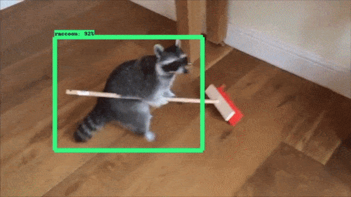
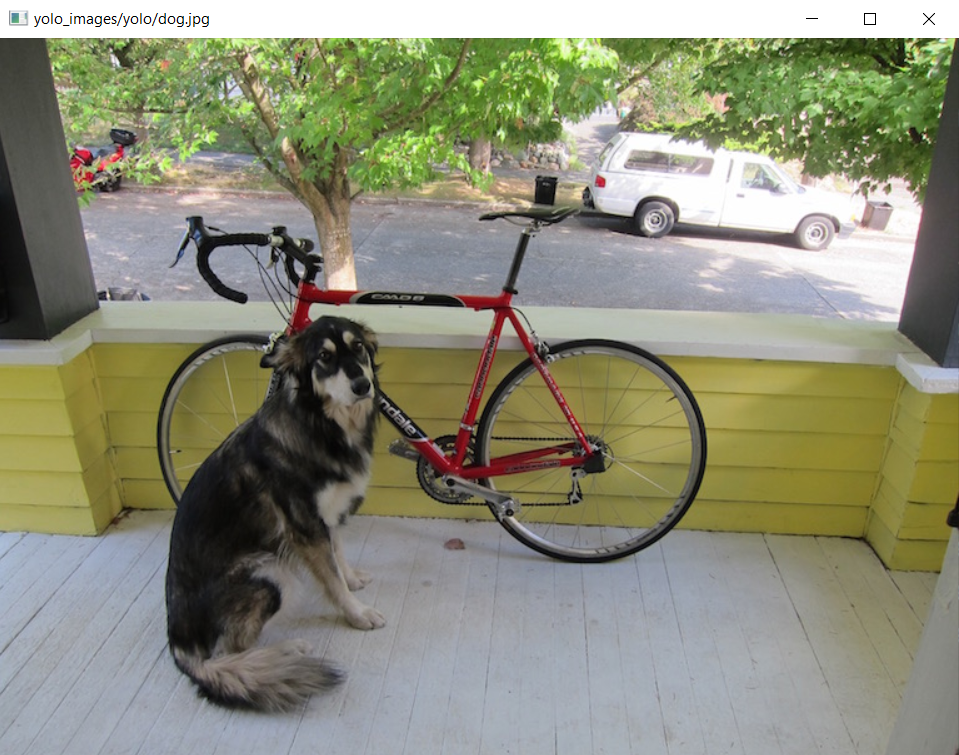
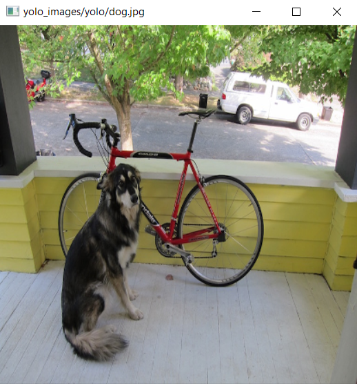
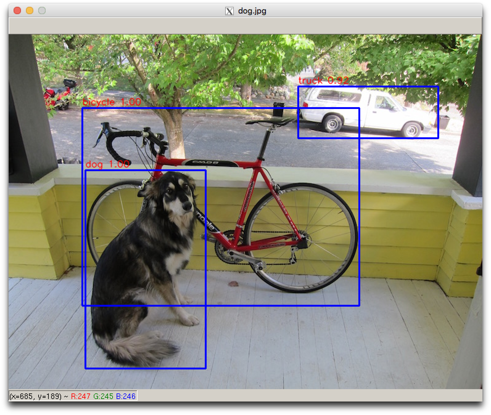
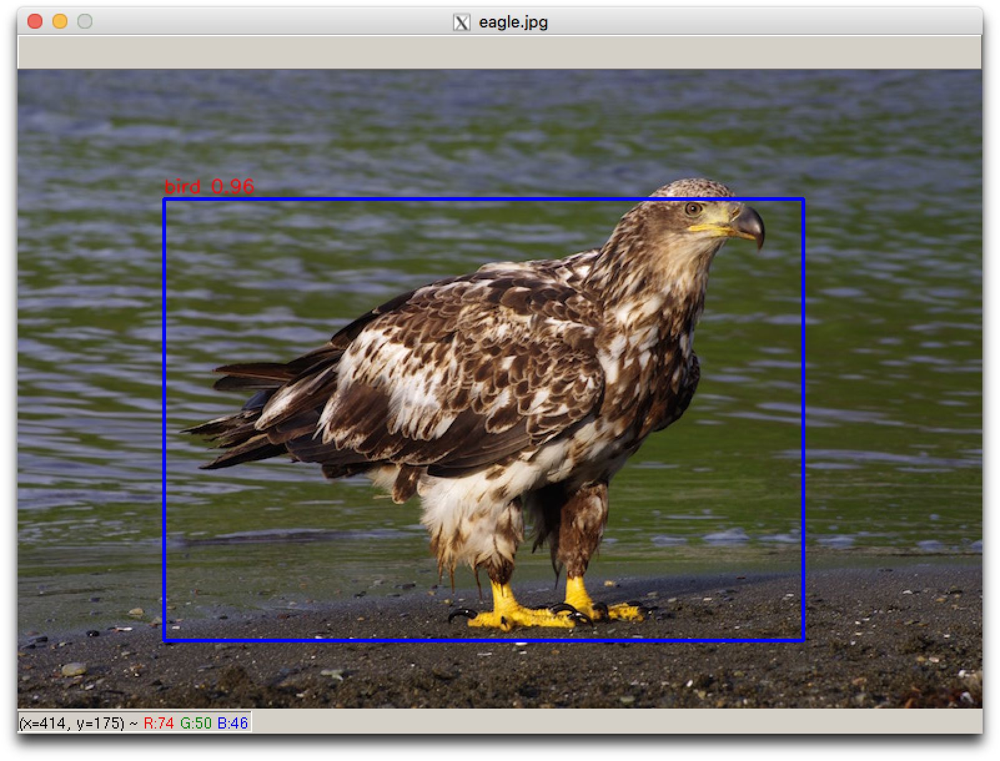
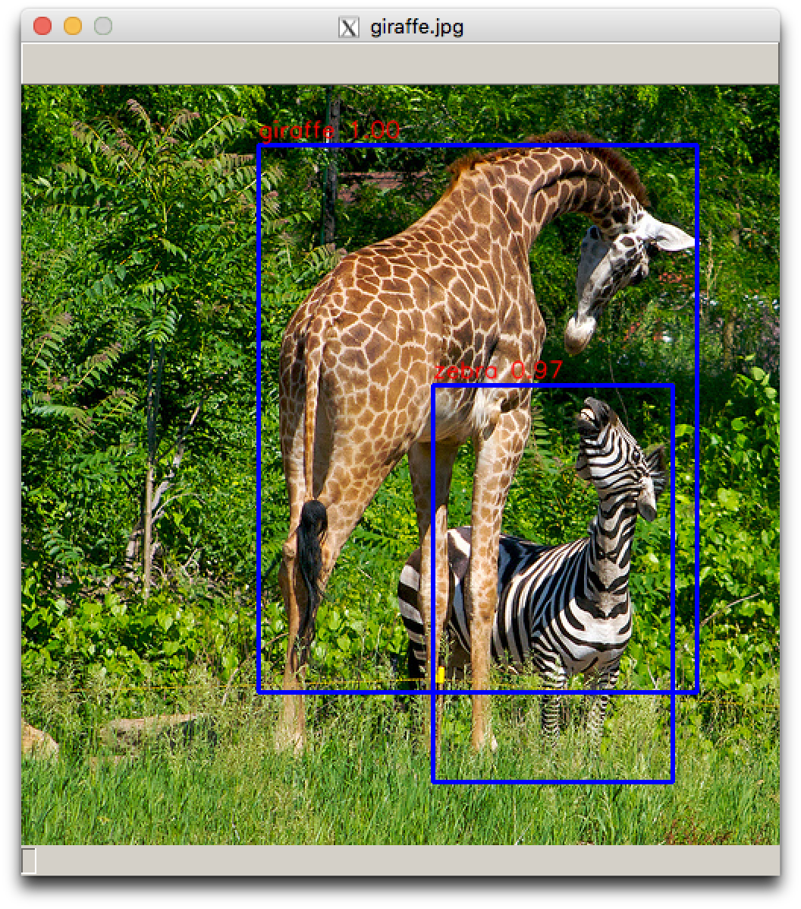
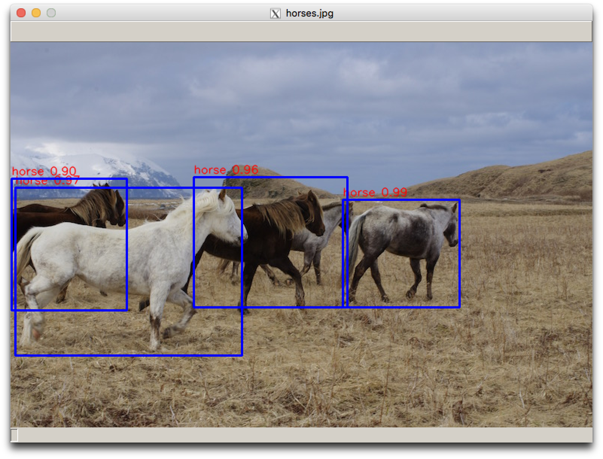
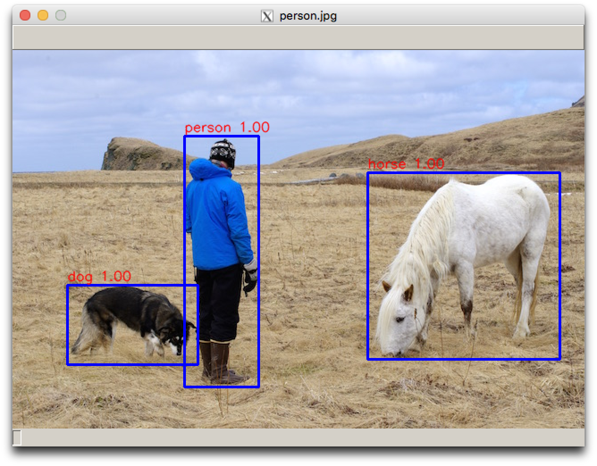
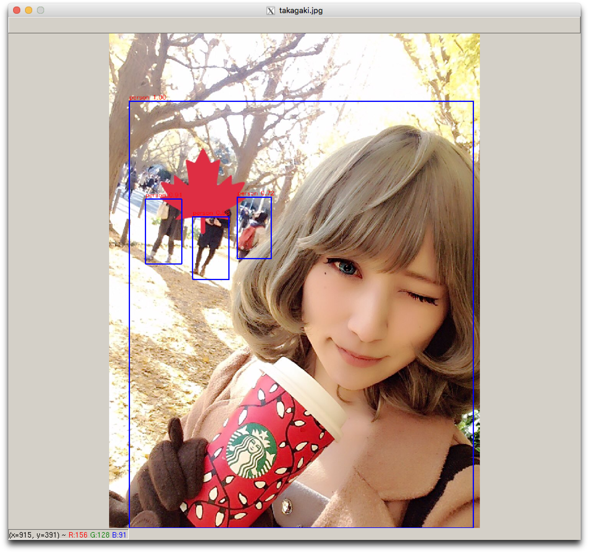

# Project 2315: Object Detection
----




## Resources

**Read or watch**:

* [OpenCV](https://opencv.org/)
* [Getting Started with Images](https://docs.opencv.org/3.0-beta/doc/py_tutorials/py_gui/py_image_display/py_image_display.html)
* [Object Localization](https://www.youtube.com/watch?v=GSwYGkTfOKk&index=23&list=PLkDaE6sCZn6Gl29AoE31iwdVwSG-KnDzF)
* [Landmark Detection](https://www.youtube.com/watch?v=rRB9iymNy1w&list=PLkDaE6sCZn6Gl29AoE31iwdVwSG-KnDzF&index=24)
* [Object Detection](https://www.youtube.com/watch?v=5e5pjeojznk&index=26&list=PLkDaE6sCZn6Gl29AoE31iwdVwSG-KnDzF)
* [Convolutional Implementation Sliding Windows](https://www.youtube.com/watch?v=XdsmlBGOK-k&list=PLkDaE6sCZn6Gl29AoE31iwdVwSG-KnDzF&index=25)
* [Intersection Over Union](https://www.youtube.com/watch?v=ANIzQ5G-XPE&list=PLkDaE6sCZn6Gl29AoE31iwdVwSG-KnDzF&index=27)
* [Nonmax Suppression](https://www.youtube.com/watch?v=VAo84c1hQX8&index=29&list=PLkDaE6sCZn6Gl29AoE31iwdVwSG-KnDzF)
* [Non-Maximum Suppression for Object Detection in Python](https://pyimagesearch.com/2014/11/17/non-maximum-suppression-object-detection-python/)
* [Anchor Boxes](https://www.youtube.com/watch?v=RTlwl2bv0Tg&list=PLkDaE6sCZn6Gl29AoE31iwdVwSG-KnDzF&index=28)
* [YOLO Algorithm](https://www.youtube.com/watch?v=9s_FpMpdYW8&list=PLkDaE6sCZn6Gl29AoE31iwdVwSG-KnDzF&index=30)
* [You Only Look Once: Unified, Real-Time Object Detection (CVPR 2016)](https://www.youtube.com/watch?v=NM6lrxy0bxs)
* [Real-time Object Detection with YOLO, YOLOv2 and now YOLOv3](https://jonathan-hui.medium.com/real-time-object-detection-with-yolo-yolov2-28b1b93e2088)
* [Dive Really Deep into YOLO v3: A Beginner’s Guide](https://medium.com/towards-data-science/dive-really-deep-into-yolo-v3-a-beginners-guide-9e3d2666280e)
* [What’s new in YOLO v3?](https://medium.com/towards-data-science/yolo-v3-object-detection-53fb7d3bfe6b)
* [What do we learn from single shot object detectors (SSD, YOLOv3), FPN & Focal loss (RetinaNet)?](https://jonathan-hui.medium.com/what-do-we-learn-from-single-shot-object-detectors-ssd-yolo-fpn-focal-loss-3888677c5f4d)
* [mAP (mean Average Precision) for Object Detection](https://jonathan-hui.medium.com/map-mean-average-precision-for-object-detection-45c121a31173)
* [You Only Look Once (YOLO): Unified Real-Time Object Detection](https://www.slideshare.net/slideshow/pr12-you-only-look-once-yolo-unified-realtime-object-detection/76999106#81)

**Definitions to skim:**

* [Object detection](https://en.wikipedia.org/wiki/Object_detection)

**References**:

* [cv2.imshow](https://docs.opencv.org/2.4/modules/highgui/doc/user_interface.html#imshow)
* [cv2.imread](https://docs.opencv.org/3.0-beta/modules/imgcodecs/doc/reading_and_writing_images.html#imread)
* [cv2.line](https://docs.opencv.org/2.4/modules/core/doc/drawing_functions.html#line)
* [cv2.putText](https://docs.opencv.org/2.4/modules/core/doc/drawing_functions.html#puttext)
* [cv2.rectangle](https://docs.opencv.org/2.4/modules/core/doc/drawing_functions.html#rectangle)
* [cv2.resize](https://docs.opencv.org/2.4/modules/imgproc/doc/geometric_transformations.html#resize)
* [glob](https://docs.python.org/3/library/glob.html)
* [You Only Look Once: Unified, Real-Time Object Detection](https://browse.arxiv.org:443/pdf/1506.02640v5)
* [YOLO9000: Better, Faster, Stronger](https://browse.arxiv.org:443/pdf/1612.08242)
* [YOLOv3: An Incremental Improvement](https://pjreddie.com/media/files/papers/YOLOv3.pdf)

**Advanced**:

* [Image segmentation](https://en.wikipedia.org/wiki/Image_segmentation)
* [Region Proposals](https://www.youtube.com/watch?v=6ykvU9WuIws&list=PLkDaE6sCZn6Gl29AoE31iwdVwSG-KnDzF&index=31)
* [Understanding Feature Pyramid Networks for object detection (FPN)](https://jonathan-hui.medium.com/understanding-feature-pyramid-networks-for-object-detection-fpn-45b227b9106c)
* [What do we learn from region based object detectors (Faster R-CNN, R-FCN, FPN)?](https://jonathan-hui.medium.com/what-do-we-learn-from-region-based-object-detectors-faster-r-cnn-r-fcn-fpn-7e354377a7c9)
* [Object Detection for Dummies Part 3: R-CNN Family](https://lilianweng.github.io/lil-log/2017/12/31/object-recognition-for-dummies-part-3.html#r-cnn)
* [Image segmentation with Mask R-CNN](https://jonathan-hui.medium.com/image-segmentation-with-mask-r-cnn-ebe6d793272)
## Learning Objectives

At the end of this project, you are expected to be able to[explain to anyone](https://fs.blog/feynman-learning-technique/),**without the help of Google**:

### General

* What is OpenCV and how do you use it?
* What is object detection?
* What is the Sliding Windows algorithm?
* What is a single-shot detector?
* What is the YOLO algorithm?
* What is IOU and how do you calculate it?
* What is non-max suppression?
* What are anchor boxes?
* What is mAP and how do you calculate it?
## Requirements

### Python Scripts

* Allowed editors:`vi`,`vim`,`emacs`
* All your files will be interpreted/compiled on Ubuntu 20.04 LTS using`python3`(version 3.9)
* Your files will be executed with`numpy`(version 1.25.2) and`tensorflow`(version 2.15)
* All your files should end with a new line
* The first line of all your files should be exactly`#!/usr/bin/env python3`
* A`README.md`file, at the root of the folder of the project, is mandatory
* Your code should use the`pycodestyle`style (version 2.11.1)
* All your modules should have documentation (`python3 -c 'print(__import__("my_module").__doc__)'`)
* All your classes should have documentation (`python3 -c 'print(__import__("my_module").MyClass.__doc__)'`)
* All your functions (inside and outside a class) should have documentation (`python3 -c 'print(__import__("my_module").my_function.__doc__)'`and`python3 -c 'print(__import__("my_module").MyClass.my_function.__doc__)'`)
* All your files must be executable
* The length of your files will be tested using`wc`
## Download and Use OpenCV 4.9.0.80

``
```
alexa@ubuntu-xenial:~$ pip install --user opencv-python==4.9.0.80
alexa@ubuntu-xenial:~$ python3
>>> import cv2
>>> cv2.__version__
'4.9.0'
```
## Test Files

* [yolo.h5](https://intranet-projects-files.s3.amazonaws.com/holbertonschool-ml/yolo.h5)
* [coco_classes.txt](https://intranet-projects-files.s3.amazonaws.com/holbertonschool-ml/coco_classes.txt)
* [yolo_images.zip](https://intranet-projects-files.s3.amazonaws.com/holbertonschool-ml/yolo_images.zip)

----
## Tasks
---
### 0. Initialize Yolo

Write a class <!--plain-NL-->`Yolo`<!--inline-NL--> that uses the Yolo v3 algorithm to perform object detection:<!--plain-NL-->

- class constructor: `def __init__(self, model_path, classes_path, class_t, nms_t, anchors):`

`model_path` is the path to where a Darknet Keras model is stored
`classes_path` is the path to where the list of class names used for the Darknet model, listed in order of index, can be found
`class_t` is a float representing the box score threshold for the initial filtering step
`nms_t` is a float representing the IOU threshold for non-max suppression
`anchors` is a `numpy.ndarray` of shape `(outputs, anchor_boxes, 2)` containing all of the anchor boxes:


`outputs` is the number of outputs (predictions) made by the Darknet model
`anchor_boxes` is the number of anchor boxes used for each prediction
`2` =&gt; `[anchor_box_width, anchor_box_height]`
- `model_path` is the path to where a Darknet Keras model is stored
- `classes_path` is the path to where the list of class names used for the Darknet model, listed in order of index, can be found
- `class_t` is a float representing the box score threshold for the initial filtering step
- `nms_t` is a float representing the IOU threshold for non-max suppression
- `anchors` is a `numpy.ndarray` of shape `(outputs, anchor_boxes, 2)` containing all of the anchor boxes:


`outputs` is the number of outputs (predictions) made by the Darknet model
`anchor_boxes` is the number of anchor boxes used for each prediction
`2` =&gt; `[anchor_box_width, anchor_box_height]`
- `outputs` is the number of outputs (predictions) made by the Darknet model
- `anchor_boxes` is the number of anchor boxes used for each prediction
- `2` =&gt; `[anchor_box_width, anchor_box_height]`
- Public instance attributes:


`model`: the Darknet Keras model
`class_names`: a list of the class names for the model
`class_t`: the box score threshold for the initial filtering step
`nms_t`: the IOU threshold for non-max suppression
`anchors`: the anchor boxes
- `model`: the Darknet Keras model
- `class_names`: a list of the class names for the model
- `class_t`: the box score threshold for the initial filtering step
- `nms_t`: the IOU threshold for non-max suppression
- `anchors`: the anchor boxes

- `model_path` is the path to where a Darknet Keras model is stored
- `classes_path` is the path to where the list of class names used for the Darknet model, listed in order of index, can be found
- `class_t` is a float representing the box score threshold for the initial filtering step
- `nms_t` is a float representing the IOU threshold for non-max suppression
- `anchors` is a `numpy.ndarray` of shape `(outputs, anchor_boxes, 2)` containing all of the anchor boxes:


`outputs` is the number of outputs (predictions) made by the Darknet model
`anchor_boxes` is the number of anchor boxes used for each prediction
`2` =&gt; `[anchor_box_width, anchor_box_height]`
- `outputs` is the number of outputs (predictions) made by the Darknet model
- `anchor_boxes` is the number of anchor boxes used for each prediction
- `2` =&gt; `[anchor_box_width, anchor_box_height]`

- `outputs` is the number of outputs (predictions) made by the Darknet model
- `anchor_boxes` is the number of anchor boxes used for each prediction
- `2` =&gt; `[anchor_box_width, anchor_box_height]`

- `model`: the Darknet Keras model
- `class_names`: a list of the class names for the model
- `class_t`: the box score threshold for the initial filtering step
- `nms_t`: the IOU threshold for non-max suppression
- `anchors`: the anchor boxes

```
root@alexa-ml2:~/object_detection# cat 0-main.py 
#!/usr/bin/env python3

if __name__ == '__main__':
    import numpy as np
    Yolo = __import__('0-yolo').Yolo

    np.random.seed(0)
    anchors = np.array([[[116, 90], [156, 198], [373, 326]],
                        [[30, 61], [62, 45], [59, 119]],
                        [[10, 13], [16, 30], [33, 23]]])
    yolo = Yolo('yolo.h5', 'coco_classes.txt', 0.6, 0.5, anchors)
    yolo.model.summary()
    print('Class names:', yolo.class_names)
    print('Class threshold:', yolo.class_t)
    print('NMS threshold:', yolo.nms_t)
    print('Anchor boxes:', yolo.anchors)
root@alexa-ml2:~/object_detection# ./0-main.py 
WARNING:tensorflow:No training configuration found in the save file, so the model was *not* compiled. Compile it manually.
Model: "model"
__________________________________________________________________________________________________
 Layer (type)                Output Shape                 Param #   Connected to
==================================================================================================
 input_1 (InputLayer)        [(None, 416, 416, 3)]        0         []

 conv2d (Conv2D)             (None, 416, 416, 32)         864       ['input_1[0][0]']

 batch_normalization (Batch  (None, 416, 416, 32)         128       ['conv2d[0][0]']
 Normalization)

 leaky_re_lu (LeakyReLU)     (None, 416, 416, 32)         0         ['batch_normalization[0][0]']

 zero_padding2d (ZeroPaddin  (None, 417, 417, 32)         0         ['leaky_re_lu[0][0]']
 g2D)

 conv2d_1 (Conv2D)           (None, 208, 208, 64)         18432     ['zero_padding2d[0][0]']

 batch_normalization_1 (Bat  (None, 208, 208, 64)         256       ['conv2d_1[0][0]']
 chNormalization)

 leaky_re_lu_1 (LeakyReLU)   (None, 208, 208, 64)         0         ['batch_normalization_1[0][0]'
                                                                    ]

 conv2d_2 (Conv2D)           (None, 208, 208, 32)         2048      ['leaky_re_lu_1[0][0]']

 batch_normalization_2 (Bat  (None, 208, 208, 32)         128       ['conv2d_2[0][0]']
 chNormalization)

 leaky_re_lu_2 (LeakyReLU)   (None, 208, 208, 32)         0         ['batch_normalization_2[0][0]'

..............

 leaky_re_lu_57 (LeakyReLU)  (None, 13, 13, 1024)         0         ['batch_normalization_57[0][0]
                                                                    ']

 leaky_re_lu_64 (LeakyReLU)  (None, 26, 26, 512)          0         ['batch_normalization_64[0][0]
                                                                    ']

 leaky_re_lu_71 (LeakyReLU)  (None, 52, 52, 256)          0         ['batch_normalization_71[0][0]
                                                                    ']

 conv2d_58 (Conv2D)          (None, 13, 13, 255)          261375    ['leaky_re_lu_57[0][0]']

 conv2d_66 (Conv2D)          (None, 26, 26, 255)          130815    ['leaky_re_lu_64[0][0]']

 conv2d_74 (Conv2D)          (None, 52, 52, 255)          65535     ['leaky_re_lu_71[0][0]']

 reshape (Reshape)           (None, 13, 13, 3, 85)        0         ['conv2d_58[0][0]']

 reshape_1 (Reshape)         (None, 26, 26, 3, 85)        0         ['conv2d_66[0][0]']

 reshape_2 (Reshape)         (None, 52, 52, 3, 85)        0         ['conv2d_74[0][0]']

==================================================================================================
Total params: 62001757 (236.52 MB)
Trainable params: 61949149 (236.32 MB)
Non-trainable params: 52608 (205.50 KB)
__________________________________________________________________________________________________
Class names: ['person', 'bicycle', 'car', 'motorbike', 'aeroplane', 'bus', 'train', 'truck', 'boat', 'traffic light', 'fire hydrant', 'stop sign', 'parking meter', 'bench', 'bird', 'cat', 'dog', 'horse', 'sheep', 'cow', 'elephant', 'bear', 'zebra', 'giraffe', 'backpack', 'umbrella', 'handbag', 'tie', 'suitcase', 'frisbee', 'skis', 'snowboard', 'sports ball', 'kite', 'baseball bat', 'baseball glove', 'skateboard', 'surfboard', 'tennis racket', 'bottle', 'wine glass', 'cup', 'fork', 'knife', 'spoon', 'bowl', 'banana', 'apple', 'sandwich', 'orange', 'broccoli', 'carrot', 'hot dog', 'pizza', 'donut', 'cake', 'chair', 'sofa', 'pottedplant', 'bed', 'diningtable', 'toilet', 'tvmonitor', 'laptop', 'mouse', 'remote', 'keyboard', 'cell phone', 'microwave', 'oven', 'toaster', 'sink', 'refrigerator', 'book', 'clock', 'vase', 'scissors', 'teddy bear', 'hair drier', 'toothbrush']
Class threshold: 0.6
NMS threshold: 0.5
Anchor boxes: [[[116  90]
  [156 198]
  [373 326]]

 [[ 30  61]
  [ 62  45]
  [ 59 119]]

 [[ 10  13]
  [ 16  30]
  [ 33  23]]]
root@alexa-ml2:~/object_detection#

```

**Repo:**

- GitHub repository: `atlas-machine_learning`
- Directory: `supervised_learning/object_detection`
- File: `0-yolo.py`


---
### 1. Process Outputs

Write a class <!--plain-NL-->`Yolo`<!--inline-NL--> (Based on <!--plain-NL-->`0-yolo.py`<!--inline-NL-->):<!--plain-NL-->

- Add the public method `def process_outputs(self, outputs, image_size):`

`outputs` is a list of `numpy.ndarray`s containing the predictions from the Darknet model for a single image:


Each output will have the shape `(grid_height, grid_width, anchor_boxes, 4 + 1 + classes)`

`grid_height` &amp; `grid_width` =&gt; the height and width of the grid used for the output
`anchor_boxes` =&gt; the number of anchor boxes used
`4` =&gt; `(t_x, t_y, t_w, t_h)`
`1` =&gt; `box_confidence`
`classes` =&gt; class probabilities for all classes


`image_size` is a `numpy.ndarray` containing the image’s original size `[image_height, image_width]`
Returns a tuple of `(boxes, box_confidences, box_class_probs)`:


`boxes`: a list of `numpy.ndarray`s of shape `(grid_height, grid_width, anchor_boxes, 4)` containing the processed boundary boxes for each output, respectively:


`4` =&gt; `(x1, y1, x2, y2)`
`(x1, y1, x2, y2)` should represent the boundary box relative to original image

`box_confidences`: a list of  `numpy.ndarray`s of shape `(grid_height, grid_width, anchor_boxes, 1)` containing the box confidences for each output, respectively
`box_class_probs`: a list of  `numpy.ndarray`s of shape `(grid_height, grid_width, anchor_boxes, classes)` containing the box’s class probabilities for each output, respectively
- `outputs` is a list of `numpy.ndarray`s containing the predictions from the Darknet model for a single image:


Each output will have the shape `(grid_height, grid_width, anchor_boxes, 4 + 1 + classes)`

`grid_height` &amp; `grid_width` =&gt; the height and width of the grid used for the output
`anchor_boxes` =&gt; the number of anchor boxes used
`4` =&gt; `(t_x, t_y, t_w, t_h)`
`1` =&gt; `box_confidence`
`classes` =&gt; class probabilities for all classes
- Each output will have the shape `(grid_height, grid_width, anchor_boxes, 4 + 1 + classes)`

`grid_height` &amp; `grid_width` =&gt; the height and width of the grid used for the output
`anchor_boxes` =&gt; the number of anchor boxes used
`4` =&gt; `(t_x, t_y, t_w, t_h)`
`1` =&gt; `box_confidence`
`classes` =&gt; class probabilities for all classes
- `grid_height` &amp; `grid_width` =&gt; the height and width of the grid used for the output
- `anchor_boxes` =&gt; the number of anchor boxes used
- `4` =&gt; `(t_x, t_y, t_w, t_h)`
- `1` =&gt; `box_confidence`
- `classes` =&gt; class probabilities for all classes
- `image_size` is a `numpy.ndarray` containing the image’s original size `[image_height, image_width]`
- Returns a tuple of `(boxes, box_confidences, box_class_probs)`:


`boxes`: a list of `numpy.ndarray`s of shape `(grid_height, grid_width, anchor_boxes, 4)` containing the processed boundary boxes for each output, respectively:


`4` =&gt; `(x1, y1, x2, y2)`
`(x1, y1, x2, y2)` should represent the boundary box relative to original image

`box_confidences`: a list of  `numpy.ndarray`s of shape `(grid_height, grid_width, anchor_boxes, 1)` containing the box confidences for each output, respectively
`box_class_probs`: a list of  `numpy.ndarray`s of shape `(grid_height, grid_width, anchor_boxes, classes)` containing the box’s class probabilities for each output, respectively
- `boxes`: a list of `numpy.ndarray`s of shape `(grid_height, grid_width, anchor_boxes, 4)` containing the processed boundary boxes for each output, respectively:


`4` =&gt; `(x1, y1, x2, y2)`
`(x1, y1, x2, y2)` should represent the boundary box relative to original image
- `4` =&gt; `(x1, y1, x2, y2)`
- `(x1, y1, x2, y2)` should represent the boundary box relative to original image
- `box_confidences`: a list of  `numpy.ndarray`s of shape `(grid_height, grid_width, anchor_boxes, 1)` containing the box confidences for each output, respectively
- `box_class_probs`: a list of  `numpy.ndarray`s of shape `(grid_height, grid_width, anchor_boxes, classes)` containing the box’s class probabilities for each output, respectively

- `outputs` is a list of `numpy.ndarray`s containing the predictions from the Darknet model for a single image:


Each output will have the shape `(grid_height, grid_width, anchor_boxes, 4 + 1 + classes)`

`grid_height` &amp; `grid_width` =&gt; the height and width of the grid used for the output
`anchor_boxes` =&gt; the number of anchor boxes used
`4` =&gt; `(t_x, t_y, t_w, t_h)`
`1` =&gt; `box_confidence`
`classes` =&gt; class probabilities for all classes
- Each output will have the shape `(grid_height, grid_width, anchor_boxes, 4 + 1 + classes)`

`grid_height` &amp; `grid_width` =&gt; the height and width of the grid used for the output
`anchor_boxes` =&gt; the number of anchor boxes used
`4` =&gt; `(t_x, t_y, t_w, t_h)`
`1` =&gt; `box_confidence`
`classes` =&gt; class probabilities for all classes
- `grid_height` &amp; `grid_width` =&gt; the height and width of the grid used for the output
- `anchor_boxes` =&gt; the number of anchor boxes used
- `4` =&gt; `(t_x, t_y, t_w, t_h)`
- `1` =&gt; `box_confidence`
- `classes` =&gt; class probabilities for all classes
- `image_size` is a `numpy.ndarray` containing the image’s original size `[image_height, image_width]`
- Returns a tuple of `(boxes, box_confidences, box_class_probs)`:


`boxes`: a list of `numpy.ndarray`s of shape `(grid_height, grid_width, anchor_boxes, 4)` containing the processed boundary boxes for each output, respectively:


`4` =&gt; `(x1, y1, x2, y2)`
`(x1, y1, x2, y2)` should represent the boundary box relative to original image

`box_confidences`: a list of  `numpy.ndarray`s of shape `(grid_height, grid_width, anchor_boxes, 1)` containing the box confidences for each output, respectively
`box_class_probs`: a list of  `numpy.ndarray`s of shape `(grid_height, grid_width, anchor_boxes, classes)` containing the box’s class probabilities for each output, respectively
- `boxes`: a list of `numpy.ndarray`s of shape `(grid_height, grid_width, anchor_boxes, 4)` containing the processed boundary boxes for each output, respectively:


`4` =&gt; `(x1, y1, x2, y2)`
`(x1, y1, x2, y2)` should represent the boundary box relative to original image
- `4` =&gt; `(x1, y1, x2, y2)`
- `(x1, y1, x2, y2)` should represent the boundary box relative to original image
- `box_confidences`: a list of  `numpy.ndarray`s of shape `(grid_height, grid_width, anchor_boxes, 1)` containing the box confidences for each output, respectively
- `box_class_probs`: a list of  `numpy.ndarray`s of shape `(grid_height, grid_width, anchor_boxes, classes)` containing the box’s class probabilities for each output, respectively

- Each output will have the shape `(grid_height, grid_width, anchor_boxes, 4 + 1 + classes)`

`grid_height` &amp; `grid_width` =&gt; the height and width of the grid used for the output
`anchor_boxes` =&gt; the number of anchor boxes used
`4` =&gt; `(t_x, t_y, t_w, t_h)`
`1` =&gt; `box_confidence`
`classes` =&gt; class probabilities for all classes
- `grid_height` &amp; `grid_width` =&gt; the height and width of the grid used for the output
- `anchor_boxes` =&gt; the number of anchor boxes used
- `4` =&gt; `(t_x, t_y, t_w, t_h)`
- `1` =&gt; `box_confidence`
- `classes` =&gt; class probabilities for all classes

- `grid_height` &amp; `grid_width` =&gt; the height and width of the grid used for the output
- `anchor_boxes` =&gt; the number of anchor boxes used
- `4` =&gt; `(t_x, t_y, t_w, t_h)`
- `1` =&gt; `box_confidence`
- `classes` =&gt; class probabilities for all classes

- `boxes`: a list of `numpy.ndarray`s of shape `(grid_height, grid_width, anchor_boxes, 4)` containing the processed boundary boxes for each output, respectively:


`4` =&gt; `(x1, y1, x2, y2)`
`(x1, y1, x2, y2)` should represent the boundary box relative to original image
- `4` =&gt; `(x1, y1, x2, y2)`
- `(x1, y1, x2, y2)` should represent the boundary box relative to original image
- `box_confidences`: a list of  `numpy.ndarray`s of shape `(grid_height, grid_width, anchor_boxes, 1)` containing the box confidences for each output, respectively
- `box_class_probs`: a list of  `numpy.ndarray`s of shape `(grid_height, grid_width, anchor_boxes, classes)` containing the box’s class probabilities for each output, respectively

- `4` =&gt; `(x1, y1, x2, y2)`
- `(x1, y1, x2, y2)` should represent the boundary box relative to original image

*HINT1: The Darknet model is an input to the class for a reason. It may not always have the same number of outputs, input sizes, etc.*<!--italics-NL-->

*HINT2: An explanatory video that might help : LINK.*<!--italics-->

```
root@alexa-ml2:~/object_detection# cat 1-main.py 
#!/usr/bin/env python3

if __name__ == '__main__':
    import numpy as np
    Yolo = __import__('1-yolo').Yolo

    np.random.seed(0)
    anchors = np.array([[[116, 90], [156, 198], [373, 326]],
                        [[30, 61], [62, 45], [59, 119]],
                        [[10, 13], [16, 30], [33, 23]]])
    yolo = Yolo('yolo.h5', 'coco_classes.txt', 0.6, 0.5, anchors)
    output1 = np.random.randn(13, 13, 3, 85)
    output2 = np.random.randn(26, 26, 3, 85)
    output3 = np.random.randn(52, 52, 3, 85)
    boxes, box_confidences, box_class_probs = yolo.process_outputs([output1, output2, output3], np.array([500, 700]))
    print('Boxes:', boxes)
    print('Box confidences:', box_confidences)
    print('Box class probabilities:', box_class_probs)
root@alexa-ml2:~/object_detection# ./1-main.py 
WARNING:tensorflow:No training configuration found in save file: the model was *not* compiled. Compile it manually.
Boxes: [array([[[[-2.13743365e+02, -4.85478868e+02,  3.05682061e+02,
           5.31534670e+02],
         [-6.28222336e+01, -1.13713822e+01,  1.56452678e+02,
           7.01966357e+01],
         [-7.00753664e+02, -7.99011810e+01,  7.77777040e+02,
           1.24440730e+02]],

                ...

        [[ 5.61142819e+02,  3.07685110e+02,  7.48124593e+02,
           6.41890468e+02],
         [ 5.80033260e+02,  2.88627445e+02,  7.62480440e+02,
           6.47683922e+02],
         [ 3.58437752e+02,  2.46899004e+02,  9.55713550e+02,
           7.08803200e+02]]]]), array([[[[-1.23432804e+01, -3.22999818e+02,  2.20307323e+01,
           3.46429534e+02],
         [-1.80604912e+01, -7.11557928e+00,  3.29117181e+01,
           3.76250584e+01],
         [-1.60588925e+02, -1.42683911e+02,  1.73612755e+02,
           1.73506691e+02]],

                ...

        [[ 6.68829175e+02,  4.87753124e+02,  6.82031480e+02,
           5.03135980e+02],
         [ 4.34438370e+02,  4.78337823e+02,  9.46316108e+02,
           5.09664332e+02],
         [ 6.22075514e+02,  4.82103466e+02,  7.35368626e+02,
           4.95580409e+02]]]]), array([[[[-2.69962831e+00, -7.76450289e-01,  1.24050569e+01,
           2.78936573e+00],
         [-4.22907727e+00, -1.06544368e+01,  1.17677684e+01,
           2.57860099e+01],
         [-7.89233952e+01, -2.81791298e+00,  8.90320793e+01,
           1.29705044e+01]],

                ...

        [[ 6.76849818e+02,  4.46289490e+02,  7.00081017e+02,
           5.41566130e+02],
         [ 6.66112867e+02,  4.81296831e+02,  7.28887543e+02,
           5.01093787e+02],
         [ 6.29818872e+02,  4.58019128e+02,  7.50570597e+02,
           5.32394185e+02]]]])]
Box confidences: [array([[[[0.86617546],
         [0.74162884],
         [0.26226237]],

                ...

        [[0.75932849],
         [0.53997516],
         [0.54609635]]]]), array([[[[0.56739016],
         [0.88809651],
         [0.58774731]],

                ...

        [[0.58788139],
         [0.3982885 ],
         [0.56051201]]]]), array([[[[0.73336558],
         [0.57887604],
         [0.59277021]],

                ...

        [[0.19774838],
         [0.69947049],
         [0.36158221]]]])]
Box class probabilities: [array([[[[0.27343225, 0.72113296, 0.46223277, ..., 0.6143566 ,
          0.177082  , 0.81581579],
         [0.40054928, 0.77249355, 0.55188134, ..., 0.17584277,
          0.76638851, 0.57857896],
         [0.66409448, 0.30929663, 0.33413323, ..., 0.53542882,
          0.42083943, 0.66630914]],

                ...

        [[0.48321664, 0.22789979, 0.6691948 , ..., 0.53945861,
          0.30098012, 0.72069712],
         [0.45435778, 0.68714784, 0.60871616, ..., 0.51156461,
          0.14100029, 0.38924579],
         [0.14533179, 0.91481357, 0.46558833, ..., 0.29158615,
          0.26098354, 0.6078719 ]]]]), array([[[[0.16748018, 0.74425493, 0.77271059, ..., 0.82238314,
          0.45290514, 0.35835817],
         [0.35157962, 0.88467242, 0.18324688, ..., 0.63359015,
          0.40203054, 0.48139226],
         [0.45924026, 0.81674653, 0.68472278, ..., 0.45661086,
          0.13878263, 0.58812507]],

                ...

        [[0.34600385, 0.2430844 , 0.82184407, ..., 0.64286074,
          0.2806551 , 0.10224861],
         [0.89692404, 0.22950708, 0.46779974, ..., 0.6787069 ,
          0.25042145, 0.63684789],
         [0.36853257, 0.67040213, 0.4840967 , ..., 0.4530742 ,
          0.20817072, 0.59335632]]]]), array([[[[0.5651767 , 0.5976206 , 0.38176215, ..., 0.27546563,
          0.31863509, 0.31522224],
         [0.34311079, 0.35702272, 0.52498233, ..., 0.67677487,
          0.13292343, 0.79922556],
         [0.31009487, 0.12745849, 0.45797284, ..., 0.20871353,
          0.60219055, 0.29796099]],

                ...

        [[0.24181667, 0.17739203, 0.77300902, ..., 0.59600114,
          0.3446732 , 0.75570862],
         [0.53289017, 0.31652626, 0.11990411, ..., 0.45424862,
          0.2372848 , 0.26196449],
         [0.40272803, 0.24201719, 0.80157031, ..., 0.2338579 ,
          0.18169015, 0.36450041]]]])]
root@alexa-ml2:~/object_detection#

```

**Repo:**

- GitHub repository: `atlas-machine_learning`
- Directory: `supervised_learning/object_detection`
- File: `1-yolo.py`


---
### 2. Filter Boxes

Write a class <!--plain-NL-->`Yolo`<!--inline-NL--> (Based on <!--plain-NL-->`1-yolo.py`<!--inline-NL-->):<!--plain-NL-->

- Add the public method `def filter_boxes(self, boxes, box_confidences, box_class_probs):`

`boxes`: a list of `numpy.ndarray`s of shape `(grid_height, grid_width, anchor_boxes, 4)` containing the processed boundary boxes for each output, respectively
`box_confidences`: a list of  `numpy.ndarray`s of shape `(grid_height, grid_width, anchor_boxes, 1)` containing the processed box confidences for each output, respectively
`box_class_probs`: a list of  `numpy.ndarray`s of shape `(grid_height, grid_width, anchor_boxes, classes)` containing the processed box class probabilities for each output, respectively
Returns a tuple of `(filtered_boxes, box_classes, box_scores)`:


`filtered_boxes`: a `numpy.ndarray` of shape `(?, 4)` containing all of the filtered bounding boxes:
`box_classes`: a `numpy.ndarray` of shape `(?,)` containing the class number that each box in `filtered_boxes` predicts, respectively
`box_scores`: a `numpy.ndarray` of shape `(?)` containing the box scores for each box in `filtered_boxes`, respectively
- `boxes`: a list of `numpy.ndarray`s of shape `(grid_height, grid_width, anchor_boxes, 4)` containing the processed boundary boxes for each output, respectively
- `box_confidences`: a list of  `numpy.ndarray`s of shape `(grid_height, grid_width, anchor_boxes, 1)` containing the processed box confidences for each output, respectively
- `box_class_probs`: a list of  `numpy.ndarray`s of shape `(grid_height, grid_width, anchor_boxes, classes)` containing the processed box class probabilities for each output, respectively
- Returns a tuple of `(filtered_boxes, box_classes, box_scores)`:


`filtered_boxes`: a `numpy.ndarray` of shape `(?, 4)` containing all of the filtered bounding boxes:
`box_classes`: a `numpy.ndarray` of shape `(?,)` containing the class number that each box in `filtered_boxes` predicts, respectively
`box_scores`: a `numpy.ndarray` of shape `(?)` containing the box scores for each box in `filtered_boxes`, respectively
- `filtered_boxes`: a `numpy.ndarray` of shape `(?, 4)` containing all of the filtered bounding boxes:
- `box_classes`: a `numpy.ndarray` of shape `(?,)` containing the class number that each box in `filtered_boxes` predicts, respectively
- `box_scores`: a `numpy.ndarray` of shape `(?)` containing the box scores for each box in `filtered_boxes`, respectively

- `boxes`: a list of `numpy.ndarray`s of shape `(grid_height, grid_width, anchor_boxes, 4)` containing the processed boundary boxes for each output, respectively
- `box_confidences`: a list of  `numpy.ndarray`s of shape `(grid_height, grid_width, anchor_boxes, 1)` containing the processed box confidences for each output, respectively
- `box_class_probs`: a list of  `numpy.ndarray`s of shape `(grid_height, grid_width, anchor_boxes, classes)` containing the processed box class probabilities for each output, respectively
- Returns a tuple of `(filtered_boxes, box_classes, box_scores)`:


`filtered_boxes`: a `numpy.ndarray` of shape `(?, 4)` containing all of the filtered bounding boxes:
`box_classes`: a `numpy.ndarray` of shape `(?,)` containing the class number that each box in `filtered_boxes` predicts, respectively
`box_scores`: a `numpy.ndarray` of shape `(?)` containing the box scores for each box in `filtered_boxes`, respectively
- `filtered_boxes`: a `numpy.ndarray` of shape `(?, 4)` containing all of the filtered bounding boxes:
- `box_classes`: a `numpy.ndarray` of shape `(?,)` containing the class number that each box in `filtered_boxes` predicts, respectively
- `box_scores`: a `numpy.ndarray` of shape `(?)` containing the box scores for each box in `filtered_boxes`, respectively

- `filtered_boxes`: a `numpy.ndarray` of shape `(?, 4)` containing all of the filtered bounding boxes:
- `box_classes`: a `numpy.ndarray` of shape `(?,)` containing the class number that each box in `filtered_boxes` predicts, respectively
- `box_scores`: a `numpy.ndarray` of shape `(?)` containing the box scores for each box in `filtered_boxes`, respectively

```
root@alexa-ml2:~/object_detection# cat 2-main.py 
#!/usr/bin/env python3

if __name__ == '__main__':
    import numpy as np
    Yolo = __import__('2-yolo').Yolo

    np.random.seed(0)
    anchors = np.array([[[116, 90], [156, 198], [373, 326]],
                        [[30, 61], [62, 45], [59, 119]],
                        [[10, 13], [16, 30], [33, 23]]])
    yolo = Yolo('yolo.h5', 'coco_classes.txt', 0.6, 0.5, anchors)
    output1 = np.random.randn(13, 13, 3, 85)
    output2 = np.random.randn(26, 26, 3, 85)
    output3 = np.random.randn(52, 52, 3, 85)
    boxes, box_confidences, box_class_probs = yolo.process_outputs([output1, output2, output3], np.array([500, 700]))
    boxes, box_classes, box_scores = yolo.filter_boxes(boxes, box_confidences, box_class_probs)
    print('Boxes:', boxes)
    print('Box classes:', box_classes)
    print('Box scores:', box_scores)
root@alexa-ml2:~/object_detection# ./2-main.py
WARNING:tensorflow:No training configuration found in save file: the model was *not* compiled. Compile it manually.
Boxes: [[-213.74336488 -485.47886784  305.68206077  531.53467019]
 [ -62.82223363  -11.37138215  156.45267787   70.19663572]
 [ 190.62733946    7.65943712  319.201764     43.75737906]
 ...
 [ 647.78041714  491.58472667  662.00736941  502.60750466]
 [ 586.27543101  487.95333873  715.85860922  499.39422783]
 [ 666.1128673   481.29683099  728.88754319  501.09378706]]
Box classes: [19 54 29 ... 63 25 46]
Box scores: [0.7850503  0.67898563 0.81301861 ... 0.8012832  0.61427808 0.64562072]
root@alexa-ml2:~/object_detection# 

```

**Repo:**

- GitHub repository: `atlas-machine_learning`
- Directory: `supervised_learning/object_detection`
- File: `2-yolo.py`


---
### 3. Non-max Suppression

Write a class <!--plain-NL-->`Yolo`<!--inline-NL--> (Based on <!--plain-NL-->`2-yolo.py`<!--inline-NL-->):<!--plain-NL-->

- Add the public method `def non_max_suppression(self, filtered_boxes, box_classes, box_scores):`

`filtered_boxes`: a `numpy.ndarray` of shape `(?, 4)` containing all of the filtered bounding boxes:
`box_classes`: a `numpy.ndarray` of shape `(?,)` containing the class number for the class that `filtered_boxes` predicts, respectively
`box_scores`: a `numpy.ndarray` of shape `(?)` containing the box scores for each box in `filtered_boxes`, respectively
Returns a tuple of `(box_predictions, predicted_box_classes, predicted_box_scores)`:


`box_predictions`: a `numpy.ndarray` of shape `(?, 4)` containing all of the predicted bounding boxes ordered by class and box score
`predicted_box_classes`: a `numpy.ndarray` of shape `(?,)` containing the class number for `box_predictions` ordered by class and box score, respectively
`predicted_box_scores`: a `numpy.ndarray` of shape `(?)` containing the box scores for `box_predictions` ordered by class and box score, respectively
- `filtered_boxes`: a `numpy.ndarray` of shape `(?, 4)` containing all of the filtered bounding boxes:
- `box_classes`: a `numpy.ndarray` of shape `(?,)` containing the class number for the class that `filtered_boxes` predicts, respectively
- `box_scores`: a `numpy.ndarray` of shape `(?)` containing the box scores for each box in `filtered_boxes`, respectively
- Returns a tuple of `(box_predictions, predicted_box_classes, predicted_box_scores)`:


`box_predictions`: a `numpy.ndarray` of shape `(?, 4)` containing all of the predicted bounding boxes ordered by class and box score
`predicted_box_classes`: a `numpy.ndarray` of shape `(?,)` containing the class number for `box_predictions` ordered by class and box score, respectively
`predicted_box_scores`: a `numpy.ndarray` of shape `(?)` containing the box scores for `box_predictions` ordered by class and box score, respectively
- `box_predictions`: a `numpy.ndarray` of shape `(?, 4)` containing all of the predicted bounding boxes ordered by class and box score
- `predicted_box_classes`: a `numpy.ndarray` of shape `(?,)` containing the class number for `box_predictions` ordered by class and box score, respectively
- `predicted_box_scores`: a `numpy.ndarray` of shape `(?)` containing the box scores for `box_predictions` ordered by class and box score, respectively

- `filtered_boxes`: a `numpy.ndarray` of shape `(?, 4)` containing all of the filtered bounding boxes:
- `box_classes`: a `numpy.ndarray` of shape `(?,)` containing the class number for the class that `filtered_boxes` predicts, respectively
- `box_scores`: a `numpy.ndarray` of shape `(?)` containing the box scores for each box in `filtered_boxes`, respectively
- Returns a tuple of `(box_predictions, predicted_box_classes, predicted_box_scores)`:


`box_predictions`: a `numpy.ndarray` of shape `(?, 4)` containing all of the predicted bounding boxes ordered by class and box score
`predicted_box_classes`: a `numpy.ndarray` of shape `(?,)` containing the class number for `box_predictions` ordered by class and box score, respectively
`predicted_box_scores`: a `numpy.ndarray` of shape `(?)` containing the box scores for `box_predictions` ordered by class and box score, respectively
- `box_predictions`: a `numpy.ndarray` of shape `(?, 4)` containing all of the predicted bounding boxes ordered by class and box score
- `predicted_box_classes`: a `numpy.ndarray` of shape `(?,)` containing the class number for `box_predictions` ordered by class and box score, respectively
- `predicted_box_scores`: a `numpy.ndarray` of shape `(?)` containing the box scores for `box_predictions` ordered by class and box score, respectively

- `box_predictions`: a `numpy.ndarray` of shape `(?, 4)` containing all of the predicted bounding boxes ordered by class and box score
- `predicted_box_classes`: a `numpy.ndarray` of shape `(?,)` containing the class number for `box_predictions` ordered by class and box score, respectively
- `predicted_box_scores`: a `numpy.ndarray` of shape `(?)` containing the box scores for `box_predictions` ordered by class and box score, respectively

```
root@alexa-ml2:~/object_detection# cat 3-main.py 
#!/usr/bin/env python3

if __name__ == '__main__':
    import numpy as np
    Yolo = __import__('3-yolo').Yolo

    np.random.seed(0)
    anchors = np.array([[[116, 90], [156, 198], [373, 326]],
                        [[30, 61], [62, 45], [59, 119]],
                        [[10, 13], [16, 30], [33, 23]]])
    yolo = Yolo('yolo.h5', 'coco_classes.txt', 0.6, 0.5, anchors)
    output1 = np.random.randn(13, 13, 3, 85)
    output2 = np.random.randn(26, 26, 3, 85)
    output3 = np.random.randn(52, 52, 3, 85)
    boxes, box_confidences, box_class_probs = yolo.process_outputs([output1, output2, output3], np.array([500, 700]))
    boxes, box_classes, box_scores = yolo.filter_boxes(boxes, box_confidences, box_class_probs)
    boxes, box_classes, box_scores = yolo.non_max_suppression(boxes, box_classes, box_scores)
    print('Boxes:', boxes)
    print('Box classes:', box_classes)
    print('Box scores:', box_scores)
root@alexa-ml2:~/object_detection# ./3-main.py
WARNING:tensorflow:No training configuration found in the save file, so the model was *not* compiled. Compile it manually.
Boxes: [[483.49145347 128.010205   552.78146847 147.87465464]
 [-38.91328475 332.66704009 102.94594841 363.78584864]
 [ 64.10861893 329.13266621 111.87941603 358.37523958]
 ...
 [130.0729606  467.20024928 172.42160784 515.90336094]
 [578.82381106  76.25699693 679.22893305 104.63320075]
 [169.12132771 304.32765204 251.1457077  342.16397829]]
Box classes: [ 0  0  0 ... 79 79 79]
Box scores: [0.80673525 0.80405611 0.78972362 ... 0.61758194 0.61455015 0.6001824 ]
root@alexa-ml2:~/object_detection#

```

**Repo:**

- GitHub repository: `atlas-machine_learning`
- Directory: `supervised_learning/object_detection`
- File: `3-yolo.py`


---
### 4. Load images

Write a class <!--plain-NL-->`Yolo`<!--inline-NL--> (Based on <!--plain-NL-->`3-yolo.py`<!--inline-NL-->):<!--plain-NL-->

- Add the static method `def load_images(folder_path):`

`folder_path`: a string representing the path to the folder holding all the images to load
Returns a tuple of `(images, image_paths)`:


`images`: a list of images as `numpy.ndarray`s
`image_paths`: a list of paths to the individual images in `images`
- `folder_path`: a string representing the path to the folder holding all the images to load
- Returns a tuple of `(images, image_paths)`:


`images`: a list of images as `numpy.ndarray`s
`image_paths`: a list of paths to the individual images in `images`
- `images`: a list of images as `numpy.ndarray`s
- `image_paths`: a list of paths to the individual images in `images`

- `folder_path`: a string representing the path to the folder holding all the images to load
- Returns a tuple of `(images, image_paths)`:


`images`: a list of images as `numpy.ndarray`s
`image_paths`: a list of paths to the individual images in `images`
- `images`: a list of images as `numpy.ndarray`s
- `image_paths`: a list of paths to the individual images in `images`

- `images`: a list of images as `numpy.ndarray`s
- `image_paths`: a list of paths to the individual images in `images`

```
root@alexa-ml2:~/object_detection# cat 4-main.py 
#!/usr/bin/env python3

if __name__ == '__main__':
    import cv2
    import numpy as np
    Yolo = __import__('4-yolo').Yolo

    np.random.seed(2)
    anchors = np.array([[[116, 90], [156, 198], [373, 326]],
                        [[30, 61], [62, 45], [59, 119]],
                        [[10, 13], [16, 30], [33, 23]]])
    yolo = Yolo('yolo.h5', 'coco_classes.txt', 0.6, 0.5, anchors)
    images, image_paths = yolo.load_images('yolo_images/yolo/')
    image_paths, images = zip(*sorted(zip(image_paths, images)))
    i = np.random.randint(0, len(images))
    print(i)
    print(image_paths[i])
    cv2.imshow(image_paths[i], images[i])
    cv2.waitKey(0)
    cv2.destroyAllWindows()
root@alexa-ml2:~/object_detection# ./4-main.py
WARNING:tensorflow:No training configuration found in the save file, so the model was *not* compiled. Compile it manually.
0
yolo_images/yolo/dog.jpg

```




**Repo:**

- GitHub repository: `atlas-machine_learning`
- Directory: `supervised_learning/object_detection`
- File: `4-yolo.py`


---
### 5. Preprocess images

Write a class <!--plain-NL-->`Yolo`<!--inline-NL--> (Based on <!--plain-NL-->`4-yolo.py`<!--inline-NL-->):<!--plain-NL-->

- Add the public method `def preprocess_images(self, images):`

`images`: a list of images as `numpy.ndarray`s
Resize the images with inter-cubic interpolation
Rescale all images to have pixel values in the range `[0, 1]`
Returns a tuple of `(pimages, image_shapes)`:


`pimages`: a `numpy.ndarray` of shape `(ni, input_h, input_w, 3)` containing all of the preprocessed images


`ni`: the number of images that were preprocessed
`input_h`: the input height for the Darknet model *Note: this can vary by model*
`input_w`: the input width for the Darknet model *Note: this can vary by model*
`3`: number of color channels

`image_shapes`: a `numpy.ndarray` of shape `(ni, 2)` containing the original height and width of the images


`2` =&gt; `(image_height, image_width)`
- `images`: a list of images as `numpy.ndarray`s
- Resize the images with inter-cubic interpolation
- Rescale all images to have pixel values in the range `[0, 1]`
- Returns a tuple of `(pimages, image_shapes)`:


`pimages`: a `numpy.ndarray` of shape `(ni, input_h, input_w, 3)` containing all of the preprocessed images


`ni`: the number of images that were preprocessed
`input_h`: the input height for the Darknet model *Note: this can vary by model*
`input_w`: the input width for the Darknet model *Note: this can vary by model*
`3`: number of color channels

`image_shapes`: a `numpy.ndarray` of shape `(ni, 2)` containing the original height and width of the images


`2` =&gt; `(image_height, image_width)`
- `pimages`: a `numpy.ndarray` of shape `(ni, input_h, input_w, 3)` containing all of the preprocessed images


`ni`: the number of images that were preprocessed
`input_h`: the input height for the Darknet model *Note: this can vary by model*
`input_w`: the input width for the Darknet model *Note: this can vary by model*
`3`: number of color channels
- `ni`: the number of images that were preprocessed
- `input_h`: the input height for the Darknet model *Note: this can vary by model*
- `input_w`: the input width for the Darknet model *Note: this can vary by model*
- `3`: number of color channels
- `image_shapes`: a `numpy.ndarray` of shape `(ni, 2)` containing the original height and width of the images


`2` =&gt; `(image_height, image_width)`
- `2` =&gt; `(image_height, image_width)`

- `images`: a list of images as `numpy.ndarray`s
- Resize the images with inter-cubic interpolation
- Rescale all images to have pixel values in the range `[0, 1]`
- Returns a tuple of `(pimages, image_shapes)`:


`pimages`: a `numpy.ndarray` of shape `(ni, input_h, input_w, 3)` containing all of the preprocessed images


`ni`: the number of images that were preprocessed
`input_h`: the input height for the Darknet model *Note: this can vary by model*
`input_w`: the input width for the Darknet model *Note: this can vary by model*
`3`: number of color channels

`image_shapes`: a `numpy.ndarray` of shape `(ni, 2)` containing the original height and width of the images


`2` =&gt; `(image_height, image_width)`
- `pimages`: a `numpy.ndarray` of shape `(ni, input_h, input_w, 3)` containing all of the preprocessed images


`ni`: the number of images that were preprocessed
`input_h`: the input height for the Darknet model *Note: this can vary by model*
`input_w`: the input width for the Darknet model *Note: this can vary by model*
`3`: number of color channels
- `ni`: the number of images that were preprocessed
- `input_h`: the input height for the Darknet model *Note: this can vary by model*
- `input_w`: the input width for the Darknet model *Note: this can vary by model*
- `3`: number of color channels
- `image_shapes`: a `numpy.ndarray` of shape `(ni, 2)` containing the original height and width of the images


`2` =&gt; `(image_height, image_width)`
- `2` =&gt; `(image_height, image_width)`

- `pimages`: a `numpy.ndarray` of shape `(ni, input_h, input_w, 3)` containing all of the preprocessed images


`ni`: the number of images that were preprocessed
`input_h`: the input height for the Darknet model *Note: this can vary by model*
`input_w`: the input width for the Darknet model *Note: this can vary by model*
`3`: number of color channels
- `ni`: the number of images that were preprocessed
- `input_h`: the input height for the Darknet model *Note: this can vary by model*
- `input_w`: the input width for the Darknet model *Note: this can vary by model*
- `3`: number of color channels
- `image_shapes`: a `numpy.ndarray` of shape `(ni, 2)` containing the original height and width of the images


`2` =&gt; `(image_height, image_width)`
- `2` =&gt; `(image_height, image_width)`

- `ni`: the number of images that were preprocessed
- `input_h`: the input height for the Darknet model *Note: this can vary by model*
- `input_w`: the input width for the Darknet model *Note: this can vary by model*
- `3`: number of color channels

- `2` =&gt; `(image_height, image_width)`

```
root@alexa-ml2:~/object_detection# cat 5-main.py 
#!/usr/bin/env python3

if __name__ == '__main__':
    import cv2
    import numpy as np
    Yolo = __import__('5-yolo').Yolo

    np.random.seed(2)
    anchors = np.array([[[116, 90], [156, 198], [373, 326]],
                        [[30, 61], [62, 45], [59, 119]],
                        [[10, 13], [16, 30], [33, 23]]])
    yolo = Yolo('yolo.h5', 'coco_classes.txt', 0.6, 0.5, anchors)
    images, image_paths = yolo.load_images('yolo_images/yolo/')
    image_paths, images = zip(*sorted(zip(image_paths, images)))
    pimages, image_shapes = yolo.preprocess_images(images)
    print(type(pimages), pimages.shape)
    print(type(image_shapes), image_shapes.shape)
    i = np.random.randint(0, len(images))
    print(images[i].shape, ':', image_shapes[i])
    cv2.imshow(image_paths[i], pimages[i])
    cv2.waitKey(0)
    cv2.destroyAllWindows()
root@alexa-ml2:~/object_detection# ./5-main.py 
WARNING:tensorflow:No training configuration found in save file: the model was *not* compiled. Compile it manually.
<class 'numpy.ndarray'> (6, 416, 416, 3)
<class 'numpy.ndarray'> (6, 2)
(576, 768, 3) : [576 768]

```




**Repo:**

- GitHub repository: `atlas-machine_learning`
- Directory: `supervised_learning/object_detection`
- File: `5-yolo.py`


---
### 6. Show boxes

Write a class <!--plain-NL-->`Yolo`<!--inline-NL--> (Based on <!--plain-NL-->`5-yolo.py`<!--inline-NL-->):<!--plain-NL-->

- Add the public method `def show_boxes(self, image, boxes, box_classes, box_scores, file_name):`

`image`: a `numpy.ndarray` containing an unprocessed image
`boxes`: a `numpy.ndarray` containing the boundary boxes for the image
`box_classes`: a `numpy.ndarray` containing the class indices for each box
`box_scores`: a `numpy.ndarray` containing the box scores for each box
`file_name`: the file path where the original image is stored
Displays the image with all boundary boxes, class names, and box scores *(see example below)*

Boxes should be drawn as with a blue line of thickness 2
Class names and box scores should be drawn above each box in red


Box scores should be rounded to 2 decimal places
Text should be written 5 pixels above the top left corner of the box
Text should be written in `FONT_HERSHEY_SIMPLEX`
Font scale should be 0.5
Line thickness should be 1
You should use `LINE_AA` as the line type

The window name should be the same as `file_name`
If the `s` key is pressed:


The image should be saved in the directory `detections`, located in the current directory 
If `detections` does not exist, create it
The saved image should have the file name `file_name`
The image window should be closed

If any key besides `s` is pressed, the image window should be closed without saving
- `image`: a `numpy.ndarray` containing an unprocessed image
- `boxes`: a `numpy.ndarray` containing the boundary boxes for the image
- `box_classes`: a `numpy.ndarray` containing the class indices for each box
- `box_scores`: a `numpy.ndarray` containing the box scores for each box
- `file_name`: the file path where the original image is stored
- Displays the image with all boundary boxes, class names, and box scores *(see example below)*

Boxes should be drawn as with a blue line of thickness 2
Class names and box scores should be drawn above each box in red


Box scores should be rounded to 2 decimal places
Text should be written 5 pixels above the top left corner of the box
Text should be written in `FONT_HERSHEY_SIMPLEX`
Font scale should be 0.5
Line thickness should be 1
You should use `LINE_AA` as the line type

The window name should be the same as `file_name`
If the `s` key is pressed:


The image should be saved in the directory `detections`, located in the current directory 
If `detections` does not exist, create it
The saved image should have the file name `file_name`
The image window should be closed

If any key besides `s` is pressed, the image window should be closed without saving
- Boxes should be drawn as with a blue line of thickness 2
- Class names and box scores should be drawn above each box in red


Box scores should be rounded to 2 decimal places
Text should be written 5 pixels above the top left corner of the box
Text should be written in `FONT_HERSHEY_SIMPLEX`
Font scale should be 0.5
Line thickness should be 1
You should use `LINE_AA` as the line type
- Box scores should be rounded to 2 decimal places
- Text should be written 5 pixels above the top left corner of the box
- Text should be written in `FONT_HERSHEY_SIMPLEX`
- Font scale should be 0.5
- Line thickness should be 1
- You should use `LINE_AA` as the line type
- The window name should be the same as `file_name`
- If the `s` key is pressed:


The image should be saved in the directory `detections`, located in the current directory 
If `detections` does not exist, create it
The saved image should have the file name `file_name`
The image window should be closed
- The image should be saved in the directory `detections`, located in the current directory
- If `detections` does not exist, create it
- The saved image should have the file name `file_name`
- The image window should be closed
- If any key besides `s` is pressed, the image window should be closed without saving

- `image`: a `numpy.ndarray` containing an unprocessed image
- `boxes`: a `numpy.ndarray` containing the boundary boxes for the image
- `box_classes`: a `numpy.ndarray` containing the class indices for each box
- `box_scores`: a `numpy.ndarray` containing the box scores for each box
- `file_name`: the file path where the original image is stored
- Displays the image with all boundary boxes, class names, and box scores *(see example below)*

Boxes should be drawn as with a blue line of thickness 2
Class names and box scores should be drawn above each box in red


Box scores should be rounded to 2 decimal places
Text should be written 5 pixels above the top left corner of the box
Text should be written in `FONT_HERSHEY_SIMPLEX`
Font scale should be 0.5
Line thickness should be 1
You should use `LINE_AA` as the line type

The window name should be the same as `file_name`
If the `s` key is pressed:


The image should be saved in the directory `detections`, located in the current directory 
If `detections` does not exist, create it
The saved image should have the file name `file_name`
The image window should be closed

If any key besides `s` is pressed, the image window should be closed without saving
- Boxes should be drawn as with a blue line of thickness 2
- Class names and box scores should be drawn above each box in red


Box scores should be rounded to 2 decimal places
Text should be written 5 pixels above the top left corner of the box
Text should be written in `FONT_HERSHEY_SIMPLEX`
Font scale should be 0.5
Line thickness should be 1
You should use `LINE_AA` as the line type
- Box scores should be rounded to 2 decimal places
- Text should be written 5 pixels above the top left corner of the box
- Text should be written in `FONT_HERSHEY_SIMPLEX`
- Font scale should be 0.5
- Line thickness should be 1
- You should use `LINE_AA` as the line type
- The window name should be the same as `file_name`
- If the `s` key is pressed:


The image should be saved in the directory `detections`, located in the current directory 
If `detections` does not exist, create it
The saved image should have the file name `file_name`
The image window should be closed
- The image should be saved in the directory `detections`, located in the current directory
- If `detections` does not exist, create it
- The saved image should have the file name `file_name`
- The image window should be closed
- If any key besides `s` is pressed, the image window should be closed without saving

- Boxes should be drawn as with a blue line of thickness 2
- Class names and box scores should be drawn above each box in red


Box scores should be rounded to 2 decimal places
Text should be written 5 pixels above the top left corner of the box
Text should be written in `FONT_HERSHEY_SIMPLEX`
Font scale should be 0.5
Line thickness should be 1
You should use `LINE_AA` as the line type
- Box scores should be rounded to 2 decimal places
- Text should be written 5 pixels above the top left corner of the box
- Text should be written in `FONT_HERSHEY_SIMPLEX`
- Font scale should be 0.5
- Line thickness should be 1
- You should use `LINE_AA` as the line type
- The window name should be the same as `file_name`
- If the `s` key is pressed:


The image should be saved in the directory `detections`, located in the current directory 
If `detections` does not exist, create it
The saved image should have the file name `file_name`
The image window should be closed
- The image should be saved in the directory `detections`, located in the current directory
- If `detections` does not exist, create it
- The saved image should have the file name `file_name`
- The image window should be closed
- If any key besides `s` is pressed, the image window should be closed without saving

- Box scores should be rounded to 2 decimal places
- Text should be written 5 pixels above the top left corner of the box
- Text should be written in `FONT_HERSHEY_SIMPLEX`
- Font scale should be 0.5
- Line thickness should be 1
- You should use `LINE_AA` as the line type

- The image should be saved in the directory `detections`, located in the current directory
- If `detections` does not exist, create it
- The saved image should have the file name `file_name`
- The image window should be closed

```
root@alexa-ml2:~/object_detection# cat 6-main.py
#!/usr/bin/env python3

if __name__ == '__main__':
    import numpy as np
    Yolo = __import__('6-yolo').Yolo

    np.random.seed(0)
    anchors = np.array([[[116, 90], [156, 198], [373, 326]],
                        [[30, 61], [62, 45], [59, 119]],
                        [[10, 13], [16, 30], [33, 23]]])
    yolo = Yolo('yolo.h5', 'coco_classes.txt', 0.6, 0.5, anchors)
    images, image_paths = yolo.load_images('yolo_images/yolo/')
    boxes = np.array([[119.22100287, 118.62197718, 567.75985556, 440.44121152],
                      [468.53530752, 84.48338278, 696.04923556, 167.98947829],
                      [124.2043716, 220.43365057, 319.4254314 , 542.13706101]])
    box_scores = np.array([0.99537075, 0.91536146, 0.9988506])
    box_classes = np.array([1, 7, 16])
    ind = 0
    for i, name in enumerate(image_paths):
        if "dog.jpg" in name:
            ind = i
            break
    yolo.show_boxes(images[i], boxes, box_classes, box_scores, "dog.jpg")
root@alexa-ml2:~/object_detection# ./6-main.py
WARNING:tensorflow:No training configuration found in save file: the model was *not* compiled. Compile it manually.

```




*press the s button*<!--italics-NL-->

```
root@alexa-ml2:~/object_detection# ls detections
dog.jpg
root@alexa-ml2-1:~/object_detection# 

```

**Repo:**

- GitHub repository: `atlas-machine_learning`
- Directory: `supervised_learning/object_detection`
- File: `6-yolo.py`


---
### 7. Predict

Write a class <!--plain-NL-->`Yolo`<!--inline-NL--> (Based on <!--plain-NL-->`6-yolo.py`<!--inline-NL-->):<!--plain-NL-->

- Add the public method `def predict(self, folder_path):`

`folder_path`: a string representing the path to the folder holding all the images to predict
All image windows should be named after the corresponding image filename without its full path*(see examples below)*
Displays all images using the `show_boxes` method
Returns: a tuple of `(predictions, image_paths)`:


`predictions`: a list of tuples for each image of `(boxes, box_classes, box_scores)`
`image_paths`: a list of image paths corresponding to each prediction in `predictions`
- `folder_path`: a string representing the path to the folder holding all the images to predict
- All image windows should be named after the corresponding image filename without its full path*(see examples below)*
- Displays all images using the `show_boxes` method
- Returns: a tuple of `(predictions, image_paths)`:


`predictions`: a list of tuples for each image of `(boxes, box_classes, box_scores)`
`image_paths`: a list of image paths corresponding to each prediction in `predictions`
- `predictions`: a list of tuples for each image of `(boxes, box_classes, box_scores)`
- `image_paths`: a list of image paths corresponding to each prediction in `predictions`

- `folder_path`: a string representing the path to the folder holding all the images to predict
- All image windows should be named after the corresponding image filename without its full path*(see examples below)*
- Displays all images using the `show_boxes` method
- Returns: a tuple of `(predictions, image_paths)`:


`predictions`: a list of tuples for each image of `(boxes, box_classes, box_scores)`
`image_paths`: a list of image paths corresponding to each prediction in `predictions`
- `predictions`: a list of tuples for each image of `(boxes, box_classes, box_scores)`
- `image_paths`: a list of image paths corresponding to each prediction in `predictions`

- `predictions`: a list of tuples for each image of `(boxes, box_classes, box_scores)`
- `image_paths`: a list of image paths corresponding to each prediction in `predictions`

```
root@alexa-ml2:~/object_detection# cat 7-main.py 
#!/usr/bin/env python3

if __name__ == '__main__':
    import numpy as np
    Yolo = __import__('7-yolo').Yolo

    np.random.seed(0)
    anchors = np.array([[[116, 90], [156, 198], [373, 326]],
                        [[30, 61], [62, 45], [59, 119]],
                        [[10, 13], [16, 30], [33, 23]]])
    yolo = Yolo('yolo.h5', 'coco_classes.txt', 0.6, 0.5, anchors)
    predictions, image_paths = yolo.predict('yolo_images/yolo/')
    for i, name in enumerate(image_paths):
        if "dog.jpg" in name:
            ind = i
            break
    print(image_paths[ind])
    print(predictions[ind])
root@alexa-ml2:~/object_detection# ./7-main.py
WARNING:tensorflow:No training configuration found in save file: the model was *not* compiled. Compile it manually.

```


*press s*<!--italics-NL-->




*press s*<!--italics-NL-->




*press s*<!--italics-NL-->




*press s*<!--italics-NL-->




*press s*<!--italics-NL-->




*press s*<!--italics-NL-->

```
yolo_images/yolo/dog.jpg
(array([[119.10217975, 118.63844066, 567.89385531, 440.58719252],
       [468.68077557,  84.48196691, 695.97415748, 168.00746345],
       [124.10609986, 220.43732858, 319.45648934, 542.3966693 ]]), array([ 1,  7, 16]), array([0.99545544, 0.91439807, 0.99883264]))
root@alexa-ml2:~/object_detection#  ls detections
dog.jpg  eagle.jpg  giraffe.jpg  horses.jpg  person.jpg  takagaki.jpg
root@alexa-ml2-1:~/object_detection# 

```

**Repo:**

- GitHub repository: `atlas-machine_learning`
- Directory: `supervised_learning/object_detection`
- File: `7-yolo.py`