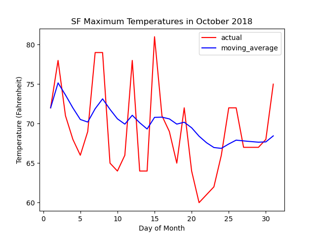

# Project 2293: Optimization
----


## Resources

**Read or watch**:

* [Hyperparameter (machine learning)](https://en.wikipedia.org/wiki/Hyperparameter_(machine_learning))
* [Feature scaling](https://en.wikipedia.org/wiki/Feature_scaling)
* [Why, How and When to Scale your Features](https://medium.com/greyatom/why-how-and-when-to-scale-your-features-4b30ab09db5e)
* [Normalizing your data](https://www.jeremyjordan.me/batch-normalization/)
* [Moving average](https://en.wikipedia.org/wiki/Moving_average)
* [An overview of gradient descent optimization algorithms](https://www.ruder.io/optimizing-gradient-descent/)
* [A Gentle Introduction to Mini-Batch Gradient Descent and How to Configure Batch Size](https://machinelearningmastery.com/gentle-introduction-mini-batch-gradient-descent-configure-batch-size/)
* [Stochastic Gradient Descent with momentum](https://medium.com/towards-data-science/stochastic-gradient-descent-with-momentum-a84097641a5d)
* [Understanding RMSprop](https://medium.com/towards-data-science/understanding-rmsprop-faster-neural-network-learning-62e116fcf29a)
* [Adam](https://medium.com/towards-data-science/adam-latest-trends-in-deep-learning-optimization-6be9a291375c)
* [Learning Rate Schedules](https://medium.com/towards-data-science/learning-rate-schedules-and-adaptive-learning-rate-methods-for-deep-learning-2c8f433990d1)
* [deeplearning.ai](https://www.deeplearning.ai/)videos (*Note: I suggest watching these video at 1.5x - 2x speed*):
  * [Normalizing Inputs](https://www.youtube.com/watch?v=FDCfw-YqWTE&index=9&list=PLkDaE6sCZn6Hn0vK8co82zjQtt3T2Nkqc)
  * [Mini Batch Gradient Descent](https://www.youtube.com/watch?v=4qJaSmvhxi8&list=PLkDaE6sCZn6Hn0vK8co82zjQtt3T2Nkqc&index=15)
  * [Understanding Mini-Batch Gradient Descent](https://www.youtube.com/watch?v=-_4Zi8fCZO4&list=PLkDaE6sCZn6Hn0vK8co82zjQtt3T2Nkqc&index=16)
  * [Exponentially Weighted Averages](https://www.youtube.com/watch?v=lAq96T8FkTw&list=PLkDaE6sCZn6Hn0vK8co82zjQtt3T2Nkqc&index=17)
  * [Understanding Exponentially Weighted Averages](https://www.youtube.com/watch?v=NxTFlzBjS-4&list=PLkDaE6sCZn6Hn0vK8co82zjQtt3T2Nkqc&index=18)
  * [[[[[

----
## Tasks
---
### 0. Normalization Constants

Write the function <!--plain-NL-->`def normalization_constants(X):`<!--inline-NL--> that calculates the normalization (standardization) constants of a matrix:<!--plain-NL-->

- `X` is the `numpy.ndarray` of shape `(m, nx)` to normalize


`m` is the number of data points
`nx` is the number of features
- `m` is the number of data points
- `nx` is the number of features
- Returns: the mean and standard deviation of each feature, respectively

- `m` is the number of data points
- `nx` is the number of features

```
ubuntu@ml:~/optimization$ cat 0-main.py 
#!/usr/bin/env python3

import numpy as np
normalization_constants = __import__('0-norm_constants').normalization_constants

if __name__ == '__main__':
    np.random.seed(0)
    a = np.random.normal(0, 2, size=(100, 1))
    b = np.random.normal(2, 1, size=(100, 1))
    c = np.random.normal(-3, 10, size=(100, 1))
    X = np.concatenate((a, b, c), axis=1)
    m, s = normalization_constants(X)
    print(m)
    print(s)
ubuntu@ml:~/optimization$ ./0-main.py 
[ 0.11961603  2.08201297 -3.59232261]
[2.01576449 1.034667   9.52002619]
ubuntu@ml:~/optimization$

```

**Repo:**

- GitHub repository: `atlas-machine_learning`
- Directory: `supervised_learning/optimization`
- File: `0-norm_constants.py`


---
### 1. Normalize

Write the function <!--plain-NL-->`def normalize(X, m, s):`<!--inline-NL--> that normalizes (standardizes) a matrix:<!--plain-NL-->

- `X` is the `numpy.ndarray` of shape `(d, nx)` to normalize


`d` is the number of data points
`nx` is the number of features
- `d` is the number of data points
- `nx` is the number of features
- `m` is a `numpy.ndarray` of shape `(nx,)` that contains the mean of all features of `X`
- `s` is a `numpy.ndarray` of shape `(nx,)` that contains the standard deviation of all features of `X`
- Returns: The normalized `X` matrix

- `d` is the number of data points
- `nx` is the number of features

```
ubuntu@ml:~/optimization$ cat 1-main.py 
#!/usr/bin/env python3

import numpy as np
normalization_constants = __import__('0-norm_constants').normalization_constants
normalize = __import__('1-normalize').normalize

if __name__ == '__main__':
    np.random.seed(0)
    a = np.random.normal(0, 2, size=(100, 1))
    b = np.random.normal(2, 1, size=(100, 1))
    c = np.random.normal(-3, 10, size=(100, 1))
    X = np.concatenate((a, b, c), axis=1)
    m, s = normalization_constants(X)
    print(X[:10])
    X = normalize(X, m, s)
    print(X[:10])
    m, s = normalization_constants(X)
    print(m)
    print(s)
ubuntu@ml:~/optimization$ ./1-main.py 
[[  3.52810469   3.8831507   -6.69181838]
 [  0.80031442   0.65224094  -5.39379178]
 [  1.95747597   0.729515     7.99659596]
 [  4.4817864    2.96939671   3.55263731]
 [  3.73511598   0.82687659   3.40131526]
 [ -1.95455576   3.94362119 -19.16956044]
 [  1.90017684   1.58638102  -3.24326124]
 [ -0.30271442   1.25254519 -10.38030909]
 [ -0.2064377    3.92294203  -0.20075401]
 [  0.821197     3.48051479  -3.9815039 ]]
[[ 1.69091612  1.74078977 -0.32557639]
 [ 0.33768746 -1.38186686 -0.18922943]
 [ 0.91174338 -1.3071819   1.21732003]
 [ 2.16402779  0.85765153  0.75051893]
 [ 1.79361228 -1.21308245  0.73462381]
 [-1.02897526  1.79923417 -1.63625998]
 [ 0.88331787 -0.47902557  0.03666601]
 [-0.20951378 -0.80167608 -0.71302183]
 [-0.1617519   1.77924787  0.35625623]
 [ 0.34804709  1.35164437 -0.04088028]]
[ 2.44249065e-17 -4.99600361e-16  1.46549439e-16]
[1. 1. 1.]
ubuntu@ml:~/optimization$

```

**Repo:**

- GitHub repository: `atlas-machine_learning`
- Directory: `supervised_learning/optimization`
- File: `1-normalize.py`


---
### 2. Shuffle Data

Write the function <!--plain-NL-->`def shuffle_data(X, Y):`<!--inline-NL--> that shuffles the data points in two matrices the same way:<!--plain-NL-->

- `X` is the first `numpy.ndarray` of shape `(m, nx)` to shuffle


`m` is the number of data points
`nx` is the number of features in `X`
- `m` is the number of data points
- `nx` is the number of features in `X`
- `Y` is the second `numpy.ndarray` of shape `(m, ny)` to shuffle


`m` is the same number of data points as in `X`
`ny` is the number of features in `Y`
- `m` is the same number of data points as in `X`
- `ny` is the number of features in `Y`
- Returns: the shuffled `X` and `Y` matrices

- `m` is the number of data points
- `nx` is the number of features in `X`

- `m` is the same number of data points as in `X`
- `ny` is the number of features in `Y`

*Hint: you should use numpy.random.permutation*<!--italics-->

```
ubuntu@ml:~/optimization$ cat 2-main.py 
#!/usr/bin/env python3

import numpy as np
shuffle_data = __import__('2-shuffle_data').shuffle_data

if __name__ == '__main__':
    X = np.array([[1, 2],
                [3, 4],
                [5, 6],
                [7, 8], 
                [9, 10]])
    Y = np.array([[11, 12],
                [13, 14],
                [15, 16],
                [17, 18],
                [19, 20]])

    np.random.seed(0)
    X_shuffled, Y_shuffled = shuffle_data(X, Y)

    print(X_shuffled)
    print(Y_shuffled)
ubuntu@ml:~/optimization$ ./2-main.py 
[[ 5  6]
 [ 1  2]
 [ 3  4]
 [ 7  8]
 [ 9 10]]
[[15 16]
 [11 12]
 [13 14]
 [17 18]
 [19 20]]
ubuntu@ml:~/optimization$

```

**Repo:**

- GitHub repository: `atlas-machine_learning`
- Directory: `supervised_learning/optimization`
- File: `2-shuffle_data.py`


---
### 3. Mini-Batch

Write a function <!--plain-NL-->`def create_mini_batches(X, Y, batch_size):`<!--inline-NL--> that creates mini-batches to be used for training a neural network using mini-batch gradient descent:<!--plain-NL-->

- `X` is a `numpy.ndarray` of shape `(m, nx)` representing input data


`m` is the number of data points
`nx` is the number of features in `X`
- `m` is the number of data points
- `nx` is the number of features in `X`
- `Y` is a `numpy.ndarray` of shape `(m, ny)` representing the labels


`m` is the same number of data points as in `X`
`ny` is the number of classes for classification tasks.
- `m` is the same number of data points as in `X`
- `ny` is the number of classes for classification tasks.
- `batch_size` is the number of data points in a batch
- Returns: list of mini-batches containing tuples `(X_batch, Y_batch)`
- Your function should allow for a smaller final batch (i.e. use the entire dataset)
- You should use `shuffle_data = __import__('2-shuffle_data').shuffle_data`

- `m` is the number of data points
- `nx` is the number of features in `X`

- `m` is the same number of data points as in `X`
- `ny` is the number of classes for classification tasks.

```
ubuntu@ml:~/optimization$ cat 3-main.py
#!/usr/bin/env python3

import numpy as np
import tensorflow as tf
import random
import os

SEED = 0

os.environ['PYTHONHASHSEED'] = str(SEED)
os.environ['TF_ENABLE_ONEDNN_OPTS']= '0'
random.seed(SEED)
np.random.seed(SEED)
tf.random.set_seed(SEED)

create_mini_batches = __import__('3-mini_batch').create_mini_batches


def one_hot(Y, classes):
    """Convert an array to a one-hot matrix"""
    one_hot = np.zeros((Y.shape[0], classes))
    one_hot[np.arange(Y.shape[0]), Y] = 1
    return one_hot

lib = np.load('MNIST.npz')
X_3D = lib['X_train']
Y = lib['Y_train']
X = X_3D.reshape((X_3D.shape[0], -1))
Y_oh = one_hot(Y, 10)
X_valid_3D = lib['X_valid']
Y_valid = lib['Y_valid']
X_valid = X_valid_3D.reshape((X_valid_3D.shape[0], -1))
Y_valid_oh = one_hot(Y_valid, 10)

model = tf.keras.models.load_model('model.h5', compile=False)

optimizer = tf.keras.optimizers.SGD(learning_rate=0.01)

batch_size = 32
epochs = 10

loss_fn = tf.keras.losses.CategoricalCrossentropy()

for epoch in range(epochs):
    print(f"After {epoch} epochs:")

    train_loss = tf.reduce_mean(loss_fn(Y_oh, model(X)))
    train_accuracy = np.mean(np.argmax(model(X), axis=1) == Y)

    valid_loss = tf.reduce_mean(loss_fn(Y_valid_oh, model(X_valid)))
    valid_accuracy = np.mean(np.argmax(model(X_valid), axis=1) == Y_valid)

    print(f"\tTraining Cost: {train_loss}")
    print(f"\tTraining Accuracy: {train_accuracy}")
    print(f"\tValidation Cost: {valid_loss}")
    print(f"\tValidation Accuracy: {valid_accuracy}")

    for step, (X_batch, Y_batch) in enumerate(create_mini_batches(X, Y_oh, batch_size)):
        with tf.GradientTape() as tape:
            predictions = model(X_batch)
            loss = loss_fn(Y_batch, predictions)
        gradients = tape.gradient(loss, model.trainable_variables)
        optimizer.apply_gradients(zip(gradients, model.trainable_variables))

        if (step + 1) % 100 == 0:
            Y_pred = np.argmax(predictions, axis=1)
            batch_accuracy = np.mean(Y_pred == np.argmax(Y_batch, axis=1))
            print(f"\tStep {step + 1}:")
            print(f"\t\tCost: {loss}")
            print(f"\t\tAccuracy: {batch_accuracy}")

print(f"After {epochs} epochs:")

final_train_loss = tf.reduce_mean(loss_fn(Y_oh, model(X)))
final_train_accuracy = np.mean(np.argmax(model(X), axis=1) == Y)

final_valid_loss = tf.reduce_mean(loss_fn(Y_valid_oh, model(X_valid)))
final_valid_accuracy = np.mean(np.argmax(model(X_valid), axis=1) == Y_valid)

print(f"\tFinal Training Cost: {final_train_loss}, Accuracy: {final_train_accuracy}")
print(f"\tFinal Validation Cost: {final_valid_loss}, Accuracy: {final_valid_accuracy}")

ubuntu@ml:~/optimization$ ./3-main.py 
After 0 epochs:
        Training Cost: 2.3219268321990967
        Training Accuracy: 0.13176
        Validation Cost: 2.318324565887451
        Validation Accuracy: 0.1315
        Step 100:
                Cost: 1.2482386827468872
                Accuracy: 0.625
        Step 200:
                Cost: 0.8422225713729858
                Accuracy: 0.8125

    ...

        Step 1500:
                Cost: 0.37368184328079224
                Accuracy: 0.84375
After 1 epochs:
        Training Cost: 0.3559108078479767
        Training Accuracy: 0.90134
        Validation Cost: 0.3254995048046112
        Validation Accuracy: 0.9095

...

After 2 epochs:
        Training Cost: 0.3029726445674896
        Training Accuracy: 0.9133
        Validation Cost: 0.2842124104499817
        Validation Accuracy: 0.918

...

After 9 epochs:
        Training Cost: 0.17719177901744843
        Training Accuracy: 0.94862
        Validation Cost: 0.17647580802440643
        Validation Accuracy: 0.952
        Step 100:
                Cost: 0.13570508360862732
                Accuracy: 1.0
        Step 200:
                Cost: 0.2039051502943039
                Accuracy: 0.96875
        Step 300:
                Cost: 0.17096975445747375
                Accuracy: 0.90625

    ...

        Step 1500:
                Cost: 0.15383833646774292
                Accuracy: 0.9375
After 10 epochs:
        Final Training Cost: 0.16524291038513184, Accuracy: 0.9523
        Final Validation Cost: 0.16789411008358002, Accuracy: 0.9537
ubuntu@ml:~/optimization$

```

**Repo:**

- GitHub repository: `atlas-machine_learning`
- Directory: `supervised_learning/optimization`
- File: `3-mini_batch.py`


---
### 4. Moving Average

Write the function <!--plain-NL-->`def moving_average(data, beta):`<!--inline-NL--> that calculates the weighted moving average of a data set:<!--plain-NL-->

- `data` is the list of data to calculate the moving average of
- `beta` is the weight used for the moving average
- Your moving average calculation should use bias correction
- Returns: a list containing the moving averages of `data`

```
ubuntu@ml:~/optimization$ cat 4-main.py 
#!/usr/bin/env python3

import matplotlib.pyplot as plt
import numpy as np
moving_average = __import__('4-moving_average').moving_average

if __name__ == '__main__':
        data = [72, 78, 71, 68, 66, 69, 79, 79, 65, 64, 66, 78, 64, 64, 81, 71, 69,
                65, 72, 64, 60, 61, 62, 66, 72, 72, 67, 67, 67, 68, 75]
        days = list(range(1, len(data) + 1))
        m_avg = moving_average(data, 0.9)
        print(m_avg)
        plt.plot(days, data, 'r', days, m_avg, 'b')
        plt.xlabel('Day of Month')
        plt.ylabel('Temperature (Fahrenheit)')
        plt.title('SF Maximum Temperatures in October 2018')
        plt.legend(['actual', 'moving_average'])
        plt.show()
ubuntu@ml:~/optimization$ ./4-main.py 
[72.0, 75.15789473684211, 73.62361623616238, 71.98836871183484, 70.52604332006544, 70.20035470453027, 71.88706986789997, 73.13597603396988, 71.80782582850702, 70.60905915023126, 69.93737009120935, 71.0609712312634, 70.11422355031073, 69.32143707981284, 70.79208718739721, 70.81760741911772, 70.59946700377961, 69.9406328280786, 70.17873340222755, 69.47534437750306, 68.41139351151023, 67.58929643210207, 66.97601174673004, 66.86995043877324, 67.42263231561797, 67.91198666959514, 67.8151574064495, 67.72913996327617, 67.65262186609462, 67.68889744321645, 68.44900744806469]

```




**Repo:**

- GitHub repository: `atlas-machine_learning`
- Directory: `supervised_learning/optimization`
- File: `4-moving_average.py`


---
### 5. Momentum

Write the function <!--plain-NL-->`def update_variables_momentum(alpha, beta1, var, grad, v):`<!--inline-NL--> that updates a variable using the gradient descent with momentum optimization algorithm:<!--plain-NL-->

- `alpha` is the learning rate
- `beta1` is the momentum weight
- `var` is a `numpy.ndarray` containing the variable to be updated
- `grad` is a `numpy.ndarray` containing the gradient of `var`
- `v` is the previous first moment of `var`
- Returns: the updated variable and the new moment, respectively

```
ubuntu@ml:~/optimization$ cat 5-main.py 
#!/usr/bin/env python3

import matplotlib.pyplot as plt
import numpy as np
update_variables_momentum = __import__('5-momentum').update_variables_momentum

def forward_prop(X, W, b):
    Z = np.matmul(X, W) + b
    A = 1 / (1 + np.exp(-Z))
    return A

def calculate_grads(Y, A, W, b):
    m = Y.shape[0]
    dZ = A - Y
    dW = np.matmul(X.T, dZ) / m
    db = np.sum(dZ, axis=1, keepdims=True) / m
    return dW, db

def calculate_cost(Y, A):
    m = Y.shape[0]
    loss = - (Y * np.log(A) + (1 - Y) * np.log(1 - A))
    cost = np.sum(loss) / m

    return cost

if __name__ == '__main__':
    lib_train = np.load('Binary_Train.npz')
    X_3D, Y = lib_train['X'], lib_train['Y'].T
    X = X_3D.reshape((X_3D.shape[0], -1))

    nx = X.shape[1]
    np.random.seed(0)
    W = np.random.randn(nx, 1)
    b = 0
    dW_prev = np.zeros((nx, 1))
    db_prev = 0
    for i in range(1000):
        A = forward_prop(X, W, b)
        if not (i % 100):
            cost = calculate_cost(Y, A)
            print('Cost after {} iterations: {}'.format(i, cost))
        dW, db = calculate_grads(Y, A, W, b)
        W, dW_prev = update_variables_momentum(0.01, 0.9, W, dW, dW_prev)
        b, db_prev = update_variables_momentum(0.01, 0.9, b, db, db_prev)
    A = forward_prop(X, W, b)
    cost = calculate_cost(Y, A)
    print('Cost after {} iterations: {}'.format(1000, cost))

    Y_pred = np.where(A >= 0.5, 1, 0)
    fig = plt.figure(figsize=(10, 10))
    for i in range(100):
        fig.add_subplot(10, 10, i + 1)
        plt.imshow(X_3D[i])
        plt.title(str(Y_pred[i, 0]))
        plt.axis('off')
    plt.tight_layout()
    plt.show()
ubuntu@ml:~/optimization$ ./5-main.py 
Cost after 0 iterations: 4.365105010037203
Cost after 100 iterations: 0.5729736703124043
Cost after 200 iterations: 0.2449357405113111
Cost after 300 iterations: 0.1771132508758216
Cost after 400 iterations: 0.14286111618067307
Cost after 500 iterations: 0.12051674907075897
Cost after 600 iterations: 0.10450664363662195
Cost after 700 iterations: 0.09245615061035156
Cost after 800 iterations: 0.08308760082979069
Cost after 900 iterations: 0.0756292416282403
Cost after 1000 iterations: 0.0695782354732263

```


**Repo:**

- GitHub repository: `atlas-machine_learning`
- Directory: `supervised_learning/optimization`
- File: `5-momentum.py`


---
### 6. Momentum Upgraded

Write the function <!--plain-NL-->`def create_momentum_op(alpha, beta1):`<!--inline-NL--> that sets up the gradient descent with momentum optimization algorithm in <!--plain-NL-->`TensorFlow`<!--inline-NL-->:<!--plain-NL-->

- `alpha` is the learning rate.
- `beta1` is the momentum weight.
- Returns: `optimizer`

```
ubuntu@ml:~/optimization$ cat 6-main.py 
#!/usr/bin/env python3

import numpy as np
import tensorflow as tf
import matplotlib.pyplot as plt
import random
import os

SEED = 0

os.environ['PYTHONHASHSEED'] = str(SEED)
os.environ['TF_ENABLE_ONEDNN_OPTS']= '0'
random.seed(SEED)
np.random.seed(SEED)
tf.random.set_seed(SEED)

create_momentum_op = __import__('6-momentum').create_momentum_op

def one_hot(Y, classes):
    """convert an array to a one-hot matrix"""
    one_hot = np.zeros((Y.shape[0], classes))
    one_hot[np.arange(Y.shape[0]), Y] = 1
    return one_hot

lib = np.load('MNIST.npz')
X_3D = lib['X_train']
Y = lib['Y_train']
X = X_3D.reshape((X_3D.shape[0], -1))
Y_oh=one_hot(Y,10)

model = tf.keras.models.load_model('model.h5', compile=False)

optimizer=create_momentum_op(0.01, 0.9)

@tf.function
def train_step(inputs, labels):
    with tf.GradientTape() as tape:
        predictions = model(inputs)
        loss = tf.reduce_mean(tf.keras.losses.CategoricalCrossentropy()(labels, predictions))
    gradients = tape.gradient(loss, model.trainable_variables)
    optimizer.apply_gradients(zip(gradients, model.trainable_variables))
    return loss


total_iterations = 1000
for iteration in range(total_iterations):

    cost = train_step(X, Y_oh)

    if (iteration + 1) % 100 == 0:
        print(f'Cost after {iteration + 1} iterations: {cost}')


Y_pred_oh = model(X[:100])
Y_pred = np.argmax(Y_pred_oh, axis=1)

fig = plt.figure(figsize=(10, 10))
for i in range(100):
    fig.add_subplot(10, 10, i + 1)
    plt.imshow(X_3D[i])
    plt.title(str(Y_pred[i]))
    plt.axis('off')
plt.tight_layout()
plt.show()

ubuntu@ml:~/optimization$ ./6-main.py 
Cost after 100 iterations: 0.4046999216079712
Cost after 200 iterations: 0.33621034026145935
Cost after 300 iterations: 0.3055974543094635
Cost after 400 iterations: 0.2854801118373871
Cost after 500 iterations: 0.2698008716106415
Cost after 600 iterations: 0.2563629746437073
Cost after 700 iterations: 0.24418331682682037
Cost after 800 iterations: 0.23279382288455963
Cost after 900 iterations: 0.2219877392053604
Cost after 1000 iterations: 0.2116965502500534

```


**Repo:**

- GitHub repository: `atlas-machine_learning`
- Directory: `supervised_learning/optimization`
- File: `6-momentum.py`


---
### 7. RMSProp

Write the function <!--plain-NL-->`def update_variables_RMSProp(alpha, beta2, epsilon, var, grad, s):`<!--inline-NL--> that updates a variable using the RMSProp optimization algorithm:<!--plain-NL-->

- `alpha` is the learning rate
- `beta2` is the RMSProp weight
- `epsilon` is a small number to avoid division by zero
- `var` is a `numpy.ndarray` containing the variable to be updated
- `grad` is a `numpy.ndarray` containing the gradient of `var`
- `s` is the previous second moment of `var`
- Returns: the updated variable and the new moment, respectively

```
ubuntu@ml:~/optimization$ cat 7-main.py 
#!/usr/bin/env python3

import matplotlib.pyplot as plt
import numpy as np
update_variables_RMSProp = __import__('7-RMSProp').update_variables_RMSProp

def forward_prop(X, W, b):
    Z = np.matmul(X, W) + b
    A = 1 / (1 + np.exp(-Z))
    return A

def calculate_grads(Y, A, W, b):
    m = Y.shape[0]
    dZ = A - Y
    dW = np.matmul(X.T, dZ) / m
    db = np.sum(dZ, axis=1, keepdims=True) / m
    return dW, db

def calculate_cost(Y, A):
    m = Y.shape[0]
    loss = - (Y * np.log(A) + (1 - Y) * np.log(1 - A))
    cost = np.sum(loss) / m

    return cost

if __name__ == '__main__':
    lib_train = np.load('Binary_Train.npz')
    X_3D, Y = lib_train['X'], lib_train['Y'].T
    X = X_3D.reshape((X_3D.shape[0], -1))

    nx = X.shape[1]
    np.random.seed(0)
    W = np.random.randn(nx, 1)
    b = 0
    dW_prev = np.zeros((nx, 1))
    db_prev = 0
    for i in range(1000):
        A = forward_prop(X, W, b)
        if not (i % 100):
            cost = calculate_cost(Y, A)
            print('Cost after {} iterations: {}'.format(i, cost))
        dW, db = calculate_grads(Y, A, W, b)
        W, dW_prev = update_variables_RMSProp(0.001, 0.9, 1e-8, W, dW, dW_prev)
        b, db_prev = update_variables_RMSProp(0.001, 0.9, 1e-8, b, db, db_prev)
    A = forward_prop(X, W, b)
    cost = calculate_cost(Y, A)
    print('Cost after {} iterations: {}'.format(1000, cost))

    Y_pred = np.where(A >= 0.5, 1, 0)
    fig = plt.figure(figsize=(10, 10))
    for i in range(100):
        fig.add_subplot(10, 10, i + 1)
        plt.imshow(X_3D[i])
        plt.title(str(Y_pred[i, 0]))
        plt.axis('off')
    plt.tight_layout()
    plt.show()
ubuntu@ml:~/optimization$ ./7-main.py 
Cost after 0 iterations: 4.365105010037203
Cost after 100 iterations: 1.370832184880606
Cost after 200 iterations: 0.2269339299030878
Cost after 300 iterations: 0.0513339480022191
Cost after 400 iterations: 0.018365571163723598
Cost after 500 iterations: 0.008176390663315379
Cost after 600 iterations: 0.004091350591779443
Cost after 700 iterations: 0.00219563959482299
Cost after 800 iterations: 0.0011481585722158702
Cost after 900 iterations: 0.000559930891318418
Cost after 1000 iterations: 0.00026558128741123633

```


**Repo:**

- GitHub repository: `atlas-machine_learning`
- Directory: `supervised_learning/optimization`
- File: `7-RMSProp.py`


---
### 8. RMSProp Upgraded

Write the function <!--plain-NL-->`def create_RMSProp_op(alpha, beta2, epsilon):`<!--inline-NL-->  that sets up the RMSProp optimization algorithm in <!--plain-NL-->`TensorFlow`<!--inline-NL-->:<!--plain-NL-->

- `alpha` is the learning rate
- `beta2` is the RMSProp weight (Discounting factor)
- `epsilon` is a small number to avoid division by zero
- Returns: `optimizer`

```
ubuntu@ml:~/optimization$ cat 8-main.py 
#!/usr/bin/env python3

import numpy as np
import tensorflow as tf
import matplotlib.pyplot as plt
import random
import os

SEED = 0

os.environ['PYTHONHASHSEED'] = str(SEED)
os.environ['TF_ENABLE_ONEDNN_OPTS']= '0'
random.seed(SEED)
np.random.seed(SEED)
tf.random.set_seed(SEED)

create_RMSProp_op = __import__('8-RMSProp').create_RMSProp_op

def one_hot(Y, classes):
    """convert an array to a one-hot matrix"""
    one_hot = np.zeros((Y.shape[0], classes))
    one_hot[np.arange(Y.shape[0]), Y] = 1
    return one_hot

lib = np.load('MNIST.npz')
X_3D = lib['X_train']
Y = lib['Y_train']
X = X_3D.reshape((X_3D.shape[0], -1))
Y_oh=one_hot(Y,10)

model = tf.keras.models.load_model('model.h5', compile=False)

optimizer=create_RMSProp_op(0.001, 0.9, 1e-07)

@tf.function
def train_step(inputs, labels):
    with tf.GradientTape() as tape:
        predictions = model(inputs)
        loss = tf.reduce_mean(tf.keras.losses.CategoricalCrossentropy()(labels, predictions))
    gradients = tape.gradient(loss, model.trainable_variables)
    optimizer.apply_gradients(zip(gradients, model.trainable_variables))
    return loss

total_iterations = 1000
for iteration in range(total_iterations):

    cost = train_step(X, Y_oh)

    if (iteration + 1) % 100 == 0:
        print(f'Cost after {iteration + 1} iterations: {cost}')

Y_pred_oh = model(X[:100])
Y_pred = np.argmax(Y_pred_oh, axis=1)

fig = plt.figure(figsize=(10, 10))
for i in range(100):
    fig.add_subplot(10, 10, i + 1)
    plt.imshow(X_3D[i])
    plt.title(str(Y_pred[i]))
    plt.axis('off')
plt.tight_layout()
plt.show()

ubuntu@ml:~/optimization$ ./8-main.py 
Cost after 100 iterations: 0.2860110104084015
Cost after 200 iterations: 0.18519501388072968
Cost after 300 iterations: 0.1329430341720581
Cost after 400 iterations: 0.0884409174323082
Cost after 500 iterations: 0.05956224724650383
Cost after 600 iterations: 0.04401925951242447
Cost after 700 iterations: 0.030383272096514702
Cost after 800 iterations: 0.024241114035248756
Cost after 900 iterations: 0.015456250868737698
Cost after 1000 iterations: 0.0107852378860116

```


**Repo:**

- GitHub repository: `atlas-machine_learning`
- Directory: `supervised_learning/optimization`
- File: `8-RMSProp.py`


---
### 9. Adam

Write the function <!--plain-NL-->`def update_variables_Adam(alpha, beta1, beta2, epsilon, var, grad, v, s, t):`<!--inline-NL--> that updates a variable in place using the Adam optimization algorithm:<!--plain-NL-->

- `alpha` is the learning rate
- `beta1` is the weight used for the first moment
- `beta2` is the weight used for the second moment
- `epsilon` is a small number to avoid division by zero
- `var` is a `numpy.ndarray` containing the variable to be updated
- `grad` is a `numpy.ndarray` containing the gradient of `var`
- `v` is the previous first moment of `var`
- `s` is the previous second moment of `var`
- `t` is the time step used for bias correction
- Returns: the updated variable, the new first moment, and the new second moment, respectively

```
ubuntu@ml:~/optimization$ cat 9-main.py
#!/usr/bin/env python3

import matplotlib.pyplot as plt
import numpy as np
update_variables_Adam = __import__('9-Adam').update_variables_Adam

def forward_prop(X, W, b):
    Z = np.matmul(X, W) + b
    A = 1 / (1 + np.exp(-Z))
    return A

def calculate_grads(Y, A, W, b):
    m = Y.shape[0]
    dZ = A - Y
    dW = np.matmul(X.T, dZ) / m
    db = np.sum(dZ, axis=1, keepdims=True) / m
    return dW, db

def calculate_cost(Y, A):
    m = Y.shape[0]
    loss = - (Y * np.log(A) + (1 - Y) * np.log(1 - A))
    cost = np.sum(loss) / m

    return cost

if __name__ == '__main__':
    lib_train = np.load('Binary_Train.npz')
    X_3D, Y = lib_train['X'], lib_train['Y'].T
    X = X_3D.reshape((X_3D.shape[0], -1))

    nx = X.shape[1]
    np.random.seed(0)
    W = np.random.randn(nx, 1)
    b = 0
    dW_prev1 = np.zeros((nx, 1))
    db_prev1 = 0
    dW_prev2 = np.zeros((nx, 1))
    db_prev2 = 0
    for i in range(1000):
        A = forward_prop(X, W, b)
        if not (i % 100):
            cost = calculate_cost(Y, A)
            print('Cost after {} iterations: {}'.format(i, cost))
        dW, db = calculate_grads(Y, A, W, b)
        W, dW_prev1, dW_prev2 = update_variables_Adam(0.001, 0.9, 0.99, 1e-8, W, dW, dW_prev1, dW_prev2, i + 1)
        b, db_prev1, db_prev2 = update_variables_Adam(0.001, 0.9, 0.99, 1e-8, b, db, db_prev1, db_prev2, i + 1)
    A = forward_prop(X, W, b)
    cost = calculate_cost(Y, A)
    print('Cost after {} iterations: {}'.format(1000, cost))

    Y_pred = np.where(A >= 0.5, 1, 0)
    fig = plt.figure(figsize=(10, 10))
    for i in range(100):
        fig.add_subplot(10, 10, i + 1)
        plt.imshow(X_3D[i])
        plt.title(str(Y_pred[i, 0]))
        plt.axis('off')
    plt.tight_layout()
    plt.show()
ubuntu@ml:~/optimization$ ./9-main.py
Cost after 0 iterations: 4.365105010037203
Cost after 100 iterations: 1.5950468370180395
Cost after 200 iterations: 0.390276184856453
Cost after 300 iterations: 0.1373790862761434
Cost after 400 iterations: 0.06963385247882237
Cost after 500 iterations: 0.043186805401891
Cost after 600 iterations: 0.029615890163981955
Cost after 700 iterations: 0.02135952185721115
Cost after 800 iterations: 0.01576513402620876
Cost after 900 iterations: 0.011813533123333355
Cost after 1000 iterations: 0.008996494409788116

```


**Repo:**

- GitHub repository: `atlas-machine_learning`
- Directory: `supervised_learning/optimization`
- File: `9-Adam.py`


---
### 10. Adam Upgraded

Write the function <!--plain-NL-->`def create_Adam_op(alpha, beta1, beta2, epsilon):`<!--inline-NL-->that sets up the Adam optimization algorithm in <!--plain-NL-->`TensorFlow`<!--inline-NL-->:<!--plain-NL-->

- `alpha` is the learning rate
- `beta1` is the weight used for the first moment
- `beta2` is the weight used for the second moment
- `epsilon` is a small number to avoid division by zero
- Returns: `optimizer`

```
ubuntu@ml:~/optimization$ cat 10-main.py 
#!/usr/bin/env python3

import numpy as np
import tensorflow as tf
import matplotlib.pyplot as plt
import random
import os

SEED = 0

os.environ['PYTHONHASHSEED'] = str(SEED)
os.environ['TF_ENABLE_ONEDNN_OPTS']= '0'
random.seed(SEED)
np.random.seed(SEED)
tf.random.set_seed(SEED)

create_Adam_op = __import__('10-Adam').create_Adam_op

def one_hot(Y, classes):
    """convert an array to a one-hot matrix"""
    one_hot = np.zeros((Y.shape[0], classes))
    one_hot[np.arange(Y.shape[0]), Y] = 1
    return one_hot

lib = np.load('MNIST.npz')
X_3D = lib['X_train']
Y = lib['Y_train']
X = X_3D.reshape((X_3D.shape[0], -1))
Y_oh=one_hot(Y,10)

model = tf.keras.models.load_model('model.h5', compile=False)

optimizer=create_Adam_op(0.001, 0.9, 0.999, 1e-7)

# Training function
@tf.function
def train_step(inputs, labels):
    with tf.GradientTape() as tape:
        predictions = model(inputs)
        loss = tf.reduce_mean(tf.keras.losses.CategoricalCrossentropy()(labels, predictions))
    gradients = tape.gradient(loss, model.trainable_variables)
    optimizer.apply_gradients(zip(gradients, model.trainable_variables))
    return loss

total_iterations = 1000
for iteration in range(total_iterations):

    cost = train_step(X, Y_oh)

    if (iteration + 1) % 100 == 0:
        print(f'Cost after {iteration + 1} iterations: {cost}')

Y_pred_oh = model(X[:100])
Y_pred = np.argmax(Y_pred_oh, axis=1)

fig = plt.figure(figsize=(10, 10))
for i in range(100):
    fig.add_subplot(10, 10, i + 1)
    plt.imshow(X_3D[i])
    plt.title(str(Y_pred[i]))
    plt.axis('off')
plt.tight_layout()
plt.show()

ubuntu@ml:~/optimization$ ./10-main.py 
Cost after 100 iterations: 0.19267748296260834
Cost after 200 iterations: 0.09857293218374252
Cost after 300 iterations: 0.04979228600859642
Cost after 400 iterations: 0.024284912273287773
Cost after 500 iterations: 0.01177093107253313
Cost after 600 iterations: 0.006168880499899387
Cost after 700 iterations: 0.0036108368076384068
Cost after 800 iterations: 0.0023372594732791185
Cost after 900 iterations: 0.001632177154533565
Cost after 1000 iterations: 0.001202528947032988

```


**Repo:**

- GitHub repository: `atlas-machine_learning`
- Directory: `supervised_learning/optimization`
- File: `10-Adam.py`


---
### 11. Learning Rate Decay

Write the function <!--plain-NL-->`def learning_rate_decay(alpha, decay_rate, global_step, decay_step):`<!--inline-NL--> that updates the learning rate using inverse time decay in <!--plain-NL-->`numpy`<!--inline-NL-->:<!--plain-NL-->

- `alpha` is the original learning rate
- `decay_rate` is the weight used to determine the rate at which `alpha` will decay
- `global_step` is the number of passes of gradient descent that have elapsed
- `decay_step` is the number of passes of gradient descent that should occur before alpha is decayed further
- the learning rate decay should occur in a stepwise fashion
- Returns: the updated value for `alpha`

```
ubuntu@ml:~/optimization$ cat 11-main.py
#!/usr/bin/env python3

import matplotlib.pyplot as plt
import numpy as np
learning_rate_decay = __import__('11-learning_rate_decay').learning_rate_decay

if __name__ == '__main__':
    alpha_init = 0.1
    for i in range(100):
        alpha = learning_rate_decay(alpha_init, 1, i, 10)
        print(alpha)
ubuntu@ml:~/optimization$ ./11-main.py
0.1
0.1
0.1
0.1
0.1
0.1
0.1
0.1
0.1
0.1
0.05
0.05
0.05
0.05
0.05
0.05
0.05
0.05
0.05
0.05
0.03333333333333333
0.03333333333333333
0.03333333333333333
0.03333333333333333
0.03333333333333333
0.03333333333333333
0.03333333333333333
0.03333333333333333
0.03333333333333333
0.03333333333333333
0.025
0.025
0.025
0.025
0.025
0.025
0.025
0.025
0.025
0.025
0.02
0.02
0.02
0.02
0.02
0.02
0.02
0.02
0.02
0.02
0.016666666666666666
0.016666666666666666
0.016666666666666666
0.016666666666666666
0.016666666666666666
0.016666666666666666
0.016666666666666666
0.016666666666666666
0.016666666666666666
0.016666666666666666
0.014285714285714287
0.014285714285714287
0.014285714285714287
0.014285714285714287
0.014285714285714287
0.014285714285714287
0.014285714285714287
0.014285714285714287
0.014285714285714287
0.014285714285714287
0.0125
0.0125
0.0125
0.0125
0.0125
0.0125
0.0125
0.0125
0.0125
0.0125
0.011111111111111112
0.011111111111111112
0.011111111111111112
0.011111111111111112
0.011111111111111112
0.011111111111111112
0.011111111111111112
0.011111111111111112
0.011111111111111112
0.011111111111111112
0.01
0.01
0.01
0.01
0.01
0.01
0.01
0.01
0.01
0.01
ubuntu@ml:~/optimization$

```

**Repo:**

- GitHub repository: `atlas-machine_learning`
- Directory: `supervised_learning/optimization`
- File: `11-learning_rate_decay.py`


---
### 12. Learning Rate Decay Upgraded

Write the function <!--plain-NL-->`def learning_rate_decay(alpha, decay_rate, decay_step):`<!--inline-NL--> that creates a learning rate decay operation in <!--plain-NL-->`tensorflow`<!--inline-NL--> using inverse time decay:<!--plain-NL-->

- `alpha` is the original learning rate
- `decay_rate` is the weight used to determine the rate at which `alpha` will decay
- `decay_step` is the number of passes of gradient descent that should occur before alpha is decayed further
- the learning rate decay should occur in a stepwise fashion
- Returns: the learning rate decay operation

```
ubuntu@ml:~/optimization$ cat 12-main.py
#!/usr/bin/env python3

import numpy as np
import tensorflow as tf
import matplotlib.pyplot as plt
import random
import os

SEED = 0

os.environ['PYTHONHASHSEED'] = str(SEED)
os.environ['TF_ENABLE_ONEDNN_OPTS']= '0'
random.seed(SEED)
np.random.seed(SEED)
tf.random.set_seed(SEED)

learning_rate_decay = __import__('12-learning_rate_decay').learning_rate_decay

def one_hot(Y, classes):
    """convert an array to a one-hot matrix"""
    one_hot = np.zeros((Y.shape[0], classes))
    one_hot[np.arange(Y.shape[0]), Y] = 1
    return one_hot

lib = np.load('MNIST.npz')
X_3D = lib['X_train']
Y = lib['Y_train']
X = X_3D.reshape((X_3D.shape[0], -1))
Y_oh=one_hot(Y,10)

model = tf.keras.models.load_model('model.h5', compile=False)

alpha = 0.1
alpha_schedule =learning_rate_decay(alpha, 1, 10)
optimizer= tf.keras.optimizers.SGD(learning_rate=alpha_schedule)

@tf.function
def train_step(inputs, labels):
    with tf.GradientTape() as tape:
        predictions = model(inputs)
        loss = tf.reduce_mean(tf.keras.losses.CategoricalCrossentropy()(labels, predictions))
    gradients = tape.gradient(loss, model.trainable_variables)
    optimizer.apply_gradients(zip(gradients, model.trainable_variables))
    return loss

total_iterations = 100
for iteration in range(total_iterations):

    current_learning_rate = alpha_schedule(iteration).numpy()
    print(current_learning_rate)
    cost = train_step(X, Y_oh)

ubuntu@ml:~/optimization$ ./12-main.py
0.1
0.1
0.1
0.1
0.1
0.1
0.1
0.1
0.1
0.1
0.05
0.05
0.05
0.05
0.05
0.05
0.05
0.05
0.05
0.05
0.033333335
0.033333335
0.033333335
0.033333335
0.033333335
0.033333335
0.033333335
0.033333335
0.033333335
0.033333335
0.025
0.025
0.025
0.025
0.025
0.025
0.025
0.025
0.025
0.025
0.02
0.02
0.02
0.02
0.02
0.02
0.02
0.02
0.02
0.02
0.016666668
0.016666668
0.016666668
0.016666668
0.016666668
0.016666668
0.016666668
0.016666668
0.016666668
0.016666668
0.014285714
0.014285714
0.014285714
0.014285714
0.014285714
0.014285714
0.014285714
0.014285714
0.014285714
0.014285714
0.0125
0.0125
0.0125
0.0125
0.0125
0.0125
0.0125
0.0125
0.0125
0.0125
0.011111111
0.011111111
0.011111111
0.011111111
0.011111111
0.011111111
0.011111111
0.011111111
0.011111111
0.011111111
0.01
0.01
0.01
0.01
0.01
0.01
0.01
0.01
0.01
0.01
ubuntu@ml:~/optimization$

```

**Repo:**

- GitHub repository: `atlas-machine_learning`
- Directory: `supervised_learning/optimization`
- File: `12-learning_rate_decay.py`


---
### 13. Batch Normalization

Write the function <!--plain-NL-->`def batch_norm(Z, gamma, beta, epsilon):`<!--inline-NL--> that normalizes an unactivated output of a neural network using batch normalization:<!--plain-NL-->

- `Z` is a `numpy.ndarray` of shape `(m, n)` that should be normalized


`m` is the number of data points
`n` is the number of features in `Z`
- `m` is the number of data points
- `n` is the number of features in `Z`
- `gamma` is a `numpy.ndarray` of shape `(1, n)` containing the scales used for batch normalization
- `beta` is a `numpy.ndarray` of shape `(1, n)` containing the offsets used for batch normalization
- `epsilon` is a small number used to avoid division by zero
- Returns: the normalized `Z` matrix

- `m` is the number of data points
- `n` is the number of features in `Z`

```
ubuntu@ml:~/optimization$ cat 13-main.py 
#!/usr/bin/env python3

import numpy as np
batch_norm = __import__('13-batch_norm').batch_norm

if __name__ == '__main__':
    np.random.seed(0)
    a = np.random.normal(0, 2, size=(100, 1))
    b = np.random.normal(2, 1, size=(100, 1))
    c = np.random.normal(-3, 10, size=(100, 1))
    Z = np.concatenate((a, b, c), axis=1)
    gamma = np.random.rand(1, 3)
    beta = np.random.rand(1, 3)
    print(Z[:10])
    Z_norm = batch_norm(Z, gamma, beta, 1e-7)
    print(Z_norm[:10])
ubuntu@ml:~/optimization$ ./13-main.py 
[[  3.52810469   3.8831507   -6.69181838]
 [  0.80031442   0.65224094  -5.39379178]
 [  1.95747597   0.729515     7.99659596]
 [  4.4817864    2.96939671   3.55263731]
 [  3.73511598   0.82687659   3.40131526]
 [ -1.95455576   3.94362119 -19.16956044]
 [  1.90017684   1.58638102  -3.24326124]
 [ -0.30271442   1.25254519 -10.38030909]
 [ -0.2064377    3.92294203  -0.20075401]
 [  0.821197     3.48051479  -3.9815039 ]]
[[ 1.48744674  0.95227432  0.82862045]
 [ 0.63640336 -0.291899    0.83717117]
 [ 0.99742624 -0.26214196  0.92538004]
 [ 1.78498593  0.6004018   0.89610557]
 [ 1.5520322  -0.22464952  0.89510874]
 [-0.22308868  0.97556057  0.74642362]
 [ 0.97954948  0.06782388  0.85133774]
 [ 0.29226936 -0.06073113  0.8043226 ]
 [ 0.32230674  0.96759734  0.87138019]
 [ 0.64291852  0.79722546  0.84647459]]
ubuntu@ml:~/optimization$

```

**Repo:**

- GitHub repository: `atlas-machine_learning`
- Directory: `supervised_learning/optimization`
- File: `13-batch_norm.py`


---
### 14. Batch Normalization Upgraded

Write the function <!--plain-NL-->`def create_batch_norm_layer(prev, n, activation):`<!--inline-NL--> that creates a batch normalization layer for a neural network in <!--plain-NL-->`tensorflow`<!--inline-NL-->:<!--plain-NL-->

- `prev` is the activated output of the previous layer
- `n` is the number of nodes in the layer to be created
- `activation` is the activation function that should be used on the output of the layer
- you should use the `tf.keras.layers.Dense` layer as the base layer with kernal initializer `tf.keras.initializers.VarianceScaling(mode='fan_avg')`
- your layer should incorporate two trainable parameters, `gamma` and `beta`, initialized as vectors of `1` and `0` respectively
- you should use an `epsilon` of `1e-7`
- Returns: a tensor of the activated output for the layer

```
ubuntu@ml:~/optimization$ cat 14-main.py 
#!/usr/bin/env python3

import numpy as np
import tensorflow as tf
import random
import os

SEED = 0

os.environ['PYTHONHASHSEED'] = str(SEED)
os.environ['TF_ENABLE_ONEDNN_OPTS']= '0'
random.seed(SEED)
np.random.seed(SEED)
tf.random.set_seed(SEED)

create_batch_norm_layer = __import__('14-batch_norm').create_batch_norm_layer

lib= np.load('MNIST.npz')
X_3D = lib['X_train']
X = X_3D.reshape((X_3D.shape[0], -1))

a = create_batch_norm_layer(X, 256, tf.nn.tanh)
print(a)

ubuntu@ml:~/optimization$ ./14-main.py 
tf.Tensor(
[[ 0.23253557 -0.338765   -0.49043232 ... -0.9721543   0.5131888
   0.94621533]
 [ 0.93405616 -0.05965466 -0.04494033 ... -0.4620138   0.82534444
   0.85449564]
 [-0.01708883 -0.31570387  0.93290466 ...  0.9038917  -0.665654
  -0.3190535 ]
 ...
 [ 0.14316253  0.93222773 -0.20546891 ...  0.04174704  0.8317966
  -0.7670826 ]
 [-0.61493874 -0.45376715 -0.08518191 ... -0.6400074   0.06867824
   0.5038617 ]
 [ 0.46984434  0.852962   -0.83436054 ...  0.8256435   0.04898308
  -0.7973691 ]], shape=(50000, 256), dtype=float32)
ubuntu@ml:~/optimization$

```

**Repo:**

- GitHub repository: `atlas-machine_learning`
- Directory: `supervised_learning/optimization`
- File: `14-batch_norm.py`


---
### 15. If you can't explain it simply, you don't understand it well enough

Write a blog post explaining the mechanics, pros, and cons of the following optimization techniques:<!--plain-NL-->

- Feature Scaling
- Batch normalization
- Mini-batch gradient descent
- Gradient descent with momentum
- RMSProp optimization
- Adam optimization
- Learning rate decay

Your posts should have examples and at least one picture, at the top. Publish your blog post on Medium or LinkedIn, and share it at least on LinkedIn.<!--plain-NL-->

When done, please add all URLs below (blog post, tweet, etc.)<!--plain-NL-->

Please, remember that these blogs must be written in English to further your technical ability in a variety of settings.<!--plain-NL-->