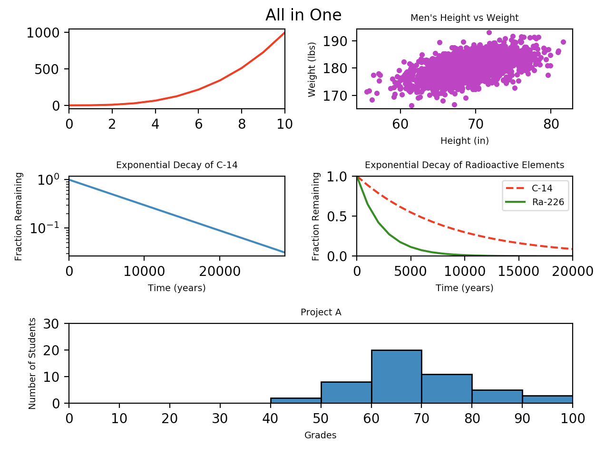

# Project 2280: Plotting
----


## Resources

**Read or watch**:

* [Plot (graphics)](https://en.wikipedia.org/wiki/Plot_%28graphics%29)
* [Scatter plot](https://en.wikipedia.org/wiki/Scatter_plot)
* [Line chart](https://en.wikipedia.org/wiki/Line_chart)
* [Bar chart](https://en.wikipedia.org/wiki/Bar_chart)
* [Histogram](https://en.wikipedia.org/wiki/Histogram)
* [Pyplot tutorial](https://matplotlib.org/stable/tutorials/introductory/pyplot.html)
* [matplotlib.pyplot](https://matplotlib.org/3.5.0/api/_as_gen/matplotlib.pyplot.html)
* [matplotlib.pyplot.plot](https://matplotlib.org/stable/api/_as_gen/matplotlib.pyplot.plot.html)
* [matplotlib.pyplot.scatter](https://matplotlib.org/stable/api/_as_gen/matplotlib.pyplot.scatter.html)
* [matplotlib.pyplot.bar](https://matplotlib.org/stable/api/_as_gen/matplotlib.pyplot.bar.html)
* [matplotlib.pyplot.hist](https://matplotlib.org/stable/api/_as_gen/matplotlib.pyplot.hist.html)
* [matplotlib.pyplot.xlabel](https://matplotlib.org/stable/api/_as_gen/matplotlib.pyplot.xlabel.html)
* [matplotlib.pyplot.ylabel](https://matplotlib.org/stable/api/_as_gen/matplotlib.pyplot.ylabel.html)
* [matplotlib.pyplot.title](https://matplotlib.org/stable/api/_as_gen/matplotlib.pyplot.title.html)
* [matplotlib.pyplot.subplot](https://matplotlib.org/stable/api/_as_gen/matplotlib.pyplot.subplot.html)
* [matplotlib.pyplot.subplots](https://matplotlib.org/stable/api/_as_gen/matplotlib.pyplot.subplots.html)
* [matplotlib.pyplot.subplot2grid](https://matplotlib.org/stable/api/_as_gen/matplotlib.pyplot.subplot2grid.html)
* [matplotlib.pyplot.suptitle](https://matplotlib.org/stable/api/_as_gen/matplotlib.pyplot.suptitle.html)
* [matplotlib.pyplot.xscale](https://matplotlib.org/stable/api/_as_gen/matplotlib.pyplot.xscale.html)
* [matplotlib.pyplot.yscale](https://matplotlib.org/stable/api/_as_gen/matplotlib.pyplot.yscale.html)
* [matplotlib.pyplot.xlim](https://matplotlib.org/stable/api/_as_gen/matplotlib.pyplot.xlim.html)
* [matplotlib.pyplot.ylim](https://matplotlib.org/stable/api/_as_gen/matplotlib.pyplot.ylim.html)
* [mplot3d tutorial](https://matplotlib.org/2.0.2/mpl_toolkits/mplot3d/tutorial.html)
* [additional tutorials](https://matplotlib.org/stable/tutorials/index.html)
## Learning Objectives

At the end of this project, you are expected to be able to[explain to anyone](https://fs.blog/feynman-learning-technique/),**without the help of Google**:

### General

* What is a plot?
* What is a scatter plot? line graph? bar graph? histogram?
* What is`matplotlib`?
* How to plot data with`matplotlib`
* How to label a plot
* How to scale an axis
* How to plot multiple sets of data at the same time
## Requirements

### General

* Allowed editors:`vi`,`vim`,`emacs`
* All your files will be interpreted/compiled on Ubuntu 20.04 LTS using`python3`(version 3.9)
* Your files will be executed with`numpy`(version 1.25.2) and`matplotlib`(version 3.8.3)
* All your files should end with a new line
* The first line of all your files should be exactly`#!/usr/bin/env python3`
* A`README.md`file, at the root of the folder of the project, is mandatory
* Your code should use the`pycodestyle`style (version 2.11.1)
* All your modules should have documentation (`python3 -c 'print(__import__("my_module").__doc__)'`)
* All your classes should have documentation (`python3 -c 'print(__import__("my_module").MyClass.__doc__)'`)
* All your functions (inside and outside a class) should have documentation (`python3 -c 'print(__import__("my_module").my_function.__doc__)'`and`python3 -c 'print(__import__("my_module").MyClass.my_function.__doc__)'`)
* Unless otherwise noted, you are not allowed to import any module
* All your files must be executable
* The length of your files will be tested using`wc`
## More Info

### Installing Matplotlib

``
```
pip install --user matplotlib==3.8.3
pip install --user Pillow==10.3.0
sudo apt-get install python3-tk
```

To check that it has been successfully downloaded, use`pip list`.


----
## Tasks
---
### 0. Line Graph

Complete the following source code to plot <!--plain-NL-->`y`<!--inline-NL--> as a line graph:<!--plain-NL-->

- `y` should be plotted as a solid red line
- The x-axis should range from 0 to 10

```
hbt-ml@Holberton-ML:~$ cat 0-line.py
#!/usr/bin/env python3
import numpy as np
import matplotlib.pyplot as plt

def line():

    y = np.arange(0, 11) ** 3
    plt.figure(figsize=(6.4, 4.8))

    # your code here

```

Result<!--plain-NL-->

```
hbt-ml@Holberton-ML:~$ cat 0-main.py
#!/usr/bin/env python3

line = __import__('0-line').line

line()
hbt-ml@Holberton-ML:~$ ./0-main.py

```


**Repo:**

- GitHub repository: `atlas-machine_learning`
- Directory: `math/plotting`
- File: `0-line.py`


---
### 1. Scatter

Complete the following source code to plot <!--plain-NL-->`x &mdash;&gt; y`<!--inline-NL--> as a scatter plot:<!--plain-NL-->

- The x-axis should be labeled `Height (in)`
- The y-axis should be labeled `Weight (lbs)`
- The title should be `Men's Height vs Weight`
- The data should be plotted as magenta points

```
hbt-ml@Holberton-ML:~$ cat 1-scatter.py
#!/usr/bin/env python3
import numpy as np
import matplotlib.pyplot as plt

def scatter():

    mean = [69, 0]
    cov = [[15, 8], [8, 15]]
    np.random.seed(5)
    x, y = np.random.multivariate_normal(mean, cov, 2000).T
    y += 180
    plt.figure(figsize=(6.4, 4.8))

    # your code here

```

Result<!--plain-NL-->

```
hbt-ml@Holberton-ML:~$ cat 1-main.py
#!/usr/bin/env python3

scatter = __import__('1-scatter').scatter

scatter()
hbt-ml@Holberton-ML:~$ ./1-main.py

```


**Repo:**

- GitHub repository: `atlas-machine_learning`
- Directory: `math/plotting`
- File: `1-scatter.py`


---
### 2. Change of scale

Complete the following source code to plot <!--plain-NL-->`x &mdash;&gt; y`<!--inline-NL--> as a line graph:<!--plain-NL-->

- The x-axis should be labeled `Time (years)`
- The y-axis should be labeled `Fraction Remaining`
- The title should be `Exponential Decay of C-14`
- The y-axis should be logarithmically scaled
- The x-axis should range from 0 to 28650

```
hbt-ml@Holberton-ML:~$ cat 2-change_scale.py
#!/usr/bin/env python3
import numpy as np
import matplotlib.pyplot as plt

def change_scale():
    x = np.arange(0, 28651, 5730)
    r = np.log(0.5)
    t = 5730
    y = np.exp((r / t) * x)
    plt.figure(figsize=(6.4, 4.8))

    # your code here

```

Result<!--plain-NL-->

```
hbt-ml@Holberton-ML:~$ cat 2-main.py
#!/usr/bin/env python3

change_scale = __import__('2-change_scale').change_scale

change_scale()
hbt-ml@Holberton-ML:~$ ./2-main.py

```


**Repo:**

- GitHub repository: `atlas-machine_learning`
- Directory: `math/plotting`
- File: `2-change_scale.py`


---
### 3. Two is better than one

Complete the following source code to plot <!--plain-NL-->`x &mdash;&gt; y1`<!--inline-NL--> and <!--plain-NL-->`x &mdash;&gt; y2`<!--inline-NL--> as line graphs:<!--plain-NL-->

- The x-axis should be labeled `Time (years)`
- The y-axis should be labeled `Fraction Remaining`
- The title should be `Exponential Decay of Radioactive Elements`
- The x-axis should range from 0 to 20,000
- The y-axis should range from 0 to 1
- `x &mdash;&gt; y1` should be plotted with a dashed red line
- `x &mdash;&gt; y2` should be plotted with a solid green line
- A legend labeling `x &mdash;&gt; y1` as `C-14` and `x &mdash;&gt; y2` as `Ra-226` should be placed in the upper right hand corner of the plot

```
hbt-ml@Holberton-ML:~$ cat two.py
#!/usr/bin/env python3
import numpy as np
import matplotlib.pyplot as plt

def two():

    x = np.arange(0, 21000, 1000)
    r = np.log(0.5)
    t1 = 5730
    t2 = 1600
    y1 = np.exp((r / t1) * x)
    y2 = np.exp((r / t2) * x)
    plt.figure(figsize=(6.4, 4.8))

    # your code here

```

Result<!--plain-NL-->

```
hbt-ml@Holberton-ML:~$ cat 3-main.py
#!/usr/bin/env python3

two = __import__('3-two').two

two()
hbt-ml@Holberton-ML:~$ ./3-main.py

```


**Repo:**

- GitHub repository: `atlas-machine_learning`
- Directory: `math/plotting`
- File: `3-two.py`


---
### 4. Frequency

Complete the following source code to plot a histogram of student scores for a project:<!--plain-NL-->

- The x-axis should be labeled `Grades`
- The y-axis should be labeled `Number of Students`
- The x-axis should have bins every 10 units
- The title should be `Project A`
- The bars should be outlined in black

```
hbt-ml@Holberton-ML:~$ cat 4-frequency.py
#!/usr/bin/env python3
import numpy as np
import matplotlib.pyplot as plt

def frequency():

    np.random.seed(5)
    student_grades = np.random.normal(68, 15, 50)
    plt.figure(figsize=(6.4, 4.8))

    # your code here

```

Result<!--plain-NL-->

```
hbt-ml@Holberton-ML:~$ cat 4-main.py
#!/usr/bin/env python3

frequency = __import__('4-frequency').frequency

frequency()
hbt-ml@Holberton-ML:~$ ./4-main.py

```


**Repo:**

- GitHub repository: `atlas-machine_learning`
- Directory: `math/plotting`
- File: `4-frequency.py`


---
### 5. All in One

Complete the following source code to plot all 5 previous graphs in one figure:<!--plain-NL-->

- All axis labels and plot titles should have a font size of `x-small` (to fit nicely in one figure)
- The plots should make a 3 x 2 grid
- The last plot should take up two column widths (see below)
- The title of the figure should be `All in One`

```
hbt-ml@Holberton-ML:~$ cat 5-all_in_one.py
#!/usr/bin/env python3
import numpy as np
import matplotlib.pyplot as plt

def all_in_one():

    y0 = np.arange(0, 11) ** 3

    mean = [69, 0]
    cov = [[15, 8], [8, 15]]
    np.random.seed(5)
    x1, y1 = np.random.multivariate_normal(mean, cov, 2000).T
    y1 += 180

    x2 = np.arange(0, 28651, 5730)
    r2 = np.log(0.5)
    t2 = 5730
    y2 = np.exp((r2 / t2) * x2)

    x3 = np.arange(0, 21000, 1000)
    r3 = np.log(0.5)
    t31 = 5730
    t32 = 1600
    y31 = np.exp((r3 / t31) * x3)
    y32 = np.exp((r3 / t32) * x3)

    np.random.seed(5)
    student_grades = np.random.normal(68, 15, 50)

    # your code here

```

Result<!--plain-NL-->

```
hbt-ml@Holberton-ML:~$ cat 5-main.py
#!/usr/bin/env python3

all_in_one = __import__('5-all_in_one').all_in_one

all_in_one()
hbt-ml@Holberton-ML:~$ ./5-main.py

```




**Repo:**

- GitHub repository: `atlas-machine_learning`
- Directory: `math/plotting`
- File: `5-all_in_one.py`


---
### 6. Stacking Bars

Complete the following source code to plot a stacked bar graph:<!--plain-NL-->

- `fruit` is a matrix representing the number of fruit various people possess


The columns of `fruit` represent the number of fruit `Farrah`, `Fred`, and `Felicia` have, respectively
The rows of `fruit` represent the number of `apples`, `bananas`, `oranges`, and `peaches`, respectively
- The columns of `fruit` represent the number of fruit `Farrah`, `Fred`, and `Felicia` have, respectively
- The rows of `fruit` represent the number of `apples`, `bananas`, `oranges`, and `peaches`, respectively
- The bars should represent the number of fruit each person possesses:


The bars should be grouped by person, i.e, the horizontal axis should have one labeled tick per person
Each fruit should be represented by a specific color:


`apples` = red
`bananas` = yellow
`oranges` = orange (`#ff8000`)
`peaches` = peach (`#ffe5b4`)
A legend should be used to indicate which fruit is represented by each color

The bars should be stacked in the same order as the rows of `fruit`, from bottom to top
The bars should have a width of `0.5`
- The bars should be grouped by person, i.e, the horizontal axis should have one labeled tick per person
- Each fruit should be represented by a specific color:


`apples` = red
`bananas` = yellow
`oranges` = orange (`#ff8000`)
`peaches` = peach (`#ffe5b4`)
A legend should be used to indicate which fruit is represented by each color
- `apples` = red
- `bananas` = yellow
- `oranges` = orange (`#ff8000`)
- `peaches` = peach (`#ffe5b4`)
- A legend should be used to indicate which fruit is represented by each color
- The bars should be stacked in the same order as the rows of `fruit`, from bottom to top
- The bars should have a width of `0.5`
- The y-axis should be labeled `Quantity of Fruit`
- The y-axis should range from 0 to 80 with ticks every 10 units
- The title should be `Number of Fruit per Person`

- The columns of `fruit` represent the number of fruit `Farrah`, `Fred`, and `Felicia` have, respectively
- The rows of `fruit` represent the number of `apples`, `bananas`, `oranges`, and `peaches`, respectively

- The bars should be grouped by person, i.e, the horizontal axis should have one labeled tick per person
- Each fruit should be represented by a specific color:


`apples` = red
`bananas` = yellow
`oranges` = orange (`#ff8000`)
`peaches` = peach (`#ffe5b4`)
A legend should be used to indicate which fruit is represented by each color
- `apples` = red
- `bananas` = yellow
- `oranges` = orange (`#ff8000`)
- `peaches` = peach (`#ffe5b4`)
- A legend should be used to indicate which fruit is represented by each color
- The bars should be stacked in the same order as the rows of `fruit`, from bottom to top
- The bars should have a width of `0.5`

- `apples` = red
- `bananas` = yellow
- `oranges` = orange (`#ff8000`)
- `peaches` = peach (`#ffe5b4`)
- A legend should be used to indicate which fruit is represented by each color

```
hbt-ml@Holberton-ML:~$ cat 6-bars.py
#!/usr/bin/env python3
import numpy as np
import matplotlib.pyplot as plt

def bars():
    np.random.seed(5)
    fruit = np.random.randint(0, 20, (4,3))
    plt.figure(figsize=(6.4, 4.8))

    # your code here

```

Result<!--plain-NL-->

```
hbt-ml@Holberton-ML:~$ cat 6-main.py
#!/usr/bin/env python3

bars = __import__('6-bars').bars

bars()
hbt-ml@Holberton-ML:~$ ./6-main.py

```


**Repo:**

- GitHub repository: `atlas-machine_learning`
- Directory: `math/plotting`
- File: `6-bars.py`