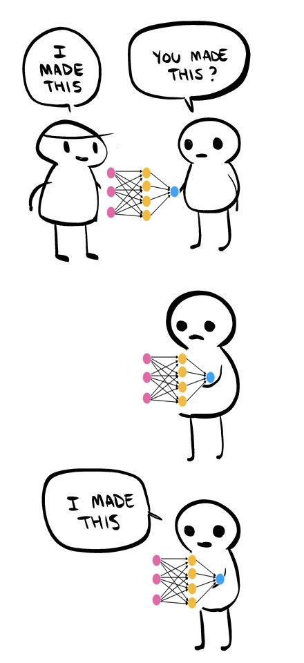

# Project 2311: Transfer Learning
----




## Resources

**Read or watch**:

* [A Comprehensive Hands-on Guide to Transfer Learning with Real-World Applications in Deep Learning](https://medium.com/towards-data-science/a-comprehensive-hands-on-guide-to-transfer-learning-with-real-world-applications-in-deep-learning-212bf3b2f27a)
* [Transfer Learning](https://www.youtube.com/watch?v=FQM13HkEfBk&index=20&list=PLkDaE6sCZn6Gl29AoE31iwdVwSG-KnDzF)
* [Transfer learning & fine-tuning](https://www.tensorflow.org/guide/keras/transfer_learning/)

**Definitions to skim:**

* [Transfer learning](https://en.wikipedia.org/wiki/Transfer_learning)

**References:**

* [Keras Applications](https://keras.io/api/applications/)
* [Keras Datasets](https://www.tensorflow.org/api_docs/python/tf/keras/datasets/)
* [tf.keras.layers.Lambda](https://www.tensorflow.org/api_docs/python/tf/keras/layers/Lambda)
* [tf.image.resize](https://www.tensorflow.org/api_docs/python/tf/image/resize)
* [A Survey on Deep Transfer Learning](https://browse.arxiv.org:443/pdf/1808.01974)
## Learning Objectives

At the end of this project, you are expected to be able to[explain to anyone](https://fs.blog/feynman-learning-technique/),**without the help of Google**:

### General

* What is a transfer learning?
* What is fine-tuning?
* What is a frozen layer? How and why do you freeze a layer?
* How to use transfer learning with Keras applications
## Requirements

### General

* Allowed editors:`vi`,`vim`,`emacs`
* All your files will be interpreted/compiled on Ubuntu 20.04 LTS using`python3`(version 3.9)
* Your files will be executed with`numpy`(version 1.25.2) and`tensorflow`(version 2.15)
* All your files should end with a new line
* The first line of all your files should be exactly`#!/usr/bin/env python3`
* A`README.md`file, at the root of the folder of the project, is mandatory
* Your code should use the`pycodestyle`style (version 2.11.1)
* All your modules should have documentation (`python3 -c 'print(__import__("my_module").__doc__)'`)
* All your classes should have documentation (`python3 -c 'print(__import__("my_module").MyClass.__doc__)'`)
* All your functions (inside and outside a class) should have documentation (`python3 -c 'print(__import__("my_module").my_function.__doc__)'`and`python3 -c 'print(__import__("my_module").MyClass.my_function.__doc__)'`)
* Unless otherwise noted, you are not allowed to import any module except`from tensorflow import keras as K`
* All your files must be executable
* The length of your files will be tested using`wc`

----
## Tasks
---
### 0. Transfer Knowledge

Write a python script that trains a convolutional neural network to classify the CIFAR 10 dataset:<!--plain-NL-->

Keras pakages a number of deep leanring models alongside pre-trained weights into an applications module. <!--plain-NL-->

- You must use one of the applications listed in Keras Applications
- Your script must save your trained model in the current working directory as `cifar10.h5`
- Your saved model should be compiled
- Your saved model should have a validation accuracy of 87% or higher
- Your script should not run when the file is imported
- **Hint1:** *The training and tweaking of hyperparameters may take a while so start early!*
- **Hint2:** *The CIFAR 10 dataset contains 32x32 pixel images, however most of the Keras applications are trained on much larger images. Your first layer should be a lambda layer that scales up the data to the correct size*
- **Hint3:** *You will want to freeze most of the application layers. Since these layers will always produce the same output, you should compute the output of the frozen layers ONCE and use those values as input to train the remaining trainable layers. This will save you A LOT of time.*

In the same file, write a function <!--plain-NL-->`def preprocess_data(X, Y):`<!--inline-NL--> that pre-processes the data for your model:<!--plain-NL-->

- `X` is a `numpy.ndarray` of shape `(m, 32, 32, 3)` containing the CIFAR 10 data, where m is the number of data points
- `Y` is a `numpy.ndarray` of shape `(m,)` containing the CIFAR 10 labels for `X`
- Returns: `X_p, Y_p`

`X_p` is a `numpy.ndarray` containing the preprocessed `X`
`Y_p` is a `numpy.ndarray` containing the preprocessed `Y`
- `X_p` is a `numpy.ndarray` containing the preprocessed `X`
- `Y_p` is a `numpy.ndarray` containing the preprocessed `Y`

- `X_p` is a `numpy.ndarray` containing the preprocessed `X`
- `Y_p` is a `numpy.ndarray` containing the preprocessed `Y`

**NOTE:**<!--code-NL--> <!--plain-NL-->*About half of the points for this project are for the blog post in the next task. While you are attempting to train your model, keep track of what you try and why so that you have a log to reference when it is time to write your report.*<!--italics-NL-->

```
alexa@ubuntu-xenial:transfer_learning$ cat 0-main.py
#!/usr/bin/env python3

from tensorflow import keras as K
preprocess_data = __import__('0-transfer').preprocess_data

# to fix issue with saving keras applications
K.learning_phase = K.backend.learning_phase 

_, (X, Y) = K.datasets.cifar10.load_data()
X_p, Y_p = preprocess_data(X, Y)
model = K.models.load_model('cifar10.h5')
model.evaluate(X_p, Y_p, batch_size=128, verbose=1)
alexa@ubuntu-xenial:transfer_learning$ ./0-main.py
10000/10000 [==============================] - 159s 16ms/sample - loss: 0.3329 - acc: 0.8864

```

**Repo:**

- GitHub repository: `atlas-machine_learning`
- Directory: `supervised_learning/transfer_learning`
- File: `0-transfer.py`


---
### 1. "Research is what I'm doing when I don't know what I'm doing." - Wernher von Braun

Write a blog post explaining your experimental process in completing the task above written as a journal-style scientific paper:<!--plain-NL-->


Your posts should have examples and at least one picture, at the top. Publish your blog post on Medium or LinkedIn, and share it at least on LinkedIn.<!--plain-NL-->

When done, please add all URLs below (blog post, tweet, etc.)<!--plain-NL-->

Please, remember that these blogs must be written in English to further your technical ability in a variety of settings.<!--plain-NL-->